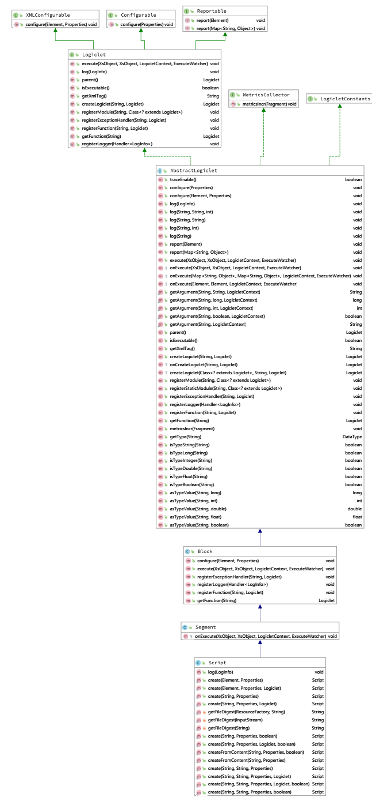
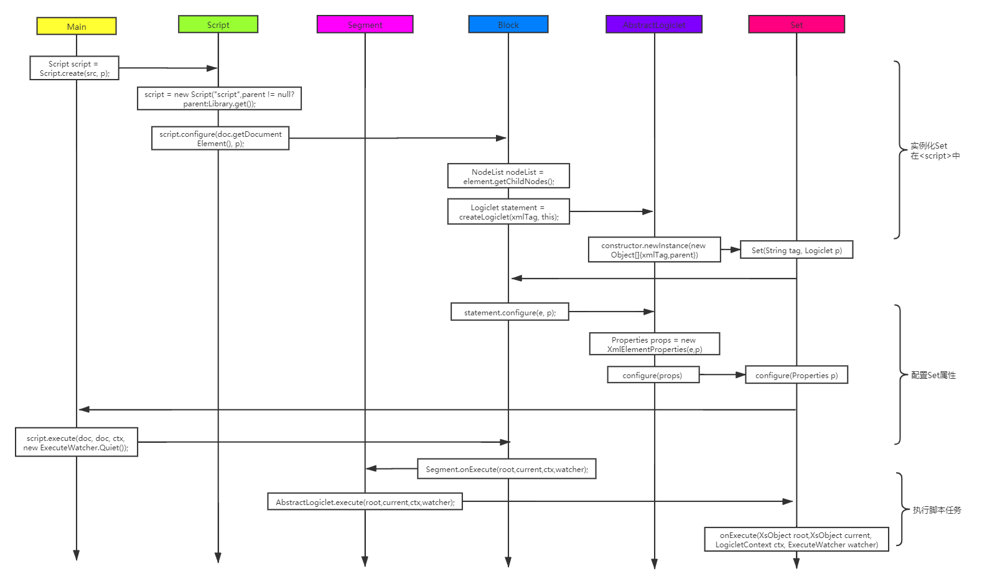
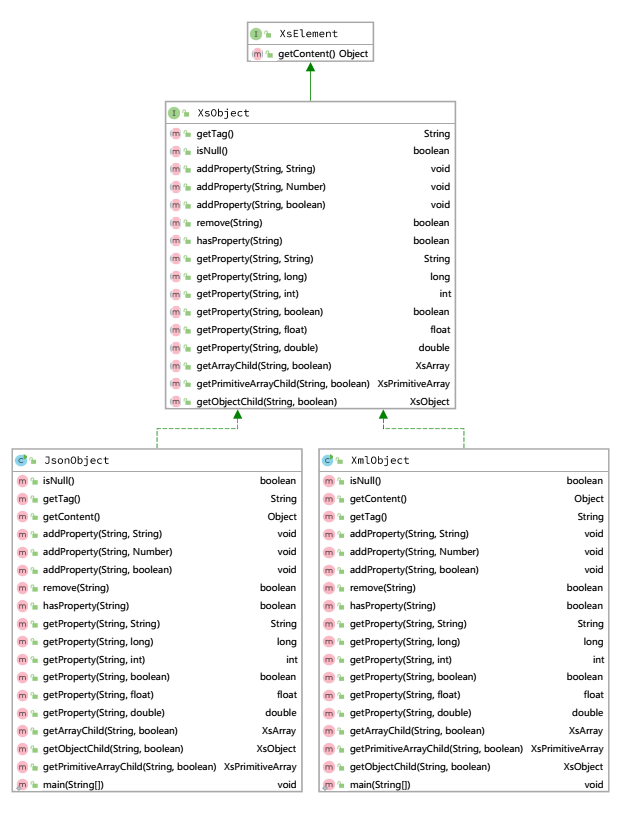
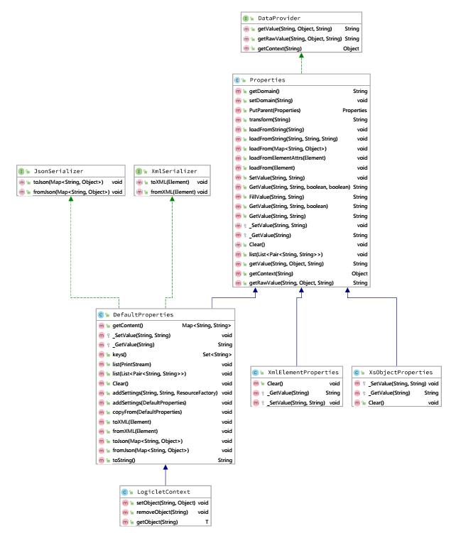

------

此文档将以 ```Set``` 为例。

记录学习 ```alogic``` 内嵌插件 ```alogic-common``` ``` com.alogic.xscript.plugins``` 源码实现流程。

在此基础上有助于理解其它新插件的功能实现。 

------

> 在学习插件代码过程中，有几个常见类，如 ```AbstractLogiclet```  ```XsObject```  ```Properties```，缕清它们各自类继承关系有助于理解在方法调用时的多态。

------

> 插件接口 ```Logiclet```，继承了```XMLConfigurable``` 和 ```Configurable``` 各自的 ```configure()``` 方法
> 其抽象类 ```AbstractLogiclet``` 
> 其子类 ```Block``` 重写 ```execute()``` 方法，```Segment``` 重写 ```onExecute()``` 方法 , ```Script``` 添加 ```create()``` 方法



------

> Q：```Set``` 从何而来
> A： 实例化脚本文件所含标签 + 配置标签属性 + 执行标签任务



------
> 文档对象接口 ```XsObject```
> 两个实现类 ```JsonObject``` 和 ```XmlObject```



> 变量对象抽象类 ```Properties```
> 实现类 ```DefaultProperties```, ```XmlElementProperties```, ```XsObjectProperties``` ，重写 ```_GetValue() ``` 和 ```_SetValue()``` 方法



------

> Q：```Set```  标签功能

``` java
protected void onExecute(XsObject root,XsObject current, LogicletContext ctx, ExecuteWatcher watcher) {
    // transform 先 Fillvalue 后 _GetValue, 有递归则继续 Fillvalue 和 _GetValue
    String id = PropertiesConstants.transform(ctx, $id, "");
    if (StringUtils.isNotEmpty(id)){
        // XsObjectProperties 组装 当下的文档和上下文变量
        XsObjectProperties p = new XsObjectProperties(current,ctx);
        if (raw){
            if (ref){
                // getRaw 直接 _GetValue, HashMap.get
                String v = PropertiesConstants.getRaw(p, $value, "");
                if (StringUtils.isEmpty(v)){
                    ctx.SetValue(id, $dftValue);
                }else{
                    // HashMap.set
                    ctx.SetValue(id, v);
                }
            }else{
                ctx.SetValue(id, $value);
            }
        }else{
            String v = PropertiesConstants.transform(p,$value,"");
            String dft = PropertiesConstants.transform(p,$dftValue,"");
            if (StringUtils.isEmpty(v)){
                v = dft;
            }
            if (ref){
                // getString 直接 _GetValue , 有递归继续 Fillvalue 和 _GetValue
                v = PropertiesConstants.getString(p,v,dft,false);
            }
            ctx.SetValue(id, v);
        }
    }
}

```

