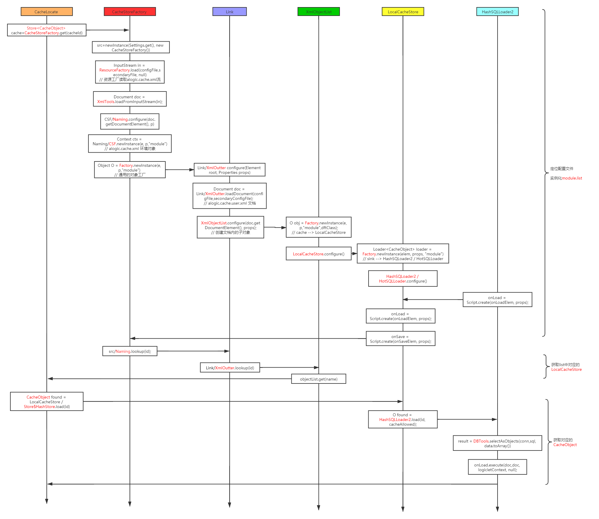
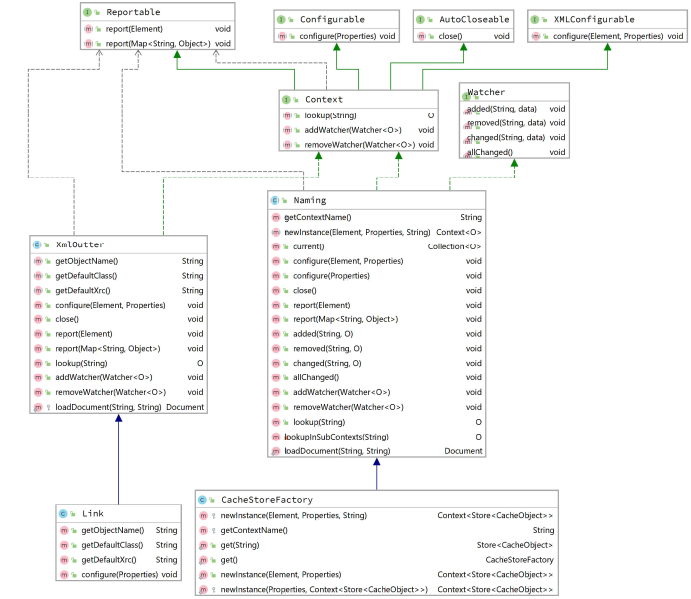
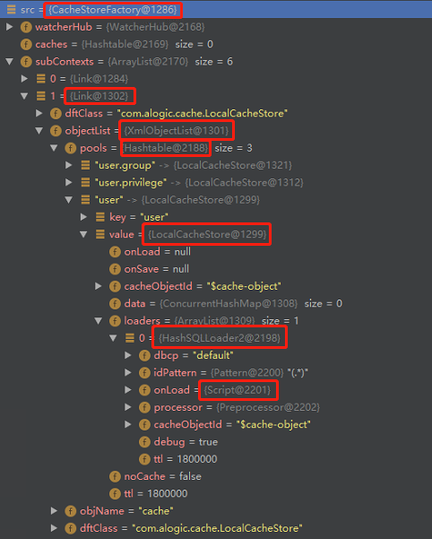
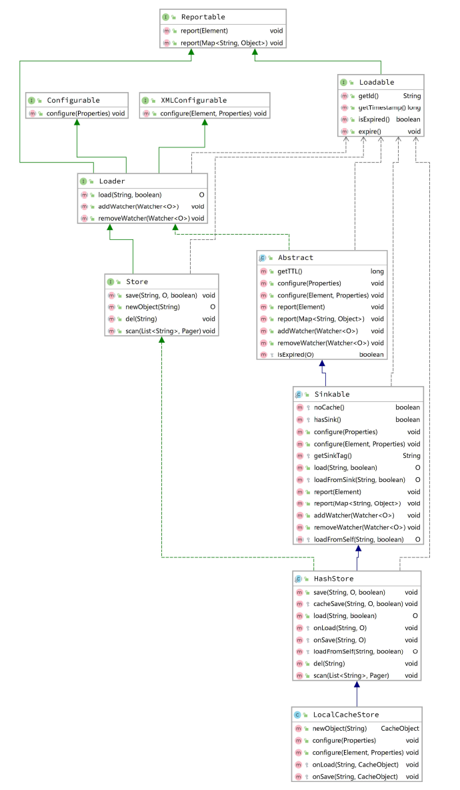
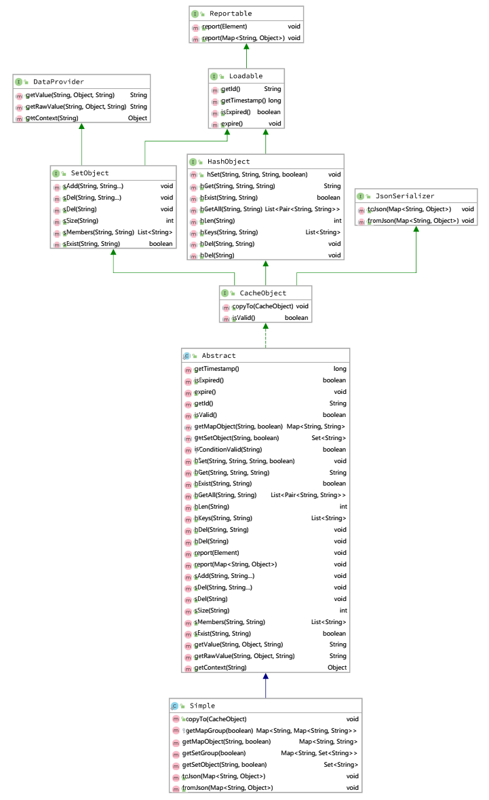
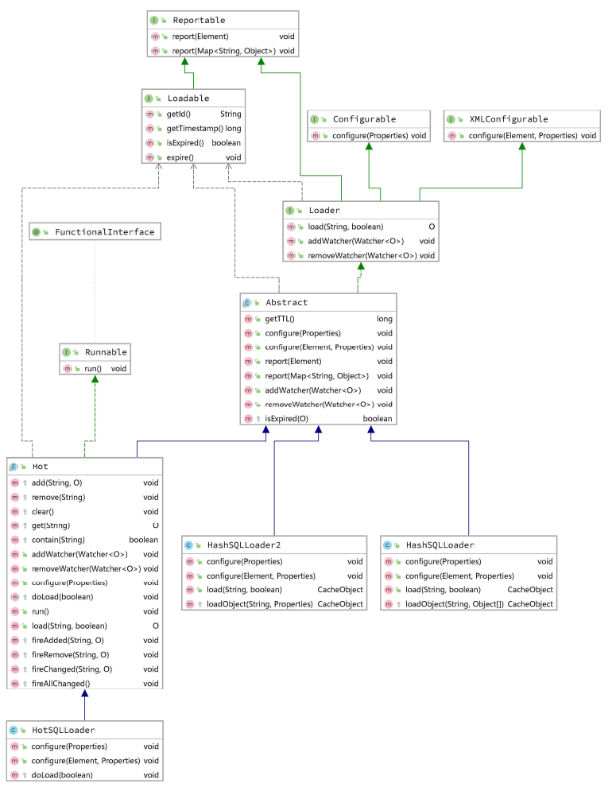

------

此文档记录 ```alogic.cache``` 标签使用方法；

同时以 ```cache-locate``` 为例，记录学习缓存插件源码实现流程。

------

##### alogic.cache 标签

```xml
<cache-locate id="${$user}" cacheId="user" cid="current">
    <cache-hget id="name" group="default" key="name" dft="dftV"/>
    <cache-hset group="default" key="name" value="Tom" overwrite="true" raw="false"/>
    <cache-hgetall group="default" key="$key" value="$value">
    	-- iterator  $key=name  $value=Tom
    </cache-hgetall>    
	<cache-del group="default" key="name"/>	
    <cache-hexist id="isExist" group="default" key="name"/>
    <cache-hsize id="size" group="default"/>    
</cache-locate>

<cache-new id="${$user}" cacheId="user" cid="current" result="result">
	-- onload
    -- cache-set ...
</cache-new>

<cache-expire id="${$user}" cacheId="user"/>
```

------

##### cache-locate 源码初探

> ```CacheLocate```.```onExecute()``` 方法中主要代码有2句，从中可以看出缓存加载的流程

```java
// Step1：定位 cache配置文件 位置，并实例化缓存列表
//        同时，返回列表中对应的 LocalCacheStore
Store<CacheObject> cache = CacheStoreFactory.get(cacheId);
// Step2：从 LocalCacheStore 中获取对应的 CacheObject
CacheObject found = cache.load(idValue)   // load db one row data
// Step3：对 CacheObject 中 key-value 的 get set
// 		  在 cache-hget、cache-hset onexecute 操作
found.hGet()、found.hSet() 
```

> 关键步骤的源码流程如下图：



> 其中，关键类有 ```CacheStoreFactory```、```Store```、```SQLLoader``` 和 ```CacheObject```

> ```CacheStoreFactory```





> ```LocalCacheStore```



> ```CacheObject```



> ```SQLLoader```

