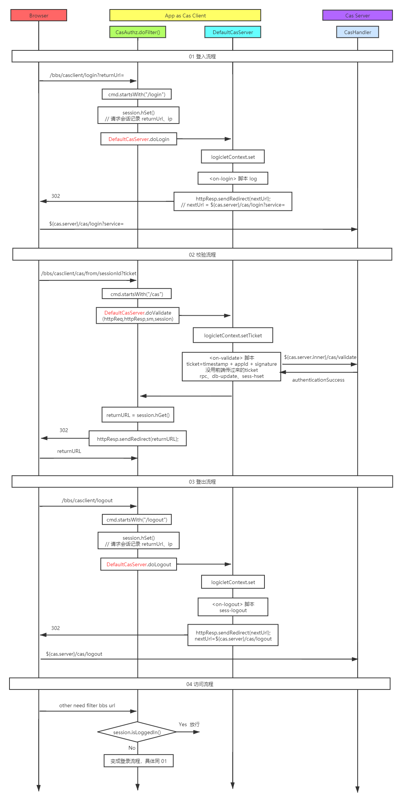

------

此文档记录学习门户论坛登录相关流程与组件
包括：1-  ```CAS``` 单点登录 ```SSO``` 流程   2- ``` alogic-cas``` 组件初探  

------

**1-  ```CAS``` 单点登录流程**

------


> 3个实体:	```Browser（浏览器）```	```App as CAS Client（app，同时作为CAS客户端）```	```CAS Server（CAS服务端）```
>
> 3种票据:	```TGC（登录CAS-Server生成的Session）```	
> ​				   ```TGT（CAS-Server-Session对应的前端Cookie）```	
> ​				   ```ST（前端访问App的凭证url-ticket，用于CAS Client向CAS Server校验）```

>CAS 登录流程规范：
>
>1. 用户访问 App01 系统，App01 系统是需要登录的，但用户现在没有登录
>2. 跳转到 CAS server，即 SSO 登录系统， SSO 系统也没有登录，弹出用户登录页
>3. 用户填写用户名、密码，SSO 系统进行认证后，将登录状态写入 SSO-Session，浏览器中写入 SSO-Cookie
>4. SSO 系统登录完成后会生成 Ticket，然后跳转到 App 系统，重定向前端，将 Ticket 作为参数传递给 App01 系统
>5. App01 系统拿到 Ticket 后，从后台向 SSO 发送校验请求，验证 Ticket 是否有效
>6. 验证通过后，App01 系统将登录状态写入App01-Session 并设置 App01-Cookie
>7. 后续用户携带 App01-Cookie 访问 App01 系统，处于登录状态
>8. 用户访问 App02 系统，没登陆则跳转 SSO。此时 SSO 已登录，则生成新 Ticket ，并走 4 - 7 流程

------

**2-  ```CAS``` 单点登出流程**

------

> 单点登出跟单点登录相对应，旨在通过 Cas Server 的登出使**所有已登录**的 Cas Client 都登出。
>
> 单点登录时，Cas Server 保存了 Cas Client 的注册信息，包括 **回跳客户端地址** 和  **颁发的 Ticket**
>
> 登出流程：当用户访问认证中心的 **`/logout`** 退出时，**认证中心** 先清除 **TGT TGC**，然后给之前注册过服务的客户端发送退出登录请求，并且携带之前登录的 Ticket，**客户端** 根据 Ticket 清除对应的 **Cookie Session**.

``` 
302 Location http://www.sso.com/login?service=www.a.com
```

------

**3- ``` alogic-cas``` 初探**

------

> ```alogic.cas.client.xml```

``` xml
<!-- cas-client 实现类 CasAuthz，作为 App Filter
     对 Browser 的请求做切面处理，与 CAS Server 交互 -->
<!-- 请求路径相关参数
	 webContext: /bbs	
	 cmdPrefix:	/casclient
  	 uri: /bbs/casclient/*  eg: /bbs/casclient/login -->
<cas-client
        dftServer="default"
        cmdPrefix="/casclient"   
        auth.page.main="/"
>
    <servers>
        <!-- server 实现类 DefaultCasServer，cas-client 配置要连接的 cas-server 相关信息 -->
        <server id="default"
                cas.server.login="${cas.server}/cas/login"
                cas.server.validate="${cas.server.inner}/cas/validate"
                cas.server.logout="${cas.server}/cas/logout"
                cas.callback.path="${cas.callback.path0}/cas/${id}"
                cas.callback.server="${cas.callback.server0}"
                >
            <on-login> </on-login>
            <on-validate> </on-validate>
            <on-logout>	</on-logout>
        </server>
    </servers>
</cas-client>
```

> ```alogic.web.addons.xml```

``` xml
<!-- App Filter 的 Web 配置 -->
<filter
        filter-name="CasClient"
        filter-class="com.alogic.cas.client.CasAuthz"
        >
    <filter-mapping url-pattern="/casclient/*"/>
    <filter-mapping url-pattern="/publish"/>
</filter>
```

> 由上可知：```CAS Client``` 主要类有 ```CasAuthz``` 和 ```DefaultCasServer```，```CAS Server``` 则是 ```CasHandler```
> 其中，Browser 请求 App 的 ```CAS``` 处理流程如下图



------

