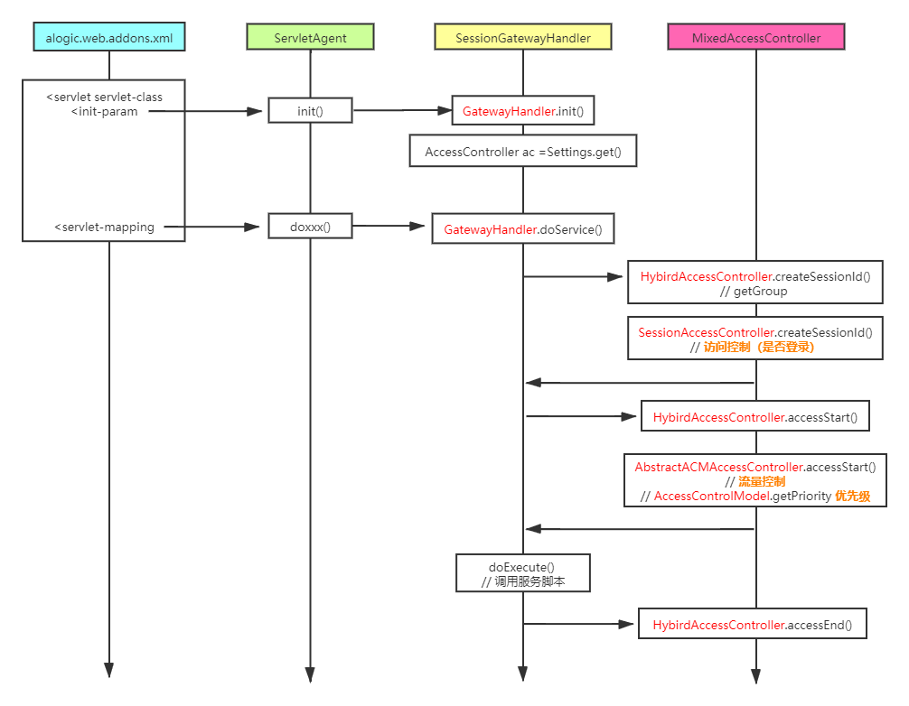
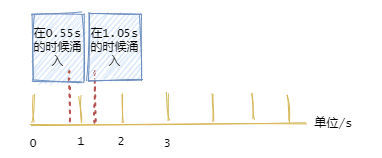
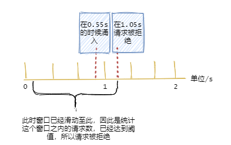

------

此文档记录学习 **服务接口访问控制** 在 alogic 中的实现，包括 **登录控制**，**流量限制**

------

> 开局一张图 ......




> 访问控制 **AccessController** 主要有3个切面方法

1. createSessionId() 根据是否登录来控制服务入口
2. accessStart() 采用限流算法来控制流量、获取访问优先级
3. accessEnd() 可用于资源池回收


#### 限流算法

1. **纯计数器限流**

   - 特点：简单粗暴，单机在 Java 中可用 Atomic 等原子类、分布式就 Redis incr
   - 缺点：一般的限流都是为了限制在时间间隔内的访问量，纯计数器没有时间单位

   ``` java
   synchronized boolean synchronize tryAcquire() {
       if (counter < threshold) {
           counter++;
           return true;
       } 	
       return false;
   }
   ```

2. **固定时间窗口计数器**

   - 缺点：窗口临界处流量双峰突发问题

   

   ``` java
   synchronized boolean tryAcquire() {
       long now = currentTimeMillis();
       if(now - lastAcquireTime > TimeWindow) {  // 是否过了时间窗口
           counter = 0;
           lastAcquireTime = now;
       }
       if (counter < threshold) {
           counter++;
           return true;
       }
       return false;
   }
   ```

3. **滑动时间窗口计数器**

   - 缺点：仍存在服务线程突增（流量突增）情况，**不够平滑**。

   

   ``` java
   synchronized boolean tryAcquire() {
       long now = currentTimeMillis();
   	long counter = getCounterInTimeWindow(now); // 当前时间为基准，往前获取窗口内的计数
       if (counter < threshold) {
           addToTimeWindow(now) // 记录
           return true;
       }
       return false;
   }
   ```

4. **漏斗算法**

   - 特点：**先减后加**，流出速率恒定，流入速率随意，满就溢出，**平滑处理**。

   ``` java
   int lastTimeStamp;
   int capacity; // 桶的容量
   int rate; // 水漏出的速度
   long water; // 当前水量(当前累积请求数)
   synchronized boolean tryAcquire()() {
       long now = currentTimeMillis();
       water = Math.max(0L, water - (now - lastTimeStamp) * rate); // 先流出水，计算剩余水量
       lastTimeStamp = now;
       if ((water + 1) < capacity) {
           water += 1;  
           return true;
       }
       return false; 
   }
   ```

5. **令牌算法**

   - 特点：**先加后减**，添加令牌速率恒定，消费速率随意，空就等待，**平滑处理**。
   - 比起漏斗算法，令牌算法**允许流量的突发**（起初桶里有令牌），后面再平滑处理。令牌算法对**用户更友好**，**业界采用最多**。

   ``` java
   int lastTimeStamp;
   int capacity; // 桶的容量
   int rate; // 令牌放入速度
   long tokens; // 当前令牌数量
   synchronized boolean tryAcquire()() {
       long now = currentTimeMillis();
       tokens = Math.min(capacity, tokens + (now - timeStamp) * rate);  // 先添加令牌，计算令牌数
       lastTimeStamp = now;
       if (tokens >= 1) {
           tokens -= 1;
           return true;
       }
       return false;
   }
   ```

   