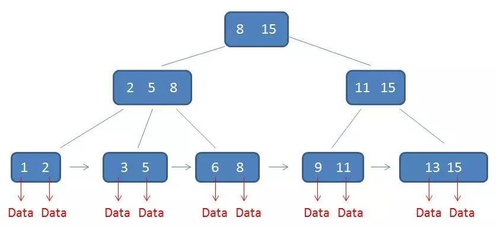

### **索引结构**

> **哈希表**（数组 + 链表结构，散列函数映射数组下标，链表解决哈希冲突）
>
> 特点：等值查询速度快 O(1)，但不支持范围查询；同时，多列联合索引需要带上所有列，否则失效


> **B+树**（多叉平衡树）多分查找 O(logN)
>
> 与 ```B-树```相比：
> 1. B+树中间节点不含行数据，只含下个指针，故每个数据页可存储更多索引，树的高度变低，查询磁盘次数变少
> 2. 行数据存放在叶子节点中，所有查询都要遍历到叶子节点，查询性能稳定
> 3. 所有叶子节点形成有序链表，有利于范围查询
>
> `Tip`：叶子节点随机插入数据会导致频繁的 `页分裂`，这是使用 `uuid` 作主键的弊端，使用 `自增主键` 从尾部插入可避免。 在此基础上，自增主键中 `雪花算法` 有利于分布式部署，`自增id` 不利于分库分表 



### 查询优化

1. **索引失效** 的情况

   - 对左边的索引列作 `表达式 或 函数运算`

   ``` sql
   SELECT name,age,birthday FROM user WHERE a + 1 = 5
   -- 字符串不加引号，导致左边列的类型转换成整数（函数运算），索引失效
   ```

   - 联合索引不满足 `最左前缀原则`

   ``` sql
   -- 联合索引（name,age,birthday），在 B+树 中三个值作为一个索引整体，需要对比每个索引整体大小，字段从左到右，再分叉查找。
   SELECT name,age,birthday FROM user WHERE name = 'Tom'; -- 走 name, 不走 age 和 birthday
   SELECT name,age,birthday FROM user WHERE name = 'Tom' and age = 18; -- 走 name 和 age, 不走 birthday
   SELECT name,age,birthday FROM user WHERE name = 'Tom' and age = 18 and birthday = 1600328876857; -- 全走
   -- 其它的排列组合则三个字段都不走索引
   
   -- 另外，若当前字段用到了范围（> < like），导致分叉查找出现范围，则索引不走字段后面的列
   SELECT name,age,birthday FROM user WHERE name like 'T%' and age = 18 -- 走 name, 不走 age 和 birthday
   ```

   - 使用 `!=` 和 `like %左模糊` 会扫描全表
   - 使用 `is null` 和 `is not null` 会扫描全表

2. 查询时 **覆盖索引**，尽量避免 **回表**

   ``` sql
   -- 聚簇索引：索引的叶子页直接存放数据行，一个表只有一个聚簇索引，主键索引为聚簇索引，反之不成立。
   -- 回表：非聚簇索引（二级索引）的 B+ 树叶子节点不包含行数据，只包含聚簇索引字段数据。如果需要查询其它字段，则需要回表去查询聚簇索引的多叉树。
   -- 覆盖索引：如果建立的索引上就已经有 SELECT 需要的字段，就不需要回表。
   
   -- eg: 主键索引 id, 普通索引 name
   SELECT age FROM user WHERE name = 'Tom';  -- 回表
   
   -- 设置成联合索引（name, age）
   SELECT age FROM user WHERE name = 'Tom';  -- 无需回表
   ```

3. **索引下推** 减少 **回表** 次数

   ``` sql
   -- 索引下推是 MySQL5.6 引入的优化，可以在非聚簇索引遍历过程中，对索引中包含的字段先做判断，直接过滤掉不满足条件的记录，再返回聚簇索引多叉树进行查询，减少回表次数
   
   -- 设置联合索引（name,age），若表中有（Tom, 18）（Tom, 19）两条记录
   SELECT birthday FROM user WHERE name like 'T%' and age = 18 -- 走 name, 不走 age
   -- MySQL5.6之前，两条记录都回表；有了索引下推后，只有（Tom, 18）回表
   ```

4. **区分度不高** 的列没有必要设置索引

   ``` sql
   -- 区分度：COUNT(DISTINCT col)/COUNT(*)
   -- 区分度太低的字段，比如 state, 加了索引扫描出来的行数也很多
   ```

5. 长字符串使用 **前缀索引**，降低索引空间

   ``` sql
   -- 前缀索引中，通过区分度的大小来设置前缀的长度
   ```
   
6. 遵循 **小表** 驱动 **大表** 原则

   ```sql
   -- MySQL表关联算法是Nest Loop Join，是通过驱动表的结果集作为基础数据，然后循环遍历，作为被驱动表数据查询的过滤条件，最后对结果合并。
   
   -- exists 外表是驱动表；内表是被驱表，字段可使用索引。外小内大
   select A.id from A where exists (select 1 from B where B.id = A.id);
   
   -- in 内表是驱动表；外表是被驱表，字段可使用索引。外大内小
   select A.id from A where A.id in (select id from B);
   
   -- join 无法保证驱动表与被驱动位置不变，需要看后续表数据量增长情况。、
   -- 可用 EXPLAIN 执行计划查询，第一行出现的表是驱动表
   
   -- 表关联查询，如果不涉及到 order by，首先可以考虑使用 join；若涉及到 order by，则需要确定驱动表与被驱动的位置，建议使用 exists 或者 in 代替
   -- 对驱动表的字段 order by 没影响，但对被驱动表 order by，则会产生 using temporary 和 filesort，性能较低。
   ```

### 唯一索引和普通索引

>1. 查询过程
>   - 对于唯一索引来说，由于索引定义了唯一性，查找到第一个满足条件的记录后，就会停止继续检索。
>   - 对于普通索引来说，查找到满足条件的第一个记录后，需要查找下一个记录，直到碰到第一个不满足条件的记录。
>2. 更新过程
>   - **change buffer**：更新操作中，如果 **数据页** 在 **内存** 中就直接更新内存，等后续落地；若数据页不在内存中，通过 **change buffer** 可使 **更新操作** 不加载 **数据页** 进 **内存**，而是先记录在 cb；在下次查询数据页时，将数据读入内存，并整合 cb 的更新操作。**change buffer** 减少更新过程中读磁盘的消耗，适用 **写多读少** 的业务场景。
>   - **唯一索引** 下 change buffer 失效，每次更新都得加载数据页**判断唯一性**；**普通索引** 可使用 change buffer
>3. 如何选择：两类索引在查询性能上差距微乎其微，主要考虑更新性能。尽量选择 **普通索引**，并开启 **change buffer**（若所有的更新后面马上伴随记录的查询，则应该关闭 change buffer）

### count() 效率

>**优先使用 count(\*)**：count(*) ≈ count(1) > count(主键id) > count(字段) ：
>
>注：count() 是 **Server层** 执行的聚合函数，需对 InnoDB 返回的数据进行 **非空判断**。但是 **count(\*) **是例外，Server 作了优化，不做判断空值的**逻辑**，直接按行累计加1。

### 慢查询

``` sql
set global slow_query_log=ON  -- 开启慢查询
set global long_query_time=2  -- 超过2s算作慢查询，记录到日志中
set global long_querise_not_using_indexex=ON  -- 记录下没有使用索引的查询语句
```

### 执行计划

> MySQL整体逻辑架构图可以分为 Server层 和 存储引擎层

```
Server层:
	- 连接器：负责跟客户端建立连接、获取权限
	- 查询缓存：执行SQL语句之前，先查缓存，没有再执行
	- 分析器：SQL词法分析、SQL语法分析
	- 优化器：索引选择，选择执行效率高的，生成执行计划
	- 执行器：操作存储引擎，返回执行结果
存储引擎层：
	有 InnoDB、MyISAM 等，负责数据的存储和提取
```


> **Explain** 
>
> 可以查出SQL语句在优化器中的执行计划，分析SQL的执行效率
> 其输出字段和含义如下

+ `id`	表示查询中 select语句 的执行顺序

  ``` 
  id 相同，执行顺序从上到下；不同则大的先（大的是子查询）
  ```

+ `select_type`	select语句 对应的查询类型

  ```
  主要是区别普通查询、联合查询、子查询等的复杂查询
  ```

+ `table`	select语句 执行的表名

+ `type`	查询类型，即搜索行记录的大概范围

  ```
  依次从最优到最差分别为：system > const > eq_ref > ref > range > index > all
  得保证查询达到 range 级别，最好达到 ref
  	- const：在简单查询时，通过主键或唯一索引列与常数比较时，所以表最多有一个匹配行
  	- eq_ref：在连接查询时，被驱动表是通过主键或唯一索引列与常数比较时，被驱动表为 eq_ref
  	- ref：不使用唯一索引，而是使用普通索引或者唯一性索引部分前缀，可能会找到多个符合条件的行
  	- range：使用索引获取范围区间的记录，通常出现在 in, between, >, <, >= 等操作中
  	- index：扫描全表索引 eg select * from group 其中group表的字段都有索引
  	- all：扫描全表，没走索引（index是扫描索引块，而all是扫描数据块）
  ```

+ `key`	查询中用到的索引名称

+ `key_len`	查询中用到的索引字段长度

  ``` 
  - char(n)：n字节长度 varchar(n)：2字节，如果是utf-8，则长度3n + 2
    字符串存储时，若该索引列可以存储NULL值，则key_len多1个字节
  - tinyint：1字节  smallint：2字节  int：4字节  bigint：8字节　
  - date：3字节  timestamp：4字节  datetime：8字节
  ```

+ `ref`	查询中用到的索引字段

+ `rows`	优化器预计要读取并检测行数

  ```
  采样预测，有误差；同时优化器不一定使用行数少的索引，会考虑是否回表
  可以强制使用某个索引：force index
  ```

+ `extra`	额外信息，常见的重要值如下

  ```
  - Using index：使用了覆盖索引，性能高
  - NULL： 查询的列未被索引覆盖，需要回表
  - Using temporary： 创建内部临时表来处理查询，需要考虑索引优化
  - Using filesort： 无法利用索引完成的排序操作称为文件排序，性能差
  ```


