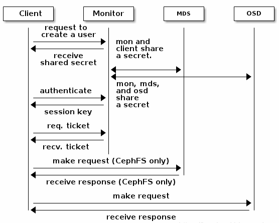

### 1 Ceph集群搭建

#### 1.1 ceph-ansible 部署

+ **配置主机环境**

    + 配置IP和网络，比如

      ```shell
      # 管理机：   10.190.180.240
      # Ceph集群： 10.190.180.241 ~ 10.190.180.243
      vi /etc/sysconfig/network-scripts/ifcfg-eth0
      # 配置以下属性
          BOOTPROTO=static
          ONBOOT=yes
          IPADDR=10.190.180.240
          GATEWAY=10.190.181.254
          NETMASK=255.255.254.0
          DNS1=202.96.134.133
          DNS2=202.96.128.86
      systemctl restart network.service
      ```

    + 关闭防火墙和SELinux

      ```shell
      # 所有机子
      systemctl stop firewalld
      systemctl disable firewalld
      systemctl status firewalld
      setenforce 0
      vi /etc/selinux/config  # 修改 selinux=disabled
      
      # firewalld 结构和使用
      # http://www.excelib.com/article/287/show/#I8ClPj
      # https://blog.csdn.net/yl3395017/article/details/105215027
      ```

    + 设置时钟源

      ```shell
      # 所有机子
      yum install ntp -y
      # 集群机子
      vi /etc/ntp.conf  # 修改 server 10.190.180.240 iburst
      # 所有机子
      systemctl restart ntpd
      systemctl enable ntpd
      ntpq -pn
      
      # 同步外部
      # ntpdate cn.pool.ntp.org
      ```

    + 配置YUM源

      ```shell
      # 所有机子
      cd /etc/yum.repos.d/
      vi /etc/yum.repos.d/internal.repo
      # 配置以下属性
        [internal]
          name=internal
          baseurl=内网仓库地址
          enabled=1
          gpgcheck=0
          priority=1
      yum repolist
      ```

    + 磁盘分区

      ```shell
      # 集群机子
      # 逻辑卷管理：PV VG LV 增删扩缩
      lsblk
      pvcreate /dev/sdb # 将物理磁盘初始化为物理卷 PV
      vgcreate ceph /dev/sdb # 创建卷组 VG，并将 PV 加入 VG
      lvcreate -n osd -L 10G ceph # 基于卷组 VG 创建逻辑卷 LV
      mkfs.xfs /dev/ceph/osd # 格式化
      mount /dev/ceph/osd /mnt # 挂载
      df -h

      pvcreate pvremove
      vgcreate vgremove vgextend vgreduce
      lvcreate lvremove
      ```

+ 配置ceph-ansible

    + 安装 Ansible

      ``` shell
      yum -y install ansible
      ```

    + 安装 Ceph-Ansible

      ```shel
      git clone -b stable-4.0 https://github.com/ceph/ceph-ansible.git --recursive
      ```

    + 解决环境依赖

      ```shell
      # 管理机
      yum install -y python-pip
      pip install pip==19.3.1
      pip install -r ceph-ansible/requirements.txt  # ansible netaddr
      ```

    + 修改ansible配置文件

      ```shell
      vi /etc/ansible/hosts
      # 配置Ceph集群节点地址以及机子角色
      [all:vars]
      ansible_ssh_port=22
      ansible_ssh_user="root"
      ansible_ssh_pass=""
      [mons]
      192.168.88.179
      192.168.88.180
      192.168.88.181
      [mgrs]
      192.168.88.179
      192.168.88.180
      192.168.88.181
      [osds]
      192.168.88.179
      192.168.88.180
      192.168.88.181

      vi /etc/ansible/ansible.cfg
      host_key_checking = False  # 跳过ssh第一次连接时输入yes
      ```

    + 修改ceph-ansible配置文件

      ```shell
      cd ceph-ansible/group_vars/

      # 根据模板创建文件
      cp mons.yml.sample mons.yml
      cp mgrs.yml.sample mgrs.yml
      cp osds.yml.sample osds.yml
      cp all.yml.sample all.yml

      # 配置 all.yml
          ---  
          # 配置 Ceph 源
          ceph_origin: repository
          ceph_repository: community
          # ceph_mirror: http://mirrors.aliyun.com/ceph
          # ceph_stable_key: http://mirrors.aliyun.com/ceph/keys/release.asc
          ceph_mirror: # 配置内部yum源
          ceph_stable_release: nautilus
          ceph_stable_repo: "{{ ceph_mirror }}/rpm-{{ ceph_stable_release }}"
          # 集群网络配置
          public_network: 10.190.180.0/22
          cluster_network: 10.190.180.0/23    
          # mon
          monitor_interface: eth0
          # osd
          osd_objectstore: bluestore
          # mgr
          dashboard_enabled: false
          # overrides
          ceph_conf_overrides:
            global:
              osd_pool_default_pg_num: 64
              osd_pool_default_pgp_num: 64
              osd_pool_default_size: 1
              #common_single_host_mode: true
            mon:
              mon_allow_pool_create: true
        ntp_daemon_type: ntpd
      # 配置 osds.yml
      # bluestore：data + metadata + wal
          ---
          lvm_volumes:
            - data: osd-data
              data_vg: ceph
              wal: osd-wal
              wal_vg: ceph
              db: osd-meta
              db_vg: ceph

      # 配置 site.yml
      cd ceph-ansible
      cp site.yml.sample site.yml
      ```
      
    + ansible ssh 免密登录

      ```
      http://www.linuxboy.net/ansiblejc/144350.html
      ```

+ **运行playbook**

```shell
ansible-playbook site.yml
```


#### 1.2 手动部署

+ **安装**

  ``` shell
  yum install ceph-mon ceph-mgr ceph-dashboard ceph-osd -y
  ```

+ **mon**

  1. 创建配置文件 /etc/ceph/ceph.conf

     ```yaml
     [global]
     fsid = 4c596c2c-69e3-47c0-a8b0-82ba499ea9ce   # uuid
     mon initial members = node-1                  # hostname [root@node-1 ~]
     mon host = 10.190.180.241                     # hostIP
     public network = 10.190.180.0/23              # 管理网络
     cluster network = 10.190.180.0/23             # 集群网络
     auth cluster required = cephx
     auth service required = cephx
     auth client required = cephx
     osd pool default size = 3
     osd pool default min size = 2
     osd pool default pg num = 64
     osd pool default pgp num = 64
     osd crush chooseleaf type = 0
     ```

  2. 配置集群 monmap 信息

     ```shell
     monmaptool --create --add node-1 10.190.180.241 --fsid 4c596c2c-69e3-47c0-a8b0-82ba499ea9ce /var/lib/ceph/tmp/monmap
     ```

  3. 配置集群的 client.admin 角色密钥环

     ``` shell
     sudo ceph-authtool --create-keyring /etc/ceph/ceph.client.admin.keyring --gen-key -n client.admin --cap mon 'allow *' --cap osd 'allow *' --cap mds 'allow *' --cap mgr 'allow *'
     ```

  4. 配置主机的 monitor 角色密钥环

     ```shell
     sudo ceph-authtool --create-keyring /var/lib/ceph/tmp/ceph.mon.keyring --gen-key -n mon. --cap mon 'allow *' 
     sudo ceph-authtool /var/lib/ceph/tmp/ceph.mon.keyring --import-keyring /etc/ceph/ceph.client.admin.keyring
     ```

  5. 配置文件夹权限

     ``` shell
     chown ceph:ceph -R /var/lib/ceph/tmp/
     ```

  6. 初始化主机的monitor数据（生成 /var/lib/ceph/mon/ceph-node-1目录  {cluster}-{hostname}）

     ```
     ceph-mon --cluster ceph --mkfs -i node-1 --monmap /var/lib/ceph/tmp/monmap --keyring /var/lib/ceph/tmp/ceph.mon.keyring
     ```

  7. 配置文件夹权限

     ```shell
     chown ceph:ceph -R /var/lib/ceph/mon
     ```

  8. 启动 monitor 服务

     ```shell
     systemctl start ceph-mon@node-1
     systemctl enable ceph-mon@node-1
     ```
     
  9. 停止 monitor 服务并踢出集群

     ``` shell
     ceph mon remove node-1
     systemctl stop ceph-mon@node-1
     systemctl disable ceph-mon@node-1
     ```

     

+ **mgr**

  1. 创建主机的 mgr 目录

     ``` shell
     mkdir /var/lib/ceph/mgr/ceph-node-1    # {cluster}-{hostname}
     ```

  2. 创建集群的主机 mgr 用户，并生成密钥环放在指定目录

     ``` shell
     ceph auth get-or-create mgr.node-1 mon 'allow profile mgr' osd 'allow *' mds 'allow *' -o /var/lib/ceph/mgr/ceph-node-1/keyring
     ```

  3. 配置文件夹权限

     ``` shell
     chown ceph:ceph -R /var/lib/ceph/mgr
     ```

  4. 启动 mgr 服务

     ```shell
     systemctl start ceph-mgr@node-1
     systemctl enable ceph-mgr@node-1
     ```

  5. 启动 mgr.dashboard 模块

     ``` shell
     ceph mgr module enable dashboard
     ceph config set mgr mgr/dashboard/ssl true
     ceph dashboard create-self-signed-cert
     ceph config set mgr mgr/dashboard/server_addr 0.0.0.0  
     ceph config set mgr mgr/dashboard/server_port 8080 
     ceph config set mgr mgr/dashboard/ssl_server_port 8443 
     ceph dashboard ac-user-create <username> -i <file-containing-password> administrator
     ```

  6. 启动 mgr.prometheus 模块

     ``` shell
     ceph mgr module enable prometheus
     ceph config set mgr mgr/prometheus/server_addr 0.0.0.0
     ceph config set mgr mgr/prometheus/server_port 9283
     ```

  7. 查看模块状态

     ``` shell
     [root@node-1 ~]# ceph mgr services
     {
         "dashboard": "https://node-1:8443/",
         "prometheus": "http://node-1:9283/"
     }
     ```

+ **osd**

    1. 拷贝集群的 /etc/ceph/ceph.conf  /etc/ceph/ceph.client.admin.keyring 到部署的主机上

    2. 获取集群的 client.bootstrap-osd 密钥环，指定名称放到指定目录

       ```shell
       ceph auth get client.bootstrap-osd -o /var/lib/ceph/bootstrap-osd/ceph.keyring
       ```

    3. 挂载磁盘并启动 osd 服务

       ```
       ceph-volume lvm create --bluestore --data centos/data --block.wal centos/wal --block.db centos/meta
       ```
       
    4. 删除 osd 服务
    
       ``` shell
       ceph osd out osd.0
       ceph osd down osd.0
       ceph osd purge osd.0 --yes-i-really-mean-it
       systemctl stop osd.0
       systemctl disable osd.0
       ```


### 2 Ceph命令操作

> architecture：https://docs.ceph.com/en/latest/architecture/
> 						  https://is-cloud.blog.csdn.net/article/details/89419873
> cluster.operations：https://docs.ceph.com/en/latest/rados/operations/
>                                      https://docs.ceph.com/en/latest/rados/man/
>                                      https://blog.51cto.com/hongchen99/2507959

```shell
ceph [-s|-w] # 静态|动态
ceph health detail
ceph df # 存储使用情况
ceph {mon/osd/pg/...} dump # 详情

# 修改 ceph  配置 （1.2 临时生效，3 永久生效）
# 1. ceph config
ceph config set mon auth_allow_insecure_global_id_reclaim false
ceph config get mon.node-1 auth_allow_insecure_global_id_reclaim # get 需要指明具体的节点，set 则不用
# 2. 套接字 / 进程
ceph --admin-daemon /var/run/ceph/ceph-mon.mode-1.asok config [show|set...]
ceph daemon osd.0 config [get|set...]
# 3. ceph.conf 
vi /etc/ceph/ceph.conf
```


#### 2.1 用户权限

> https://docs.ceph.com/en/latest/rados/operations/user-management/#
> https://is-cloud.blog.csdn.net/article/details/89679912 
> ceph client 包括 rbd / radosgw / cephfs / cli-rest-api 等

+ 身份认证原理：**共享密钥**

  

  > 1. 用户通过客户端向 MON 发起请求。
  > 2. 客户端将**用户名**传递到 MON。
  > 3. MON 对用户名进行检查，若用户存在，则通过加密用户密钥生成一个 session key 并返回客户端。
  > 4. 客户端通过共享密钥解密 session key，只有**拥有相同用户密钥环文件的客户端**可以完成解密。
  > 5. 客户端得到 session key 后，客户端持有 session key 再次向 MON 发起请求
  > 6. MON 生成一个 ticket，同样使用用户密钥进行加密，然后发送给客户端。
  > 7. 客户端同样通过共享密钥解密得到 ticket。
  > 8. 往后，客户端持有 ticket 向 MON、OSD 发起请求。

  **故：**只要客户端拥有任意用户的密钥环文件，客户端就可以执行特定用户所具有权限的所有操作

+ ceph -s

  ```shell
  # 实际上执行的是
  ceph -s --conf /etc/ceph/ceph.conf --name client.admin --keyring /etc/ceph/ceph.client.admin.keyring
  # 默认使用client.admin用户，并使用默认路径下密钥环
  ```
  
+ ceph auth  用户管理

  ```shell
  ceph auth ls  # 所有用户信息
  ceph auth add {USERTYPE.USERID} [{daemon} 'allow [r|w|x|*|...] [pool={pool-name}]']  # 新增用户
  ceph auth caps {USERTYPE.USERID} [{daemon} 'allow [r|w|x|*|...] [pool={pool-name}]']  # 用户授权
  ceph auth del {USERTYPE.USERID} # 删除用户
  
  # 用户名
  osd.1
      	# 用户密码
          key: AQCpmBpgshmRHRAAFln+JqLcJy+IXY6tInrVlw==
          # 允许用户在 mon 进行 osd 访问
          caps: [mon] allow profile osd
          # 允许用户在 osd 进行 rwx
          caps: [osd] allow *
          
  # profile osd (Monitor only)
  # Gives a user permissions to connect as an OSD to other OSDs or monitors. Conferred on OSDs to enable OSDs to handle replication heartbeat traffic and status reporting.
  
  # profile bootstrap-osd (Monitor only)
  # Gives a user permissions to bootstrap an OSD. Conferred on deployment tools such as ceph-volume, cephadm, etc. so that they have permissions to add keys, etc. when bootstrapping an OSD.
  ```

+ ceph-authtool 密钥环文件管理

  > https://docs.ceph.com/en/latest/man/8/ceph-authtool/

  ```shell
  ceph-authtool -n client.l --gen-key --cap osd 'allow rwx' --cap mon 'allow rwx' --create-keyring /etc/ceph/client.l.keyring  # 生成用户密钥环文件
  ceph auth import -i /etc/ceph/client.l.keyring # 从密钥环文件导入用户到集群
  ceph auth get client.admin -o /etc/ceph/ceph.client.admin.keyring # 将用户导出到密钥环
  ceph -n client.admin --keyring=/etc/ceph/ceph.client.admin.keyring health # 指定密钥环用户来操作
  ```


#### 2.2 mon

+ monmaptool 工具 

  ```shell
  # 生成 monmap
  monmaptool --create --fsid 6da67f55-6178-486b-98d1-0286def1914f --add node-1 10.193.52.132 /tmp/monmap
  # 获取 monmap
  monmaptool --create --generate -c /etc/ceph/ceph.conf /tmp/monmap
  # 查看 monmap
  monmaptool --print monmap
  # 删除指定字段
  monmaptool --rm node-1 /tmp/monmap
  # 新增字段
  monmaptool --add node-2 10.112.101.143 /tmp/monmap
  ```


#### 2.3 osd

+ ceph-volume

  > https://docs.ceph.com/en/nautilus/man/8/ceph-volume/

  ```shell
  ceph-volume lvm [ trigger | create | activate | prepare | zap | list | batch ]
  ceph-volume simple [ trigger | scan | activate ]
  ceph-volume [-h] [–cluster CLUSTER] [–log-level LOG_LEVEL] [–log-path LOG_PATH]
  ceph-volume inventory
  ```
  
+ ceph osd

  > https://blog.csdn.net/mpu_nice/article/details/106354561

  ``` shell
  ceph osd [ blocklist | blocked-by | create | new | deep-scrub | df | down | dump | erasure-code-profile | find | getcrushmap | getmap | getmaxosd | in | ls | lspools | map | metadata | ok-to-stop | out | pause | perf | pg-temp | force-create-pg | primary-affinity | primary-temp | repair | reweight | reweight-by-pg | rm | destroy | purge | safe-to-destroy | scrub | set | setcrushmap | setmaxosd | stat | tree | unpause | unset ]
  ```
+ 操作示例

  ```shell
  # 新增 osd 
  # bluestore: db + meta + wal
  # create 版
  ceph-volume lvm create --bluestore --data {dev or vg/lv} --block.wal {} --block.db {}
  # if block device, a logical volume will be created
  
  # 等同于 prepare + activate
  ceph-volume lvm prepare --bluestore --data {dev or vg/lv} --block.wal {} --block.db {} 
  ceph-volume lvm list
  ceph-volume lvm activate {ID} {FSID}
  
  # 扩容（新增）osd 后会触发 rebalance 重分布（部分PGs重新定位到新的osd）
  # 设置标志位临时关闭，适用于当前业务流量较大的时候
  ceph osd set norebalance 
  ceph osd set nobackfill
  ceph osd unset norebalance
  ceph osd unset nobackfill
  
  # 清空磁盘数据  dd if=/dev/zero of=/dev/sdc bs=1M count=10 conv=fsync 
  ceph-volume lvm zap /dev/sdc
  
  # osd 副本间数据一致性检查
  ceph osd scrub {who}
  ceph pg scrub {pg.id}  # ceph pg dump -> pg.id
  ```

  

#### 2.4 mgr


#### 2.5 rbd 块存储

> 命令文档：https://docs.ceph.com/en/latest/man/8/rbd/

+ 创建Pool资源池

  > https://docs.ceph.com/en/latest/rados/operations/pools/#

  ```shell
  ceph osd pool create poolName 64 64   -- replicated[default] 副本 | erasure 纠删码
  ceph osd pool application enable poolName [rbd | rgw | cephfs] -- 启用应用类型
  ceph osd lspools
  ceph osd pool get poolName pg_num    
  ceph osd pool set poolName pg_num 128
  ceph osd pool delete {pool-name} [{pool-name} --yes-i-really-really-mean-it]
  ```

+ 创建RBD块

  > https://docs.ceph.com/en/latest/rbd/rados-rbd-cmds/#basic-block-device-commands

  ```shell
  rbd create --size {megabytes} [--image-feature feature-name (layering)] {pool-name}/{image-name}
  rbd ls {poolname}
  rbd info {pool-name}/{image-name}
  rbd rm {pool-name}/{image-name}
  
  # 扩容分三步：底层磁盘扩容、分区扩容（可选）、文件系统扩容
  rbd resize {pool-name}/{image-name} --size 20G  # 磁盘扩容 fdisk -l
  fdisk /dev/rbd0  # 若直接挂裸盘，则可跳过
  resize2fs /dev/rbd0 # 文件系统扩容 df -h
  ```

+ 映射RBD块到磁盘

  ```shell
  rbd device map {pool-name}/{image-name}
  # 取消映射
  rbd device unmap /dev/rbd0
  ```

+ 磁盘逻辑卷操作

  > https://blog.csdn.net/u011350541/article/details/88722263

  ```shell
  pvcreate /dev/sdb # 将物理磁盘初始化为物理卷 PV
  vgcreate ceph /dev/sdb # 创建卷组 VG，并将 PV 加入 VG
  lvcreate -n osd -L 10G ceph # 基于卷组 VG 创建逻辑卷 LV
  mkfs.xfs /dev/ceph/osd # 格式化
  mount /dev/ceph/osd /mnt # 挂载
  ```

+ RBD回收站机制

  ```shell
  rbd trash mv {pool-name}/{image-name}      # 移至回收站 
  rbd trash restore {pool-name}/{image-id}   # 从回收站恢复
  rbd trash rm {pool-name}/{image-id}        # 删除回收站
  ```

+ RBD快照机制

  > https://docs.ceph.com/en/latest/rbd/rbd-snapshot/

  + 基础操作

    ``` shell 
    rbd snap create {pool-name}/{image-name}@{snap-name}   # 创建
    rbd snap ls {pool-name}/{image-name}
    rbd snap rollback {pool-name}/{image-name}@{snap-name}   # 回滚恢复
    rbd snap rm {pool-name}/{image-name}@{snap-name}   
    ```

  + 克隆 Layering / Copy-On-Write

    ```shell
    rbd snap create {pool-name}/{image-name}@{snap-name}      # 创建快照
    rbd snap protect {pool-name}/{image-name}@{snapshot-name}  # 设置保护位
    rbd clone {pool-name}/{parent-image}@{snap-name} {pool-name}/{child-image-name}  # 快速克隆
    rbd flatten {pool-name}/{image-name}  # 扁平化，解除父子关系
    ```

  + 持久化备份

    + 全量导出

      ```shell
      rbd snap export {pool-name}/{image-name}@{snap-name} {path}
      rbd snap import {snap-file} {pool-name}/{image-name}
      ```

    + 增量导出

      ```shell
      rbd snap export-diff {pool-name}/{image-name}@{snap-name} {path}
      rbd snap import-diff {snap-file} {pool-name}/{image-name}
      ```


#### 2.6 rgw 对象存储

> radosgw 对象存储网关：https://docs.ceph.com/en/latest/man/8/radosgw/#   
> 对象存储无状态（无磁盘、目录等），只有对外的上传和下载接口（无更新）

> 接口高可用：keepalived（VIP：虚拟IP）+ haproxy（负载均衡）


#### 2.7 cephfs 文件存储


#### 2.8 rados object

> object 对象操作：https://docs.ceph.com/en/latest/man/8/rados/

``` shell
rbd info {pool-name}/{image-name}  --> block_name_prefix
rados -p {pool-name} ls | grep {block_name_prefix}   # object list
rados -p {pool-name} stat {block_name_prefix}.000000000000423  # object stat 大小
ceph osd map {pool-name} {block_name_prefix}.000000000000423 # object 映射到 pg osd 
```


#### 2.8 crush map

> https://blog.csdn.net/weillee9000/article/details/102842642


#### 2.9  log

> cd /var/log/ceph/


### 3 Ceph基础知识


#### 3.1 存储方案

+ **DAS(Direct-attached Storage)：**直连存储裸设备，物理接口插拔，本地操作
+ **NAS(Network Attached Storage)：** **网络**附加存储，**共享**文件系统，如NFS服务器
+ **SAN(Storage Area Network)：**存储区域**网络**，**共享**裸设备。
+ **OS(Object Storage)：** 整合任意可达磁盘，存储**静态不可编辑文件**

| ======== | DAS                                  | NAS                                     | SAN                                            | OS                                          |
| -------- | ------------------------------------ | --------------------------------------- | ---------------------------------------------- | ------------------------------------------- |
| 方式     | 服务器是有SCSI或FC协议连接到存储阵列 | 服务器使用TCP网络协议连接至文件共享存储 | 服务器使用一个存储区域网络IP或FC连接到存储阵列 | 通过网络API访问一个无限扩展的分布式存储系统 |
| 协议类型 | SCSI总线/FC光纤                      | NFS/CIFS                                | IP-SAN/FC-SAN                                  | S3/REST                                     |
| 表现形式 | 一块有空间大小的裸磁盘/dev/sdb       | 映射到存储中的一个目录                  | 一块有空间大小的裸磁盘/dev/sdb                 | 无限使用的存储空间，通过PUT/GET上传和下载   |


#### 3.2 Ceph架构

> Ceph可以将多台服务器组成集群，把这些机器中的磁盘资源整合到一块，形成资源池（支持PB级别 K M G T P），按需分配给客户端使用，即 软件定义存储

+ **应用层**支持三种存储：块存储、文件存储、对象存储
+ 提供**CRUSH分布式**存储，去中心，可扩展，无需单点维护元数据
+ 数据**强一致性**，写入OSD时先同步完副本再返回响应


+ **RADOS(Reliable Autonomic Object Store)：**底层完整的对象存储系统（Ceph中所有数据都以对象形式存储），RADOS主要包括OSD和Monitor
+ **LIBRADOS：**客户端直接访问RADOS所需的基础库
+ **上层应用接口：**提供抽象层次更高的应用接口
  + **RGW：**提供对象存储接口（区分RADOS对象）
  + **RBD：**提供块存储设备接口
  + **CephFS：**提供文件系统接口


#### 3.3 Ceph组件

+ **osd(object storage daemon)：**ceph通过osd管理物理硬盘，每一块盘对应一个osd进程，**负责处理集群数据存储、复制、恢复、均衡等**
+ **mon(monitor)：**维护cluster map（五张表）信息，包括其它组件元信息、crush算法信息，**保证集群数据一致性**  **Paxos 算法**
+ **mgr(manager)：**监控ceph集群，**采集存储利用率、系统负载等运行指标**，并对外提供ui dashboard界面
+ **mds(metadata server)：**专为**cephfs文件存储**提供的**元数据缓存服务器**，提高查询性能


#### 3.4 rados存储

>  一个文件首先按照配置的大小切分成多个对象，对象经过哈希算法映射到不同的归置组PG中，整个PG再通过Crush算法映射到多个OSD中（第一个OSD是主节点，其它的是副本从节点）。


+ **File：**用户需要存储或访问的文件
+ **Objects：**RADOS基本存储单元，即对象，由File进行切分（ID / Binary Data / Metadata）
+ **PG(Placement Group)：**一个PG包含Objects，整个PG映射到多个OSD上（一主多从）。是实现上的逻辑概念，物理上不存在。PG数量固定，不会随着OSD动态伸缩。
+ **PGP：**PG分裂（手动增加数量）后，为避免新增的PG在OSD之间迁移，故引入PGP记录之前PG个数，让原先的PG保持之前的分布
+ **Pool**：对多个PG设置相同的Namespace，定义成逻辑概念上的Pool，可以对不同的业务场景做隔离（pool size 即 PG 映射到 size 个 osd）
+ **OSDs：**每一块物理硬盘对应一个osd进程。每个OSD上分布多个PG，每个PG会自动散落在不同OSD上。如果扩容OSD，那么相应的PG会进行迁移到新的OSD上，保证每个OSD上的PG数量均衡
+ **Bucket：**C-RUSH算法树的中间节点（区别于rgw对象存储中的bucket）

> 上面的映射可归纳为：file → (Pool, Object) → (Pool, PG) → OSD set → OSD/Disk


#### 3.5 crush算法

> Object在通过PG存储到实际的OSD设备上时，会通过C-RUSH算法，按照预定好的规则选择N个OSD进行存储，即CRUSH(pgid) --> (osd1,osd2 ...)。不同对象存储到OSD设备位置无必然联系，对相同对象进行重复计算，其存储位置必然相同。	


> ceph通过cluster_map存储分布式集群的结构拓扑，集群物理结构定义为树形结构，默认10种层级，每个**中间节点**称为**bucket**，**叶子节点**一定是**osd**

> 若以host为单位，则不同副本将落到不同host，如host0，再落到dev0 dev1
>
> 若以rack为单位，则不同副本将落到不同rack，如rack0，再落到dev0 ... 8


#### 3.6 place group

> https://blog.csdn.net/weixin_44389885/article/details/86621686
>
> https://blog.csdn.net/u014706515/article/details/100586053
>
> 指的是 pg 的状态（如osd挂了，则其上面的pg改变状态） pg:osd = 1:n
>
> 正常状态：100% active + clean

| 状态       | 描述                                                         |
| ---------- | ------------------------------------------------------------ |
| Active     | 活跃态。PG可以正常处理来自客户端的读写请求                   |
| Clean      | 干净态。PG当前不存在待修复的对象， Acting Set（OSD进程）和Up Set（crush osd）内容一致，并且大小等于存储池的副本数 <br />pg 1.a4edac00 (1.0) -> up ([1,0,2], p1) acting ([1,0,2], p1) |
| Activating | Peering已经完成，PG正在等待所有PG实例同步并固化Peering的结果（Info、Log等） |
|            |                                                              |
| Degraded   | 降级态。Peering完成后，PG检测到存在不一致（需要被同步/修复）的OSD对象，或者当前 ActingSet（OSD进程） 小于存储池副本数 |
| Undersized | 当前 ActingSet（OSD进程） 小于存储池副本数 // Degraded + Undersized 仍可以正常读写 |
|            |                                                              |
| Peering    | 正在同步态。PG正在执行同步处理                               |
| Peered     | 等待态。Peering已经完成。但是 PG当前 Acting Set 规模小于存储池最小副本数（min_size）// 此时 IO 将阻塞挂起，无法读写 |
| Remapped   | 重映射态。Peering已经完成，但 ActingSet 与 UpSet 不一致。// 可正常读写（在OSD挂掉或扩容时，PG会按照Crush算法重新分配PG所属OSD编号，并把PGRemap到新OSD） |
|            |                                                              |
| Recovery   | PG 通过 PGLog 针对数据不一致的OSD对象进行同步修复。 // PGLog 在osd_max_pg_log_entries=10000条以内时，可通过PGLog增量恢复数据 |
| Backfill   | PG 无法通过 PGLog 恢复所需数据，则需要通过完全拷贝当前 OSD Primary 进行全量同步 // 如果 PGLog 超过osd_max_pg_log_entries=10000条， 这个时候需要全量恢复数据 |
|            |                                                              |
| Stale      | 未刷新态。 PG 存储的所有 OSD 都挂掉（单个挂掉可转移）；或者 Mon 没有检测到 OSD Primary 统计信息（网络抖动） |
| Down       | 宕机态。当前剩余在线的 OSD 不足以完成数据修复                |
