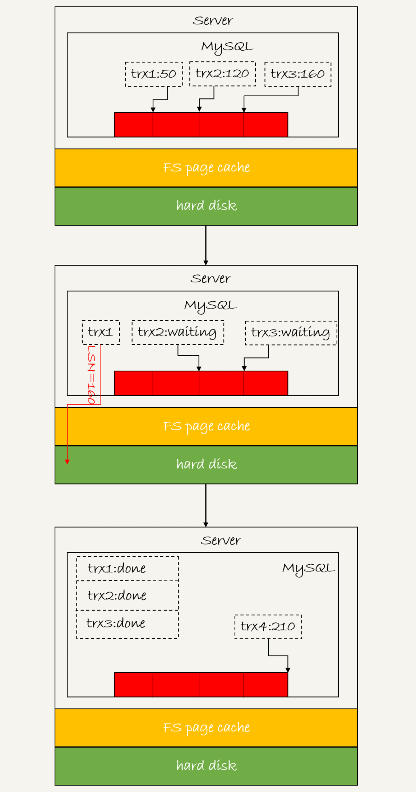
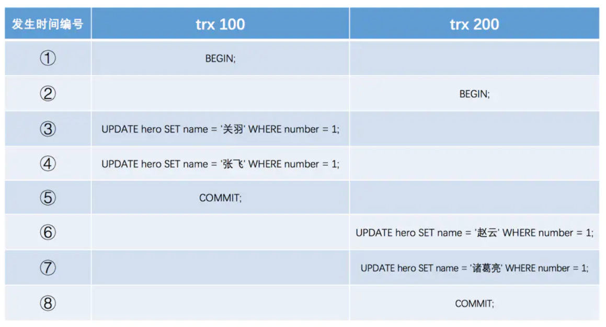

------

此文档记录学习 **MySQL日志模块** 实现 **crash-safe**，包括 **redolog**  **binlog**  **undolog**  

------

### WAL 思想 (Write-Ahead Logging) 

> 实现**crash-safe**过程中，如果每一次更新操作都需要写进磁盘，磁盘要先 **查找** 对应记录，然后再更新，整个过程随机 IO 成本很高。为了解决这个问题，采用日志来提升更新效率，**即Write-Ahead Logging，先写日志，再写磁盘**。虽然这样修改数据需要写两次磁盘，但写日志操作是磁盘顺序IO，速度快。

### redolog （重做日志）

> `作用`：由存储引擎层  InnoDB  生成，确保 **事务持久性**，即只要事务提交成功，那么对数据库的修改就永久保存。如果系统奔溃，数据本身还没写回磁盘，则引擎可在重启时依靠 redolog 恢复数据。

### binlog（归档日志）

> `作用`：由 Server 层生成，可以用于 数据库归档 和 **主备同步**。

### redolog 和 binlog 的区别

> 1. redolog是InnoDB引擎特有的；binlog是MySQL的Server层实现的，所有引擎都可以使用。
> 2. redolog是 **物理日志**，记录某个数据页上做的修改；binlog是 **逻辑日志**，记录语句逻辑，比如“给id=2行的cnt加1”。
>    - 数据落盘的是 **Buffer Pool** **内存页**数据，而不是redolog日志。redolog并没有记录数据页完整数据，而是记录内存页数据的**修改情况**。
>    - binlog有3种格式：statement（记录的是语句，可能导致**主备不一致**，比如 delete limit 在不同索引下删除的数据不同）、row（记录每行字段值及操作，比较**占用空间**）、mixed（混合模式）
> 3. redolog是循环写的，空间固定会用完；binlog是可以追加写入，不会覆盖以前的日志。
>    - 由于redolog 环形追加覆盖内容，无法记录所有更改，故不适宜主从复制，**不能代替binlog**。
>    - 由于 **InnoDB** 依赖**物理**日志来修复内存**数据页**上的损坏数据，而binlog是**逻辑**日志，没有记录数据页物理更新细节，**不能代替redolog**。

### **prepare and commit (两阶段提交)**

> `作用`：保证binlog和redolog **一致性**。binlog和redolog可视作两个独立的个体（服务），故主线程用到**分布式事务思想**。

``` sql
update T set c = c + 1 where id = 2;
```


> 1. 时刻A宕机，binlog没写，redolog未提交，则重启时事务回滚，binlog和redolog数据一致。
> 2. 时刻B宕机，redolog处于prepare。若对应的事务binlog完整存在，则重启提交事务，否则回滚事务，均可保证数据一致。
>    - Q：如何判断binlog完整性？ A：statement格式有 Commit 标志；row 格式有 XID Event 标志。
>    - Q：redolog和binlog如何关联？ A：有共同的 **XID** 字段，奔溃恢复时的拿XID去binlog找对应事务。

### binlog写入机制

>1. 事务执行过程中，先把日志写到 **内存 binlog cache**，事务提交的时候，执行器把 binlog cache 里的完整事务写入到 **binlog 文件**中，并清空 binlog cache。
>2. 其中，文件磁盘写入操作又分为两步：write 和 fsync。内核先 write 写入文件系统 **page cache**，速度快；fsync 则将缓存数据**持久化磁盘**。write 和 fsync 时机，由参数 sync_binlog 控制，出现 **IO瓶颈** 时可将其设大，提高性能，但可能丢N个事务。
>   - sync_binlog=0 表示每次提交事务都只 write，不 fsync
>   - sync_binlog=1 表示每次提交事务都会执行 fsync
>   - sync_binlog=N(N>1) 表示每次提交事务都 write，但累积N个事务后才 fsync


### redolog写入机制

> 1. 事务在执行过程中，生成 redolog 先写到内存 **redolog buffer**，再写入 redolog 文件。
>
> 2. **写入策略**：InnoDB参数 **innodb_flush_log_at_trx_commit** 
>
>    - 0 表示每次事务提交时都只是把 redolog 留在 redolog buffer 
>    - 1 表示每次事务提交时都将redolog buffer 直接持久化到磁盘
>    - 2 表示每次事务提交时都只是把redolog buffer写到 page cache
>
>    同时，InnoDB的后台线程，每隔1秒，就会把 redolog buffer 持久化到磁盘；并且，若redolog buffer占用空间达到 **innodb_log_buffer_size** 一半的时候，后台线程会主动写盘；或者，**并行事务** 提交的时候，顺带将事务 redolog buffer 全部持久化到磁盘
>
> 3. **组提交策略**：减少刷盘，节约磁盘IOPS。逻辑如下图三个并发事务所示，每次写入长度为 length 的 redolog buffer， 日志逻辑序列号（log sequence number，LSN）就会加上 length。在并发更新场景下，第一个事务写完redolog buffer以后，写入磁盘越晚调用，组员可能越多，节约IOPS效果越好。
>
>    - binlog_group_commit_sync_delay 表示延迟多少微秒后才调用 fsync
>    - binlog_group_commit_sync_no_delay_count 表示累积多少次以后才调用fsync




##### **Q：MySQL现在出现IO性能瓶颈，可以通过哪些方法来提升性能**

> 1. 设置 **binlog_group_commit_sync_delay** 和 **binlog_group_commit_sync_no_delay_count** 参数，减少 binlog 的写盘次数。这个方法是基于“额外的故意等待”来实现的，因此可能会增加语句的响应时间，但没有丢失数据的风险。
> 2. 将 **sync_binlog** 设置为大于1的值（比较常见是100~1000）。这样做的风险是，主机掉电时会丢binlog日志。
> 3. 将 **innodb_flush_log_at_trx_commit** 设置为 2。这样做的风险是，主机掉电的时候会丢数据。

### undolog （回滚日志）

> `作用`：1- 事务回滚 **原子性**    2- MVCC 视图版本**链**
>
> `实现`：记录事务操作中 **增删改**（当前读，加锁阻塞） 的相反语句，用于当前版本回滚，属于 **逻辑日志**
>
> `写入`：
>
> - **更新数据前** 记录 undolog buffer， 如 031 流程图中 将C值加1 更新操作 前面。
> - **落盘binlog前** 落盘 undolog， 如 031 流程图中的 时刻A 区间，用于宕机重启时事务回滚。



