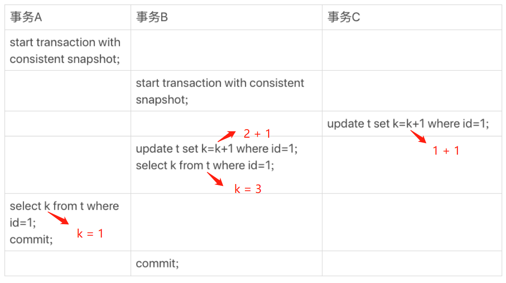
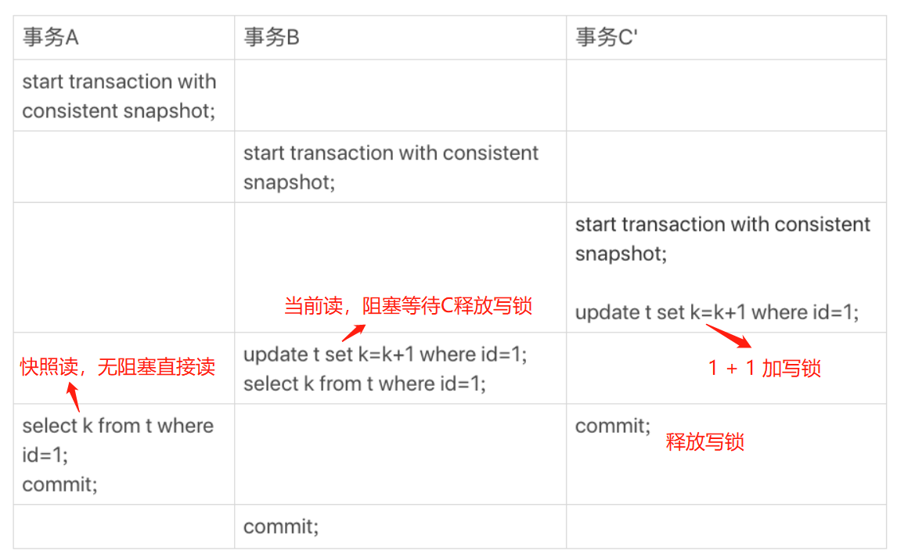

------

此文档记录学习 **MySQL事务**  ，包括 **锁** 和 **MVCC**，以实现 **ACID** 特性 

Atomicity、Consistency、Isolation、Durability，即 原子性、一致性、隔离性、持久性

------

### 事务隔离

> 场景：数据库操作并行时，可能出现 **脏读、不可重复读、幻读** 3个问题。
>
> 解决：**事务隔离**，由弱到强分为 **读未提交、读提交、可重复读** 和 **串行化** 4个级别。但是，隔离级别越高，并行效率越低，故需要根据具体业务使用对应事务。存在即合理。 
>
> 实现：MySQL默认 **可重复读 RR**，InnoDB 通过用 **锁** 和 **MVCC** 结合实现

### 锁

> `全局锁`
>
> - 对数据库加锁，只可读不可写，维护 **全局视图** 一致，典型场景是做全库备份。命令：**Flush tables with read lock**
> - 而对于使用事务引擎的数据库，可不用全局锁，直接使用参数 **–single-transaction**，通过导数据之前启动事务来获取视图，由于 MVCC 支持，备份过程中数据可写。

> `表级锁`
>
> - 表锁：**lock tables t1 read/write** 除了会限制别的线程的读写外，同时也会限定本线程 **可操作的表** 以及 **读写权限** 。
> - 元数据锁（Meta Data Lock, **MDL**）：隐式**自动**上锁，对表做增删改查操作时加 **读锁**；对表做结构变更操作时加 **写锁**。

> `行级锁`
>
> - **两段锁协议**：事务执行分为 **加锁**阶段 和 **解锁**阶段。事务开启后，行锁在需要时才上锁（加锁阶段中），但只有等到事务结束时才解锁（ rollback/commit 进入解锁阶段 ），会有死锁隐患。
>   - 注意在写事务SQL时，把最可能影响并发度的锁**往后放**。（比如减库存并记录交易：先 insert 后 update）
>   - 如果过滤条件无法走 **索引** ，InnoDB **存储引擎层面** 就会将所有记录 **加锁** 后返回，再由 **Server层** 进行过滤，并 **释放** 不满足条件的记录锁（**优化操作**，但违背二段锁协议约束）
> - 事务 **死锁** 解决策略：
>   - 设置等待超时阈值 **innodb_lock_wait_timeout** = 50 dft （太小会有误伤）
>   - 死锁检测，发现死锁主动回滚 **innodb_deadlock_detect** = on dft （额外的检测负担）

##### 注：读写锁乞丐版实现

``` java
public class ReadWriteLock {
    private int readers = 0;
    private int writers = 0;
    private int writeRequests = 0;
    public synchronized void lockRead() throws InterruptedException {
        // 读写锁原型中，有写请求时不可以进行读操作 
        // read - write(block) - read(block)
        while (writers > 0 || writeRequests > 0) {
            wait();
        }
        readers++;
    }
    public synchronized void unlockRead() {
        readers--;
        notifyAll();
    }
    public synchronized void lockWrite() throws InterruptedException {
        writeRequests++;
        while (readers > 0 || writers > 0) {
            wait();
        }
        writeRequests--;
        writers++;
    }
    public synchronized void unlockWrite() {
        writers--;
        notifyAll();
    }    
}
```

> `间隙锁` 
>
> - InnoDB 使用 **间隙锁** 使得在 **RR 隔离级别** 下也能解决 **幻读** 问题
> - **幻读**：事务中先后查询 **同一范围** 的数据行，返回的结果不一致（RR 针对的是 **update** 和 **delete**，相同行，可用行锁锁住；幻读针对的是 **insert**，不同行，需要用间隙锁锁住）
> - select where pid = 20 用 **行锁** 锁住条件对应的数据行，同时也用 **间隙锁** 将 **索引条件** 在 **B+树叶子节点** 两侧索引 **范围** 之间锁住。无法 insert pid = 20，column = any 的数据行，添加 pid B+树 节点时阻塞。

> `Next-Key Lock`
>
> - Next-Key Lock = 行锁 + 间隙锁，即 锁定一个范围，且包括记录本身（间隙锁是锁定一个范围，但不包括记录本身）

##### InnoDB RR 加锁原则和优化

>- 原则1：首先，加锁的基本单位是 **next-key lock**，是个左开右闭区间 (left, right]
>- 优化1：索引上的等值查询，给 **唯一索引** 加锁的时候，next-key lock退化为行锁（**唯一索引才优化**）
>- 优化2：索引上的等值查询，向右遍历时（**普通索引** 的查询过程直到不满足条件才停止），到最后一个值 **均不** 满足 **等值条件** 的时候，next-key lock退化为间隙锁。
>- 原则2：查找过程中 **访问到** 的 **索引**对象 才会加锁（即锁是加在索引上，同时考虑是否需要回表）

### MVCC

> 作用：多版本并发控制 MVCC 实现 **快照读** 操作， **不加锁**，提高性能。

> 实现：**版本号** + **回滚日志 undolog** 

> - 在InnoDB中，每个事务有唯一的**递增版本号**，并给每行数据后添加三个隐藏列（创建数据行的事务版本号、删除的事务版本号、回溯指针）。在 **可重复读 RR** 级别下，MVCC 维护 **一致性视图**，CRUD 操作如下：
>   - **SELECT**，读取（创建版本号 <= 当前事务版本号 ) && ( 删除版本号 = null || 删除版本号 > 当前事务版本号 )  的数据行
>   - **INSERT**，新增数据行，并设置行的创建版本号为当前事务版本号
>   - **DELETE**，读取出来的记录行中，设置行的删除版本号为当前事务版本号
>   - **UPDATE**，等同先 DELETE 后 INSERT，其先后操作逻辑同上

> - 每个事务启动时会构造 **定义快照视图范围** 的 **版本号数组**。历史版本数据不是物理存在的，每次读取时需要根据 当前版本 和 **undolog**  逻辑计算回溯出来。
>   - start transaction 不会启动事务，只有执行 SQL 时才隐式启动；可用 **with consistent snapshot** 显示启动
>   - MVCC 读操作 分 **快照读**（视图范围，用于 **不加锁** 操作，如 select where 操作） 和 **当前读**（全局当前版本，用于 **加锁** 操作，包括update、insert、delete where 操作 以及 select lock in share mode / for update 显示加锁）。其中，只有事务提交后，更新的数据才变成全局当前版本。




##### **小结：InnoDB 可重复读 RR  = MVCC (优化读操作) + 行级锁（两段锁协议，写互斥）**

> 即：不加锁的 **快照读**  + 加读锁的 **当前读** + 写锁 

