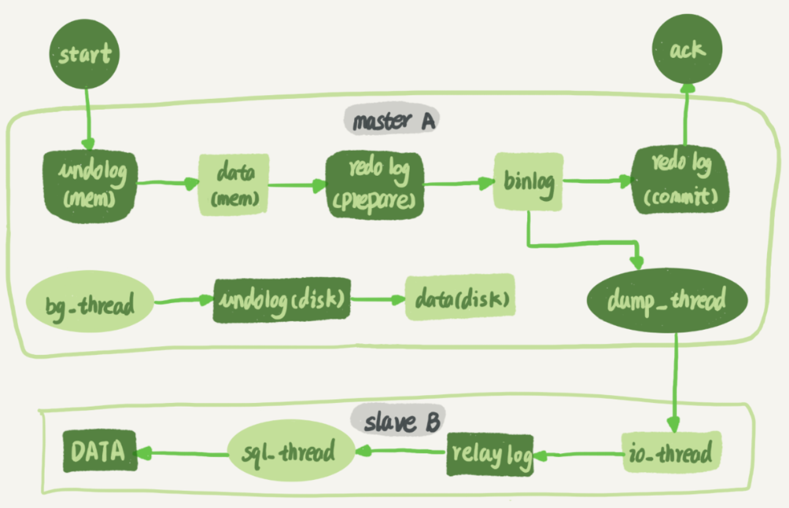

### MySQL 搭建模式

+ **单点模式**：顾名思义，存在单点风险。
+ **主从模式**：集群，主节点宕机可使用备份节点，提高可用性；同时可在此基础上加 **读写分离、数据分片**，提高查询性能。


### MySQL 主从模式

+ **主从数据同步流程**

  > 1. Slave IO线程 连接 Master，发起请求获取 binlog文件 **指定位置** 的数据
  > 2. Master IO线程 接收到请求后，读取指定位置后的binlog日志信息并返回
  > 3. Slave **IO线程** 将日志数据写入 relaylog，并将Master最新的日志文件名和位置等元信息写入 Master Info
  > 4. Slave **SQL线程** 实时检测 relaylog 并执行 SQL语句写入数据库

  

  > 同个流程，另一个视图：



+ **主从搭建**

  ```mysql
  -- docker 安装 mysql8.0 
  $ docker run -d -p 3307:3306 [-v ..] -e MYSQL_ROOT_PASSWORD=123456 mysql -- 初始化root密码，否则进不去
  $ docker exec -it e4 /bin/bash
  $ mysql [-h ..] [--port ..] -uroot -p123456;
  $ select * from mysql.user \G;
  $ update mysql.user set host='10.190.180.240' where user='root' and host='localhost'; -- 改成IP，外部接入
  $ alter user root@10.190.180.240 identified with mysql_native_password by '123456'; -- 否则报错authentication plugin caching_sha2_password 
  $ mysql -h 10.190.180.240 --port -uroot -p123456; -- success
  
  -- 修改主库 my.conf
  [mysqld]
  server-id=1
  binlog-format=mixed -- statement row mixed 
  binlog-do-db=ct-test -- 要同步的库
  binlog-ignore-db=mysql -- 不同步的库
  
  $ docker restart e4 -- 重启主库
  $ show variables like 'log_bin'; -- log_bin=ON
  $ show master status; -- 记下 File Position
  
  -- 修改从库 my.conf
  [mysqld]
  server-id=2
  replicate-do-db=ct-test -- 要同步的库
  replicate-ignore-db=mysql -- 不同步的库
  
  $ stop slave;
  -- slave 绑定 master，并指定binlog初始增量位置
  -- 在做主从数据增量复制前，需要先全量拷贝master旧数据到slave上
  $ change master to  master_host='172.17.0.7',master_port=3306,master_user='root',master_password='123456',master_log_file='binlog.000006',master_log_pos=156; -- docker与docker间连接用局域网地址
  $ start slave;
  $ show slave status; -- Slave_IO_Running YES & Slave_SQL_Runing YES
  ```

  + **主库宕机数据丢失**

    MySQL5.5 实现 **semi-sync 半同步复制**，取代异步复制，解决主库数据丢失问题。半同步复制指主库写入binlog后立即通知从库写入relaylog，待从库写完返回ack后，主库才commit事务（否则等待超时切换异步复制）。

  + **主备同步存在延时**

    MySQL5.6 实现 relaylog **并行写入** 数据库，改善因主库多个客户端连接，并行写入binlog，而从库只能串行将relaylog写入数据库带来的时延问题。其中，并行策略有 **按表分发** 和 **按行分发**


### MySQL 读写分离 + 数据分片 

> 常用中间件：<u>**Sharding-Sphere**</u>、Mycat