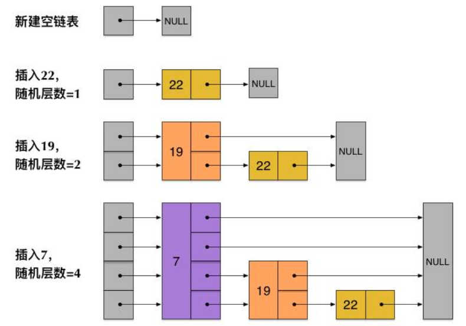
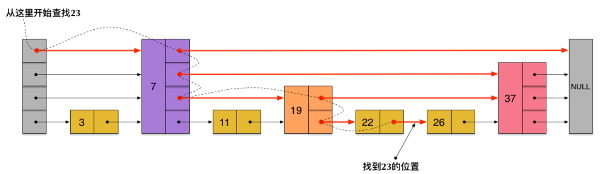

### Redis 数据结构

+ **SDS** 简单动态字符串

  ```c
  struct sdshdr {
      // 字符串长度 
      int len;
      // buf数组中未使用的字节数
      int free;
      // 字节数组，用于保存字符串
      char buf[];
  };
  ```

  + 与 c 相比，redis 通过 len 和 free 提升性能

    > 1. 获取长度时间复杂度O(1)
    > 2. 减少修改字符串时带来内存重分配次数

  + raw 和 embstr 编码的 SDS

    > 字符串长度小于39字节，编码类型 embstr；否则为 raw
    >
    > 区别：embstr 的 redisObject 和 sdshdr 地址连续；raw 不连续

+ **LinkedList** 双向无环链表 【前后指针】

+ **ZipList** 压缩列表

  > 经过压缩编码的由连续内存块组成的顺序型数据结构

  | zlbytes        | zltail                   | zlen     | entryX1...N | zlend      |
  | -------------- | ------------------------ | -------- | ----------- | ---------- |
  | 列表占用字节数 | 尾节点距离起始地址字节数 | 节点个数 | 各个节点    | 列表尾标志 |

+ **SkipList** 跳跃表

  ```c
  typedef struct zskiplistNode {
      // 后退指针
      struct zskiplistNode *backward;
      // 分值
      double score;
      // 成员对象
      robj *obj;
      // 层
      struct zskiplistLevel {
          // 前进指针
          struct zskiplistNode *forward;
          // 跨度
          unsigned int span;
      } level[];
  } zskiplistNode;
  ```

  + 上层节点个数是下层节点的一半（如何实现？随机层数）

  

  + 查找的时间复杂度 O(logN)

  

+ **HashTable** 哈希表 【数组 + 链表 + Entry<K,V>】

  + 渐进式 rehash 提高扩容性能

    > 在对哈希表增删改查操作过程中逐步迁移数据，每次迁移一个桶上所有数据
    >
    > 查: 先h[0] 没有则h[1]，增: 直接h[1]，删: 先[0] 没有则h[1]

+ **IntSet** 整数集合

  > 用于保存整数值，contents[] 不含重复项，按值从小到大排序  

  ``` c
  typedef struct intset {
      // 编码方式
      uint32_t encoding;
      // 集合包含的元素数量
      uint32_t length;
      // 保存元素的数组
      int8_t contents[];
  } intset;
  ```

  

### Redis 对象类型

>  对象类型redisObject结构体

```c
typedef struct redisObject {
    // 类型
    unsigned type:4;
    // 编码
    unsigned encoding:4;
    // 底层数据结构的指针
    void *ptr;
} robj;
```

+ **String** ：Int / SDS    【KV缓存、计数】
+ **List** ：ZipList / LinkedList    【消息队列】
+ **Hash** ： ZipList / HashTable    【关系型数据库表】 
+ **Set** ：IntSet / HashTable    【交集】
+ **ZSet** ：ZipList / SkipList    【排行榜】

> 操作指令：help @redisObject


### Redis 线程模型

+ **单线程：事件驱动 + IO多路复用**

  

  > Redis 的文件事件处理器 Event Loop 是基于事件驱动，是单线程模型
  > 同时，socket上基于IO多路复用产生事件源，也是单线程

  

+ **单线程与多线程**

  > Redis核心是数据存在内存中，由于内存iops很高，故使用单线程的效率更高，省去线程切换的开销
  >
  > 假设：CPU读取内存1MB数据，单线程耗时250us；一次线程上下文切换约1500ns，若1000个线程读...
  >
  > 相反，当下层iops慢速时（如磁盘、网络）应使用多线程。
  >
  > Redis 的性能瓶颈在网络 IO上，故6.0采用多线程来处理网络数据读写（事件处理执行命令仍是单线程）


### Redis 缓存问题

+ **缓存雪崩**

  > 大量key同时失效（如缓存服务宕机），流量打到DB上
  >
  > 解决：事前哨兵主从，事中熔断限流，事后持久化恢复

+ **缓存击穿**

  > 单个热key过期瞬间，流量全部打到DB上。
  >
  > 解决：缓存无需更新时，热点数据设为永不过期；更新不频繁时，缓存查不到则加锁更新；更新频繁时定时异步任务

+ **缓存穿透**

  > 查询不存在的key（恶意攻击），流量每次打到DB上
  >
  > 解决：做标记，如布隆过滤器


### Redis 双写不一致

> 在同时使用数据库和缓存时，
>
> 读数据流程固定为：先读缓存，没有则查数据库，再放入缓存，
>
> 而在更新数据时，两端会存在不一致问题，常见的流程如下：

+ **先删除缓存，再更新数据库**

  > 存在问题：A线程 删除缓存后**准备（还未）**更新数据库；此时 B线程 查不到缓存，将数据库脏数据同步到缓存中。
  >
  > 解决思路：**延时双删策略**，即 A线程 在更新数据库后休眠200ms（根据实际流程），再次删除缓存，保证中间产生的脏数据被删除。若Redis删除操作异常，则可提供 **重试保障机制**（同步 / 异步）。

+ **先更新数据库，再删除缓存【Cache Aside】**

  > 存在问题：更新数据库后删除缓存失败，此时数据不一致产生脏数据
  >
  > 解决思路：**重试保障机制之异步消息队列**，若再次删除失败，可重发消息多次尝试

  

  > 方法论：① **Double Check**（脏数据） ② **异步消息重试** （操作失败）

  > 缓存组件的设计模式

  + **Cache Aside（旁路模式）**：缓存和数据库两个存储的操作同时对外暴露
  + **Read / Write Through（读写穿透）**：数据库由**缓存服务**统一管理，对外提供单一存储视图
    + Read Through：查不到缓存时，缓存服务自己加载数据库（Cache Aside 是业务层加载）
    + Write Through：数据更新时，由缓存服务**同步**更新缓存和数据库
  + **Write Behind Caching（异步缓存写入）**：缓存服务更新数据时，只更新缓存，再**异步**批量更新数据库（Page Cahce用该模式，其中 write back 思想可以合并同一数据的多次操作，提高性能）

  

### Redis 过期策略

+ **惰性删除**

  > 在查询key的时候对过期时间进行检测，过期则删除

+ **定期删除**

  > 开启定时任务，随机获取一些key做检查和删除

+ **内存淘汰**

  > 当惰性和定期没把某些key删除时，则key当内存满时走内存淘汰机制 
  
  ```java
  /**
   * LRU最近最少使用
   * LinkedHashMap 在 next 基础上加 before after，节点间形成双向链表
   */
  public class LruUtils<K, V> extends LinkedHashMap<K, V> {
      private int maxSize;
      public LruUtils(int maxSize) {
          // initialCapacity 容量
          // loadFactor      负载因子
          // accessOrder     排序模式, true 为访问, false 为插入
          super((int) Math.ceil(maxSize / 0.75) + 1, 0.75f, true);
          this.maxSize = maxSize;
      }
      /**
       * 钩子方法，Map 插入元素时调用
       *
       * @param eldest 当前最老的元素
       * @return 是否删除最老的元素
       */
      @Override
      protected boolean removeEldestEntry(Map.Entry<K, V> eldest) {
          // 将不会扩容
          return size() > maxSize;
      }
  }
  ```


### Redis 事务机制

> Redis 事务将一组命令集合按顺序添加到队列中，并按顺序执行。要么处理所有命令，要么不处理任何，是原子性，但不提供回滚。

+ **multi**：开启事务，之后输入的命令将加入队列中（不是原子），若 **加入队列过程中** 报错（如语法问题），则 Redis **撤销**事务，不执行队列中的任何命令。
+ **exec**：执行事务，按顺序执行队列命令**（原子操作）**，**执行期间** 若有命令报错（如变量类型问题），Redis **不会进行回滚**，**继续执行后续命令**。
+ **discard**：撤销事务，**位于 exec 前面**，不执行队列中的**任何**命令。
+ **watch**：监视 redis key，若变量值在 **exec 之前** 被其它客户端修改，则 **exec 返回 null**，事务失败 **撤销**。是**乐观锁** 机制，**默认**数据不会冲突，不加锁，在数据更新时才进行检测。


### Redis 持久化

+ **RDB 快照** 

  > 快照：某一时刻的内存**数据**以**二进制**形式写入磁盘
  >
  > 使用 **save（主线程，有性能问题） / bgsave（fork子线程）** 指令，持久化到 **dump.rdb** 文件

  ```shell
  # redis.conf 配置文件
  # rdb 写入时机
  save 900 1
  save 300 10
  save 60 10000
  # save m n 表示m秒发生n次变化时，触发bgsave
  # 三个配置项，满足任意一个都会触发
  ```

  >优点：文件体积小，恢复速度快	缺点：时间窗口数据丢失

+ **AOF 文件追加**

  > 文件追加：不断往AOF文件追加客户端写入的**指令**

  ```shell
  # redis.conf 配置文件
  appendonly yes  # 默认 false 不开启
  				# 开启后 Redis 使用 AOF 而不是 RDB
  
  # aof 写入时机
  # always 每次写入指令都刷盘；everysec 每秒刷盘一次；no 随操作系统机制	
  appendfsync always|everysec|no
  		   
  # aof 重写（瘦身）时机
  auto-aof-rewrite-percentage 100  # 距离上次文件增长超过多少百分比
  auto-aof-rewrite-size 64mb		 # 文件体积超过多大
  ```

  > 优点：数据更完整，易读性强	缺点：文件体积大，IO压力大

+ **混合持久化 Redis 4**

  > 背景：RDB 会丢大量数据，宕机重放 AOF 文件很慢 
  >
  > 混合持久化：AOF **重写**时用 RshellDB 全量冷备，后续继续用 AOF 追加增量，结合两者优势

  ```shell
  # AOF 重写的方式
  aof-use-rdb-preamble yes  # 默认 false 不开启 
  ```

