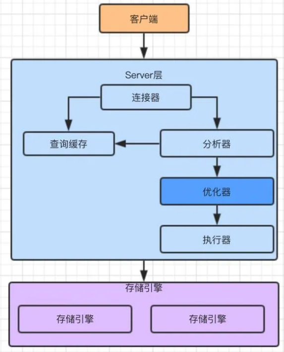
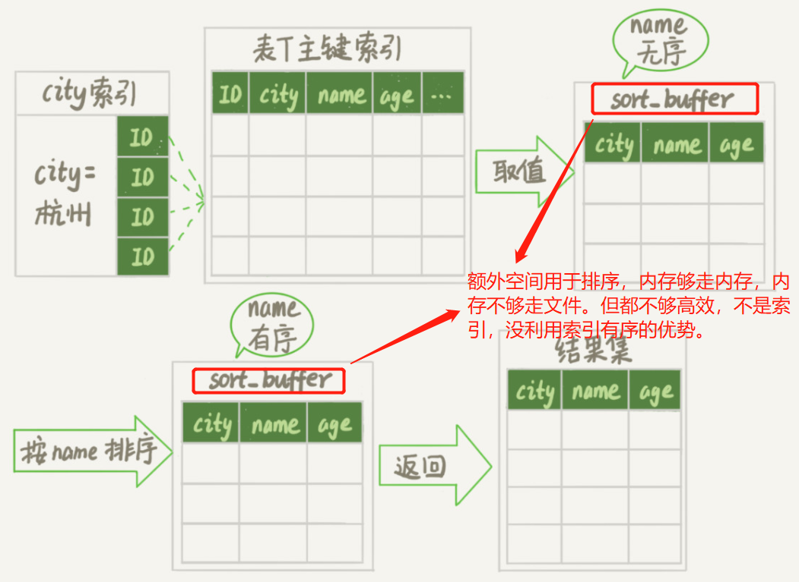
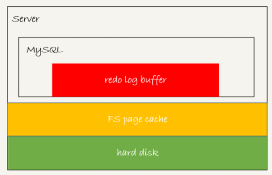

## 1. MySQL 索引优化

### 存储引擎

+ MyISAM
  + 文件结构：.myi 索引文件、.myd 数据文件、.frm 表结构文件
  + 只有非聚集索引：索引文件不包含数据
  + 只支持表级锁
  + 不支持事务操作
  + 适合读多写少：MyISAM 是非聚集索引，索引保存的是数据文件的指针，主键索引和辅助索引是独立的
+ InnoDB
  + 文件结构：.ibd 索引数据字典文件、.frm 表结构文件
  + 有聚集索引：索引文件包含数据
  + 支持行级锁（只有当查询条件使用索引时才会使用行级锁，是对索引加锁，而不是对数据行加锁）
  + 支持事务操作
  + 适合写多读少：InnoDB 是聚集索引，通过主键索引效率很高，但是辅助索引需要两次查询

> MyISAM 读速度比 InnoDB 快


### **索引结构**

> **哈希表**（数组 + 链表结构，散列函数映射数组下标，链表解决哈希冲突）
>
> 特点：等值查询速度快 O(1)，但不支持范围查询；同时，多列联合索引需要带上所有列，否则失效


> **B+树**（多叉平衡树）多分查找 O(logN)
>
> 与 ```B-树```相比：
>
> 1. B+树中间节点不含行数据，只含下个指针，故每个数据页可存储更多索引，树的高度变低，查询磁盘次数变少
> 2. 行数据存放在叶子节点中，所有查询都要遍历到叶子节点，查询性能稳定
> 3. 所有叶子节点形成有序链表，有利于范围查询
>
> `Tip`：叶子节点随机插入数据会导致频繁的 `页分裂`，这是使用 `uuid` 作主键的弊端，使用 `自增主键` 从尾部插入可避免。 在此基础上，自增主键中 `雪花算法` 有利于分布式部署，`自增id` 不利于分库分表 


### 查询优化

1. **索引失效** 的情况

   - 对左边的索引列作 `表达式 或 函数运算`

   ``` sql
   SELECT name,age,birthday FROM user WHERE a + 1 = 5
   -- 字符串不加引号，导致左边列的类型转换成整数（函数运算），索引失效
   ```

   - 联合索引不满足 `最左前缀原则`

   ``` sql
   -- 联合索引（name,age,birthday），在 B+树 中三个值作为一个索引整体，需要对比每个索引整体大小，字段从左到右，再分叉查找。
   SELECT name,age,birthday FROM user WHERE name = 'Tom'; -- 走 name, 不走 age 和 birthday
   SELECT name,age,birthday FROM user WHERE name = 'Tom' and age = 18; -- 走 name 和 age, 不走 birthday
   SELECT name,age,birthday FROM user WHERE name = 'Tom' and age = 18 and birthday = 1600328876857; -- 全走
   -- 其它的排列组合则三个字段都不走索引
   
   -- 另外，若当前字段用到了范围（> < like），导致分叉查找出现范围，则索引不走字段后面的列
   SELECT name,age,birthday FROM user WHERE name like 'T%' and age = 18 -- 走 name, 不走 age 和 birthday
   ```

   - 使用 `!=` 和 `like %左模糊` 会扫描全表
   - 使用 `is null` 和 `is not null` 会扫描全表

2. 查询时 **覆盖索引**，尽量避免 **回表**

   ``` sql
   -- 聚簇索引：索引的叶子页直接存放数据行，一个表只有一个聚簇索引，主键索引为聚簇索引，反之不成立。
   -- 回表：非聚簇索引（二级索引）的 B+ 树叶子节点不包含行数据，只包含聚簇索引字段数据。如果需要查询其它字段，则需要回表去查询聚簇索引的多叉树。
   -- 覆盖索引：如果建立的索引上就已经有 SELECT 需要的字段，就不需要回表。
   
   -- eg: 主键索引 id, 普通索引 name
   SELECT age FROM user WHERE name = 'Tom';  -- 回表
   
   -- 设置成联合索引（name, age）
   SELECT age FROM user WHERE name = 'Tom';  -- 无需回表
   ```

3. **索引下推** 减少 **回表** 次数

   ``` sql
   -- 索引下推是 MySQL5.6 引入的优化，可以在非聚簇索引遍历过程中，对索引中包含的字段先做判断，直接过滤掉不满足条件的记录，再返回聚簇索引多叉树进行查询，减少回表次数
   
   -- 设置联合索引（name,age），若表中有（Tom, 18）（Tom, 19）两条记录
   SELECT birthday FROM user WHERE name like 'T%' and age = 18 -- 走 name, 不走 age
   -- MySQL5.6之前，两条记录都回表；有了索引下推后，只有（Tom, 18）回表
   ```

4. **区分度不高** 的列没有必要设置索引

   ``` sql
   -- 区分度：COUNT(DISTINCT col)/COUNT(*)
   -- 区分度太低的字段，比如 state, 加了索引扫描出来的行数也很多
   ```

5. 长字符串使用 **前缀索引**，降低索引空间

   ``` sql
   -- 前缀索引中，通过区分度的大小来设置前缀的长度
   ```

6. 遵循 **小表** 驱动 **大表** 原则，**没走索引** 驱动 **走索引**

   ```sql
   -- MySQL表连接查询算法是 Nest Loop Join
   -- 通过循环遍历驱动表的数据，作为被驱动表数据查询的过滤条件，最后对结果合并
   -- 驱动表不会走索引，被驱动表走索引
   -- 可用 EXPLAIN 执行计划查询，第一行出现的表是驱动表
   
   -- exists 外表是驱动表；内表是被驱表，字段可使用索引。外小内大
   select A.id from A where exists (select 1 from B where B.id = A.id);
   
   -- in 内表是驱动表；外表是被驱表，字段可使用索引。外大内小
   select A.id from A where A.id in (select id from B);
   
   -- 对于 join 查询
   -- 当连接查询没有 where 条件时：
   -- 		1. left join 查询时，左表是驱动表，右表是被驱动表；
   --      2. right join 查询时，右表是驱动表，左表是被驱动表；
   --      3. inner join 查询时，能走索引的是被驱动表
   -- 当连接查询带有 where 条件时：能走索引的是被驱动表
   
   -- 由于 Nest Loop 算法，如果内嵌表不走索引，那每次外循环时，内嵌表都得遍历全表
   -- eg: 小表a, 大表b
   --     on a.id = b.a_id
   --     若 a.id有加索引，b.a_id没有加索引，则 a 是被驱动表
   --     若 a.id有加索引，b.a_id也有加索引，则 b 是被驱动表
   ```

### Select 执行顺序

> 引擎在执行下面每一步时，都会在内存中形成一张虚拟表，然后对虚拟表进行后续操作，并释放没用的虚拟表的内存，以此类推

``` sql
FROM
<表名> # 笛卡尔积
ON
<筛选条件> # 对笛卡尔积的虚表进行筛选
JOIN <inner join, left join, right join ...> 
<join表> # 指定join，用于添加数据到on之后的虚表中，例如left join会将左表的剩余数据添加到虚表中
WHERE
<where条件> # 对上述虚表进行筛选
GROUP BY
<分组条件> # 分组
<SUM()等聚合函数> # 用于having子句进行判断，在书写上这类聚合函数是写在having判断里面的
HAVING
<分组筛选> # 对分组后的结果进行聚合筛选
SELECT
<返回数据列表> # 返回的单列必须在group by子句中，聚合函数除外
DISTINCT
# 数据除重
ORDER BY
<排序条件> # 排序
LIMIT
<行数限制>
```


### 唯一索引和普通索引

>1. 查询过程
>
>  - 对于唯一索引来说，由于索引定义了唯一性，查找到第一个满足条件的记录后，就会停止继续检索。
>  - 对于普通索引来说，查找到满足条件的第一个记录后，需要查找下一个记录，直到碰到第一个不满足条件的记录。
>
>2. 更新过程
>
>  - **change buffer**：更新操作中，如果 **数据页** 在 **内存** 中就直接更新内存，等后续落地；若数据页不在内存中，通过 **change buffer** 可使 **更新操作** 不加载 **数据页** 进 **内存**，而是先记录在 cb；在下次查询数据页时，将数据读入内存，并整合 cb 的更新操作。**change buffer** 减少更新过程中读磁盘的消耗，适用 **写多读少** 的业务场景。
>  - **唯一索引** 下 change buffer 失效，每次更新都得加载数据页**判断唯一性**；**普通索引** 可使用 change buffer
>
>3. 如何选择：两类索引在查询性能上差距微乎其微，主要考虑更新性能。尽量选择 **普通索引**，并开启 **change buffer**（若所有的更新后面马上伴随记录的查询，则应该关闭 change buffer）

### count() 效率

>**优先使用 count(\*)**：count(*) ≈ count(1) > count(主键id) > count(字段) ：
>
>注：count() 是 **Server层** 执行的聚合函数，需对 InnoDB 返回的数据进行 **非空判断**。但是 **count(\*) **是例外，Server 作了优化，不做判断空值的**逻辑**，直接按行累计加1。

### 慢查询

``` sql
set global slow_query_log=ON  -- 开启慢查询
set global long_query_time=2  -- 超过2s算作慢查询，记录到日志中
set global long_querise_not_using_indexex=ON  -- 记录下没有使用索引的查询语句

# 慢查询相关配置
show variables like '%slow_query%';
# 查看正在执行的进程
show processlist;
# 查看当前事务信息
SELECT * FROM INFORMATION_SCHEMA.INNODB_TRX\G;
# 查看当前事务持有锁信息
SELECT * FROM performance_schema.data_locks\G;
```

### 执行计划

> MySQL整体逻辑架构图可以分为 Server层 和 存储引擎层

```
Server层:
	- 连接器：负责跟客户端建立连接、获取权限
	- 查询缓存：执行SQL语句之前，先查缓存，没有再执行
	- 分析器：SQL词法分析、SQL语法分析
	- 优化器：索引选择，选择执行效率高的，生成执行计划
	- 执行器：操作存储引擎，返回执行结果
存储引擎层：
	有 InnoDB、MyISAM 等，负责数据的存储和提取
```



> **Explain** 
>
> 可以查出SQL语句在优化器中的执行计划，分析SQL的执行效率
> 其输出字段和含义如下

+ `id`	表示查询中 select语句 的执行顺序

  ``` 
  id 相同，执行顺序从上到下；不同则大的先（大的是子查询）
  ```

+ `select_type`	select语句 对应的查询类型

  ```
  主要是区别普通查询、联合查询、子查询等的复杂查询
  ```

+ `table`	select语句 执行的表名

+ `type`	查询类型，即搜索行记录的大概范围

  ```
  依次从最优到最差分别为：system > const > eq_ref > ref > range > index > all
  得保证查询达到 range 级别，最好达到 ref
  	- const：在简单查询时，通过主键或唯一索引列与常数比较时，所以表最多有一个匹配行
  	- eq_ref：在连接查询时，被驱动表是通过主键或唯一索引列与常数比较时，被驱动表为 eq_ref
  	- ref：不使用唯一索引，而是使用普通索引或者唯一性索引部分前缀，可能会找到多个符合条件的行
  	- range：使用索引获取范围区间的记录，通常出现在 in, between, >, <, >= 等操作中
  	- index：扫描全表索引 eg select * from group 其中group表的字段都有索引
  	- all：扫描全表，没走索引（index是扫描索引块，而all是扫描数据块）
  ```

+ `key`	查询中用到的索引名称

+ `key_len`	查询中用到的索引字段长度

  ``` 
  - char(n)：n字节长度 varchar(n)：2字节，如果是utf-8，则长度3n + 2
    字符串存储时，若该索引列可以存储NULL值，则key_len多1个字节
  - tinyint：1字节  smallint：2字节  int：4字节  bigint：8字节　
  - date：3字节  timestamp：4字节  datetime：8字节
  ```

+ `ref`	查询中用到的索引字段

+ `rows`	优化器预计要读取并检测行数

  ```
  采样预测，有误差；同时优化器不一定使用行数少的索引，会考虑是否回表
  可以强制使用某个索引：force index
  ```

+ `extra`	额外信息，常见的重要值如下

  ```
  - Using index：使用了覆盖索引，性能高
  - NULL： 查询的列未被索引覆盖，需要回表
  - Using temporary： 创建内部临时表来处理查询，需要考虑索引优化
  - Using filesort： 无法利用索引完成的排序操作称为文件排序，性能差
  ```




## 2. MySQL 日志模块

> 日志模块实现 **crash-safe**，包括 **redolog**  **binlog**  **undolog**  
>
> https://icyfenix.cn/architect-perspective/general-architecture/transaction/local.html


> 存在的三个问题：
>
> 1. 未提交事务，写入后崩溃
> 2. 已提交事务，写入前崩溃
> 3. 在事务提交之后，才允许写入变动数据（即使磁盘 I/O 有足够空闲、即使某个事务修改的数据量非常庞大，占用了大量的内存缓冲区）
>
> Commit Logging（redolog） ： 解决 1、2
>
> Write-Ahead Logging（undolog） ： 解决 3

### WAL 思想 (Write-Ahead Logging) 

> 实现**crash-safe**过程中，如果每一次更新操作都需要写进磁盘，磁盘要先 **查找** 对应记录，然后再更新，整个过程随机 IO 成本很高。为了解决这个问题，采用日志来提升更新效率，**即Write-Ahead Logging，先写日志，再写磁盘**。虽然这样修改数据需要写两次磁盘，但写日志操作是磁盘顺序IO，速度快。

### redolog （重做日志）

> `作用`：由存储引擎层  InnoDB  生成，确保 **事务持久性**，即只要 **事务** 提交成功，那么对数据库的修改就永久保存。如果系统奔溃，数据本身还没写回磁盘，则引擎可在重启时依靠 redolog 恢复数据。

### binlog（归档日志）

> `作用`：由 Server 层生成，可以用于 数据库归档 和 **主备同步**。
>
> `查看`：https://www.cnblogs.com/---wunian/p/8992900.html  mysqlbinlog --base64-output=decode-rows -v bin.000001

### redolog 和 binlog 的区别

> 1. redolog是InnoDB引擎特有的；binlog是MySQL的Server层实现的，所有引擎都可以使用。
> 2. redolog是 **物理日志**，记录某个数据页上做的修改；binlog是 **逻辑日志**，记录语句逻辑，比如“给id=2行的cnt加1”。
>    - 数据落盘的是 **Buffer Pool** **内存页**数据，而不是redolog日志。redolog并没有记录数据页完整数据，而是记录内存页数据的**修改情况**。
>    - binlog有3种格式：statement（记录的是语句，可能导致**主备不一致**，比如 delete limit 在不同索引下删除的数据不同）、row（记录每行字段值及操作，比较**占用空间**）、mixed（混合模式）
> 3. redolog是循环写的，空间固定会用完；binlog是可以追加写入，不会覆盖以前的日志。
>    - 由于redolog 环形追加覆盖内容，无法记录所有更改，故不适宜主从复制，**不能代替binlog**。
>    - 由于 **InnoDB** 依赖**物理**日志来修复内存**数据页**上的损坏数据，而binlog是**逻辑**日志，没有记录数据页物理更新细节，**不能代替redolog**。

### **prepare and commit (两阶段提交)**

> `作用`：保证binlog和redolog **一致性**。binlog和redolog可视作两个独立的个体（服务），故主线程用到**分布式事务思想**。

``` sql
update T set c = c + 1 where id = 2;
```


> 原理：
>
> 1. prepare 阶段：redolog 会被刷到磁盘，并将回滚段置为 prepared 状态。binlog不作任何操作。
> 2. commit阶段：undolog、binlog 持久化到磁盘后，设置 redolog 提交状态，然后存储引擎层提交。

> 1. 时刻A宕机，binlog没写，redolog未提交，则重启时事务回滚，binlog和redolog数据一致。
> 2. 时刻B宕机，redolog处于prepare。若对应的事务binlog完整存在，则重启提交事务，否则回滚事务，均可保证数据一致。
>    - Q：如何判断binlog完整性？ A：statement格式有 Commit 标志；row 格式有 XID Event 标志。
>    - Q：redolog和binlog如何关联？ A：有共同的 **XID** 字段，奔溃恢复时的拿XID去binlog找对应事务。

### binlog写入机制

>1. 事务执行过程中，先把日志写到 **内存 binlog cache**，事务提交的时候，执行器把 binlog cache 里的完整事务写入到 **binlog 文件**中，并清空 binlog cache。
>2. 其中，文件磁盘写入操作又分为两步：write 和 fsync。内核先 write 写入文件系统 **page cache**，速度快；fsync 则将缓存数据**持久化磁盘**。write 和 fsync 时机，由参数 sync_binlog 控制，出现 **IO瓶颈** 时可将其设大，提高性能，但可能丢N个事务。
>
>  - sync_binlog=0 表示每次提交事务都只 write，不 fsync
>  - sync_binlog=1 表示每次提交事务都会执行 fsync
>  - sync_binlog=N(N>1) 表示每次提交事务都 write，但累积N个事务后才 fsync


### redolog写入机制

> 1. 事务在执行过程中，生成 redolog 先写到内存 **redolog buffer**，再写入 redolog 文件。
>
> 2. **写入策略**：InnoDB参数 **innodb_flush_log_at_trx_commit** 
>
>    - 0 表示每次事务提交时都只是把 redolog 留在 redolog buffer 
>    - 1 表示每次事务提交时都将redolog buffer 直接持久化到磁盘
>    - 2 表示每次事务提交时都只是把redolog buffer写到 page cache
>
>    同时，InnoDB的后台线程，每隔1秒，就会把 redolog buffer 持久化到磁盘；并且，若redolog buffer占用空间达到 **innodb_log_buffer_size** 一半的时候，后台线程会主动写盘；或者，**并行事务** 提交的时候，顺带将事务 redolog buffer 全部持久化到磁盘
>
> 3. **组提交策略**：减少刷盘，节约磁盘IOPS。逻辑如下图三个并发事务所示，每次写入长度为 length 的 redolog buffer， 日志逻辑序列号（log sequence number，LSN）就会加上 length。在并发更新场景下，第一个事务写完redolog buffer以后，写入磁盘越晚调用，组员可能越多，节约IOPS效果越好。
>
>    - binlog_group_commit_sync_delay 表示延迟多少微秒后才调用 fsync
>    - binlog_group_commit_sync_no_delay_count 表示累积多少次以后才调用fsync




**Q：MySQL现在出现IO性能瓶颈，可以通过哪些方法来提升性能**

> 1. 设置 **binlog_group_commit_sync_delay** 和 **binlog_group_commit_sync_no_delay_count** 参数，减少 binlog 的写盘次数。这个方法是基于“额外的故意等待”来实现的，因此可能会增加语句的响应时间，但没有丢失数据的风险。
> 2. 将 **sync_binlog** 设置为大于1的值（比较常见是100~1000）。这样做的风险是，主机掉电时会丢binlog日志。
> 3. 将 **innodb_flush_log_at_trx_commit** 设置为 2。这样做的风险是，主机掉电的时候会丢数据。

### undolog （回滚日志）

> `作用`：1- 事务回滚 **原子性**    2- MVCC 视图版本**链**
>
> `实现`：记录事务操作中 **增删改**（当前读，加锁阻塞） 的相反语句，用于当前版本回滚，属于 **逻辑日志**
>
> `写入`：1. 修改前做 undolog 记录、2. undolog 刷入磁盘后，才提交事务
>
> - **更新数据前** 记录 undolog buffer， 如 031 流程图中 将C值加1 更新操作 前面。
> - **落盘binlog前** 落盘 undolog， 如 031 流程图中的 时刻A 区间，用于宕机重启时事务回滚。


## 3. MySQL 事务与锁

> **MySQL事务**  ，包括 **锁** 和 **MVCC**，以实现 **ACID** 特性 
>
> Atomicity、Consistency、Isolation、Durability，即 原子性、一致性、隔离性、持久性

### 事务隔离

> 场景：数据库操作并行时，可能出现 **脏读、不可重复读、幻读** 3个问题。
>
> 解决：**事务隔离**，由弱到强分为 **读未提交、读提交、可重复读** 和 **串行化** 4个级别。但是，隔离级别越高，并行效率越低，故需要根据具体业务使用对应事务。存在即合理。 
>
> ```
> // 读未提交  
>    存在问题：脏读（外部select事务内部）	解决方法：Update写锁（排它锁），select不加锁，提交事务才释放
> // 读已提交	
>    存在问题：不可重复读（外部update事务内部）	  解决方法：select读锁（共享锁），Update写锁（排它锁）提交事务才释放
> // 可重复读		  
>    存在问题：幻读（外部insert事务内部）	解决方法：表锁
> // 串行化
> ```
>
> 实现：MySQL默认 **可重复读 RR**，InnoDB 通过用 **锁** 和 **MVCC** 结合实现

### 锁

> `全局锁`
>
> - 对数据库加锁，只可读不可写，维护 **全局视图** 一致，典型场景是做全库备份。命令：**Flush tables with read lock**
> - 而对于使用事务引擎的数据库，可不用全局锁，直接使用参数 **–single-transaction**，通过导数据之前启动事务来获取视图，由于 MVCC 支持，备份过程中数据可写。

> `表级锁`
>
> - 表锁：**lock tables t1 read/write** 除了会限制别的线程的读写外，同时也会限定本线程 **可操作的表** 以及 **读写权限** 。
> - 元数据锁（Meta Data Lock, **MDL**）：隐式**自动**上锁，对表做增删改查操作时加 **读锁**；对表做结构变更操作时加 **写锁**。

> `行级锁`
>
> - **两段锁协议**：事务执行分为 **加锁**阶段 和 **解锁**阶段。事务开启后，行锁在需要时才上锁（加锁阶段中），但只有等到事务结束时才解锁（ rollback/commit 进入解锁阶段 ），会有死锁隐患。
>   - 注意在写事务SQL时，把最可能影响并发度的锁**往后放**。（比如减库存并记录交易：先 insert 后 update）
>   - 如果过滤条件无法走 **索引** ，InnoDB **存储引擎层面** 就会将所有记录 **加锁** 后返回，再由 **Server层** 进行过滤，并 **释放** 不满足条件的记录锁（**优化操作**，但违背二段锁协议约束）
> - 事务 **死锁** 解决策略：
>   - 设置等待超时阈值 **innodb_lock_wait_timeout** = 50 dft （太小会有误伤）
>   - 死锁检测，发现死锁主动回滚 **innodb_deadlock_detect** = on dft （额外的检测负担）

**注：读写锁乞丐版实现**

``` java
public class ReadWriteLock {
    private int readers = 0;
    private int writers = 0;
    private int writeRequests = 0;
    public synchronized void lockRead() throws InterruptedException {
        // 读写锁原型中，有写请求时不可以进行读操作 
        // read - write(block) - read(block)
        while (writers > 0 || writeRequests > 0) {
            wait();
        }
        readers++;
    }
    public synchronized void unlockRead() {
        readers--;
        notifyAll();
    }
    public synchronized void lockWrite() throws InterruptedException {
        writeRequests++;
        while (readers > 0 || writers > 0) {
            wait();
        }
        writeRequests--;
        writers++;
    }
    public synchronized void unlockWrite() {
        writers--;
        notifyAll();
    }    
}
```

> `间隙锁` 
>
> - InnoDB 使用 **间隙锁** 使得在 **RR 隔离级别** 下也能解决 **幻读** 问题
> - **幻读**：事务中先后查询 **同一范围** 的数据行，返回的结果不一致（RR 针对的是 **update** 和 **delete**，相同行，可用行锁锁住；幻读针对的是 **insert**，不同行，需要用间隙锁锁住）
> - select where pid = 20 用 **行锁** 锁住条件对应的数据行，同时也用 **间隙锁** 将 **索引条件** 在 **B+树叶子节点** 两侧索引 **范围** 之间锁住。无法 insert pid = 20，column = any 的数据行，添加 pid B+树 节点时阻塞。

> `Next-Key Lock`
>
> - Next-Key Lock = 行锁 + 间隙锁，即 锁定一个范围，且包括记录本身（间隙锁是锁定一个范围，但不包括记录本身）

**InnoDB RR 加锁原则和优化**

>- 原则1：首先，加锁的基本单位是 **next-key lock**，是个左开右闭区间 (left, right]
>- 优化1：索引上的等值查询，给 **唯一索引** 加锁的时候，next-key lock退化为行锁（**唯一索引才优化**）
>- 优化2：索引上的等值查询，向右遍历时（**普通索引** 的查询过程直到不满足条件才停止），到最后一个值 **均不** 满足 **等值条件** 的时候，next-key lock退化为间隙锁。
>- 原则2：查找过程中 **访问到** 的 **对象** 才会加锁（区分不同的索引对象、不走索引的话则是行记录对象）

### MVCC

> 作用：多版本并发控制 MVCC 实现 **快照读** 操作， **不加锁**，提高性能。

> 实现：**版本号** + **回滚日志 undolog** 

> - 在InnoDB中，每个事务有唯一的**递增版本号**，并给每行数据后添加三个隐藏列（创建数据行的事务版本号、删除的事务版本号、回溯指针）。在 **可重复读 RR** 级别下，MVCC 维护 **一致性视图**，CRUD 操作如下：
>   - **SELECT**，读取（创建版本号 <= 当前事务版本号 ) && ( 删除版本号 = null || 删除版本号 > 当前事务版本号 )  的数据行
>   - **INSERT**，新增数据行，并设置行的创建版本号为当前事务版本号
>   - **DELETE**，读取出来的记录行中，设置行的删除版本号为当前事务版本号
>   - **UPDATE**，等同先 DELETE 后 INSERT，其先后操作逻辑同上

> - 每个事务启动时会构造 **定义快照视图范围** 的 **版本号数组**。历史版本数据不是物理存在的，每次读取时需要根据 当前版本 和 **undolog**  逻辑计算回溯出来。
>   - start transaction 不会启动事务，只有执行 SQL 时才隐式启动；可用 **with consistent snapshot** 显示启动
>   - MVCC 读操作 分 **快照读**（视图范围，用于 **不加锁** 操作，如 select where 操作） 和 **当前读**（全局当前版本，用于 **加锁** 操作，包括update、insert、delete where 操作 以及 select lock in share mode / for update 显示加锁）。其中，只有事务提交后，更新的数据才变成全局当前版本。


**小结：InnoDB 可重复读 RR  = MVCC (优化读操作) + 行级锁（两段锁协议，写互斥）**

> 即：不加锁的 **快照读**  + 加读锁的 **当前读** + 写锁 


## 4. MySQL 部署


### MySQL 主从模式

+ **主从数据同步流程**

  > 1. Slave IO线程 连接 Master，发起请求获取 binlog文件 **指定位置** 的数据
  > 2. Master IO线程 接收到请求后，读取指定位置后的binlog日志信息并返回
  > 3. Slave **IO线程** 将日志数据写入 relaylog，并将Master最新的日志文件名和位置等元信息写入 Master Info
  > 4. Slave **SQL线程** 实时检测 relaylog 并执行 SQL语句写入数据库

  

  > 同个流程，另一个视图：


+ **主从搭建**

  ```mysql
  -- docker 安装 mysql8.0 
  $ docker run -d -p 3307:3306 [-v ..] -e MYSQL_ROOT_PASSWORD=123456 mysql -- 初始化root密码，否则进不去
  $ docker exec -it e4 /bin/bash
  $ mysql [-h ..] [--port ..] -uroot -p123456;
  $ select * from mysql.user \G;
  $ update mysql.user set host='10.190.180.240' where user='root' and host='localhost'; -- 改成IP，外部接入
  $ alter user root@10.190.180.240 identified with mysql_native_password by '123456'; -- 否则报错authentication plugin caching_sha2_password 
  $ mysql -h 10.190.180.240 --port -uroot -p123456; -- success
  
  -- 修改主库 my.conf
  [mysqld]
  server-id=1
  binlog-format=mixed -- statement row mixed 
  binlog-do-db=ct-test -- 要同步的库
  binlog-ignore-db=mysql -- 不同步的库
  
  $ docker restart e4 -- 重启主库
  $ show variables like 'log_bin'; -- log_bin=ON
  $ show master status; -- 记下 File Position
  
  -- 修改从库 my.conf
  [mysqld]
  server-id=2
  replicate-do-db=ct-test -- 要同步的库
  replicate-ignore-db=mysql -- 不同步的库
  
  $ stop slave;
  -- slave 绑定 master，并指定binlog初始增量位置
  -- 在做主从数据增量复制前，需要先全量拷贝master旧数据到slave上
  $ change master to  master_host='172.17.0.7',master_port=3306,master_user='root',master_password='123456',master_log_file='binlog.000006',master_log_pos=156; -- docker与docker间连接用局域网地址
  $ start slave;
  $ show slave status; -- Slave_IO_Running YES & Slave_SQL_Runing YES
  ```

  + **主库宕机数据丢失**

    MySQL5.5 实现 **semi-sync 半同步复制**，取代异步复制，解决主库数据丢失问题。半同步复制指主库写入binlog后立即通知从库写入relaylog，待从库写完返回ack后，主库才commit事务（否则等待超时切换异步复制）。

  + **主备同步存在延时**

    MySQL5.6 实现 relaylog **并行写入** 数据库，改善因主库多个客户端连接，并行写入binlog，而从库只能串行将relaylog写入数据库带来的时延问题。其中，并行策略有 **按表分发** 和 **按行分发**


### MySQL MGR模式

**MGR组复制 MySQL Group Replication**

select from performance_schema.replication_group_members;

https://blog.csdn.net/sinat_36757755/article/details/124547156

https://blog.csdn.net/tonghu_note/article/details/123885596


### MySQL 读写分离

**ProxySQL**

所谓组的配置，即定义读组、写组等，可以使用如下两个表来定义读写组：

- mysql_replication_hostgroups：该表用于传统的master/slave的异步复制或者半同步复制的配置。
- mysql_group_replication_hostgroups:该表用于MySQL Group Replication、InnoDB Cluster or Galera/Percona XtraDB Cluster的配置

**for master/slave**

https://proxysql.com/documentation/ProxySQL-Configuration/

**for mgr**

https://blog.csdn.net/tonghu_note/article/details/124208003


## 5. MySQL L

+ DDL DML DCL https://blog.csdn.net/weixin_28755847/article/details/113426345
+ 用户管理 https://blog.csdn.net/aiwangtingyun/article/details/106011258
+ 权限管理 https://www.cnblogs.com/richardzhu/p/3318595.html
+ 字符集和排序规则 https://blog.csdn.net/weixin_43888891/article/details/121210470


