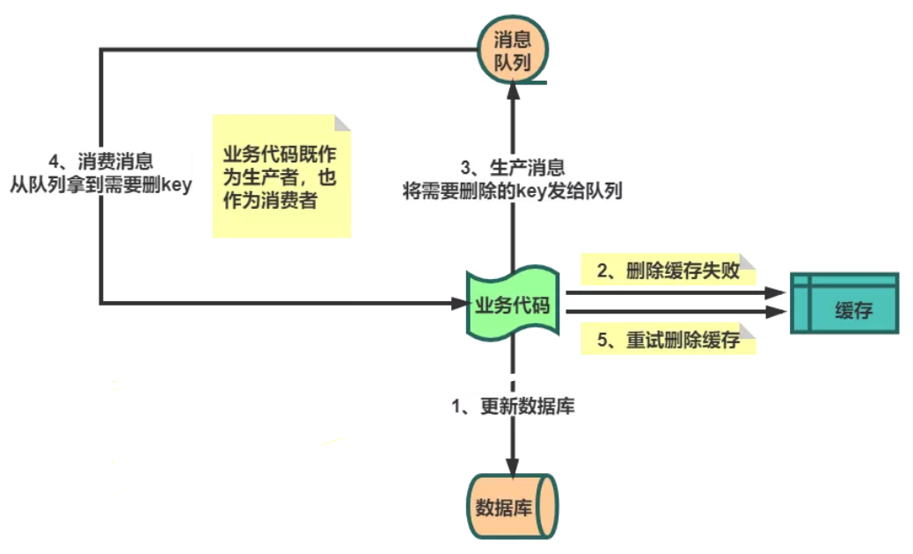

## 1. Redis 基础知识

### Redis 数据结构

+ **SDS** 简单动态字符串

  ```c
  struct sdshdr {
      // 字符串长度 
      int len;
      // buf数组中未使用的字节数
      int free;
      // 字节数组，用于保存字符串
      char buf[];
  };
  ```

  + 与 c 相比，redis 通过 len 和 free 提升性能

    > 1. 获取长度时间复杂度O(1)
    > 2. 减少修改字符串时带来内存重分配次数

  + raw 和 embstr 编码的 SDS

    > 字符串长度小于39字节，编码类型 embstr；否则为 raw
    >
    > 区别：embstr 的 redisObject 和 sdshdr 地址连续；raw 不连续

+ **LinkedList** 双向无环链表 【前后指针】

+ **ZipList** 压缩列表

  > 经过压缩编码的由连续内存块组成的顺序型数据结构

  | zlbytes        | zltail                   | zlen     | entryX1...N | zlend      |
  | -------------- | ------------------------ | -------- | ----------- | ---------- |
  | 列表占用字节数 | 尾节点距离起始地址字节数 | 节点个数 | 各个节点    | 列表尾标志 |

+ **SkipList** 跳跃表

  ```c
  typedef struct zskiplistNode {
      // 后退指针 
      struct zskiplistNode *backward;
      // 分值
      double score;
      // 成员对象
      robj *obj;
      // 层
      struct zskiplistLevel {
          // 前进指针
          struct zskiplistNode *forward;
          // 跨度
          unsigned int span;
      } level[];
  } zskiplistNode;
  ```

  + 跳表是链表与二分法的结合，上层节点个数是下层节点的一半（如何实现？随机层数）

  

  + 查找的时间复杂度 O(logN)：19二层 **前进** 37二层，37二层 **后退** 到19一层，19一层 **前进** 22一层

  

+ **HashTable** 哈希表 【数组 + 链表 + Entry<K,V>】

  + （单线程）渐进式 rehash 提高扩容性能

    > 在对哈希表增删改查操作过程中逐步迁移数据，每次迁移一个桶上所有数据
    >
    > 查: 先h[0] 没有则h[1]，增: 直接h[1]，删: 先[0] 没有则h[1]

+ **IntSet** 整数集合

  > 用于保存整数值，contents[] 不含重复项，按值从小到大排序  

  ``` c
  typedef struct intset {
      // 编码方式
      uint32_t encoding;
      // 集合包含的元素数量
      uint32_t length;
      // 保存元素的数组
      int8_t contents[];
  } intset;
  ```

  

### Redis 对象类型

>  对象类型redisObject结构体

```c
typedef struct redisObject {
    // 类型
    unsigned type:4;
    // 编码
    unsigned encoding:4;
    // 底层数据结构的指针
    void *ptr;
} robj;
```

+ **String** ：Int / SDS    【KV缓存、计数】
+ **List** ：ZipList / LinkedList    【消息队列】
+ **Hash(Map)** ： ZipList / HashTable    【关系型数据库表】 
+ **Set** ：IntSet / HashTable    【交集】
+ **ZSet** ：ZipList / SkipList    【排行榜】


### Redis 操作指令

+ **key**

  | 命令                 | 说明                         |
  | -------------------- | ---------------------------- |
  | select idx           | 选择桶                       |
  | keys pattern         | 查找键 （keys * 查找所有键） |
  | exists key [key ...] | 查询键是否存在               |
  | del key [key ...]    | 删除键                       |
  | type key             | 查询键类型                   |
  | move key db          | 移动键                       |
  | ttl key              | 查询键的生命周期             |
  | expire key seconds   | 设置过期时间                 |
  | persist key          | 设置永不过期                 |
  | rename key newkey    | 更改键名称                   |

+ **String**
  | 命令                                                         | 说明                                                         |
  | ------------------------------------------------------------ | ------------------------------------------------------------ |
  | set key value [EX seconds] [PX milliseconds] [NX\|XX]<br />mset key value [key value ...] | 存放键值 <br />nx：如果key不存在则建立，xx：如果key存在则修改其值 |
  | get key<br />mget key [key ...]                              | 获取键值                                                     |
  | incr/decr key                                                | 值递增 / 递减                                                |
  
+ **Set**

  | 命令                         | 说明                 |
  | ---------------------------- | -------------------- |
  | sadd key member [member ...] | 添加集合元素         |
  | srem key member [member ...] | 删除集合元素         |
  | smembers key                 | 获取所有元素         |
  | sismember key member         | 判断集合是否存在元素 |
  | scard key                    | 获取集合元素个数     |
  
+ **Hash(Map)**

  | 命令                                                         | 说明             |
  | ------------------------------------------------------------ | ---------------- |
  | hset key field value <br />hmset key field value [field value ...]<br />hsetnx key field value | 存放键值         |
  | hget key field<br />hmget key field [field ...]              | 获取键值         |
  | hgetall key<br />hkeys key<br />hvals key                    | 获取所有键值     |
  | hexists key field                                            | 判断字段是否存在 |
  | hdel key field [field ...]                                   | 删除字段         |


### Redis 线程模型

+ **单线程：事件驱动 + IO多路复用**

  

  > Redis 的文件事件处理器 Event Loop 是基于事件驱动，是单线程模型
  > 同时，socket上基于IO多路复用产生事件源，也是单线程

  

+ **单线程与多线程**

  > Redis核心是数据存在内存中，由于内存iops很高，故使用单线程的效率更高，省去线程切换的开销
  >
  > 假设：CPU读取内存1MB数据，单线程耗时250us；一次线程上下文切换约1500ns，若1000个线程读...
  >
  > 相反，当下层iops慢速时（如磁盘、网络）应使用多线程。
  >
  > Redis 的性能瓶颈在网络 IO上，故6.0采用多线程来处理网络数据读写（**事件处理执行命令**仍是单线程）


### Redis 缓存问题

+ **缓存雪崩**

  > 大量key同时失效（如缓存服务宕机），流量打到DB上
  >
  > 解决：事前哨兵主从，事中熔断限流，事后持久化恢复

+ **缓存击穿**

  > 单个热key过期瞬间，流量全部打到DB上。
  >
  > 解决：缓存无需更新时，热点数据设为永不过期；更新不频繁时，缓存查不到则加锁更新；更新频繁时定时异步任务

+ **缓存穿透**

  > 查询不存在的key（恶意攻击），流量每次打到DB上
  >
  > 解决：做标记，如布隆过滤器。判断某个key是否在过滤器（位图），用k个hash函数计算出k个散列值，并查询数组中对应的比特位，如果所有的比特位都是1，则认为存在并过滤（可能误判好人）。


### Redis 双写不一致

> 在同时使用数据库和缓存时，
>
> 读数据流程固定为：先读缓存，没有则查数据库，再放入缓存，
>
> 而在更新数据场景下，可能存在**数据不一致**问题，常见的流程如下：

+ **先删除缓存，再更新数据库**

  > 存在问题：A线程 删除缓存后**准备（还未）**更新数据库；此时 B线程 查不到缓存，将数据库脏数据同步到缓存中。
  >
  > 解决思路：**延时双删策略**，即 A线程 在更新数据库后休眠200ms（根据实际流程），再次删除缓存，保证中间产生的脏数据被删除。若Redis删除操作异常，则可提供 **重试保障机制**（同步 / 异步）。

+ **先更新数据库，再删除缓存【Cache Aside】**

  > 存在问题：更新数据库后删除缓存失败，此时数据不一致产生脏数据
  >
  > 解决思路：**重试保障机制之异步消息队列**，若再次删除失败，可重发消息多次尝试

  

  > 方法论：① **Double Check**（脏数据） ② **异步消息重试** （操作失败）

  > 缓存组件的设计模式

  + **Cache Aside（旁路模式）**：缓存和数据库两个存储的操作同时对外暴露
  + **Read / Write Through（读写穿透）**：数据库由**缓存服务**统一管理，对外提供单一存储视图
    + Read Through：查不到缓存时，缓存服务自己加载数据库（Cache Aside 是业务层加载）
    + Write Through：数据更新时，由缓存服务**同步**更新缓存和数据库
  + **Write Behind Caching（异步缓存写入）**：缓存服务更新数据时，只更新缓存，再**异步**批量更新数据库（Page Cahce用该模式，其中 write back 思想可以合并同一数据的多次操作，提高性能）

  

### Redis 过期策略

+ **惰性删除**

  > 在查询key的时候对过期时间进行检测，过期则删除

+ **定期删除**

  > 开启定时任务，随机获取一些key做检查和删除

+ **内存淘汰**

  > 当惰性和定期没把某些key删除时，则key当内存满时走内存淘汰机制

  ```java
  /**
   * LRU最近最少使用
   * LinkedHashMap 在 next 基础上加 before after，节点间形成双向链表
   */
  public class LruUtils<K, V> extends LinkedHashMap<K, V> {
      private int maxSize;
      public LruUtils(int maxSize) {
          // initialCapacity 容量
          // loadFactor      负载因子
          // accessOrder     排序模式, true 为访问, false 为插入
          super((int) Math.ceil(maxSize / 0.75) + 1, 0.75f, true);
          this.maxSize = maxSize;
      }
      /**
       * 钩子方法，Map 插入元素时调用
       *
       * @param eldest 当前最老的元素
       * @return 是否删除最老的元素
       */
      @Override
      protected boolean removeEldestEntry(Map.Entry<K, V> eldest) {
          // 将不会扩容
          return size() > maxSize;
      }
  }
  ```


### Redis 事务机制

> Redis 事务将一组命令集合按顺序添加到队列中，并按顺序执行。要么处理所有命令，要么不处理任何，是原子性，但不提供回滚。

+ **multi**：开启事务，之后输入的命令将加入队列中（不是原子），若 **加入队列过程中** 报错（如语法问题），则 Redis **撤销**事务，不执行队列中的任何命令。
+ **exec**：执行事务，按顺序执行队列命令**（原子操作）**，**执行期间** 若有命令报错（如变量类型问题），Redis **不会进行回滚**，**继续执行后续命令**。
+ **discard**：撤销事务，**位于 exec 前面**，不执行队列中的**任何**命令。
+ **watch**：监视 redis key，若变量值在 **exec 之前** 被其它客户端修改，则 **exec 返回 null**，事务失败 **撤销**。是**乐观锁** 机制，**默认**数据不会冲突，不加锁，在数据更新时才进行检测。


### Redis 持久化

+ **RDB 快照** 

  > 快照：某一时刻的内存**数据**以**二进制**形式写入磁盘
  >
  > 使用 **save（主线程，有性能问题） / bgsave（fork子线程）** 指令，持久化到 **dump.rdb** 文件

  ```shell
  # redis.conf 配置文件
  # rdb 写入时机
  save 900 1
  save 300 10
  save 60 10000
  # save m n 表示m秒发生n次变化时，触发bgsave
  # 三个配置项，满足任意一个都会触发
  ```

  >优点：恢复速度快	缺点：时间窗口数据丢失

+ **AOF 文件追加**

  > 文件追加：不断往AOF文件追加客户端写入的**指令**

  ```shell
  # redis.conf 配置文件
  appendonly yes  # 默认 false 不开启
  				# 开启后 Redis 使用 AOF 而不是 RDB
  
  # aof 写入时机
  # always 每次写入指令都刷盘；everysec 每秒刷盘一次；no 随操作系统机制	
  appendfsync always|everysec|no
  		   
  # aof 重写（瘦身）时机
  auto-aof-rewrite-percentage 100  # 距离上次文件增长超过多少百分比
  auto-aof-rewrite-size 64mb		 # 文件体积超过多大
  ```

  > 优点：数据更完整，易读性强	缺点：重放速度慢

+ **混合持久化 Redis 4**

  > 背景：RDB 会丢大量数据，宕机重放 AOF 文件很慢 
  >
  > 混合持久化：AOF **重写**时用 RshellDB 全量冷备，后续继续用 AOF 追加增量，结合两者优势

  ```shell
  # AOF 重写的方式
  aof-use-rdb-preamble yes  # 默认 false 不开启 
  ```
  
  > 冷备：读写操作均不可进行
  >
  > 温备：读操作可执行；但写操作不可执行
  >
  > 热备：读写操作均可执行


## 2. Redis 集群主从

### Redis 高性能、高可用

+ **主从架构（ 读写分离 ）**

  > master - slave：全量复制 + 增量复制 + 异步复制 + 断点续传

  

  + **redis.conf**

    ```shell
    # 开启 无磁盘化 全量复制，直接在内存中生成 RDB
    repl-diskless-sync yes
    
    # 等待 5s 后再开始复制，用于多 slave 连接
    repl-diskless-sync-delay 5
    
    # 停止复制情况：rdb文件传输时间超过 60s
    #            异步复制所需内存持续超过 64M、一次性超过 256M
    client-output-buffer-limit slave 256MB 64MB 60
    ```

  + **主从搭建**

    ```shell
    # master redis.conf
    bind 127.0.0.1  # 注释掉，即 bind 0.0.0.0
    daemonize no    # yes 时 docker -d 启动失败
    requirepass 123456  # 访问密码
    maxclients <>   # 最大连接数
    maxmemory <>	# 最大内存
    maxmemory-policy volatile-lru # 内存淘汰策略
    appendonly yes  # 开启 AOF
    
    # slave redis.conf 除了上面，还有
    replicaof 172.17.0.6 6379 # 作为哪个主节点的从节点
    masterauth 123456
    
    # redis 6.09
    $ docker run -d -p 6379:6379 -v /opt/redis/redis01/conf/redis.conf:/etc/redis/redis.conf -v /opt/redis/redis01/data/:/data redis redis-server /etc/redis/redis.conf
    # docker redis 默认无配置文件，需手动 redis-server 指定开启
    
    $ docker run -d -p 6378:6379 -v /opt/redis/redis02/conf/redis.conf:/etc/redis/redis.conf -v /opt/redis/redis02/data/:/data redis redis-server /etc/redis/redis.conf
    
    $ redis-cli
    $ auth 123456
    
    $ set username nick   # master set
    $ get username        # slave get
    ```

+ **Sentinel 哨兵**

  > Redis 主备模式下，当 master 宕机时，写服务无法使用，需要手动切换。Sentienl 则可以实现自动主备切换。

  

  + **Sentinels 集群**

    + **Raft 分布式一致性**

      > 解决问题：对集群进行操作时如何保证各节点数据的一致性
      >
      > 核心概念：选举任期、超过半数、节点状态【跟随者、候选者、领导者】

      + **Leader选举**：每个跟随着节点 **随机的选举超时** 时间，直到仅有一个节点 **最先** 发起候选投票，**超过半数** 节点同意则晋升为领导者。领导者是分布式系统的 **操作入口** 。

      + **日志复制流程**：客户端想更新数据，Leader **先记录** 日志，此时状态为 **uncommitted**；并将日志同步给 Fllower节点，当超过半数节点同步日志时，Leader 状态变为 **commited** **再更新** 数据；最后通知其它所有节点更新数据至集群状态一致。    

      + **网络分区容错**：不同分区下的节点会 **各自选举**，产生多个 Leader；当网络恢复正常时，选举任期高的 Leader 留下，其它 Leader 转化为 Follower，并根据 uncommitted 日志进行操作回滚；最后同步所有节点。

      + **故障转移执行者**

        > 当哨兵 ping redis-master 超过 ```is-master-down-after-milliseconds``` 时则主观认为 master 宕机，并通知其它哨兵。当某哨兵接收 **超过半数** 的宕机通知，则开启 **执行故障转移的哨兵选举** 流程。

    + **哨兵注册发现**

      > 通过 redis 的**发布/订阅系统**实现， 即监听 ```__sentinel__:hello``` 管道。

  + **Redis 主备切换**

    + **Master 选举算法**

      > 对 slave 的相关信息进行排序：
      >
      > 1. 与 master 断开连接的时长，越短优先级越高
      > 2. slave priority 值越低，优先级越高
      > 3. replica offset 同步数据越多，优先级越高

  + **数据丢失问题**

    > Sentinel 只能保证 Redis 主备切换可用，但不保证数据零丢失。
    >
    > **Redis 主备切换是 AP 模型，Sentinel集群 raft 数据一致性是 CP 模型。**
    
    + **异步数据复制**：master 在部分数据还未同步到 slave 前就宕机
    + **多个master（脑裂）**：master 与集群网络分区时，哨兵会再选举出新的 master；当分区结束时，旧的 master 会作为 slave，清空自身数据，挂到新的 master 上，从而丢失 **分区期间** 接收到的客户端数据。
    
    > 解决方法：`min-slaves-to-write 1`        `min-slaves-max-lag 10` 
    >
    > 要求主机至少有1个从机，同时数据同步时的延迟不能超过10s，否则主机拒绝写请求。

​    

### Redis Cluster

> **集群 + 主从**：Redis cluster **支撑 N 个 Redis master node，每个 master node 可以挂载多个 slave node**，实现了高可用和高性能 

> Redis 的哨兵模式基本已经可以实现高可用，读写分离 ，但是在这种模式下每台 Redis 服务器都存储相同的数据，很浪费内存，所以在 redis3.0 上加入了 Cluster 集群模式，实现了 Redis 的分布式存储，**也就是说每台 Redis 节点上存储不同的内容（数据分片）**。

+ **数据一致性**

  + **gossip 协议**

    > 集中式：将元数据（节点信息、故障信息）统一存储在组件上进行维护，比如 zookeeper。优点：时效性好。缺点：组件接收更新元数据请求的压力大。

    

    > gossip：所有节点持有一份元数据，当节点更新了数据，就通知其它节点进行 **数据同步** 。优点：分散节点更新元数据的请求。缺点：更新有时延滞后。

    > gossip 消息命令有： meet、ping、pong、fail

    > 传播机制：**周期** 发送 + **固定** 个数 + **随机** 路线。log(20)(base 4) = 2.16，表示集群中有20个节点，受感染节点每周期会随机向另外4个节点（可以重复感染）成功同步数据。全部感染最少需要2.16个周期。

    

+ **分布式寻址算法**

  + **一致性哈希 = 哈希环 + 虚拟节点 **

    + **哈希环**：解决 **节点动态扩收容时全部节点失效需要重哈希问题** 。将节点进行哈希，定位到哈希环上，比如通过IP来哈希。缓存数据先哈希定位环上，归入顺时针方向的第一个节点中。这样收扩容时只需要对受影响数据进行转移，而不影响其它数据。

    + **虚拟节点**：解决 **节点过少哈希不均匀造成的缓存倾斜存储问题** 。对每个节点（比如将信息进行虚拟映射扩充）计算多个哈希值，虚拟节点均匀定位到哈希环上，实现负载均衡。

    

  + **Hash Slot【Redis-Cluster 使用】**

    > Redis-Cluster 将 16384 个 虚拟槽 分配给集群中的 Masters。Key 哈希取模定位到 Slot 上，机器宕机则将其 Slot 转移到其它机器上，数据不会全部失效。Key 定位的是 Slot 而不是 机器。 

    

+ **Redis-Cluster 搭建**

  + **原生搭建**

    ```shell
    # common 配置
    bind 0.0.0.0
    daemonize no
    requirepass 123456
    masterauth 123456
    maxmemory-policy volatile-lru
    appendonly yes
    # cluster 配置
    cluster-enabled yes
    cluster-config-file cluster.conf    # 保存集群配置
    cluster-node-timeout 15000          # 节点不可访问的最大时间
    cluster-replica-validity-factor 10  # 集群副本有效因子
    cluster-require-full-coverage  no   # 节点全活时集群功能才有效 no
    
    $ docker run -d -p 637x:6379 -v /opt/redis/redis.conf:/etc/redis/redis.conf redis redis-server /etc/redis/redis.conf
    
    $ reids-cli
    $ auth 123456
    
    # 节点加入集群
    $ cluster nodes  # 查看集群下的节点
    $ cluster meet redis-ip:port # 邀请其它节点接入集群
    
    # 指派槽位
    $ cluster addslots slot-number
    # assign-slot.sh 
    start=$1
    end=$2
    for slot in `seq ${start} ${end}`
    do
        echo "slot:${slot}"
        /usr/local/bin/redis-cli -h 127.0.0.1 -p 6379 -a 123456 cluster addslots ${slot}
    done
    $ sh assign-slot.sh 0 5461
    $ sh assign-slot.sh 5462 10922
    $ sh assign-slot.sh 10923 16383
    $ cluster nodes
    
    # 指定从机
    $ cluster replicate master-id # 指定当前节点作为主节点的从机
    ```

  + **快速搭建**

    ```shell
    # 启动集群 cluster create 指令
    $ redis-cli --cluster create 172.17.0.6:6379 172.17.0.7:6379 172.17.0.8:6379 172.17.0.9:6379 172.17.0.10:6379 172.17.0.11:6379 --cluster-replicas 1 -a 123456 # --cluster-replicas 2 一主二从
    
    # 新节点加入集群 cluster add-node 指令
    $ redis-cli --cluster add-node 172.17.0.12:6379 172.17.0.6:6379 --cluster-master-id masterId -a 123456 # [newNode oldNode] --cluster-master-id 指定主节点ID，若不指定则加入集群后称为主节点
    
    # 迁移槽位和数据 cluster reshard 指令
    $ redis-cli --cluster reshard 172.17.0.12:6379 -a 123456  # 扩容时
    $ redis-cli --cluster reshard --cluster-from sendId --cluster-to recieveId --cluster-slots slotNum recieveIp:Port -a 123456
    
    # 集群停机节点 cluster delete 指令
    redis-cli --cluster del-node 172.17.0.12:6379 edc8ff41aef320beb5081c5b50bf32485a7ffb9e -a 123456
    ```