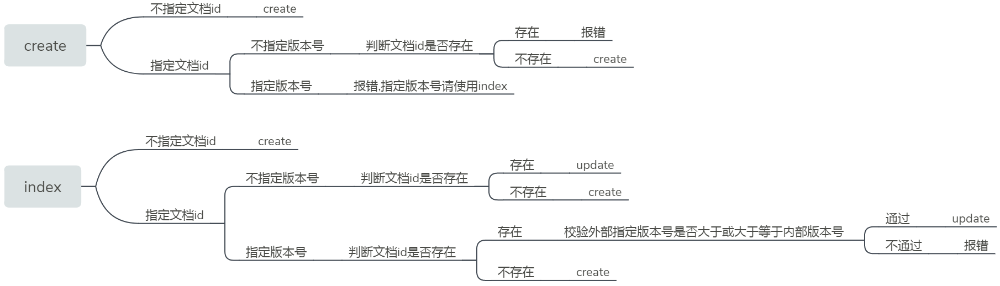

> [**安装 Elasticsearch 和 数据可视化 Kibana**](https://zhuanlan.zhihu.com/p/79659243)
>
> [**安装 ElasticSearch 集群监控工具 Cerebro**](https://www.jianshu.com/p/433d821f9667)
>
> **[使用 Docker 快速部署 Elasticsearch 集群](https://segmentfault.com/a/1190000018606414)**
>
> **[基于SpringBoot和RestHighLevelClient集成操作Elasticsearch](https://mp.weixin.qq.com/s?__biz=MzIxMjE3NjYwOQ==&mid=2247484027&idx=1&sn=efa5dfffa8db647ead9850c95b696393&chksm=974b59f5a03cd0e3684b32fe9fb2d380f9c9d9ecba34ea7e7e664597f844aebb552c2063255e&scene=178#rd)**

#### ES 基本概念

+ **节点 Node** 与 **集群 Cluster**

  > Master Nodes：
  > ​			每个节点都保存集群状态（节点、索引、路由等信息）
  > ​			但只有 Master 可以修改（一写多读，任意节点都能修改会导致数据不一致性）
  >
  > Coordinate Nodes（Master-eligible）：
  > ​			从节点，可参加选主（可设为禁止），第一个启动的节点会将自己选举为 Master
  > ​			每个节点都负责接收Client请求，并分发到合适的节点，最终汇集结果返回
  >
  > Data Nodes（Hot & Warm Nodes）
  > 			负责保存分片数据的节点，实现数据水平扩展；
  > 			Hot & Warm 架构可降低集群部署成本；热数据定期迁移为冷数据，其中，热节点处理新输入的数据，存储查询速度快（SSD）；冷节点存储早期数据，密度较大，关注度不高，接收较慢的查询（SATA）
  >
  > ML Nodes
  > ​			负责跑机器学习的节点，用来做异常检测

+ **分片 Shard** 与 **副本 Replica**

  > Primary Shard
  > ​			主分片解决水平扩展问题，将数据分布到集群中所有节点上
  >
  > Replica Shard
  > 			副本分片解决数据高可用问题，是主分片的拷贝 

	```
	# 查看集群健康状态 
	GET /_cluster/health
	status: 
		Green  	主分片和副本分片都正常分配
    	Yellow	主分片正常分配，副本分片未能正常分配
    	Red		有主分片未能正常分配（例如当磁盘容量快满时创建新索引）
	```


#### ES 数据结构

| **MySQL**       | **ElasticSearch**                               |
| --------------- | ----------------------------------------------- |
| DataBase 数据库 | Index 索引                                      |
| Table 表        | Type 类型<br />8.0 删除此概念，索引对应单个类型 |
| Row 行          | Document 文档                                   |
| Column 列       | Field 字段                                      |
| Schema 模式     | Mapping <br />定义文档及其字段如何存储和索引    |

> RDMS 优势：事务操作
> ElasticSearch 优势：高性能全文检索


#### ES 数据类型

+ String 字符串

  + text	索引存储的是分词
  + keyword	索引直接存储，不会被分词

+ date 时间类型

  > format：yyyy-MM-dd HH:mm:ss  ||  yyyy-MM-dd  ||  epoch_millis

+ Multi 复杂类型

  + array

  + object

    > List\<obj\> 无法单独被索引

    ``` 
    {"user":[{"name":"Tom", "age":2 }, {"name":"Jack", "age":1}]}
    {"user":[{"name":"Tom", "age":2 }, {"name":"Jack", "age":1}]}
    eg : query name = Tom && age = 2 --> 两行记录记录都会查出来
    ```

  + nested

    > 每个嵌套的对象可以被独立的查询

+ GEO 地理类型

  + 地图：Geo-point
  + 形状：Geo-shape

+ 数值（整数 / 浮点）、布尔 boolean、二进制 binary、区间类型 xxx_range


#### ES CRUD 

+ **Index 索引**

  ```
  # 索引元数据
  {
  	# 索引设置
      "settings": {
          "index": {
              "number_of_shards": 1,  # 主分片数量，默认为5
              "number_of_replicas": 1  # 每个主分片的副本分片数量，默认为1
          },
          "analysis": {
              "analyzer": {  # 分词器
                  "pinyin_analyzer": {  # 自定义名
                      "tokenizer": "standard" # 初始化分词，这里是为了实现offset高亮 
                      "filter": [
                          "my_pinyin"   # 进一步转换输出分词
                      ]
                  }
              },
              "filter": {  # 分词器中的过滤器组件
                  "my_pinyin": {   # 自定义名
                      "lowercase": "true",
                      "keep_original": "true",
                      "keep_first_letter": "true",
                      "keep_separate_first_letter": "false",
                      "type": "pinyin",
                      "limit_first_letter_length": "16",
                      "keep_full_pinyin": "true"
                  }
              }
          }
      },
      # 映射配置
      "mappings": {
          "_doc": {   # type 类型名，7.0 后只能名为 _doc
              "dynamic": false,    # Dynamic Mapping
              					 #     true: 当有新增字段（类型自动识别）文档写入时，Mapping被更新	     
              					 #     false: Mapping不会被更新，新增字段无法索引，但信息会出现在 _source 中
              					 # 	   strict: 新增字段文档写入失败
              # 字段属性配置 
              "properties": {
                  "id": {
                      "type": "integer"   # 表示字段id，类型为integer
                      "index": "false"    # 控制字段是否被索引，默认为true
                  },
                  "name": {
                      "type": "text",
                      "analyzer": "ik_max_word",  # 存储时的分词器
                      "search_analyzer": "ik_smart" # 查询时的分词器
                      "index_options": "offsets"  # index_options 控制倒排索引记录的内容
                      							#     docs/freqs/positions/offset 后者包含前者
                      							#     Text类型默认为 positions，其它默认为 docs
                      							
                  },
                  "mobile": {
                  	"type": "keyword",
                  	"null_value": "null"        # 需要对null值实现搜索，只有keyword支持null_value
                  },
                  “city”: {
                  	"type": "keyword",
                  	"fields": {    # ES允许一个字段有多个不同类型，如可以用keyword来聚合与排序，用text来全文检索
                  		"pinyin": {     # 字段别名为 city.py
                   			"type": "text",
                   			"analyzer": "pinyin_analyzer"  # 分词器 analysis-pinyin
                  		},
                          "standard": {
                          	"type": "text",
                          	"analyzer": "standard"
                          }
                  	}
                  },
                  "createAt": {
                      "type": "date"
                  }
              }
          }
      }
  }
  ```

  1. ​    增

     ``` 
     PUT /new_idx?pretty  # 创建名为 new_idx 的索引
     ```
     
  2. ​    查

     ```
     GET /new_idx  # 可以同时检索多个索引或所有索引，eg GET /*  ,  GET /idx1,idx2
     GET /_cat/indices?v  #查看所有 index
     ```

  3. ​    改

     ```
     PUT /new_idx/_settings  #  修改副本数量、新增字段等
     {
         "index" : {
             "number_of_replicas" : 2,
             "refresh_interval" : "2s"
         },
         "properties": {
         	"age": {
           		"type": "integer"
         	}
       	}
     }
     ```

  4. ​    删

     ```
     DELETE /new_idx  # 删除索引
     ```

+ **Doc 文档**
  
  ```
  # 文档元数据
  {
  	"_index": "movies",    # 索引
  	"_type": "_doc",       # 类型
  	"_id": "1",            # 文档唯一id
  	"_score": 14.69302,    # 查询相关性
  	"_version": 1,		   # 文档版本
  	"_source": {           # 文档内容
  		"title": "Toy Story",
  		"year": 1995,
  		"version": "1.0",
  		"style": ["Adventure", "Animation", "Chlidren", "Comedy", "Fantasy"]
  	}
  }
  ```
  
  1. ​    增
  
  	```
     # PUT指定id, POST不指定id
     # 新增单条数据，指定id为1
     PUT /new_idx/_doc/1?pretty  # pretty 格式化输出
     {
     	"name": "Te Hero"
     }
     # 新增单条数据，自动生成id
     POST /new_idx/_doc?pretty
     {
     	"name": "Te Hero2"
     }
     # 使用 op_type 属性，强制执行某种操作
     PUT new_idx/_doc/1?op_type=create
     {
     	"name": "Te Hero3"
	   }
     POST new_idx/_doc/2?op_type=index&version=2&version_type=external
     ```
     
	   >  **Index  Create Update 区别**
	   
     
     
     ```
     index 已存在的文档，旧文档先被删除，新文档再被写入，同时版本号加 1 （即 update 操作）
     ```
     
     
  
  
  2. ​    改
  
  	```
  	# 根据 id 更新
  	PUT /new_idx/_doc/1?pretty
  	{
  		"name": "Te Hero-update"
  	}
  	# 根据查询条件更新字段 
  	# POST _update_by_query
  	POST tehero_index/_update_by_query
  	{
  		"script": {
  			"source": "ctx._source.name = params.name",  
  			"lang": "painless",
  			"params": {
  				"name": "Tom"
  			}
  		},
  		"query": {
  			"term": {
  				"id": "10"
  			}
  		}
  	}
  	```
  
  3. ​    删
  
      ```
     # 根据 id 删除
     DELETE /new_idx/_doc/1
     # 根据查询条件删除
     POST /new_idx/_delete_by_query
     ```
  
  4. ​    查
  
  5. ​    批量操作 
  
     ```
     POST _bulk
     支持 Index|Create|Update|Delete 四种类型操作
     {"index": {"_index":"user_index", "_type":"_doc", "_id":"1"}}
     {"nickName":"关注我"}
     {"index": {"_index":"user_index", "_type":"_doc", "_id":"2"}}
     {"nickName":"我关注"}
     {"index": {"_index":"user_index", "_type":"_doc", "_id":"3"}}
     {"nickName":"系统学ES就关注我"}
     {"index": {"_index":"user_index", "_type":"_doc", "_id":"4"}}
     {"nickName":"系统学ES"}
     ```


#### 倒排索引

> 文档单词 --> 文档ID --> 文档

+ 单词词典 Term Dictionary

  > 记录所有文档的单词，记录单词到倒排列表的关联关系，可用B+树或哈希拉链法实现

+ 倒排列表 Posting List

  > 记录单词对应的文档结合阿，由倒排索引项组成

  + 文档 Doc_ID
  + 词频 TF（相关性评分）
  + 位置 Position（单词在文档中分词的位置） 
  + 偏移 Offset（单词在文档的开始和结束位置）

| 单词 | Doc_ID | TF   | Position | Offset |
| ---- | ------ | ---- | -------- | ------ |
| 学习 | 1      | 1    | 1        | <2,4>  |
| 学习 | 2      | 1    | 0        | <0,2>  |


#### Analyzer 文本分析 （分词过程 Term / Token）

1. 字符过滤器 **character filter**：原始文本处理，如去除 html，&转and等
2. 分词器 **tokenizer**：按照规则切分单词
3. 令牌过滤器 **token filter**：词条过滤处理，如转换小写、删除无用词等


#### IK 分词

1. **ik_max_word**：细颗粒度分词，词的文字可能相交
2. **ik_smart**：粗粒度分词，词的文字不会相交

> 建议是：为了提高搜索的效果，
> ​				**建索引**时用 **ik_max_word** 尽可能多的分词
> ​				而**搜索**时用 **ik_smart** 尽可能提高匹配准度（query 时字段会先分词 token）

