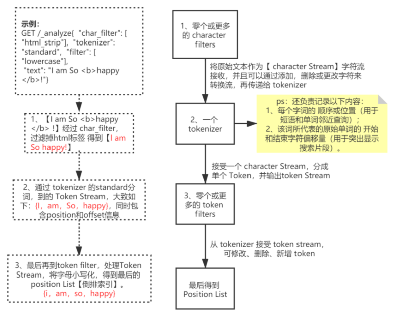

#### 倒排索引

> 文档单词 --> 文档ID --> 文档

+ 单词词典 Term Dictionary

  > 记录所有文档的单词，记录单词到倒排列表的关联关系，可用B+树或哈希拉链法实现

+ 倒排列表 Posting List

  > 记录单词对应的文档结合阿，由倒排索引项组成

  + 文档 Doc_ID
  + 词频 TF（相关性评分）
  + 位置 Position（单词在文档中分词的位置） 
  + 偏移 Offset（单词在文档的开始和结束位置）

| 单词 | Doc_ID | TF   | Position | Offset |
| ---- | ------ | ---- | -------- | ------ |
| 学习 | 1      | 1    | 1        | <2,4>  |
| 学习 | 2      | 1    | 0        | <0,2>  |


#### Analyzer 文本分析 （分词过程 Term / Token）

1. 字符过滤器 **character filter**：原始文本处理，如去除 html，&转and等
2. 分词器 **tokenizer**：按照规则切分单词（初始化 Terms）
3. 令牌过滤器 **token filter**：词条过滤处理，如转换小写、删除无用词等（最终 Terms）

**流程如下图所示：**



| Analyzer   | 作用                               |
| ---------- | ---------------------------------- |
| Standard   | 默认分词器，按词切分，小写处理     |
| Stop       | 按词切分，停用词过滤（the  a  is） |
| Whitespace | 按空格切分，不转小写               |
| Keyword    | 不分词，直接将输入当作输出         |
| IK         | 中文分词                           |
| PinYin     | 中文和拼音分词                     |


#### IK 分词

1. **ik_max_word**：细颗粒度分词，词的文字可能相交
2. **ik_smart**：粗粒度分词，词的文字不会相交

> 建议是：为了提高搜索的效果，
> ​				**建索引**时用 **ik_max_word** 尽可能多的分词
> ​				而**搜索**时用 **ik_smart** 尽可能提高匹配准度（query 时字段会先分词 token）

> 查询分词效果 **_analyze**

```
GET /_analyze
{
	"text": "我爱中国",
	"analyzer": "ik_smart"   # 缺省为 standard，无法处理中文
}
```


#### URI Search

```
GET /index/type(_doc)/_search?sort=year:desc&from=0&size=10&timeout=1s
# sort 排序 from size 分页 timeout 超时限制
{
	"query": {}
}
```

#### Request Body Search

```
GET /index/type(_doc)/_search
{
	"sort": [{"order_date": "desc"}],
	"from": 10,
	"size": 5,
	"query": {}
}
```


#### Full text queries 分词查询

> **倒排列表不存在的记录，则无法查询到结果，不存在全表扫的情况**

1. **match**

   ``` 
   GET /tehero_index/_doc/_search
   {
       "query": {
           "match": {
               "content.ik_smart_analyzer": {
               	"query": "学习 Elasticsearch", # ik_smart_analyzer 分词生成 token
               	"operator": "and",  # 控制 token 间逻辑关系, 默认 or
               	"lenient": "true",  # 忽略数据类型转换异常, 默认 false
               	"zero_terms_query": "all"  # 针对 Stop Analyzer（会过滤停顿词 the a is） 搜索停顿词，默认 none 
               }
           }
       }
   }
   ```

2. **match_phrase**

   ```
   # match_phrase: 类似 match, 但 query 分词结果必须在被检索字段的分词中都包含，且顺序必须相同
   GET /tehero_index/_doc/_search
   {
       "query": {
           "match_phrase": {  
               "content.ik_smart_analyzer": {
               	"query": "学习 Elasticsearch",
               	"slop": "1", # tokens位置距离容差值（position差值）. 默认需要连续
               }
           }
       }
   }
   ```

3. **match_phrase_prefix**

   ``` 
   # match_phrase_prefix: 类似 match_phrase, 但 会对 query 分词最后一个 token 添加通配符
   GET tehero_index/_doc/_search
   {
       "query": {
           "match_phrase_prefix": {
               "content.ik_smart_analyzer": {
                   "query": "系",
                   "max_expansions": 1  # 通配符个数，默认 50 
               }
           }
       }
   }
   ```

4. **multi_match**

   ``` 
   # match 多字段版本 逻辑是or
   GET /tehero_index/_doc/_search
   {
       "query": {
           "multi_match": {
               "query": "系统",
               "fields": [
                   "title",  # 没分词器，keyword 匹配
                   "content.ik_smart_analyzer^3" # ik_smart_analyzer 分词器
                   			# ^ 评分权重，增强该字段
               ]
           }
       }
   }
   ```

5. **query_string**

   ``` 
   # 允许指定 AND | OR | NOT 逻辑
   GET /tehero_index/_doc/_search
   {
       "query": {
           "query_string" : {
               "fields" : ["content.ik_smart_analyzer"],
               "query" : "系统编程 OR es"  # 依旧会把系统编程分词为
           }
       }
   }
   ```

6. **simple_query_string**

   ```
   类似 query_string，但是会忽略错误的语法，永远不会引发异常
   同时，支持以下特殊字符：
   + 与运算    | 或运算    - 取反
   "" 对检索词进行 match_phrase 
   * 通配符 类似 match_phrase_prefix
   ```

   > **query_string** 和 **simple_query_string** 是 查询语句的合集，使用灵活，但是有类似于 sql 注入的弊端，慎用。


#### Term-level queries 精准查询

> 核心点：**检索词不会被分词，作为一个 Term **

1. **term query**

   ``` 
   # 使用场景：用于检索不会被分词的字段，主要是类型为：integer、keyword、boolean 的字段
   POST /blogs_index/_doc/_search
   {
       "query": {
           "term": {
               "title": "学习Elasticsearch"
           }
       }
   }
   ```

2. **terms query**

   ```
   # 类似于 MySQL in
   POST /blogs_index/_doc/_search
   {
       "query": {
           "terms": {
               "author": ["Tom","Jack"]
           }
       }
   }
   ```

3. **terms lookup mechanism**

   ```
   # 类似于 mysql 联表查询
   GET /tags_index/_search  # tags_index 主
   {
       "query": {
           "terms": {
               "id": {
                   "index": "blogs_index",   # blogs_index 联表
                   "type": "_doc",
                   "id": "3",  # 子查询的条件只能是 _id 字段
                   "path": "tag"
               }
           }
       }
   }
   # 类似于 select * from tags_index where id in （select tag from blogs_index where _id = 3）
   ```

4. **wildcard**

   ``` 
   # 类似于 mysql like 查询
   # * -> %  匹配任何字符序列
   # ? -> _  匹配任何单个字符
   GET /blogs_index/_search
   {
       "query": {
           "wildcard": {
               "author": "方*"
           }
       }
   }
   ```

5. **prefix**

   ```
   # 查找指定字段包含以 指定确切前缀开头 的术语的文档
   GET /blogs_index/_search
   {
       "query": {
           "prefix": {
               "author": "方"  # 类似于 like "方%"
           }
       }
   }
   ```

6. **fuzzy**

   ```
   # 基于 Levenshtein 编辑距离的相似度，用于误拼写时的 fuzzy 模糊搜索
   GET /blogs_index/_search
   {
       "query": {
           "fuzzy" : {
               "author": {
                   "value": "Tom",  
                   "fuzziness": 1,  # 最大编辑距离
                   "prefix_length": 1, # 共同前缀的长度，1 则是 "T"，默认 0
                   "max_expansions": 100  # 最多可穷举次数， 默认 50
               }
           }
       }
   }
   # tips: 如果 prefix_length 设置为 0，max_expansions 设置为很高，则可能会导致索引倒排每一项都受到检查。
   ```

7. **exists**

   ```
   # 查找指定字段包含任何非空值 [不是 null 也不是[ ]] 的文档
   # 查询为 null 的字段 可使用 must_not + exists
   GET /blogs_index/_search
   {
       "query": {
           "exists" : { "field" : "title" }  # 查询 title 字段不为 null 的文档
       }
   }
   ```

8. **terms_set**

   ``` 
   # 返回的文档至少匹配一个或多个检索的术语
   # 用于检索 Array类型 的字段
   ```


#### Bool query 

> ​		Bool query 子句只支持 只支持 text queries 、 term-level queries  和 bool query

**ES 两种上下文**

- Query context：查询上下文，关注的是「文档与查询子句 **匹配度如何 _score**」
- Filter context：过滤上下文，关注的是「文档与查询子句 **是否匹配 yes or not** 」，不计分

> **must** 和 **should** 子句会 **计算相关性评分**
> **filter** 和 **must_not** 子句是在过滤器上下文中执行，**忽略计分，避免相关性算分开销**，并且子句被考虑用于缓存

1. **filter** 必须出现  and
2. **must_not** 不得出现  not
3. **must** 必须出现  and
4. **should ** 应该出现  or


#### 结果命中高亮

```
{
    "highlight": {
        "fields": {
            "nickName.pinyin": {}    # 字段名
        }
    }
}
```

