### 概念

Kubernetes 是容器编排平台

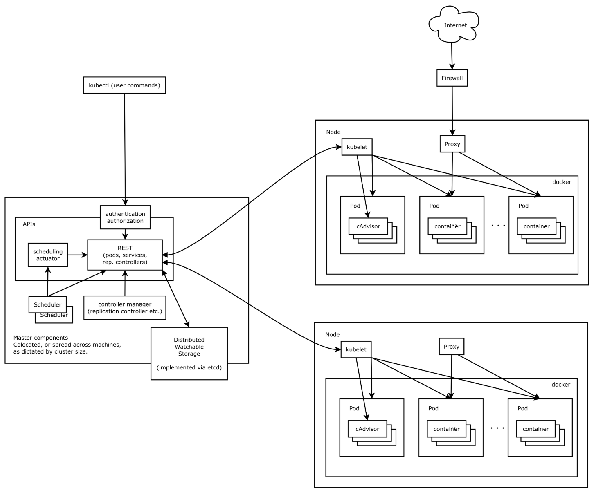

**核心组件**

- etcd：分布式高性能键值数据库,存储整个集群的所有元数据
- apiserver:  API服务器,集群资源访问控制入口,提供restAPI及安全访问控制
- scheduler：调度器,负责把业务容器调度到最合适的Node节点
- controller manager：控制器管理,确保集群资源按照期望的方式运行
- kubelet：运行在每运行在每个节点上的主要的“节点代理”个节点上的主要的“节点代理”
  - pod 管理：kubelet 定期从所监听的数据源获取节点上 pod/container 的期望状态（运行什么容器、运行的副本数量、网络或者存储如何配置等等），并调用对应的容器平台接口达到这个状态。
  - 容器健康检查：kubelet 创建了容器之后还要查看容器是否正常运行，如果容器运行出错，就要根据 pod 设置的重启策略处理
  - 容器监控：kubelet 会监控所在节点的资源使用情况，并定时向 master 报告，资源使用数据都是通过 cAdvisor 获取的。知道整个集群所有节点的资源情况，对于 pod 的调度和正常运行至关重要
- kube-proxy：维护节点的网络规则，实现Pod网络通信，是实现Service的重要部分
- container-engine：容器引擎，如 Docker cri-o rktlet
- kubectl: 命令行接口，用于对 Kubernetes 集群运行命令  https://kubernetes.io/zh/docs/reference/kubectl/ 


**工作流程**

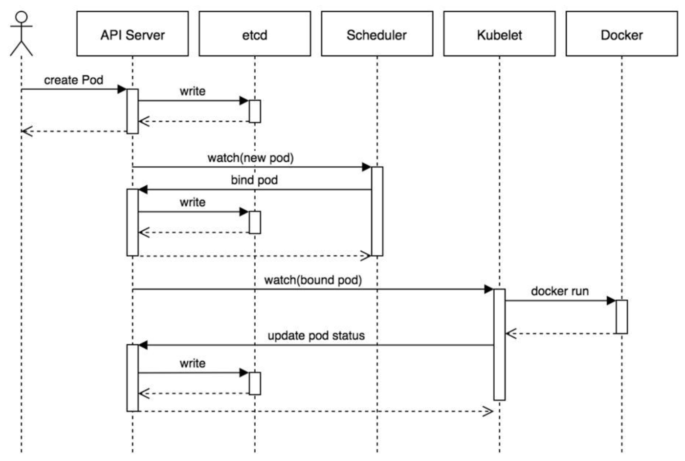

1. 用户准备一个资源文件（记录了业务应用的名称、镜像地址等信息），通过调用APIServer执行创建Pod
2. APIServer收到用户的Pod创建请求，将Pod信息写入到etcd中
3. 调度器通过list-watch的方式，发现有新的pod数据，但是这个pod还没有绑定到某一个节点中
4. 调度器通过调度算法，计算出最适合该pod运行的节点，并调用APIServer，把信息更新到etcd中
5. kubelet同样通过list-watch方式，发现有新的pod调度到本机的节点了，因此调用容器运行时，去根据pod的描述信息，拉取镜像，启动容器，同时生成事件信息
6. 同时，把容器的信息、事件及状态也通过APIServer写入到etcd中


#### **Master**

```
- Master 集群控制平台，负责协调集群中的所有活动。
- Master 组件包括：
	- apiserver：提供 Kubernetes API, 是控制平台的前端接口
	- etcd：存储配置信息和集群状态数据
	- kube-scheduler：提供调度服务，选择合适的节点执行Pod
	- controller：控制器，监控 apiserver 当前状态，不断修正接近用户yaml文件声明的期望值
        - kube-controller-manager：统一运行控制器，包括
            - Node controller：负责监听节点停机事件
            - Replicas controller：负责维护期望的Pod副本数
            - Endpoints controller：负责为端点对象（连接Service和Pod）赋值
            - Namespace controller：负责为新的名称空间创建 Service Account 和 API Access Token
        - cloud-controller-manager：由云产商定制的控制器
            - route controller
            - service controller
```

#### **Worker/Node**  

``` 
- 节点是虚拟机或物理计算机，充当k8s集群中的工作计算机。（外网IP）
- Node 组件包括：
	- kubelet：管理Worker节点并负责与Master节点通信，管理 Pod 内运行的 Container 。
	- kube-proxy：维护节点的网络规则，实现Pod网络通信，是实现Service的重要部分
	- container-engine：容器引擎，如 Docker cri-o rktlet
```


#### **Pod**

```
- Pod（容器组）是 k8s 集群上的最基本的单元。（内网IP）
- 存放一组 container（可包含一个或多个 container 容器，即图上正方体。
- 存放 container 容器的共享资源，包括：
	- 共享存储，称为 Volumes 卷，即图上紫色圆柱
	- 网络，每个 Pod（容器组）在集群中有个唯一的 IP，pod（容器组）中的 container（容器）共享该IP地址
	- container（容器）的基本信息，例如容器的镜像版本，对外暴露的端口
```

> Node             :  物理机
> Pod                :  虚拟机
> Container     :  容器


#### **Deployment**

```
- Pod 控制器：Deployment
- 在kubernetes中，Pod是最小的控制单元，但是kubernetes很少直接控制Pod，都是通过Pod控制器来完成
```


+ **操作：部署 Deployment**

``` yaml
- 创建文件 nginx-deployment.yaml
apiVersion: apps/v1	
kind: Deployment 	
metadata:	        
  name: nginx-deployment	
  labels:	    
    app: nginx	
spec:	        # Deployment specific
  replicas: 1	
  selector:	   
    matchLabels: 
      app: nginx
  template:	    # Pod template
    metadata:	
      labels:	
        app: nginx
    spec:	    # Pod specific
      containers:	
      - name: nginx
        image: nginx:1.7.9
```

#### **Service** 

``` 
- Pod IP会随着 Pod 的重建产生变化，同时 Pod IP仅仅是集群内部可见的虚拟的IP，外部无法访问。
- Service 屏蔽后端系统的 Pod 在销毁、创建过程中所带来的 IP 地址的变化, 实现对前端透明统一。
- Service 使 Pod 之间的相互依赖解耦（原本从一个 Pod 中访问另外一个 Pod，需要知道对方的 IP 地址）.
- Service 使用 Labels、LabelSelector 匹配一组 Pod.
```


#### **LabelSelector** 

```
- Service 通过 LabelSelector 将多组 Pod 统一入口，把这些 Pod 的指定端口公布到到集群外部，并支持负载均衡和服务发现。
- 上图中有两个服务Service A(黄色虚线)和Service B(蓝色虚线)
- Service A 将请求转发到 IP 为 10.10.10.1 的Pod上， Service B 将请求转发到 IP 为 10.10.10.2、10.10.10.3、10.10.10.4 的Pod上。
```


#### **Lable**

```
- Labels（标签）是附加到 Kubernetes 对象（Node、Deployment、Pod、Service等） 的键/值对
	- 将 Kubernetes 对象指派用于开发、测试、生产环境
	- 嵌入版本标签，使用标签区别不同应用软件版本
	- 使用标签对 Kubernetes 对象进行分类

- 上图体现了 Labels（标签）和 LabelSelector（标签选择器）之间的关联关系
    - Deployment B 含有 LabelSelector 为 app=B, 通过此方式，将含有 app=B 标签的 Pod 与之关联
    - 通过 Deployment B 创建的 Pod 包含标签为 app=B
    - Service B 通过标签选择器 app=B 选择可以路由的 app=B 的 Pod
```


+ **操作：为 Deployment 创建 Service**

``` yaml
- 创建文件 nginx-deployment.yaml
apiVersion: apps/v1	
kind: Deployment	# Deployment template
metadata:	       
  name: nginx-deployment	
  labels:	    
    app: nginx	
spec:	         # Deployment specific
  replicas: 1	
  selector:	    
    matchLabels: 
      app: nginx
  template:	     # Pod template
    metadata:	
      labels:	
        app: nginx
    spec:	     # Pod specific
      containers:	
      - name: nginx	
        image: nginx:1.7.9	

- 创建文件 nginx-service.yaml
apiVersion: v1
kind: Service      # Service template
metadata:
  name: nginx-service	
  labels:     	
    app: nginx	
spec:	    # Service specific
  selector:	   
    app: nginx	
  ports:
  - name: nginx-port	
    protocol: TCP	    
    port: 80	        # 集群内的其他容器组可通过 80 端口访问 Service
    nodePort: 32600   # 外部通过主机32600端口访问 Service
    targetPort: 80	# 将请求转发到匹配 Pod 的 80 端口
  type: NodePort	

# ClusterIP：默认值，它是kubernetes系统自动分配的虚拟IP，只能在集群内部访问。
# NodePort：将Service通过指定的Node上的端口暴露给外部，通过此方法，就可以在集群外部访问服务。
# LoadBalancer：使用外接负载均衡器完成到服务的负载分发，注意此模式需要外部云环境的支持。
# ExternalName：把集群外部的服务引入集群内部，直接使用。

- 启动 service 服务进程
kubectl apply -f nginx-service.yaml
- 访问服务
curl [anyNode ip]:32600
```

#### Namespaces

```
命名空间，可对资源进行分组隔离
```

#### **Scaling**

``` 
- 我们创建了一个 Deployment，然后通过 Service 服务 提供访问 Pod 的方式。我们发布的 Deployment 只创建了一个 Pod 来运行我们的应用程序。当流量增加时，我们需要对应用程序进行伸缩操作以满足系统性能需求。
- 下图所示：Service A 只将访问流量转发到 IP 为 10.0.0.5 的Pod上，修改了 Deployment 的 replicas 为 4 后，Kubernetes 又为该 Deployment 创建了 3 新的 Pod，这 4 个 Pod 有相同的标签。因此Service A通过标签选择器与新的 Pod建立了对应关系，将访问流量通过负载均衡在 4 个 Pod 之间进行转发。
```


+ **操作：将 Deployment 扩容到 4 个副本**

``` yaml
- 通过更改 Deployment 中的 replicas（副本数）来完成扩展
spec:
  replicas: 4    #使用该Deployment创建两个应用程序实例
```

#### **Rolling Update**

``` 
- 通过使用新版本的 Pod 逐步替代旧版本的 Pod 来实现 Deployment 的更新, 这个过程中，Service 能够监视 Pod 的状态，将流量始终转发到可用的 Pod 上。
- Rolling Update 支持：
	- 将应用程序从准上线环境升级到生产环境（通过更新容器镜像）
	- 回滚到以前的版本
	- 持续集成和持续交付应用程序，无需停机
- Rolling Update 流程：
	- 更新完 Deployment 部署文件中的镜像版本后，master 节点选择了一个 worker 节点，并根据新的镜像版本创建 Pod（紫色容器）。新 Pod 拥有唯一的新的 IP。同时，master 节点选择一个旧版本的 Pod 将其移除。重复以上操作直至所有 Pod 均替换。
```


+ **操作：Deployment 滚动更新** 

``` yaml
- Deployment 运行多个应用程序实例 (replicas)，就可以在不停机的情况下执行滚动更新
- 更新 Image 配置
apiVersion: apps/v1
kind: Deployment
metadata:
  name: nginx-deployment
  labels:
    app: nginx
spec:
  replicas: 4
  selector:
    matchLabels:
      app: nginx
  template:
    metadata:
      labels:
        app: nginx
    spec:
      containers:
      - name: nginx
        image: nginx:1.8   #使用镜像nginx:1.8替换原来的nginx:1.7.9
        ports:
        - containerPort: 80

- 查看 Pod 替换过程
watch kubectl get pods -l app=nginx
```


### 组件


#### Object

```yaml
K8s Objects指集群中的实体 .yaml 数据描述
每个 K8s Object 包含 spec（目标状态） 和 status（实际状态）
由 Controller 动态修正，利用负反馈原理不断使 实际状态 接近 目标状态

apiVersion: v1
kind: Pod
spec:
  containers:
  - name: nginx
    image: nginx:1.7.9
    ports:
    - containerPort: 80
```

+ **标签和选择器**

  ```yaml
  # 标签（Label）是Kubernetes对象上的一组键值对，标签可以标识Kubernetes对象
  apiVersion: v1
  kind: Pod
  metadata:
    name: label-demo
    labels:
      environment: production
      app: nginx
  
  # 标签选择器（Label Selector）可以分类和选择相同标签的一组Kubernetes对象
  apiVersion: v1
  kind: Pod
  metadata:
    name: cuda-test
  spec:
    containers:
      - name: cuda-test
        image: "k8s.gcr.io/cuda-vector-add:v0.1"
        resources:
          limits:
            nvidia.com/gpu: 1
    nodeSelector:     #  Pod 可以被调度到包含标签 accelerator = nvidia-tesla-p100 的节点上
      accelerator: nvidia-tesla-p100
  ```

+ **注解**

  ```yaml
  # 注解（annotation）可以为对象添加一些元数据，用于客户端读取
  apiVersion: v1
  kind: Pod
  metadata:
    name: annotations-demo
    annotations:
      imageregistry: "https://hub.docker.com/"
  ```


#### Pod

```
Pod 是 Kubernetes 中最小调度单元
Pod 为 组内容器 提供两种共享资源，包括 网络和存储：
	- 网络：每个 Pod 分配独立的 IP地址；Pod中所有容器共享网络名称空间，容器IP相同，端口不同，可用localhost:port通信
	- 存储：Pod 定义共享数据卷，组内容器可以访问共享数据。
```

```
每个 Pod 中都包含一个或者多个容器，这些容器可以分为两类：
- 应用容器：用户程序所在的容器，数量可多可少
- 根容器：每个 Pod 都会有的一个根容器，作用有两个
	- 可以以它为依据，评估整个Pod的健康状况。
	- 可以在根容器上设置IP地址，其它容器都共享此IP（Pod的IP）以实现Pod内部的网络通信（采用虚拟二层网络技术来实现）
```


+ **相关定义**

  ``` yaml
  apiVersion: v1     # 必选，版本号，例如v1
  kind: Pod       　 # 必选，资源类型，例如 Pod
  metadata:       　 # 必选，元数据
    name: string     # 必选，Pod名称
    namespace: string  # Pod所属的命名空间,默认为"default"
    labels:       　　  # 自定义标签列表
      key: value      　
  spec:  # 必选，Pod定义
    # 容器列表
    containers:
      # 容器基本配置
      - name: string   # 必选，容器名称
        image: string  # 必选，容器的镜像名称
        imagePullPolicy: [ Always|Never|IfNotPresent ]  # 获取镜像的策略 
        command: [string]   # 容器的启动命令列表，如不指定，使用打包时使用的启动命令
        args: [string]      # 容器的启动命令参数列表
        # 如果command和args均没有指定，那么则使用Dockerfile的配置。
        # 如果command没有指定，但指定了args，那么Dockerfile中配置的ENTRYPOINT的命令行会被执行，并且将args中填写的参数追加到ENTRYPOINT中。
  	  # 如果command指定了，但args没有写，那么Dockerfile默认的配置会被忽略，执行输入的command（不带任何参数，当然command中可自带参数）。
  	  # 如果command和args都指定了，那么Dockerfile的配置被忽略，执行command并追加上args参数。
        workingDir: string  # 容器的工作目录
        volumeMounts:       # 挂载到容器内部的存储卷配置
          - name: string      # 引用pod定义的共享存储卷的名称，需用volumes[]部分定义的的卷名
            mountPath: string # 存储卷在容器内mount的绝对路径，应少于512字符
            readOnly: boolean # 是否为只读模式
        ports: # 需要暴露的端口库号列表
          - name: string        # 端口的名称
            containerPort: int  # 容器需要监听的端口号
            hostPort: int       # 容器所在主机需要监听的端口号，默认与Container相同
            protocol: string    # 端口协议，支持TCP和UDP，默认TCP
        env:   # 容器运行前需设置的环境变量列表
          - name: string  # 环境变量名称
            value: string # 环境变量的值
        # 资源限制和请求的设置 
        # k8s会根据容器跑起来后，分配的资源是否满足，将Qos分为三类 
        # [Guaranteed 全满足 | Burstable 满足一部分 | BestEffort 全不满足]
        # 一旦出现OOM，k8s为保证服务可用，会按顺序先后删除 BestEffort Burstable Guaranteed 的 Pod 
        resources: 
          limits:  # 资源限制的设置
            cpu: string     # Cpu的限制，单位为core数，将用于docker run --cpu-shares参数
            memory: string  # 内存限制，单位可以为Mib/Gib，将用于docker run --memory参数
          requests: # 资源请求的设置
            cpu: string    # Cpu请求，容器启动的初始可用数量
            memory: string # 内存请求,容器启动的初始可用数量
        securityContext:
          privileged: true # 使用特权模式运行容器
          
        # 容器生命周期钩子
        lifecycle: 
    		postStart: # 容器启动后立即执行此钩子,如果执行失败,会根据重启策略进行重启
    		  exec:
    		    command:
    		preStop: # 容器终止前执行此钩子,无论结果如何,容器都会终止
    		  exec:
    		    command:
              
        # 容器探测 对容器健康检查的设置，当探测无响应几次后将自动重启该容器
        livenessProbe:   # 
          exec:       　 # 方式一：exec方式
            command: [string]  
          httpGet:       # 方式二：HttpGet方式，需要制定Path、port
            path: string
            port: number
            host: string
            scheme: string
            HttpHeaders:
              - name: string
                value: string
          tcpSocket:     # 方式三：tcpSocket方式
            port: number
          initialDelaySeconds: 0       # 容器启动完成后首次探测的时间，单位为秒
          timeoutSeconds: 0    　　    # 对容器健康检查探测等待响应的超时时间，单位秒，默认1秒
          periodSeconds: 0     　　    # 对容器监控检查的定期探测时间设置，单位秒，默认10秒一次
          successThreshold: 0         # 连续探测成功多少次才被认定为成功。默认是1
          failureThreshold: 0         # 连续探测失败多少次才被认定为失败。默认是3。最小值是1
          
    # 初始化容器列表：    
    # 初始化容器必须运行完成直至结束，如果某个初始化容器运行失败，那么k8s需要重启它直至成功完成。
    # 初始化容器必须按照定义的顺序执行，当且仅当前一个成功之后，后面的一个才能运行
    initContainers: [属性类似于containers]        
  
    # Pod的重启策略
    restartPolicy: [Always | Never | OnFailure]
    
    # Pod调度策略
    # 方式一：定向调度 
    nodeName:  # 设置NodeName表示将该Pod调度到指定到名称的node节点上
    nodeSelector:  # 设置NodeSelector表示将该Pod调度到包含这个label的node上
    # 方式二：亲和性调度
    affinity:
      nodeAffinity:   # 以Node为目标，解决Pod可以调度到那些Node的问题
      podAffinity:  # 以Pod为目标，解决Pod可以和那些已存在的Pod部署在同一个拓扑域中的问题
      podAntiAffinity:   # 以Pod为目标，解决Pod不能和那些已经存在的Pod部署在同一拓扑域中的问题
    # 方式三：污点和容忍
    # 通过在Node上添加污点属性，来决定是否运行Pod调度过来
    # key=value:effect [PreferNoSchedule | NoSchedule | NoExecute]
    # kubectl taint node k8s-node1 k1=v1:PreferNoSchedule  设置污点
    # kubectl taint node k8s-node1 k1:PreferNoSchedule-    取消污点
    
    
    # kubectl create secret docker-registry xxx-key \
    #                       --docker-server=registry.xxxxxx.com  \
    #                       --docker-username=admin \
    #                       --docker-password=123456
    # Pull镜像时使用的 secret 名称
    imagePullSecrets:
      - name: xxx-key
      
    # 是否使用主机网络模式，默认为false，如果设置为true，表示使用宿主机网络  
    hostNetwork: false   
    
    # pod 定义共享存储卷列表
    volumes:   
      - name: string    # 共享存储卷名称 （volumes类型有很多种）
        emptyDir: {}       # 类型为emtyDir的存储卷，与Pod同生命周期的一个临时目录。为空值
        hostPath: string   # 类型为hostPath的存储卷，表示挂载Pod所在宿主机的目录
          path: string     # Pod所在宿主机的目录，将被用于同期中mount的目录
        secret:       　　　# 类型为secret的存储卷，挂载集群与定义的secret对象到容器内部
          scretname: string
          items:
            - key: string
              path: string
        configMap:         # 类型为configMap的存储卷，挂载预定义的configMap对象到容器内部
          name: string
          items:
            - key: string
              path: string
  ```

  

+ **生命周期**

  ```
  Pod 生命周期包含下面过程：
      - Pod 创建
      - 运行初始化容器（init container）过程
      - 运行主容器（main container）
      - 容器启动后钩子（post start）、容器终止前钩子（pre stop）
      - 容器的存活性探测（liveness probe）、就绪性探测（readiness probe）
  	- Pod 终止
  ```

  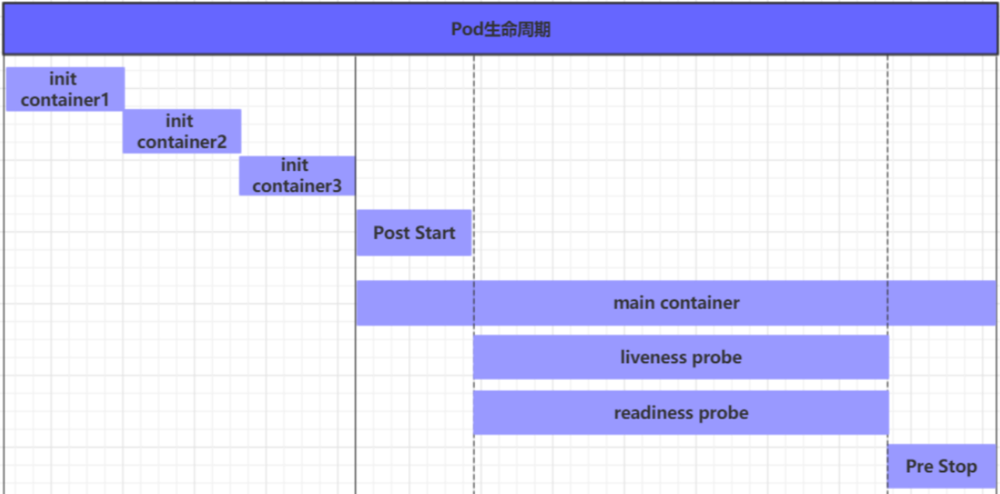

  ```
  在整个生命周期中，Pod会出现5种状态（相位），分别如下：
  	挂起（Pending）：API Server已经创建了Pod资源对象，但它尚未被调度完成或者仍处于下载镜像的过程中。
  	运行中（Running）：Pod已经被调度到某节点，并且所有容器都已经被kubelet创建完成。
  	成功（Succeeded）：Pod中的所有容器都已经成功终止并且不会被重启。
  	失败（Failed）：所有容器都已经终止，但至少有一个容器终止失败，即容器返回了非0值的退出状态。
  	未知（Unknown）：API Server无法正常获取到Pod对象的状态信息，通常由于网络通信失败所导致。
  ```

  

  ``` 
  Pod 创建过程
      1. 用户通过kubectl或其他的api客户端提交需要创建的Pod信息给API Server
      2. API Server开始生成Pod对象的信息，并将信息存入etcd，然后返回确认信息至客户端
      3. API Server开始反映etcd中的Pod对象的变化，其它组件使用watch机制来跟踪检查API Server上的变动
      4. Scheduler发现有新的Pod对象要创建，开始为Pod分配主机并将结果信息更新至API Server
      5. Node节点上的kubelet发现有Pod调度过来，尝试调度Docker启动容器，并将结果回送至API Server
      5. API Server将接收到的Pod状态信息存入到etcd中
  ```

  ``` 
  Pod 终止过程
      1. 用户向API Server发送删除Pod对象的命令
      2. API Server中的Pod对象信息会随着时间的推移而更新，在宽限期内（默认30s），Pod被视为dead
      3. 将Pod标记为terminating状态
      4. kubelet在监控到Pod对象转为terminating状态的同时，启动Pod关闭过程
      5. controller监控到Pod对象的关闭行为时，将其从所有匹配到此端点的service资源的端点列表中移除
      6. 如果当前Pod对象定义了preStop钩子处理器，则在其标记为terminating后会以同步的方式启动执行
      7. Pod对象中的容器进程收到停止信号
      8. 宽限期结束后，如果Pod中还存在运行的进程，那么Pod对象会收到立即终止的信号
      9. kubectl请求API Server将此Pod资源的宽限期设置为0从而完成删除操作，此时Pod对于用户已经不可用了
  ```

  

#### Controller

```
在k8s中，按照 Pod的创建方式可以将其分为两类：
	1. 自主式Pod：k8s直接创建出来的Pod，此时Pod删除后就没有了，也不会重建
	2. 控制器创建Pod：通过Pod控制器创建的Pod，此时Pod删除之后还会自动重建
```

```
在k8s中，每种控制器都有自己的适合的场景，常见的有：
    1. ReplicaSet：保证指定数量的Pod运行，并支持Pod数量变更，镜像版本变更。
    2. Deployment：通过控制ReplicaSet来控制Pod，并支持滚动升级、版本回退。
    3. Horizontal Pod Autoscaler：可以根据集群负载自动调整Pod的数量，实现削峰填谷。
    4. DaemonSet：在集群中的指定Node上都运行一个副本，一般用于守护进程类的任务。
    5. Job：它创建出来的Pod只要完成任务就立即退出，用于执行一次性任务。
    6. CronJob：它创建的Pod会周期性的执行，用于执行周期性的任务。
    7. StatefulSet：管理有状态的应用。
```


+ **ReplicaSet**

  RS的主要作用是保证一定数量的Pod能够正常运行，它会持续监听这些Pod的运行状态，一旦Pod发生故障，就会重启或重建。

  同时它还支持对Pod数量的扩缩容和版本镜像的升级。 通过修改：kubectl edit rs pc-replicaset -n dev

  ```yaml
  apiVersion: apps/v1 # 版本号 
  kind: ReplicaSet # 类型 
  metadata: # 元数据 
    name: # rs名称
    namespace: # 所属命名空间 
    labels: #标签 
      controller: rs 
  spec: # 详情描述 
    replicas: 3 # 副本数量 
    selector: # 选择器，通过它指定该控制器管理哪些po
      matchLabels: # Labels匹配规则 
        app: nginx-pod 
      matchExpressions: # Expressions匹配规则 
        - {key: app, operator: In, values: [nginx-pod]} 
  template: # 模板，当副本数量不足时，会根据下面的模板创建pod副本 
    metadata: 
      labels: 
        app: nginx-pod 
    spec: 
      containers: 
        - name: nginx 
          image: nginx:1.17.1 
          ports: 
          - containerPort: 80
  ```


+ **Deployment**

  Deployment管理ReplicaSet，ReplicaSet管理Pod

  除了有RS的功能之外，deploy还支持发布的停止、继续（金丝雀灰度发布），支持版本滚动更新和版本回退

  ```yaml
  apiVersion: apps/v1 # 版本号 
  kind: Deployment # 类型 
  metadata: # 元数据 
    name: # rs名称 
    namespace: # 所属命名空间 
    labels: #标签 
      controller: deploy 
  spec: # 详情描述 
    replicas: 3 # 副本数量 
    revisionHistoryLimit: 3 # 保留历史版本，默认为10 
    paused: false # 暂停部署，默认是false 
    progressDeadlineSeconds: 600 # 部署超时时间（s），默认是600 
    strategy: # 策略 
      type: RollingUpdate # 滚动更新策略 
      rollingUpdate: # 滚动更新 
        maxSurge: 30% # 最大额外可以存在的副本数，可以为百分比，也可以为整数 maxUnavailable: 30% # 最大不可用状态的    Pod 的最大值，可以为百分比，也可以为整数 
    selector: # 选择器，通过它指定该控制器管理哪些pod 
      matchLabels: # Labels匹配规则 
        app: nginx-pod 
      matchExpressions: # Expressions匹配规则 
        - {key: app, operator: In, values: [nginx-pod]} 
    template: # 模板，当副本数量不足时，会根据下面的模板创建pod副本 
      metadata: 
        labels: 
          app: nginx-pod 
      spec: 
        containers: 
        - name: nginx 
          image: nginx:1.17.1 
          ports: 
          - containerPort: 80
  
  # 更新 Deployment
  kubectl set image nginx nginx=nginx:1.9.1 -record=true
  
  # 回滚 Deployment  
  1. 检查更新历史  kubectl rollout[滚动] history[历史] nginx
  2. 回滚指定版本  kubectl rollout history nginx -revision=2
  
  # 伸缩 Deployment
  kubectl scale nginx -replicas=10
  kubectl autoscale nginx -min=10 -max=15 -cpu-percent=80 （基于CPU利用率自动伸缩）
  
  # 暂停和继续 Deployment
  1. 暂停 Deployment  kubectl rollout pause[暂停] nginx
  2. 修改 Deployment（暂停状态下未更新）   kubectl set image nginx nginx=nginx:1.9.1
  3. 继续 Deployment（对修改做更新）   kubectl rollout resume[继续] nginx
  
  # 查看 Deployment 状态  
  kubectl rollout status 
      - Progressing：正在执行滚动更新
      - Complete：滚动完成
      - False：滚动失败
  ```


+ **StatefulSet**

  StatefulSet是Kubernetes提供的管理有状态应用的负载管理控制器。

  + 无状态应用：认为Pod都是一样的。没有顺序要求。不用考虑在哪个Node节点上运行。随意进行伸缩和扩展。

  + 有状态应用：有顺序的要求。认为每个Pod都是不一样的。需要考虑在哪个Node节点上运行。需要按照顺序进行伸缩和扩展。让每个Pod都是独立的，保持Pod启动顺序和唯一性。

  StatefulSet 部署需要 HeadLinessService（无头服务）

  StatefulSet中要求Pod必须是有序 ，每个Pod不能被随意取代，Pod重建后标识还是一样的，而Pod IP是变化的，所以是以Pod名称来作为唯一标志，这时候需要无头服务，它可以给每个Pod一个唯一的名称 

  ```yaml
  apiVersion: v1
  kind: Service
  metadata:
    name: service-headliness
    namespace: dev
  spec:
    selector:
      app: nginx-pod
    clusterIP: None # 将clusterIP设置为None，即可创建headliness Service
    type: ClusterIP
    ports:
      - port: 80 # Service的端口
        targetPort: 80 # Pod的端口
  ---
  
  apiVersion: apps/v1
  kind: StatefulSet
  metadata:
    name: pc-statefulset
    namespace: dev
  spec:
    replicas: 3
    serviceName: service-headliness
    selector:
      matchLabels:
        app: nginx-pod
    template:
      metadata:
        labels:
          app: nginx-pod
      spec:
        containers:
          - name: nginx
            image: nginx:1.17.1
            ports:
              - containerPort: 80
  ```


+ **DaemonSet**

  DS类型的控制器可以保证集群中的每一台（或指定）节点上都运行一个副本，一般适用于日志收集、节点监控等场景。

  - 每向集群中添加一个节点的时候，指定的Pod也将添加到该节点上

  - 当节点从集群中移除的时候，Pod也会被垃圾回收

  ```yaml
  apiVersion: apps/v1 # 版本号
  kind: DaemonSet # 类型
  metadata: # 元数据
    name: # 名称
    namespace: #命名空间
    labels: #标签
      controller: daemonset
  spec: # 详情描述
    revisionHistoryLimit: 3 # 保留历史版本
    updateStrategy: # 更新策略
      type: RollingUpdate # 滚动更新策略
      rollingUpdate: # 滚动更新
        maxUnavailable: 1 # 最大不可用状态的Pod的最大值，可用为百分比，也可以为整数
    selector: # 选择器，通过它指定该控制器管理那些Pod
      matchLabels: # Labels匹配规则
        app: nginx-pod
      matchExpressions: # Expressions匹配规则
        - key: app
          operator: In
          values:
            - nginx-pod
    template: # 模板，当副本数量不足时，会根据下面的模板创建Pod模板
       metadata:
         labels:
           app: nginx-pod
       spec:
         containers:
           - name: nginx
             image: nginx:1.17.1
             ports:
               - containerPort: 80
  ```


+ **Job**

  Job主要用于负责批量处理短暂的一次性任务。

  - 当Job创建的Pod执行成功结束时，Job将记录成功结束的Pod数量。
  - 当成功结束的Pod达到指定的数量时，Job将完成执行。

  ```yml
  apiVersion: batch/v1 # 版本号
  kind: Job # 类型
  metadata: # 元数据
    name:  # 名称
    namespace:  #命名空间
    labels: # 标签
      controller: job
  spec: # 详情描述
    completions: 1 # 指定Job需要成功运行Pod的总次数，默认为1
    parallelism: 1 # 指定Job在任一时刻应该并发运行Pod的数量，默认为1
    activeDeadlineSeconds: 30 # 指定Job可以运行的时间期限，超过时间还没结束，系统将会尝试进行终止
    backoffLimit: 6 # 指定Job失败后进行重试的次数，默认为6
    manualSelector: true # 是否可以使用selector选择器选择Pod，默认为false
    selector: # 选择器，通过它指定该控制器管理那些Pod
      matchLabels: # Labels匹配规则
        app: counter-pod
      matchExpressions: # Expressions匹配规则
        - key: app
          operator: In
          values:
            - counter-pod
    template: # 模板，当副本数量不足时，会根据下面的模板创建Pod模板
       metadata:
         labels:
           app: counter-pod
       spec:
         restartPolicy: Never # 重启策略只能设置为Never或OnFailure
         containers:
           - name: counter
             image: busybox:1.30
             command: ["/bin/sh","-c","for i in 9 8 7 6 5 4 3 2 1;do echo $i;sleep 20;done"]
             
  # 关于模板中的重启策略的说明：
  # 如果设置为OnFailure，则Job会在Pod出现故障的时候重启容器，而不是创建Pod，failed次数不变。
  # 如果设置为Never，则Job会在Pod出现故障的时候创建新的Pod，并且故障Pod不会消失，也不会重启，failed次数+1。
  # 如果指定为Always的话，就意味着一直重启，意味着Pod任务会重复执行，这和Job的定义冲突，所以不能设置为Always。
  ```

  

+ **CronJob**

  CronJob控制器以Job控制器为其管控对象，并借助它管理Pod资源对象。

  Job定义的作业任务在其控制器资源创建之后便会立即执行，CronJob可以在特定的时间点反复去执行Job任务。

  ``` yaml
  apiVersion: batch/v1beta1 # 版本号
  kind: CronJob # 类型
  metadata: # 元数据
    name:  # 名称
    namespace:  #命名空间
    labels:
      controller: cronjob
  spec: # 详情描述
    schedule: # cron格式的作业调度运行时间点，用于控制任务任务时间执行
    concurrencyPolicy: # 并发执行策略
    failedJobsHistoryLimit: # 为失败的任务执行保留的历史记录数，默认为1
    successfulJobsHistoryLimit: # 为成功的任务执行保留的历史记录数，默认为3
    jobTemplate: # job控制器模板，用于为cronjob控制器生成job对象，下面其实就是job的定义
      metadata: {}
      spec:
        completions: 1 # 指定Job需要成功运行Pod的总次数，默认为1
        parallelism: 1 # 指定Job在任一时刻应该并发运行Pod的数量，默认为1
        activeDeadlineSeconds: 30 # 指定Job可以运行的时间期限，超过时间还没结束，系统将会尝试进行终止
        backoffLimit: 6 # 指定Job失败后进行重试的次数，默认为6
        template: # 模板，当副本数量不足时，会根据下面的模板创建Pod模板
          spec:
            restartPolicy: Never # 重启策略只能设置为Never或OnFailure
            containers:
              - name: counter
                image: busybox:1.30
                command: [ "/bin/sh","-c","for i in 9 8 7 6 5 4 3 2 1;do echo $i;sleep 20;done" ]
                
  
  # concurrencyPolicy：并发执行策略
  # Allow：运行Job并发运行（默认）。
  # Forbid：禁止并发运行，如果上一次运行尚未完成，则跳过下一次运行。
  # Replace：替换，取消当前正在运行的作业并使用新作业替换它。
  ```

  

#### Service

```
Service 解决 Deployment 管理的 Pod IP 动态变化问题
	- Pod 有各自的 IP 地址，Service 提供统一的入口地址
	- Service 通过 label selector 选定一组 Pod，并将流程负载均衡到这组 Pod 中
```


+ **kube-proxy**

  对于 Service，真正起作用的其实是 kube-proxy 服务进程。每个 Node 节点上都运行了 kube-proxy 的服务进程。当创建 Service 的时候会通过 API Server 向 etcd 写入创建的 Service 的信息，而 kube-proxy 会基于监听的机制发现这种 Service 的变化，然后它会将最新的 Service 信息转换为对应的访问规则。

  kube-proxy目前支持三种工作模式：  kubectl edit cm kube-proxy -n kube-system  -->  mode 字段

  + **userspace模式**

    + userspace模式下，kube-proxy会为每个Service创建监听端口，发向Cluster IP的请求被iptables规则重定向到kube-proxy监听的端口上，kube-proxy根据LB算法（负载均衡算法）选择提供服务的Pod并和其建立连接，以便将请求转发到Pod上。
    + 该模式下，kube-proxy充当了四层负载均衡器的角色。由于kube-proxy运行在userspace中，在进行转发处理的时候会增加内核和用户空间之间的数据拷贝，虽然比较稳定，但是效率非常低下。

    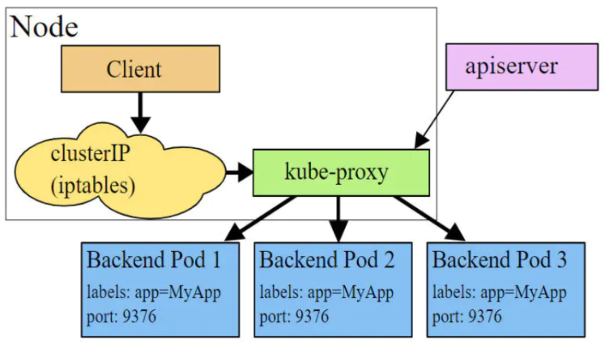

  + **iptables模式 （默认）**

    + iptables模式下，kube-proxy为Service后端的每个Pod创建对应的iptables规则，直接将发向Cluster IP的请求重定向到一个Pod的IP上。
    + 该模式下kube-proxy不承担四层负载均衡器的角色，只负责创建iptables规则。该模式的优点在于较userspace模式效率更高，但是不能提供灵活的LB策略，当后端Pod不可用的时候无法进行重试。

    

  + **ipvs模式**

    + ipvs模式和iptables类似，kube-proxy监控Pod的变化并创建相应的ipvs规则。ipvs相对iptables转发效率更高，除此之外，ipvs支持更多的LB算法。
    + 开启需安装ipvs内核模块，否则会降级为iptables。  ipvsadm -Ln 查看映射规则

    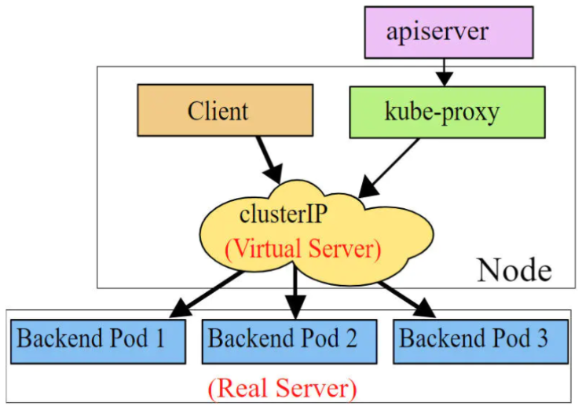


+ **yml 定义**

  ```yaml
  apiVersion: v1 # 版本
  kind: Service # 类型
  metadata: # 元数据
    name: # 资源名称
    namespace: # 命名空间
  spec:
    selector: # 标签选择器，用于确定当前Service代理那些Pod
      app: nginx
    type: ClusterIP # Service的类型，指定Service的访问方式
    clusterIP: # 虚拟服务的IP地址
    sessionAffinity: # session亲和性
    ports: # 端口信息
      - port: 8080 # Service端口
        protocol: TCP # 协议
        targetPort : # Pod端口
        nodePort:  # 主机端口
        
  # 负载分发策略 sessionAffinity
  # none: 默认使用kube-proxy的策略，比如随机、轮询等
  # ClientIP: 来自同个客户端发起的所有请求都会转发到固定的Pod上
  ```

  + **ClusterIP**

    默认值，它是kubernetes系统自动分配的虚拟IP，只能在集群内部访问。

    ``` yml
    apiVersion: v1
    kind: Service
    metadata:
      name: service-clusterip
      namespace: dev
    spec:
      selector:
        app: nginx-pod
      clusterIP: 10.97.97.97 # service的IP地址，如果不写，默认会生成一个
      type: ClusterIP
      ports:
        - port: 80 # Service的端口
          targetPort: 80 # Pod的端口
    ```

  + **HeadLiness**

    在某些场景中，开发人员可能不想使用Service提供的负载均衡功能，而希望（Controller）来控制负载均衡策略。K8s提供了HeadLinesss，此Service不会分配Cluster IP，如果想要访问Service，只能通过Service的域名进行查询。 （StatefulSet 需要）

    ``` yaml
    apiVersion: v1
    kind: Service
    metadata:
      name: service-headliness
      namespace: dev
    spec:
      selector:
        app: nginx-pod
      clusterIP: None # 将clusterIP设置为None，即可创建headliness Service
      type: ClusterIP
      ports:
        - port: 80 # Service的端口
          targetPort: 80 # Pod的端口
    ```

  + **NodePort**

    前面两种Service只能在集群内部才能访问。如果希望Service暴露给集群外部使用，则可由 NodePort 将 Service 的端口映射到 Node 的端口上，然后就可以用 NodeIP:NodePort 来访问 Service

    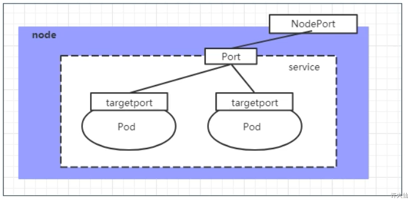

    ``` yaml
    apiVersion: v1
    kind: Service
    metadata:
      name: service-nodeport
      namespace: dev
    spec:
      selector:
        app: nginx-pod
      type: NodePort # Service类型为NodePort
      ports:
        - port: 80 # Service的端口
          targetPort: 80 # Pod的端口
          nodePort: 30002 # 指定绑定的node的端口（默认取值范围是30000~32767），如果不指定，会默认分配
    ```

  + **LoadBalancer**

    LoadBalancer和NodePort很相似，目的都是向外部暴露一个端口，区别在于LoadBalancer会在集群的外部再来做一个负载均衡设备，而这个设备需要外部环境的支持，外部服务发送到这个设备上的请求，会被设备负载之后转发到集群中。

    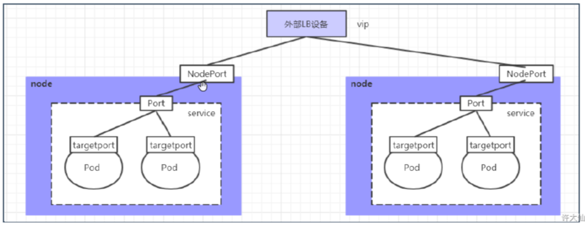

  + **ExternalName**

    ExternalName类型的Service用于引入集群外部的服务，它通过externalName属性指定一个服务的地址，然后在集群内部访问此Service就可以访问到外部的服务了。

    ``` yaml
    apiVersion: v1
    kind: Service
    metadata:
      name: service-externalname
      namespace: dev
    spec:
      type: ExternalName # Service类型为ExternalName
      externalName: www.baidu.com # 改成IP地址也可以
    ```
    
  + **域名**
  
    ```
    <servicename>.<namespace>.svc.<clusterdomain>
    servicename为service名称，namespace为service所处的命名空间，clusterdomain是k8s集群设计的域名后缀，默认为cluster.local
    ```
  
    


+ **Ingress**

  Service对集群之外暴露服务的主要方式有两种：NodePort 和 LoadBalancer，都具有一定缺点

  + NodePort方式的缺点是会占用很多集群机器的端口
  + LoadBalancer的缺点是每个Service都需要一个LB，需要k8s之外的设备的支持

  基于这种现状，k8s提供了Ingress资源对象，Ingress只需要一个NodePort或者一个LB就可以满足暴露多个Service的需求。

  实际上，Ingress相当于一个七层的负载均衡器，是kubernetes对反向代理的一个抽象，包括：

  + Ingress：kubernetes中的对象，作用是定义请求如何转发到Service的规则。
  + Ingress Controller：具体实现反向代理及负载均衡的程序，对Ingress定义的规则进行解析，根据配置的规则来实现请求转发，实现的方式有很多，比如Nginx，Contour，Haproxy等。

  Ingress（以Nginx）的工作原理如下：

  1. 用户编写Ingress规则，说明那个域名对应kubernetes集群中的那个Service
  2. Ingress Controller动态感知Ingress服务规则的变化，然后生成一段对应的Nginx的反向代理配置
  3. Ingress Controller会将生成的Nginx配置写入到一个运行着的Nginx服务中，并动态更新
  4. 到此为止，其实真正在工作的就是一个Nginx了，内部配置了用户定义的请求规则

  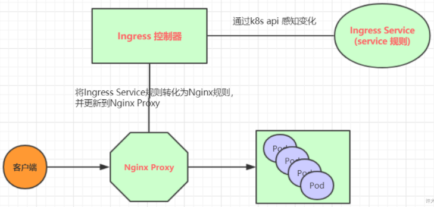

  + **yaml 定义**

    ``` yaml
    apiVersion: extensions/v1beta1
    kind: Ingress
    metadata:
      name: ingress-http
      namespace: dev
    spec:
      rules:
      - host: nginx.xudaxian.com
        http:
          paths:
          - path: /
            pathType: ImplementationSpecific
            backend:
              serviceName: nginx-service
              servicePort: 80
      - host: tomcat.xudaxian.com
        http:
          paths:
          - path: /
            pathType: ImplementationSpecific
            backend:
              serviceName: tomcat-service
              servicePort: 8080
    ```

+ **Endpoint**

  https://blog.csdn.net/c13257595138/article/details/124007593

  每一个**Service**资源都有一个**endpoints**，**endpoints**主要记录了每个**pod**的IP地址信息，当**Pod**的IP发生变化时，endpoints会进行更新。

  

  **使用endpoint代理集群外部服务**

  

  ``` yaml
  ---
  apiVersion: v1
  kind: Endpoints
  metadata:
    name: ai-10000
    namespace: nest
  subsets:
    - addresses:
      - ip: 172.16.1.3 
      ports:
      - port: 10000
  ---
  apiVersion: v1
  kind: Service
  metadata:
    name: ai-10000
    namespace: nest
  spec:
    ports:
      - protocol: TCP
        port: 80
        targetPort: 10000
        
  # curl http://ai-10000.nest.svc:80  ->  172.16.1.3:10000
  ```

  

+ **Network Policy**

  作用：网络隔离。定制网络流量 **进出 / 流出** Pod的规则，其采用的是白名单模式，符合规则的通过，不符合规则的拒绝。

  ``` yaml
  apiVersion: networking.k8s.io/v1
  kind: NetworkPolicy
  metadata:
    name: network-policy
    namespace: default
  spec:
    podSelector:
      matchLabels:
        key: value   # Pod 选择器
    policyTypes:
    - Ingress    # 进入 Pod 的流量规则
    - Egress     # 流出 Pod 的流量规则
    ingress:
    - from:
      - ipBlock:
          cidr: 172.17.0.0/16
          except:
          - 172.17.1.0/24
      - namespaceSelector:
          matchLabels:
            project: myproject
      - podSelector:
          matchLabels:
            role: frontend
      ports:
      - protocol: TCP
        port: 6379
    egress:
    - to:
      - ipBlock:
          cidr: 10.0.0.0/24
      ports:
      - protocol: TCP
        port: 5978
  ```

  


#### Volume

K8s数据存储：Volume是Pod中能够被多个容器访问的共享目录，挂载到Host节点上具体的文件目录下，实现持久化存储。

``` 
Volume支持多种类型，如：
    - 简单存储：EmptyDir、HostPath、NFS。
    - 高级存储：PV、PVC。
    - 配置存储：ConfigMap、Secret。
```

+ **EmptyDir**

  EmptyDir是最基础的Volume类型，一个EmptyDir就是Host上的一个空目录

  EmptyDir是在Pod被分配到Node时创建的，它的初始内容为空，并且无须指定宿主机上对应的目录文件，自动分配。当Pod销毁时，EmptyDir中的数据也会被永久删除。

  ``` yaml
  apiVersion: v1
  kind: Pod
  metadata:
    name: volume-emptydir
    namespace: dev
  spec:
    containers:
      - name: nginx
        image: nginx:1.17.1
        imagePullPolicy: IfNotPresent
        ports:
          - containerPort: 80
        volumeMounts: # 将logs-volume挂载到nginx容器中对应的目录，该目录为/var/log/nginx
          - name: logs-volume
            mountPath: /var/log/nginx
      - name: busybox
        image: busybox:1.30
        imagePullPolicy: IfNotPresent
        command: ["/bin/sh","-c","tail -f /logs/access.log"] # 初始命令，动态读取指定文件
        volumeMounts: # 将logs-volume挂载到busybox容器中的对应目录，该目录为/logs
          - name: logs-volume
            mountPath: /logs
    volumes: # 声明volume，name为logs-volume，类型为emptyDir
      - name: logs-volume
        emptyDir: {}
  ```

+ **HostPath**

  EmptyDir中的数据不会被持久化，会随着Pod的结束而销毁。如果想要简单的将数据持久化到主机中，可以选择HostPath。

  ``` yaml
  apiVersion: v1
  kind: Pod
  metadata:
    name: volume-hostpath
    namespace: dev
  spec:
    containers:
      - name: nginx
        image: nginx:1.17.1
        imagePullPolicy: IfNotPresent
        ports:
          - containerPort: 80
        volumeMounts: # 将logs-volume挂载到nginx容器中对应的目录，该目录为/var/log/nginx
          - name: logs-volume
            mountPath: /var/log/nginx
      - name: busybox
        image: busybox:1.30
        imagePullPolicy: IfNotPresent
        command: ["/bin/sh","-c","tail -f /logs/access.log"] # 初始命令，动态读取指定文件
        volumeMounts: # 将logs-volume挂载到busybox容器中的对应目录，该目录为/logs
          - name: logs-volume
            mountPath: /logs
    volumes: # 声明volume，name为logs-volume，类型为hostPath
      - name: logs-volume
        hostPath:
          path: /root/logs
          type: DirectoryOrCreate # 目录存在就使用，不存在就先创建再使用
  
  # type的值的说明：
  #   DirectoryOrCreate：目录存在就使用，不存在就先创建后使用。
  #   Directory：目录必须存在。
  #   FileOrCreate：文件存在就使用，不存在就先创建后使用。
  #   File：文件必须存在。
  #   Socket：unix套接字必须存在。
  #   CharDevice：字符设备必须存在。
  #   BlockDevice：块设备必须存在。
  ```

+ **NFS**

  NFS是网络文件存储系统，可以搭建NFS服务器，然后将Pod中的存储直接连接到NFS系统上，可以实现Node故障时，Pod转移到其它节点仍可访问数据。

  ``` yaml
  apiVersion: v1
  kind: Pod
  metadata:
    name: volume-nfs
    namespace: dev
  spec:
    containers:
      - name: nginx
        image: nginx:1.17.1
        imagePullPolicy: IfNotPresent
        ports:
          - containerPort: 80
        volumeMounts: # 将logs-volume挂载到nginx容器中对应的目录，该目录为/var/log/nginx
          - name: logs-volume
            mountPath: /var/log/nginx
      - name: busybox
        image: busybox:1.30
        imagePullPolicy: IfNotPresent
        command: ["/bin/sh","-c","tail -f /logs/access.log"] # 初始命令，动态读取指定文件
        volumeMounts: # 将logs-volume挂载到busybox容器中的对应目录，该目录为/logs
          - name: logs-volume
            mountPath: /logs
    volumes: # 声明volume
      - name: logs-volume
        nfs:
          server: 192.168.18.100 # NFS服务器地址
          path: /root/data/nfs # 共享文件路径
  ```

  

+ **PV PVC**

  为了能够屏蔽底层存储实现的细节，方便用户使用，k8s引入了 PV 和 PVC 两种资源对象

  PV（Persistent Volume）是持久化卷的意思，是对底层的共享存储的抽象。PV由kubernetes管理员进行创建和配置，它和底层具体的共享存储技术有关，并通过插件完成和共享存储的对接。

  PVC（Persistent Volume Claim）是持久化卷声明的意思，是用户对于存储需求的声明。换言之，PVC其实就是用户向8s系统发出的资源需求申请。

  从此：存储由底层工程师维护，PV由K8s管理员维护，PVC由K8s用户维护

  

  + **PV**

    ``` yaml
    apiVersion: v1
    kind: PersistentVolume
    metadata:
      name: pv2
    spec:
      nfs: # 存储类型，和底层正则的存储对应
        path:
        server:
      capacity: # 存储能力，目前只支持存储空间的设置
        storage: 2Gi
      accessModes: # 访问模式
        -
      storageClassName: # 存储类别
      persistentVolumeReclaimPolicy: # 回收策略
      
    # 关键配置参数说明
    # 存储类型：底层实际存储的类型，kubernetes支持多种存储类型，每种存储类型的配置有所不同
    # 存储能力（capacity）：目前只支持存储空间的设置（storage=1Gi），不过未来可能会加入IOPS、吞吐量等指标的配置。
    # 访问模式（accessModes）：用来描述用户应用对存储资源的访问权限（不同类型支持的可能不同）
    # 		ReadWriteOnce（RWO）：读写权限，但是只能被单个节点挂载
    # 		ReadOnlyMany（ROX）：只读权限，可以被多个节点挂载。
    #		ReadWriteMany（RWX）：读写权限，可以被多个节点挂载
    # 回收策略（persistentVolumeReclaimPolicy）：当PV不再被使用之后，对其的处理方式（不同类型支持的可能不同）
    # 		Retain（保留）：保留数据，需要管理员手动清理数据。
    #		Recycle（回收）：清除PV中的数据，效果相当于rm -rf /volume/*
    #		Delete（删除）：和PV相连的后端存储完成volume的删除操作
    # 存储类别（storageClassName）：PV可以通过storageClassName参数指定一个存储类别
    #		具有特定类型的PV只能和请求了该类别的PVC进行绑定
    #		未设定类别的PV只能和不请求任何类别的PVC进行绑定
    # 状态（status）：一个PV的生命周期，可能会处于4种不同的阶段
    #		Available（可用）：表示可用状态，还未被任何PVC绑定
    #		Bound（已绑定）：表示PV已经被PVC绑定
    #		Released（已释放）：表示PVC被删除，但是资源还没有被集群重新释放
    #		Failed（失败）：表示该PV的自动回收失败
    ```

  + **PVC**

    ``` yaml
    apiVersion: v1
    kind: PersistentVolumeClaim
    metadata:
      name: pvc
      namespace: dev
    spec:
      accessModes: # 访客模式
        - 
      selector: # 采用标签对PV选择
      storageClassName: # 存储类别
      resources: # 请求空间
        requests:
          storage: 5Gi
    
    # 关键配置参数说明：
    # 访客模式（accessModes）：用于描述用户应用对存储资源的访问权限。
    # 选择条件（selector）：通过Label Selector的设置，可使PVC对于系统中已存在的PV进行筛选。
    # 存储类别（storageClassName）：PVC在定义时可以设定需要的后端存储的类别，只有设置了该class的pv才能被系统选出。
    # 资源请求（resources）：描述对存储资源的请求。
    ```

  + **Pod**

    ``` yaml
    ---
    apiVersion: v1
    kind: PersistentVolume
    metadata:
      name: pv1
    spec:
      nfs: # 存储类型吗，和底层正则的存储对应
        path: /root/data/pv1
        server: 192.168.18.100
      capacity: # 存储能力，目前只支持存储空间的设置
        storage: 1Gi
      accessModes: # 访问模式
        - ReadWriteMany
      persistentVolumeReclaimPolicy: Retain # 回收策略
    
    ---
    apiVersion: v1
    kind: PersistentVolumeClaim
    metadata:
      name: pvc1
      namespace: dev
    spec:
      accessModes: # 访客模式
        - ReadWriteMany
      resources: # 请求空间
        requests:
          storage: 1Gi
    
    ---
    apiVersion: v1
    kind: Pod
    metadata:
      name: pod1
      namespace: dev
    spec:
      containers:
      - name: busybox
        image: busybox:1.30
        command: ["/bin/sh","-c","while true;do echo pod1 >> /root/out.txt; sleep 10; done;"]
        volumeMounts:
        - name: volume
          mountPath: /root/
      volumes:
        - name: volume
          persistentVolumeClaim:
            claimName: pvc1
            readOnly: false
    ```

  + **生命周期**

    PVC和PV是一一对应的，PV绑定到PVC上，就会被这个PVC独占，不能再和其他的PVC进行绑定。

    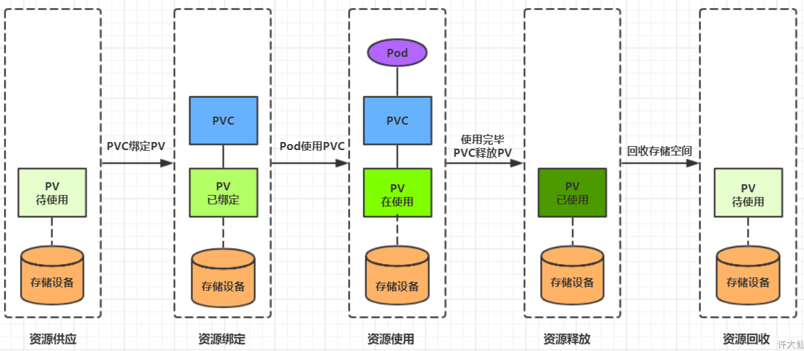

+ **ConfigMap**

  ConfigMap主要用来存储配置信息

  ``` yaml
  ---
  apiVersion: v1
  kind: ConfigMap
  metadata:
    name: configmap
    namespace: dev
  data:
    info:
      username:admin
      password:123456
      
  ---
  apiVersion: v1
  kind: Pod
  metadata:
    name: pod-configmap
    namespace: dev
  spec:
    containers:
      - name: nginx
        image: nginx:1.17.1
        volumeMounts:
          - mountPath: /configmap/config
            name: config
    volumes:
      - name: config
        configMap:
          name: configmap
  ```

  ```shell
  # properties文件中的每一行必须为 VAR=VAL 格式， VAR可自定义，多个英文单词.号隔开
  # enemies=aliens
  # lives=3
  # enemies.cheat=true
  # enemies.cheat.level=noGoodRotten
  
  # 从一个目录中创建ConfigMap
  kubectl create configmap cm1 --from-file=configure-pod-container/configmap/
  # 从一个文件中创建ConfigMap,并自定义ConfigMap中data.key的名称
  kubectl create configmap cm2 --from-file=keyName=configure-pod-container/configmap/game.properties
  # 从环境变量文件创建ConfigMap 
  kubectl create cm cm3 --from-env-file=configure-pod-container/configmap/env-file.properties
  # 在命令行根据键值对创建ConfigMap
  kubectl create cm cm4 --from-literal=special.how=very --from-literal=special.type=charm
  
  # 使用ConfigMap定义容器环境变量
  ---
  apiVersion: v1
  kind: Pod
  metadata:
    name: test-pod
  spec:
    containers:
      - name: test-container
        image: busybox
        command: [ "/bin/sh", "-c", "env" ]
        env:
          # 定义环境变量
          - name: SPECIAL_LEVEL_KEY
            valueFrom:
              configMapKeyRef:
                # ConfigMap的名称
                name: cm4
                # ConfigMap的key 不指定则将所有键值对配置为容器环境变量
                key: special.how
    restartPolicy: Never
  
  # 使用存储在ConfigMap中的数据填充容器
  ---
  apiVersion: v1
  kind: Pod
  metadata:
    name: test-pod
  spec:
    containers:
      - name: test-container
        image: busybox
        command: [ "/bin/sh", "-c", "ls /etc/config/" ]
        volumeMounts:
        - name: config-volume
          mountPath: /etc/config
    volumes:
      - name: config-volume
        configMap:
          name: cm4
    restartPolicy: Never
  ```

+ **Secret**

  与ConfigMap类似，用来存储敏感信息（base64编码）

  ``` yaml
  ---
  apiVersion: v1
  kind: Secret
  metadata:
    name: secret
    namespace: dev
  type: Opaque
  data:  # 手动编码
    username: YWRtaW4=
    password: MTIzNDU2
  stringData: # 交给K8s编码
    username: admin
    password: 123456
    
  ---
  apiVersion: v1
  kind: Pod
  metadata:
    name: pod-secret
    namespace: dev
  spec:
    containers:
      - name: nginx
        image: nginx:1.17.1
        volumeMounts:
          - mountPath: /secret/config
            name: config
    volumes:
      - name: config
        secret:
          secretName: secret
  ```

  imagePullSecrets：拉取镜像仓库

  ``` yaml
  kubectl create secret docker-registry docker-harbor-registrykey \
  			--docker-server=ip:port \
            	--docker-username=username \
            	--docker-password=password \
            	--docker-email=email
  ---
  apiVersion: v1
  kind: Pod
  metadata:
    name: redis
  spec:
    containers:
      - name: redis
        image: ip:port/uri # 这是Harbor的镜像私有仓库地址
    imagePullSecrets:
      - name: docker-harbor-registrykey
  ```

  其它操作与ConfigMap类似
  
+ **PVC transfer namespace**

  ``` shell
  $ kubectl get pvc cassandra-data-0 cassandra-data-1 cassandra-data-2 -n staging
  NAME                         STATUS   VOLUME                                     CAPACITY   ACCESS MODES   STORAGECLASS    AGE
  cassandra-data-0   Bound    pvc-ca98b157-8ad0-434c-8dda-4bd526d7b042   4Ti        RWO            gp2-encrypted   7m34s
  
  Step 1. Patch the PVs to set the “persistentVolumeReclaimPolicy” to “Retain”
  $ kubectl patch pv pvc-ca98b157-8ad0-434c-8dda-4bd526d7b042 -p '{"spec":{"persistentVolumeReclaimPolicy":"Retain"}}'
  persistentvolume/pvc-ca98b157-8ad0-434c-8dda-4bd526d7b042 patched
  
  Step 2. Export the current PVCs objects because it will be necessary to recreate the PVCs in a later stage:
  $ kubectl get pvc cassandra-data-0 -o yaml > cassandra-data-0.yaml
  
  Step 3. Delete the current PVC in the namespace “staging”
  $ kubectl delete pvc cassandra-data-0 cassandra-data-1 cassandra-data-2 -n staging
  persistentvolumeclaim "cassandra-data-0" deleted
  
  See that the PV Status will be changed from “Bound” to “Released”
  $ kubectl get pv pvc-ca98b157-8ad0-434c-8dda-4bd526d7b042
  NAME                                       CAPACITY   ACCESS MODES   RECLAIM POLICY   STATUS     CLAIM                                STORAGECLASS    REASON   AGE
  pvc-ca98b157-8ad0-434c-8dda-4bd526d7b042   4Ti        RWO            Retain           Released   staging/cassandra-data-0   gp2-encrypted            62d
  
  
  Step 4. Edit each one of the PVs to remove the old references
  $ kubectl edit pv pvc-ca98b157-8ad0-434c-8dda-4bd526d7b042
  And delete all the lines below:
  ...
  claimRef:
   apiVersion: v1
   kind: PersistentVolumeClaim
   name: cassandra-data-0
   namespace: staging
   resourceVersion: "85681949"
   uid: ca98b157-8ad0-434c-8dda-4bd526d7b042
  ...
  Now, see that there are no references anymore in the CLAIM column
  $ kubectl get pv pvc-ca98b157-8ad0-434c-8dda-4bd526d7b042
  NAME                                       CAPACITY   ACCESS MODES   RECLAIM POLICY   STATUS     CLAIM   STORAGECLASS    REASON   AGE
  pvc-ca98b157-8ad0-434c-8dda-4bd526d7b042   4Ti        RWO            Retain           Released   /       gp2-encrypted            62d
  
  Step 5. Edit each one of those files which we exported the PVC object in step 2.
  $ vi cassandra-data-0.yaml
  And delete all the lines below with the arrow key “< — — “
  ...
  apiVersion: v1
  kind: PersistentVolumeClaim
  metadata:
    annotations:  <------ To delete
      pv.kubernetes.io/bind-completed: "yes"  <------ To delete
      pv.kubernetes.io/bound-by-controller: "yes"  <------ To delete
      volume.beta.kubernetes.io/storage-provisioner: kubernetes.io/aws-ebs  <------ To delete
    creationTimestamp: "2020-08-19T23:52:17Z"  <------ To delete
    finalizers:  <------ To delete
    - kubernetes.io/pvc-protection  <------ To delete
    labels:
      app: cassandra
    name: cassandra-data-0
    namespace: staging  <------ To delete
    resourceVersion: "85682006"  <------ To delete
    selfLink: /api/v1/namespaces/staging/persistentvolumeclaims/cassandra-data-cassandra-0  <------ To delete
    uid: ca98b157-8ad0-434c-8dda-4bd526d7b042  <------ To delete
  spec:
    accessModes:
    - ReadWriteOnce
    resources:
      requests:
        storage: 4Ti
    storageClassName: gp2-encrypted
    volumeMode: Filesystem
    volumeName: pvc-ca98b157-8ad0-434c-8dda-4bd526d7b042
  status:  <------ To delete
    accessModes:  <------ To delete
    - ReadWriteOnce  <------ To delete
    capacity:  <------ To delete
      storage: 4Ti  <------ To delete
    phase: Bound  <------ To delete
  ...
  
  Step 6. Now, I’m going to create those PVCs again, but inside the Namespace “integration”
  kubectl apply -f cassandra-data-0.yaml
  
  In the following, check the PVCs state, which will probably in Pending state
  After a few seconds, all the PVCs should be in a Bound state
  
  Step 7. Patch the PVs to set the “persistentVolumeReclaimPolicy” to “Delete”
  $ kubectl patch pv pvc-ca98b157-8ad0-434c-8dda-4bd526d7b042 -p '{"spec":{"persistentVolumeReclaimPolicy":"Retain"}}'
  persistentvolume/pvc-ca98b157-8ad0-434c-8dda-4bd526d7b042 patched
  ```


#### Role

API Server是访问和管理资源对象的唯一入口。任何一个请求访问API Server，都要经过下面的三个流程

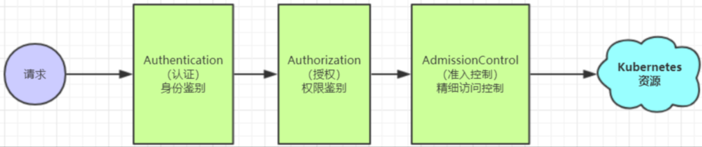

+ 认证管理：

  + 通过用户名+密码识别用户
  + 通过Token来识别合法用户
  + HTTPS基于CA根证书签名的双向数字证书认证方式

  

+ 授权管理：

  + AlwaysDeny：表示拒绝所有请求，一般用于测试。

  - AlwaysAllow：允许接收所有的请求，相当于集群不需要授权流程（kubernetes默认的策略）。

  - ABAC：基于属性的访问控制，表示使用用户配置的授权规则对用户请求进行匹配和控制。

  - Webhook：通过调用外部REST服务对用户进行授权。

  - Node：是一种专用模式，用于对kubelet发出的请求进行访问控制。

  - RBAC：基于角色的访问控制（kubeadm安装方式下的默认选项）。

  

+ **RABC**（Role Based Access Control）：基于角色的访问控制，涉及以下概念：

  + 对象：User、Groups、ServiceAccount。

  - 角色：Role 代表着一组定义在资源上的可操作的动作（权限）的集合。

  - 绑定：RoleBinding 将定义好的角色和用户绑定在一起。

    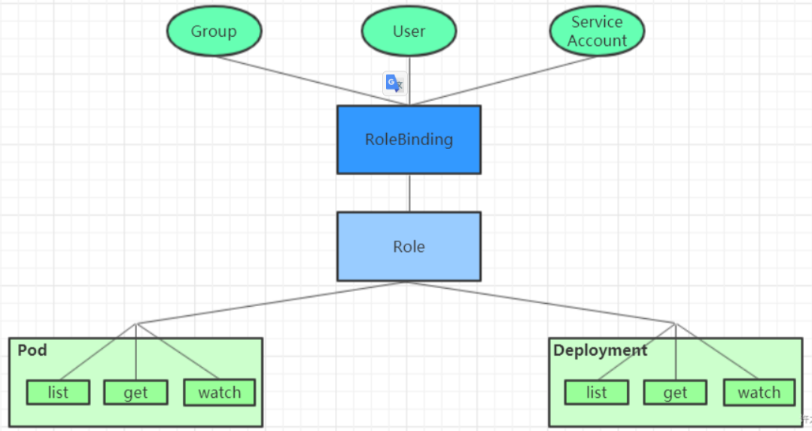

  - RBAC还引入了4个顶级资源对象：

    - Role、ClusterRole：角色，用于指定一组权限。
    - RoleBinding、ClusterRoleBinding：角色绑定，用于将角色（权限的集合）赋予给对象。

  

+ **Role、ClusterRole**

  一个角色就是一组权限的集合，这里的权限都是许可形式的（白名单）

  ``` yaml
  ---
  # Role只能对命名空间的资源进行授权，需要指定namespace
  apiVersion: rbac.authorization.k8s.io/v1
  kind: Role
  metadata:
    name: authorization-role
    namespace: dev
  rules:
    - apiGroups: [""] # 支持的API组列表，""空字符串，表示核心API群
      resources: ["pods"] # 支持的资源对象列表
      verbs: ["get","watch","list"]
  
  ---
  # ClusterRole可以对集群范围内的资源、跨namespace的范围资源、非资源类型进行授权
  apiVersion: rbac.authorization.k8s.io/v1
  kind: ClusterRole
  metadata:
    name: authorization-clusterrole
  rules:
    - apiGroups: [""] # 支持的API组列表，""空字符串，表示核心API群
      resources: ["pods"] # 支持的资源对象列表
      verbs: ["get","watch","list"]
      
  
  # rules中的参数说明：
  # apiGroups：支持的API组列表。"","apps","autoscaling","batch"。
  # resources：支持的资源对象列表。"services","endpoints","pods","secrets","configmaps","crontabs","deployments","jobs","nodes","rolebindings","clusterroles","daemonsets","replicasets","statefulsets","horizontalpodautoscalers","replicationcontrollers","cronjobs"。
  # verbs：对资源对象的操作方法列表。"get", "list", "watch", "create", "update", "patch", "delete", "exec"。
  ```


+ **RoleBinding、ClusterRoleBinding**

  角色绑定用来把一个角色绑定到一个目标对象上，绑定目标可以是User、Group或者ServiceAccount。

  ``` yaml
  ---
  # RoleBinding可以将同一namespace中的subject对象绑定到某个Role下，则此Subject具有该Role定义的权限
  apiVersion: rbac.authorization.k8s.io/v1
  kind: RoleBinding
  metadata:
    name: authorization-role-binding
    namespace: dev
  subjects:
    - kind: User
      name: xudaxian
      apiGroup: rbac.authorization.k8s.io  
  roleRef:
    apiGroup: rbac.authorization.k8s.io
    kind: Role
    name: authorization-role
    
  ---
  # ClusterRoleBinding在整个集群级别和所有namespaces将特定的subject与ClusterRole绑定，授予权限
  apiVersion: rbac.authorization.k8s.io/v1
  kind: ClusterRoleBinding
  metadata:
    name: authorization-clusterrole-binding
  subjects:
    - kind: User
      name: xudaxian
      apiGroup: rbac.authorization.k8s.io
  roleRef:
    apiGroup: rbac.authorization.k8s.io
    kind: ClusterRole
    name: authorization-clusterrole
    
    
  ---
  # 虽然authorization-clusterrole是一个集群角色，但是因为使用了RoleBinding，所以xudaxian只能读取dev命名空间中的资源
  apiVersion: rbac.authorization.k8s.io/v1
  kind: RoleBinding
  metadata:
    name: authorization-clusterrole-binding
  subjects:
    - kind: User
      name: xudaxian
      apiGroup: rbac.authorization.k8s.io
  roleRef:
    apiGroup: rbac.authorization.k8s.io
    kind: ClusterRole
    name: authorization-clusterrole
  ```

  

###  资源

#### kubectl 命令

```shell
kubectl [command] [resourceType] [name] [flags -n -A -o]   # kubectl集群命令行工具
```

1. 基本命令

   | 命令         |          | 命令作用                     |
   | ------------ | -------- | ---------------------------- |
   | create       | 创建     | 创建一个资源                 |
   | edit         | 编辑     | 编辑一个资源                 |
   | get          | 获取     | 获取一个资源                 |
   | patch        | 更新     | 更新一个资源                 |
   | delete       | 删除     | 删除一个资源                 |
   | explain      | 解释     | 展示资源文档                 |
   | cluster-info | 集群信息 | 显示集群信息                 |
   | version      | 版本     | 显示当前Client和Server的版本 |

2. 运行和调试

   | 命令      |          | 命令作用               |
   | --------- | -------- | ---------------------- |
   | run       | 运行     | 在集群中运行指定的镜像 |
   | expose    | 暴露     | 暴露资源为Service      |
   | describe  | 描述     | 显示资源内部信息       |
   | logs      | 日志     | 输出容器在Pod中的日志  |
   | attach    | 缠绕     | 进入运行中的容器       |
   | exec      | 执行     | 进入容器中执行命令     |
   | cp        | 复制     | 在Pod内外复制文件      |
   | rollout   | 首次展示 | 管理资源的发布         |
   | scale     | 规模     | 扩（缩）容Pod的数量    |
   | autoscale | 自动调整 | 自动调整Pod的数量      |
   | apply     | 应用     | 通过文件对资源进行配置 |
   | label     | 标签     | 更新资源上的标签       |
   
   ```shell
   # 可以使API server监听在主机端口  
   # http://tnblog.net/hb/article/details/4681
   kubectl proxy  
   # 监听本地端口，把此端口的ip包统统forward到K8S集群的SVC/POD业务的端口 
   # https://blog.csdn.net/xiphi_6/article/details/122962757
   kubectl port-forward  
   ```
   
   


#### 资源类型

```shell
kubectl api-resources   # kubernetes中所有的内容都抽象为资源
```


#### 资源管理方式

1. 命令式：

   kubectl create deployment nginx --image=nginx:1.17.1 --dry-run=client -n dev -o yaml

   kubectl run nginx --image=nginx:1.17.1 --port=80 --namespace=dev

2. 命令式 + 配置：kubectl create/patch -f nginx-pod.yaml

3. 声明式 + 配置： kubectl apply -f nginx-pod.yaml


### CRD

```
https://developer.aliyun.com/article/1110272

1. 创建 CustomResourceDefinition
2. 创建定制对象
3. 删除 CustomResourceDefinition
4. crd参数
4.1 自定义资源-validations
4.2 自定义资源-additionalPrinterColumns
4.3 自定义资源-subresources
```


#### 运行模式


CR 的变化 会通过 Informer 存入队列 WorkQueue，在 Controller 中消费队列的数据做出响应，响应的代码是业务逻辑


#### client-go

https://github.com/kubernetes/sample-controller

+ https://andblog.cn/3196
+ https://www.cnblogs.com/huiyichanmian/p/16260274.html
+ https://blog.51cto.com/daixuan/5175780


https://zhuanlan.zhihu.com/p/202611841

https://www.fdevops.com/2022/06/26/31114

+ Informer

  

  从图上就能看出，`Informer`由多个组件构成的。下面先了解一下组件。

  - `Reflector`：使用`list-watch`来保证本地缓存数据的准确性、顺序性和一致性。list对应资源的全量列表数据，watch负责变化部分的数据，watch指定的k8s资源，当watch的资源发生变化时，触发变更的事件，并将资源对象的变化存放到本地队列`DeltaFIFO`中。
  - `DeltaFIFO`：是一个增量队列，记录了资源变化的过程，`Reflector`就相当于队列的生产者。这个组件可以拆分成两个部分来理解，FIFO就是一个队列，拥有基本的队列方法，比如ADD，UPDATE等。Delta是一个资源对象存储，保存存储对象的消费类型。
  - `Indexer`：用来存储资源对象并自带索引功能的本地存储，`Reflector`从`DeltaFIFO`中将消费处来的资源对象存储到`Indexer`，`Indexer`与ETCD中的数据完全保持一致。从而client-go可以本地读取，减少k8sAPIServer的数据交互压力。


#### controller-runtime

https://www.cnblogs.com/huiyichanmian/p/16278007.html

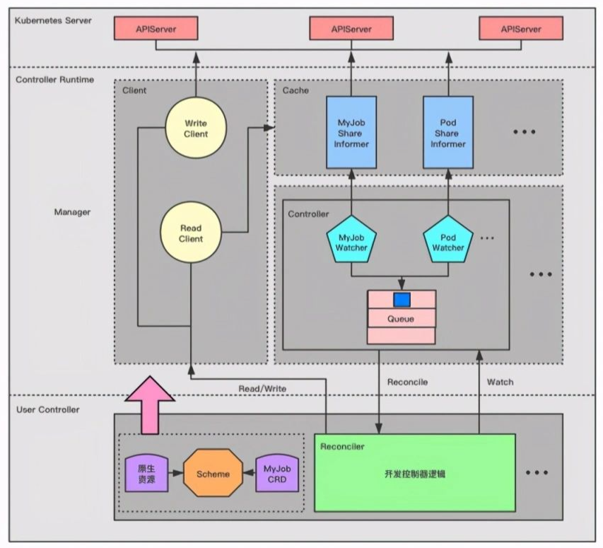

+ **GVK = Group + Version + Kind**：apps/v1/deployments

+ **GVR = Group + Version + Resource**：apps/v1/sample（例如某个 deployment 的 name 是 sample）

+ **Scheme**：存储 GVK 和 Go Type 的映射关系

+ **Manager**：Controller Runtime 抽象的最外层管理对象，负责管理内部的 Controller，Cache，Client 等对象。

+ **Cache**：负责管理 GVK 对应的 Share Informer

+ **Client**：Reconciler 对资源的创建/删除/更新操作都是通过该对象去操作

+ **Controller**：创建有带限速功能的 Queue，以及该 Controller 关注 GVK 的 Watcher，一个 Controller 可以关注很多 GVK

+ **Reconciler**：接收 Controller 发送给自己的 GVR 事件，然后从 Cache 中读取出 GVR 的当前状态，经过自己的控制逻辑，通过 Client 向 Kubernetes APIServer 更新 GVR 资源。**开发者只需要在 Reconciler 实现自己的控制逻辑** 。

  

#### kubebuiler

https://www.cnblogs.com/huiyichanmian/p/16288912.html


### CSI

https://kubernetes-csi.github.io/docs/introduction.html

https://github.com/container-storage-interface/spec/blob/master/spec.md#rpc-interface

https://mritd.com/2020/08/19/how-to-write-a-csi-driver-for-kubernetes/

#### Sidecar

+ [external-provisioner](https://kubernetes-csi.github.io/docs/external-provisioner.html)：watch pvc object，calls ControllerCreateVolume
+ [external-attacher](https://kubernetes-csi.github.io/docs/external-attacher.html)：watch VolumeAttachment object，call Controller[Publish|Unpublish]Volume
+ [external-snapshotter](https://kubernetes-csi.github.io/docs/external-snapshotter.html)：watch VolumeSnapshotContent object，call 
+ [external-resizer](https://kubernetes-csi.github.io/docs/external-resizer.html)：watch pvc object，calls ControllerExpandVolume
+ [node-driver-registrar](https://kubernetes-csi.github.io/docs/node-driver-registrar.html)：fetches driver information (using NodeGetInfo) from a CSI endpoint and registers it with the kubelet
+ [livenessprobe](https://kubernetes-csi.github.io/docs/livenessprobe.html)：monitors the health of the CSI driver and reports

CSI 插件开发是面向 Sidecar Containers 的 gRPC 开发。

Sidecar Containers 一般会和我们自己开发的 CSI 驱动程序在同一个 Pod 中启动。

Sidecar Containers Watch API 中 CSI 相关 Object 的变动，接着通过本地 unix 套接字调用我们编写的 CSI 驱动。


#### 处理流程

https://mp.weixin.qq.com/s/A9xWKMmrxPyOEiCs_sicYQ

https://mp.weixin.qq.com/s/jpopq16BOA_vrnLmejwEdQ

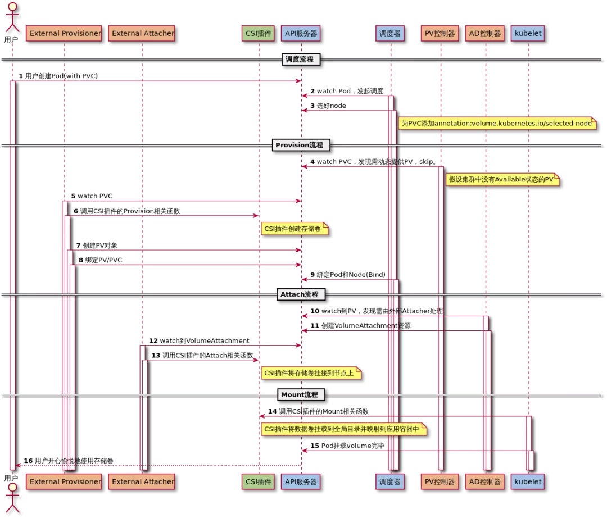

+ **Provisioning and Deleting：**实现与外部存储供应商协调卷的创建/删除处理，即 CreateVolume 和 DeleteVolume。如执行 rbd create / rbd rm 

+ **Attaching and Detaching：**实现在Attach阶段（在mount阶段之前）做准备工作，即 ControllerPublishVolume 和 ControllerUnpublishVolume。

+ **Mount and Umount：**实现将存储挂载到Pod容器或者从Pod解挂，即 NodeStageVolume、NodePublishVolume 等。

  如执行 rbd device map / rbd device unmap

  可以实现一个 PV 挂载在多个 pod 中使用

  NodeStageVolume 就是先 mount 到一个 globalmount 目录（/var/lib/kubelet/plugins/kubernetes.io/csi/pv/pvc-bcfe33ed-e822-4b0e-954a-0f5c0468525e/globalmount）
  
  NodePublishVolume 再通过 mount bind 到 pod 的目录（/var/lib/kubelet/pods/xxx/volumes/kubernetes.io-csi/pvc-bcfe33ed-e822-4b0e-954a-0f5c0468525e/mount/hello-world）


```
阶段1：Controller部分实现云盘扩容
这个阶段由csi-resizer实现完成，在controller中通过云盘api调用实现扩容。

下面逻辑决定是否扩容：
resizer watch pvc，判断pvc是否需要resize：
比较pvc现在和之前的值，当pvc值变大时；
比较pvc和volume的值，当pvc值大于pv值时；

扩容是通过resizeVolume函数实现的，过程：
对需要扩容的pvc，配置pvc状态为resizing；
调用csi-plugin中 ControllerExpandVolume函数，调用云盘api实现云盘扩容；
更新pv对象的size，size变成扩容后大小；
如果需要文件系统扩容，更新pvc状态为：FileSystemResizePending，等待node部分进行文件系统扩容；
```

```
阶段2：Node部分实现文件系统扩容
kubelet 一直watch pvc，执行逻辑如下：
云盘attach后，执行MountDevice；编辑pv为已挂载：MarkDeviceAsMounted；
然后调用resizeFileSystem函数（通过RequiresFSResize()方法判断是否进行文件系统扩容）
调用CSI的NodeExpand接口，进而调用CSI Plugin的NodeExpandVolume，实现文件系统扩容；
更新pvc的size大小，并更新pvc的FileSystemResizePending 状态；
```


#### gRPC Server

Sidecar Containers Watch API 中 CSI 相关 Object 的变动，接着通过本地 unix 套接字调用我们编写的 CSI gRPC Server

+ **Identity Server：**显示 CSI 插件所支持的能力信息
+ **Node Server：**Mount and Umount
+ **Controller Server：**Provisioning and Deleting、Attaching and Detaching


#### API 资源

K8s 为支持 CSI 标准，包含如下 API 对象：

1. CSINode：判断**外部 CSI 插件**是否注册成功。

   在 Node Driver Registrar 组件向 Kubelet 注册完毕后，Kubelet 会创建该资源，故不需要显式创建 CSINode 资源。

   ``` yaml
   apiVersion: storage.k8s.io/v1beta1
   kind: CSINode
   metadata:
     name: node-10.212.101.210
   spec:
     drivers:
     - name: yodaplugin.csi.alibabacloud.com
       nodeID: node-10.212.101.210
       topologyKeys:
       - kubernetes.io/hostname
     - name: pangu.csi.alibabacloud.com
       nodeID: a5441fd9013042ee8104a674e4a9666a
       topologyKeys:
       - topology.pangu.csi.alibabacloud.com/zone
   ```

- CSIDriver： 简化**外部 CSI 插件**的发现，由集群管理员创建，

  ``` yaml
  apiVersion: storage.k8s.io/v1beta1
  kind: CSIDriver
  metadata:
    name: pangu.csi.alibabacloud.com
  spec:
    # 插件是否支持卷挂接（VolumeAttach）
    attachRequired: true
    # Mount阶段是否CSI插件需要Pod信息
    podInfoOnMount: true
    # 指定CSI支持的卷模式
    volumeLifecycleModes:
    - Persistent
  ```

- VolumeAttachment：记录了存储卷的挂接/摘除信息以及节点信息

  ```yaml
  apiVersion: storage.k8s.io/v1
  kind: VolumeAttachment
  metadata:
    annotations:
      csi.alpha.kubernetes.io/node-id: 21481ae252a2457f9abcb86a3d02ba05
    finalizers:
    - external-attacher/pangu-csi-alibabacloud-com
    name: csi-0996e5e9459e1ccc1b3a7aba07df4ef7301c8e283d99eabc1b69626b119ce750
  spec:
    attacher: pangu.csi.alibabacloud.com
    nodeName: node-10.212.101.241
    source:
      persistentVolumeName: pangu-39aa24e7-8877-11eb-b02f-021234350de1
  status:
    attached: true
  ```


**日志级别**

``` shell
--v=0   Generally useful for this to ALWAYS be visible to an operator.
--v=1   A reasonable default log level if you don’t want verbosity.
--v=2   Useful steady state information about the service and important log messages that may correlate to significant changes in the system. This is the recommended default log level for most systems.
--v=3   Extended information about changes.
--v=4   Debug level verbosity.
--v=6   Display requested resources.
--v=7   Display HTTP request headers.
--v=8   Display HTTP request contents
```


### Extension API Server

https://blog.csdn.net/weixin_38299404/article/details/121038582

https://kubernetes.io/zh-cn/docs/tasks/extend-kubernetes/setup-extension-api-server/

http://www.asznl.com/post/42


### 网络

**如果让你来设计网络**

https://mp.weixin.qq.com/s/jiPMUk6zUdOY6eKxAjNDbQ

**电脑视角：**

- 首先我要知道我的 IP 以及对方的 IP
- 通过子网掩码判断我们是否在同一个子网
- 在同一个子网就通过 arp 获取对方 mac 地址直接扔出去
- 不在同一个子网就通过 arp 获取默认网关的 mac 地址直接扔出去

**交换机视角：**

- 我收到的数据包必须有目标 MAC 地址
- 通过 MAC 地址表查映射关系
- 查到了就按照映射关系从我的指定端口发出去
- 查不到就所有端口都发出去

**路由器视角：**

- 我收到的数据包必须有目标 IP 地址
- 通过路由表查映射关系
- 查到了就按照映射关系从我的指定端口发出去（不在任何一个子网范围，走其路由器的默认网关也是查到了）
- 查不到则返回一个路由不可达的数据包

**涉及到的三张表分别是**

- 交换机中有 **MAC 地址**表用于映射 MAC 地址和它的端口
- 路由器中有**路由表**用于映射 IP 地址(段)和它的端口
- 电脑和路由器中都有 **arp 缓存表**用于缓存 IP 和 MAC 地址的映射关系

**这三张表是怎么来的**

- MAC 地址表是通过以太网内各节点之间不断通过交换机通信，不断完善起来的。
- 路由表是各种路由算法 + 人工配置逐步完善起来的。
- arp 缓存表是不断通过 arp 协议的请求逐步完善起来的。


**VLAN**
https://cloud.tencent.com/developer/article/1412795


**VXLAN**
https://support.huawei.com/enterprise/zh/doc/EDOC1100087027
https://www.cnblogs.com/bakari/p/11131268.html


**tap/tun**

https://segmentfault.com/a/1190000009249039

**veth**
https://segmentfault.com/a/1190000009251098

**bridge**

https://segmentfault.com/a/1190000009491002   


**虚拟机**（tun/tap + bri）


**docker**（veth + bri）

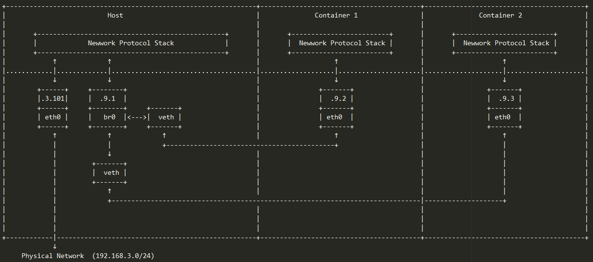


**docker**

Docker使用了Linux的Namespaces技术来进行资源隔离，如PID Namespace隔离进程，Mount Namespace隔离文件系统，Network Namespace隔离网络（包括网卡、路由、Iptable规则）等。

https://www.cnblogs.com/gispathfinder/p/5871043.html

+ **host模式**

  容器将不会获得一个独立的Network Namespace，而是和宿主机共用一个Network Namespace，使用宿主机的IP和端口

+ **container模式**

  新创建的容器和已经存在的一个容器共享一个Network Namespace

+ **none模式**

  容器拥有自己的Network Namespace，但是，并不为Docker容器进行任何网络配置，需要手动添加

+ **bridge模式**

  为每个容器分配Network Namespace、设置IP等，并将主机上的Docker容器共同连接到一个虚拟网桥上


**K8s**

Kubernetes引入的网络模型提出了下列基本要求。只要满足了这些要求，即可成为一个K8s网络方案供应商。

+ Pod都有自己单独的IP地址，Pod内部的所有容器共享Pod的IP地址，且可以相互自由通信
+ Node上的容器可以使用Pod的IP地址和其它Node上面的容器通信，且不需要通过NAT
+ 如果Pod使用宿主机网络环境，那么跨Node的容器间可以使用宿主机IP地址进行通信，且不需要通过NAT
+ Node上面的agent（比如system daemon, kubelet等）可以使用IP地址和位于该Node上面的所有容器通信，且不需要通过NAT
+ Pod之间容器通信所涉及到的隔离问题，通过 NetworkPolicy CR解决

要求说明了

+ 不能NAT意味着Pod自己看自己的IP和别人(宿主机上面的agent或者其它Pod)看到自己的IP是一样的，对，一眼看穿、看懂对方的那种。而与此对应的是，如有NAT在捣鬼的话，当企业内部的机器访问躲在Nginx后面的服务时，二者相互看不清对方的本来面目。
+ 容器之间IP互通，也就间接要求了宿主机之间是三层可达的。为什么呢？**如果宿主机环境是二层网络，那么天生就是可实现三层可达的，但如果二层不通的话，也需要实现三层可达，不然从一个Pod发出的数据不是被憋死在宿主机上面了吗？**

+ 二层可达表示同个局域网内，不可达则表示位于不同局域网；三层可达则可位于不同局域网，经过路由器到达


**K8s扁平网络模型：**

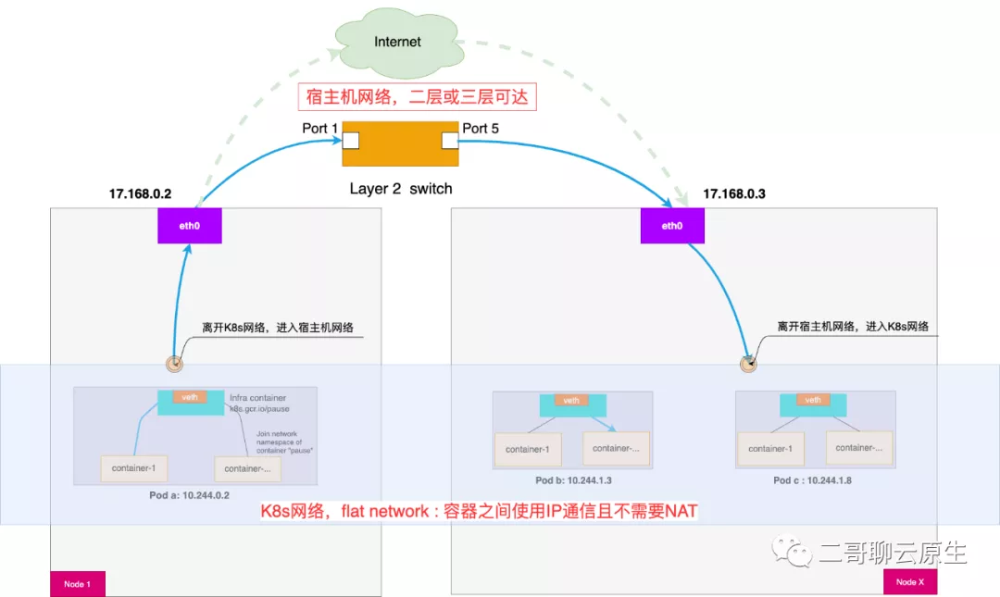


**CNI实现方案**

K8s内建了一个kubenet，它可以支持一些基本的网络连接。但更普遍的使用方式是用第三方的网络方案。只要它满足CNI(Container Network Interface) 规范就可以以插件的方式在K8s环境使用。

CNI插件的种类多种多样，关键的功能有两个：

+ IP管理插件，主要负责为Pod分配IP地址，并在Pod被销毁的时候回收IP

+ 网络插件，主要负责将Pod插入到K8s网络或从K8s网络删除


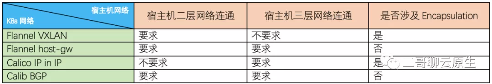


+ **离开k8s网络，进入宿主机网络阶段**

  + **Overlay networks 模式**

    作为一般规则，当K8s网络的traffic途径宿主机网络中路由规则**不可以被正常路由**的话（比如不同网段），就需要考虑封包（Encapsulation）。典型的封包方案有 Flannel VXLAN 和 Calico IP-in-IP两种。

  + **直接路由 Pod IP 模式**

    作为一般规则，如果K8s网络的traffic途径宿主机网络中路由规则**可以被正常路由**的话，就可以采用直接路由Pod IP方案，无需封包，性能损失小。Flannel host-gw 和 Calico BGP 使用了这种模式。

+ **离开宿主机网络阶段**

  + **要求宿主机二层连通的方案**

    作为一般规则，当K8s网络的traffic离开宿主机时，如果下一跳或者网关是**集群主机**的IP地址，也即dest MAC是集群主机的MAC地址时，就**需要**宿主机环境二层是能直接连通的。

  + **要求宿主机三层连通的方案**

    作为一般规则，当K8s网络的traffic离开宿主机时，如果下一跳或者网关**不是集群主机**的IP地址，就**不需要**二层连通，此时**只要三层IP可达**即可把以太帧路由到终点。


### 容器

https://ustack.io/2019-11-21-container%E7%9B%B8%E5%85%B3%E6%A6%82%E5%BF%B5%E6%A2%B3%E7%90%86.html

OCI（Open Container Initiative）：是由多家公司共同成立的项目，并由linux基金会进行管理，致力于 container runtime 的标准的制定和runc的开发等工作。所谓 container runtime，主要负责的是容器的生命周期的管理。

CRI（container runtime interface）：Kubernetes推出自己的运行时接口，隔离了各个容器引擎之间的差异，而通过统一的接口与各个容器引擎之间进行互动。

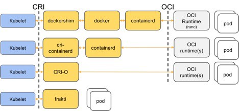


### 调度

过滤 + 打分

https://cloud.tencent.com/developer/article/1644857


### 源码

https://jiulongzaitian.gitbooks.io/kubernetes/content/yuan-ma-fen-xi/scheduler/kubeletzhu-yao-gong-neng.html


### MiniKube

https://www.jianshu.com/p/ef400bfea973


