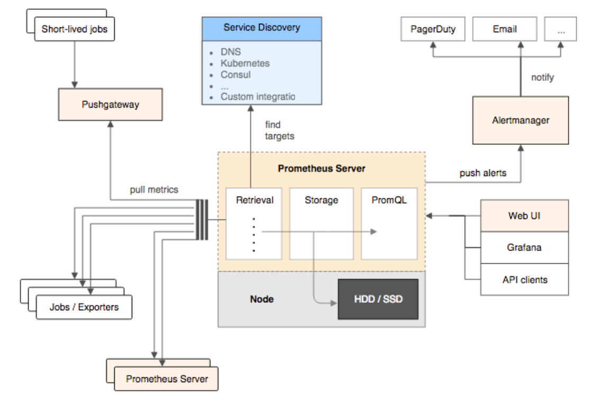
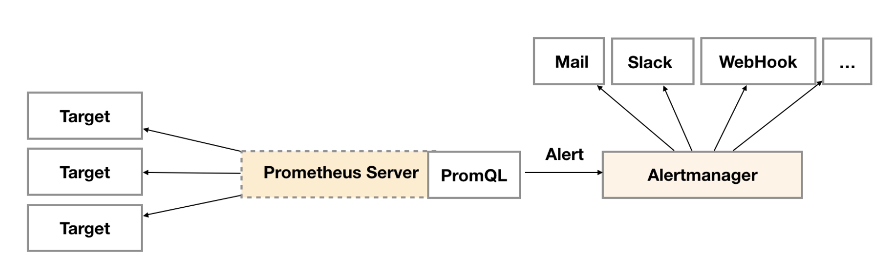
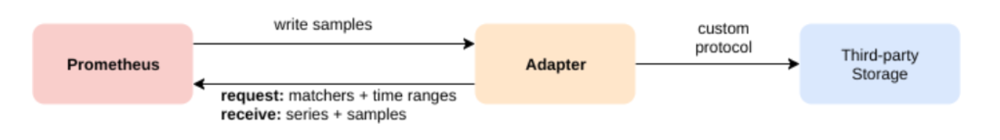
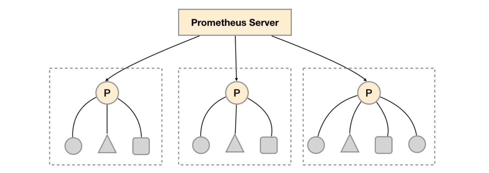
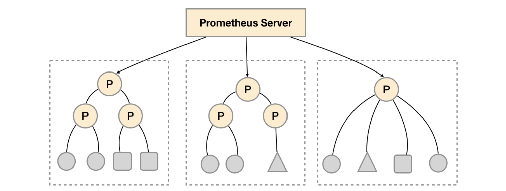

# Prometheus

> 作用：系统监控和告警的工具


### 核心组件



+ **Prometheus Server**

  > 实现监控数据的获取（调用Exporters HTTP接口）、存储（时序数据库）、查询（PromQL语言）

+ **Exporter**

  > 将采集监控数据的Endpoint端点，以HTTP接口形式提供给 Server（Pull模式）

+ **PushGateway**

  > 当网络隔离时，内部网络的Exporters可将数据主动推给Gateway（Push模式）进行中转，Server以相同的Pull模式向网关获取数据

+ **AlertManager**

  > Server定义PromQL告警规则产生告警信号，后续处理流程由告警系统AlertManager进行管理


### PromQL

+ **样本数据**

  > Promtheus 将采集到的 **样本数据** 以 **时间序列（time-series）** 方式保存在内存数据库中，定期持久化到硬盘。
  > 每条 time-series 通过 **指标名** 和 **标签值** 命名

  ```
    ^
    │     . . . . . . . . . . . . . . . . . . .   node_cpu{cpu="cpu0",mode="idle"}        
    │     . . . . . . . . . . . . . . . . . . .   node_cpu{cpu="cpu0",mode="system"}      
    │     . . . . . . . . . . . . . . . . . . .   node_load1{}
    │     . . . . . . . . . . . . . . . . . . .  
    v
      <------------------ 时间 ---------------->
  ```

  > 在 time-series 中每一个点称为一个 **样本**，由 **指标（名称和标签值）、时间戳、样本值** 组成

  ```
  <--------------- metric ---------------------><-timestamp -><-value->
  http_request_total{status="200", method="GET"}@1434417560938 => 94355
  http_request_total{status="404", method="GET"}@1434417560938 => 38473
  http_request_total{status="200", method="POST"}@1434417560938 => 4748
  ```


+ **Metrics 指标**

  ```
  <--- name ---><--------- labelset ----------->
  <metric name>{<label name>=<label value>, ...}
  ```

  > 标签可以用于对 **样本数据** 的过滤、聚合，名称满足 \[a-zA-Z_]\[a-zA-Z0-9\_\]*。**指标类型** 包括：

  + **Counter：** 只增不减的计数器
  + **Gauge：** 可增可减的仪表盘
  + **Histogram：**  区间统计直方图
  + **Summary：**  分位数计算，Summary在客户端，Histogram在服务端

  > 四个黄金指标：**请求时间、系统流量、错误请求、服务饱和度**


+ **Prome SQL 操作**

  + **条件查询**
  
    ```yaml
    http_requests_total{}  # 当前瞬时数据
    # 在标签的取值非唯一的情况下，没有匹配的话则返回所有不同标签纬度的时间序列，比如
    http_requests_total{code="200",handler="alerts",instance="localhost:9090",job="prometheus",method="get"}=(20889@1518096812.326)
    http_requests_total{code="200",handler="graph",instance="localhost:9090",job="prometheus",method="get"}=(21287@1518096812.326)
    ```
  
    ```yaml
    http_requests_total{instance="",job!=""} # 完全匹配
    http_requests_total{instance=~"a|b|c",job!~""} # 正则匹配
    http_request_total{}[1d] offset 1d # offset 1d limit 1d 
    ```
  
  + **聚合操作**
  
    > 如果标签的取值非唯一的情况下，通过 PromeQL 查询数据，会返回多条满足标签纬度的时间序列。可以进行聚合
  
    ```yaml
    # <聚合函数>([参数], <Metrics>) [without|by (<label>)]
    sum min max avg stddev（标准差）
    count count_values（对value计数）
    topk bottomk
    quantile（分位数）
    without 分组，计算结果中移除的标签
    by 分组，计算结果中保留的标签
    ```
  
    ```yaml
    # 查询系统所有http请求的总量
    sum(http_request_total)
    # 按照mode计算主机CPU的平均使用时间
    avg(node_cpu) by (mode)
    # 按照主机查询各个主机的CPU使用率
    sum(sum(irate(node_cpu{mode!='idle'}[5m]))  / sum(irate(node_cpu[5m]))) by (instance)
    ```
  
  + **操作运算符**
  
    ```yaml
    # 数学运算
    + - * / % ^ 
    # 布尔运算
    http_requests_total > 1000  # 0 or 1
    http_requests_total > bool 1000 # sample + 0/1
    ```
  
  + **内置函数**
  
    ```yaml
    # Counter 
    increase(node_cpu[2m]) / 120  # 时间窗口内的平均增长率
    rate(node_cpu[2m])  # 等效上面
    irate(node_cpu[2m]) # 瞬时增长率
    # Gauge
    predict_linear(node_filesystem_free{job="node"}[2h], 4 * 3600) # 预测4小时后的值
    # Histogram
    histogram_quantile(0.7, http_request_duration_seconds_bucket) # 统计分位数 φ=0.7
    ```
  


### API 接口

```
https://www.cnblogs.com/zhoujinyi/p/11955131.html
```

+ **clnt v1**

  + **query / query_range 查询指标值**

    ```shell
    $ curl 'http://localhost:9090/api/v1/query?query=label_replace(kube_node_labels{workspace="10002341",app="js-yangzhou-3-kube",label_kube_ovn_role='master'}, 'ip', '$1', 'node','(.*)')&time=1609316507
    ```

  + **v1: labels  查询标签名**

    ``` shell
    $ curl 'localhost:9090/api/v1/labels'
    ```

  + **v1: label/<label_name>/values 查询标签值**

    ``` shell
    $ curl 'http://localhost:9090/api/v1/label/job/values'
    ```

  + **v1: series 匹配器查询指标**

    ```shell
    $ curl 'http://localhost:9090/api/v1/series?match[]=up&match[]=process_start_time_seconds{job="prometheus"}'
    ```

+ **browser** 

  + **metrics / targets / rules / config**

  + **federate 匹配器查询指标**

    ```sh
    $ curl 'http://localhost:9090/federate?match[]=up&match[]=process_start_time_seconds{job="prometheus"}'
    ```


### Prome Server

```yaml
# /etc/prometheus/prometheus.yaml
# 全局配置
global:
  scrape_interval:     15s # 拉取数据时间间隔
  evaluation_interval: 15s # 扫描AlertRule时间间隔

# 配置 AlertRule 文件路径
rule_files:
  - "first_rules.yml"

# 配置 Alertmanager URL
alerting:
  alertmanagers:
  - static_configs:
    - targets: ['10.190.180.240:9093']
 
# 配置 Exporter 数据源
scrape_configs:
  - job_name: prometheus
    static_configs:
      - targets: ['10.190.180.240:9090']
        labels:
          instance: 'prometheus'
  - job_name: linux
    static_configs:
      - targets: ['10.190.180.240:9100']
        labels:
          instance: 'linux'
```


### Exporter

> 提供 HTTP 接口，Prometheus Server **定期** 发起请求，获取监控样本数据，其实例又称 Target


+ **接口数据规范**

  > Exporter 返回的样本数据规范：说明 HELP + 类型 TYPE + 样本 SAMPLE
  > Prometheus 对其逐行解析

  ```yaml
  # HELP <metrics_name> <doc_string>
  # TYPE <metrics_name> <metrics_type>
  <metric name>{<label name>=<label value>, ...} value [timestamp 缺省时默认当前时间]
  ```

  ```yaml
  # HELP node_cpu Seconds the cpus spent in each mode.
  # TYPE node_cpu counter
  node_cpu{cpu="cpu0",mode="idle"} 362812.7890625 
  ```

+ **Instances / Jobs**

  > prometheus.yaml 配置文件可通过 **scrape_configs** 配置采集的 exporter 

  > 不同的监控指标（主机/MySQL/Nginx）由不同的 **exporter** **进程** 采集，并在 promtheus 配置 exporter 访问地址

  > 每一个 exporter 称之为一个 **instance（实例）**
  >
  > 一组用于相同采集目的的实例，或同一个采集进程的多个副本，则称之为一个 **job（任务）**
>
  > 或者说： 任意一个独立的数据源（target）称之为实例（instance）。包含相同类型实例的集合称之作业（job）

  **job**：node

+ **instance** 1：1.2.3.4:9100
  
+ **instance** 2：5.6.7.8:9100

  ```yaml
  scrape_configs:
    - job_name: linux
      static_configs:
        - targets: ['10.190.180.240:9090','10.190.180.240:9091'] 
        			 # 两个exporter进程均采集本机10.190.180.240.linux指标
          labels:
              instance: '10.190.180.240.linux'
        - targets: ['10.190.180.241:9090','10.190.180.241:9091']  
                   # 两个exporter进程均采集本机10.190.180.241.linux指标
          labels:
              instance: '10.190.180.241.linux'
  
  up{job="<job-name>", instance="<instance-id>"}: 如果实例运行状况良好（即可达）为1，或者如果抓取失败则为0
  ```

  > 如果在抓取的数据中已经存在这些标签中的任何一个，则行为取决于honor_labels配置选项


### Alertmanager

> Prometheus Server 周期性根据 PromQL 定义的 AlertRule 告警规则进行计算，将满足触发条件的告警信息发送给 Alertmanager 进行后续处理。
> Alertmanager 除了提供基本的告警功能以外，还提供了分组聚合、抑制重复、静默处理等功能



+ **AlertRule**

  ```yaml
  # /etc/prometheus/rules/rule-example.yaml 
  groups:
  - name: example  # 组名
    rules:
    - alert: HighErrorRate  # 警告名
      expr: job:request_latency_seconds:mean5m{job="myjob"} > 0.5  # PromQL触发表达式 上下文取值$value
      for: 10m  # 触发持续10m才告警
      labels:
        severity: page   # 告警附加标签  上下文取值 $labels.<labelname>
      annotations:
        summary: High request latency on {{ $labels.instance }}   # 描述告警的概要信息
        description: current value: {{ $value }}  # 描述告警的详细信息
  ```
  
  ``` yaml
  # /etc/prometheus/prometheus.yaml
  rule_files:
    [ - <filepath_glob> ... ] # 规则文件路径
  global:
    [ evaluation_interval: <duration> | default = 1m ] # 扫描间隔
  alerting:
    alertmanager:
      - static_configs:
          - targets:     
              - # alertmanager 服务
  ```

+ **Alertmanager**

  ```yaml
  # /etc/alertmanager/alertmanager.yaml 
  global:    # 全局配置
    [ resolve_timeout: <duration> | default = 5m ]
    [ smtp_from: <tmpl_string> ] 
    [ smtp_smarthost: <string> ] 
    [ smtp_auth_username: <string> ]
    [ smtp_auth_password: <secret> ]
    [ smtp_require_tls: <bool> | default = true ]
    ...
  
  templates:   # 模板配置 html email
    [ - <filepath> ... ]
  
  route: <route>  # 告警路由，分配处理方式
  
  receivers:   # 接收人，配合告警路由使用，wechat email webhook..
    - <receiver> ...
  
  inhibit_rules:  # 抑制重复规则
    [ - <inhibit_rule> ... ]
  ```
  


### 高可靠（持久化）

+ **本地存储**

  > 每两个小时为一个时间窗口，将时间窗口内数据存储在同一个块（block）中，包括样本数据（chunks）、索引数据（index）、元数据（meta.json 描述）
  >
  > 同时，为提高读取效率，当前窗口收集数据时是直接放在内存中；同时为保证 craft-safe 和 IO 效率，采用日志 WAL 进行重播。
  >
  > 有效期：storage.tsdb.retention(how long to retain samples in the storage)=15day[dft]

+ **远程存储**

  > 解决本地存储无法持久化大量历史数据，Prometheus提供两个标准接口**（remote_write/remote_read）**让用户实现 **Adaptor**，将数据保存到第三方存储中

  

  

### 高性能（联邦）

+ **联邦集群**

  > 联邦集群架构如下：在 **每个** 数据中心搭建各自的 Prometheus Server，用于**采集各自**数据中心监控数据；同时，由一个**中心**  Promtheus Server 负责 **聚合** 多个数据中心的监控数据。

  

  

  > 联邦集群核心在于：每个Prometheus Server都包含一个用于获取当前实例中监控样本的 **接口/federate**。
  >
  > 对于中心Prometheus Server而言，无论是从其他的Prometheus实例还是Exporter实例中获取数据实际上 **并没有任何差异**。

  + **主节点配置**

  ```yaml
  https://blog.csdn.net/vonhehe/article/details/102240698
  scrape_configs:
    - job_name: 'node_workers'
      honor_labels: true           # true：当采集到的监控 指标（指标名+标签值）冲突时，忽略冲突的监控数据
      							 # false：发生冲突时，将冲突的 标签名 替换为 ”exported_“ 的形式
      metrics_path: '/federate'    # 联邦集群用于获取监控样本参数配置 /federate
      params:
        'match[]':                 # 将想要从节点上获取的信息的标签写入主节点，否则无法获取
          - '{job="zookeeper"}'    # iterate targets --> target/federate?...[all_macth] 写入主节点
          - '{job="hbase"}'
          - '{job="hdfs"}'
          - '{job="hive"}'
          - '{job="kafka"}'
          - '{job="linux_server"}'
          - '{job="spark
          - '{job="yarn"}'
          - '{__name__=~"instance.*"}'
      static_configs:               # 填写从节点地址池
        - targets:
          - '192.168.1.1:9090'
          - '192.168.1.2:9090'
  ```

  ```
  # /federate 与 /metrics 返回结果都是指标定义
      # HELP <metrics_name> <doc_string>
    # TYPE <metrics_name> <metrics_type>
      <metric name>{<label name>=<label value>, ...} value [timestamp 缺省时默认当前时间]
  
  # 调用主节点 /federate 接口，并过滤出想要的指标（是配置文件中的match[]（汇总多个子节点的指标）的子集）
  "http://192.168.1.3:9090/federate?match[]={job="zookeeper"}&match[]={job="hbase"}&match[]={__name__=~"instance.*"}&match[]=...
  
  # 调用子节点 /federate 接口，获取的是该子节点的指标的子集
  ```
  
  + **从节点配置**
  
  ```yaml
  scrape_configs:
    - job_name: 'prometheus'
      static_configs:
      - targets: ['127.0.0.1:9090']
    - job_name: 'linux_server'
    file_sd_configs:
       - files:
         - configs/linux.json
    - job_name: 'hdfs'
    - job_name: 'hbase'
    - job_name: 'yarn'
  ```
  
  

### 服务发现

+ **基于文件**

  > Prometheus 能够定时从 prometheus.yml 配置文件中读取最新 Target 信息

+ **基于注册中心 eg Consul**

  ```yaml
  # consul 可通过 服务定义文件 或 HTTP方式 接收服务的注册
  # node_export 以服务定义文件方式注册到 consul
  {
      "service": {
          "name": "node_exporter",
          "tags": [	
              "exporter"
          ],
          "port": 9100
      }
  }
  ```

  ```yaml
  # prometheus 集成（订阅） consul
  # prometheus.yaml
  - job_name: node_exporter
      metrics_path: /metrics
      scheme: http
      consul_sd_configs:
        - server: consul_ip:port
          services:
            - node_exporter
  ```

  