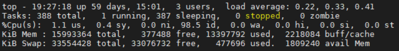
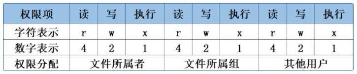
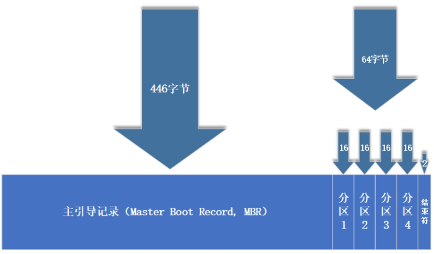
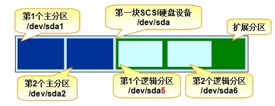
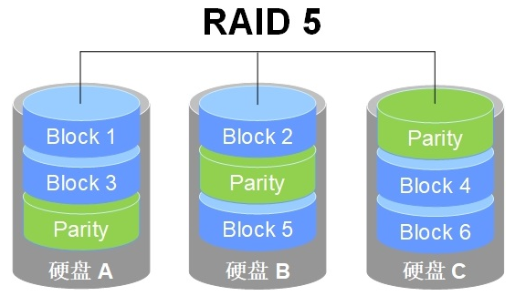
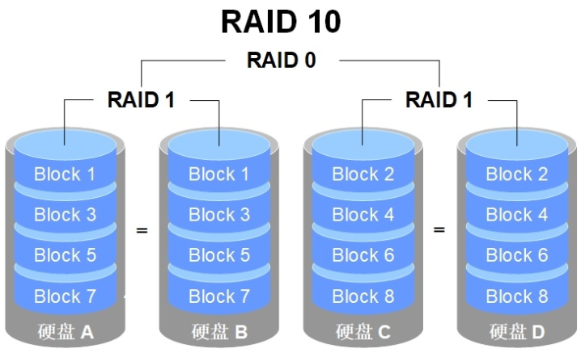

##### 硬件信息

```shell
# 总核数 = 物理CPU个数 X 每个物理CPU的核数 
# 总逻辑CPU数 = 物理CPU个数 x 每个物理CPU的核数 x 超线程数

# 查看物理CPU个数
cat /proc/cpuinfo| grep "physical id"| sort| uniq| wc -l

# 查看每个物理CPU中core的个数(即核数)
cat /proc/cpuinfo| grep "cpu cores"| uniq
# 使用超线程后的CPU中core的个数
cat /proc/cpuinfo | grep "siblings" | uniq 

# 查看总逻辑CPU的个数
cat /proc/cpuinfo| grep "processor"| wc -l

# 查看CPU信息（型号）
cat /proc/cpuinfo | grep name | cut -f2 -d: | uniq -c

# 查看内存信息
cat /proc/meminfo

# 网卡绑定模式 
# https://blog.csdn.net/wangzongyu/article/details/127097986
cat /proc/net/bonding/Bond0 | grep -i bond

# 如何查看操作系统
cat /etc/redhat-release
cat /etc/os-release
lsb_release -a
cat  /etc/issue

# 查看内核版本
uname -a
cat /proc/version

# 检查内核是否包含ocfs2模块
ls /lib/modules/3.10.0-1062.18.1.el7.x86_64/kernel/fs/ocfs2
# 设置启动默认内核
cat /boot/grub2/grub.cfg | grep menuentry
grub2-set-default 'CentOS Linux (3.10.0-1062.18.1.el7.x86_64) 7 (Core)'

# 查看机器型号（机器硬件型号）
dmidecode | grep "Product Name"
 
# 如何查看linux系统和CPU型号，类型和大小
cat /proc/cpuinfo

# 如何查看linux 系统内存大小的信息，可以查看总内存，剩余内存，可使用内存等信息  
cat /proc/meminfo
do
# 查看是否HDD  rota=1 旋转=HDD
lsblk -o name,rota
grep ^ /sys/block/*/queue/rotational

# 查看带外地址 
# https://blog.csdn.net/qq_38120778/article/details/126097810
ipmitool lan print | grep 'IP Address'
```


##### 系统状态

+ **echo**：echo [字符串] [$变量]

  ``` shell
  echo "hello world"
  echo $SHELL  ->  /bin/bash
  ```

+ **wget**：

  | 参数 | 作用                                 |
  | ---- | ------------------------------------ |
  | -b   | 后台下载模式                         |
  | -P   | 下载到指定目录                       |
  | -t   | 最大尝试次数                         |
  | -c   | 断点续传                             |
  | -p   | 下载页面内所有资源，包括图片、视频等 |
  | -r   | 递归下载                             |

+ **ps**

  **pstree**

  | 参数 | 作用                                                    |
  | ---- | ------------------------------------------------------- |
  | -a   | 显示所有进程（包括其他用户的进程）                      |
  | -u   | 用户以及其他详细信息                                    |
  | -x   | 显示没有控制终端的进程zQ                                |
  | -e   | 此选项的效果和指定"-A"选项相同，显示所有程序。          |
  | -f   | 显示UID,PPIP,C与STIME栏位                               |
  | -L   | 显示线程及线程个数显示出来（LWP: light weight process） |

  ```
  ps -axu
  ps -ef
  ps aux -L
  ps -efL
  ```

  > **R（运行）：**进程正在运行或在运行队列中等待。
  >
  > **S（中断）：**进程处于休眠中，当某个条件形成后或者接收到信号时，则脱离该状态。
  >
  > **D（不可中断）：**进程不响应系统异步信号，即便用kill命令也不能将其中断。
  >
  > **Z（僵死）：**进程已经终止，但进程描述符依然存在, 直到父进程调用wait4()系统函数后将进程释放。
  >
  > **T（停止）：**进程收到停止信号后停止运行。
  >
  > 高优先级（<）
  >
  > 低优先级（N）
  >
  > 被锁进内存（L - has pages locked into memory）
  >
  > 包含子进程（s - is a session leader）
  >
  > 多线程（l - is multi-threaded）
  >
  > 位于前台的进程组  (+)

+ **top**

  

  > 第1行：系统时间、运行时间、登录终端数、系统负载（三个数值分别为1分钟、5分钟、15分钟内的平均值，数值越小意味着负载越低）。
  >
  > 第2行：进程总数、运行中的进程数、睡眠中的进程数、停止的进程数、僵死的进程数。
  >
  > 第3行：用户占用资源百分比、系统内核占用资源百分比、改变过优先级的进程资源百分比、空闲的资源百分比等。其中数据均为CPU数据并以百分比格式显示，例如“99.9 id”意味着有99.9%的CPU处理器资源处于空闲。
  >
  > 第4行：物理内存总量、内存空闲量、内存使用量、作为内核缓存的内存量。
  >
  > 第5行：虚拟内存总量、虚拟内存空闲量、虚拟内存使用量、已被提前加载的内存量。

  ``` shell
  https://www.coonote.com/linux-note/linux-cpu-utilization-2.html
  https://www.pianshen.com/article/1554466913/
  top 1
  ```

  

+ **htop**：一个互动的进程查看器，可以动态观察系统进程状况

+ **nice**：用于调整进程的优先级。nice 优先级数字 服务名称

  ``` shell
  nice -n -20 bash
  ```

+ **pidof**：用于查询某个指定服务进程的PID号码值

  ``` shell
  pidof sshd
  ```

+ **strace**：跟踪系统调用和信号

  ```shell
  strace -p pid
  ```

+ **ulimit**：用于限制 shell 启动进程所占用的资源

  ```shell
  # https://cloud.tencent.com/developer/article/1656809
  
  # /etc/security/limits.conf
  
  # ulimit只在当前的 session 有效
  # limits.conf中可以根据用户和限制项使用户在下次登录中生效
  
  # 文件句柄被限制的话，进程运行会变慢（比如: K8S创建虚机变慢，CSI挂载磁盘变慢）
  ```

+ **dmesg**：用于检查和控制内核的环形缓冲区

+ **kill**：用于终止某个指定PID值的服务进程。kill [参数] 进程的PID

  **killall**：用于终止某个指定名称的服务所对应的全部进程。killall [参数] 服务名称

  **pkill**：用于终止某个指定名称的服务所对应的全部进程

  ``` shell
  # Linux 踢出多余TTY连接终端（解决连接被占用，没法连接问题）
  # who
  root tty1
  root ttyS0
  # pkill -kill -t ttyS0
  ```

+ **ifconfig**：用于获取网卡配置与网络状态等信息

  ``` shell
  # 主要看：网卡名称、inet参数的IP地址、ether参数的MAC地址、RX、TX流量统计
  ens160: flags=4163<UP,BROADCAST,RUNNING,MULTICAST>  mtu 1500
          inet 192.168.10.10  netmask 255.255.255.0  broadcast 192.168.10.255
          inet6 fe80::c8f8:f5c5:8251:aeaa  prefixlen 64  scopeid 0x20
          ether 00:0c:29:7d:27:bf  txqueuelen 1000  (Ethernet)
          RX packets 304  bytes 33283 (32.5 KiB)
          RX errors 0  dropped 0  overruns 0  frame 0
          TX packets 91  bytes 11052 (10.7 KiB)
          TX errors 0  dropped 0 overruns 0  carrier 0  collisions 0
  ```

+ **iftop**：用来监控网卡的实时流量（可以指定网段）、反向解析IP、显示端口信息等

+ **free**：显示当前系统中内存的使用量信息  free -h

  |       | 内存总量 | 已用量 | 空闲量 | 进程共享的内存量 | 磁盘缓存的内存量 | 缓存的内存量 | 可用量    |
  | ----- | -------- | ------ | ------ | ---------------- | ---------------- | ------------ | --------- |
  |       | total    | used   | free   | shared           | buffers          | buff/cache   | available |
  | Mem:  | 1.9Gi    | 1.4Gi  | 99Mi   | 20Mi             | 450Mi            | 348Mi        |           |
  | Swap: | 2.0Gi    | 80Mi   | 1.9Gi  |                  |                  |              |           |

+ **who**：用于查看当前登入主机的用户终端信息

  **last**：用于调取主机的被访记录

+ **ping**

  **tracepath**：用于显示数据包达到目的主机途中所经过的路由信息

  **nc**：扫描端口

  ```shell
  -u 使用UDP传输协议。
  -v 显示指令执行过程。
  -w<超时秒数> 设置等待连线的时间。
  -z 使用0输入/输出模式，只在扫描通信端口时使用。
  [root@localhost ~]# nc -v -z -w2 192.168.0.3 1-100 
  192.168.0.3: inverse host lookup failed: Unknown host
  (UNKNOWN) [192.168.0.3] 80 (http) open
  (UNKNOWN) [192.168.0.3] 23 (telnet) open
  (UNKNOWN) [192.168.0.3] 22 (ssh) open
  [root@localhost ~]# nc -u -z -w2 192.168.0.1 1-1000  # 扫描192.168.0.3 的端口 范围是 1-1000
  [root@localhost ~]# nc -vz acme-v02.api.letsencrypt.org 443 -w2
  Ncat: Version 7.50 ( https://nmap.org/ncat )
  Ncat: Connected to 23.77.214.183:443.
  Ncat: 0 bytes sent, 0 bytes received in 0.07 seconds.
  ```

+ **netstat**：netstat -antupl

  | 参数 | 说明                     |
  | ---- | ------------------------ |
  | -a   | 显示所有连接中的Socket   |
  | -p   | 显示正在使用的进程信息   |
  | -t   | 显示TCP协议的连接状态    |
  | -u   | 显示UDP协议的连接状态    |
  | -n   | 使用IP地址，不使用域名   |
  | -l   | 仅列出正在监听的服务状态 |
  | -i   | 现在网卡列表信息         |
  | -r   | 显示路由表信息           |

+ **telnet**：telnet ip port

+ **crontab**：定时任务

  | 参数 | 说明                   |
  | ---- | ---------------------- |
  | -u   | 表示操作哪个用户       |
  | -l   | 显示工作表内的定时任务 |
  | -e   | 编辑工作表             |
  
+ **sysctl**

  ``` shell
  sysctl -a
  # 持久修改
  vi /etc/sysctl.conf
  /sbin/sysctl -p
  # 临时修改
  /sbin/sysctl -w net.ipv4.route.flush=1
  ```

+ **systemctl** 

  **rc.local**

  ``` shell 
  source: /usr/lib/systemd/system/
  enable: /etc/systemd/system/multi-user.target.wants/
  
  systemd vs rc.local
  https://blog.csdn.net/haveqing/article/details/130343394
  https://blog.csdn.net/soonfly/article/details/72876001
  ```

  

##### 文件操作

+ **vim**

  ```
  i (insert) 	编辑模式
  esc 		正常模式
  
  : 			命令行模式
  :q			仅退出
  :q!			不保存退出
  :wq			保存退出
  
  i			插前
  a (append)	附后
  hj(joke)k(king)l	左下上右
  o (open new line)   新增下一行
  O					新增上一行
  G			到最后一行
  gg			到第一行
  yy (yank)   复制当前行
  dd (delete) 删除当前行
  .			重复前次操作
  u (undo)	撤销前次操作
  ctrl+r		恢复前次操作
  w (word)			下个单词首部
  b (back)			上个单词首部
  e (end)				下个单词尾部
  dw (delete word)	删除单词
  cw (change word)	改变单词
  yw (yank word)		复制单词
  p (paste)			粘贴 (3P粘贴3次)
  ci{ (change in)		删除{}内容 ([]{}()同理)
  
  /keyword	搜索
  n			下一个
  N			上一个
  :%s/old/new/g		全局替换
  
  ctrl+v		可视化块
  			按下箭头，选择多行
  shift+i		插入模式
  			输入内容
  esc			两次
  ```

  

+ **pwd**

+ **cd**

+ **ls**：ls -al

  **tree**：用于以树状图的形式列出目录内容及结构

+ **find**：用于按照指定条件来查找文件所对应的位置。find [查找范围] 寻找条件  eg：find / -name "hello"

  | 参数               | 作用                                                         |
  | ------------------ | ------------------------------------------------------------ |
  | -name              | 匹配名称                                                     |
  | -perm              | 匹配权限（mode为完全匹配，-mode为包含即可）                  |
  | -user              | 匹配所有者                                                   |
  | -group             | 匹配所有组                                                   |
  | -mtime -n +n       | 匹配修改内容的时间（-n指n天以内，+n指n天以前）               |
  | -atime -n +n       | 匹配访问文件的时间（-n指n天以内，+n指n天以前）               |
  | -ctime -n +n       | 匹配修改文件权限的时间（-n指n天以内，+n指n天以前）           |
  | -nouser            | 匹配无所有者的文件                                           |
  | -nogroup           | 匹配无所有组的文件                                           |
  | -newer f1 !f2      | 匹配比文件f1新但比f2旧的文件                                 |
  | --type b/d/c/p/l/f | 匹配文件类型（后面的字幕字母依次表示块设备、目录、字符设备、管道、链接文件、文本文件） |
  | -size              | 匹配文件的大小（+50KB为查找超过50KB的文件，而-50KB为查找小于50KB的文件） |
  | -prune             | 忽略某个目录                                                 |
  
+ **cat**

  **more**：space / enter 向下翻页

  **head**：head -n 10 log

  **tail**：tail -n 10 log

+ **wc**：用于统计指定字符串的行数、字数或字节数

  | 参数 | 作用         |
  | ---- | ------------ |
  | -l   | 只显示行数   |
  | -w   | 只显示单词数 |
  | -c   | 只显示字节数 |

+ **cut**：用于按列提取字符串内容   cut -d : -f 1 /etc/passwd

  | 参数 | 作用                   |
  | ---- | ---------------------- |
  | -f   | 设置需要提取的列的下标 |
  | -d   | 设置间隔符号           |

+ **grep**：输出符合查询条件的行   grep  "warn"  a.log 

  | 参数 | 作用                               |
  | ---- | ---------------------------------- |
  | -n   | 显示行号                           |
  | -v   | 反向选择——仅列出没有“关键词”的行。 |

+ **awk**：读取文件的每一行，输出里面的字段

  ``` shell
  # 原理
  awk 'BEGIN{ commands } pattern{ commands } END{ commands }'
  # 示例
  echo -e "A line 1\nA line 2" | awk 'BEGIN{ print "Start" } { print } END{ print "End" }'
  Start
  A line 1
  A line 2
  End
  # 示例：统计存储资源之和
  kubectl get pv -A | grep storage-mixed | awk '{print $2}' | grep Ti | awk '{info=$1;gsub(/Ti/,"",info);print info}' | awk '{sum += $1} END{print sum}'
  ```

  + **BEGIN语句块** 在awk开始从输入流中读取行 **之前** 被执行，这是一个可选的语句块，比如变量初始化、打印输出表格的表头等语句通常可以写在BEGIN语句块中。

  + **END语句块** 在awk从输入流中读取完所有的行 **之后** 即被执行，比如打印所有行的分析结果这类信息汇总都是在END语句块中完成，它也是一个可选语句块。

  + **pattern语句块** 中的通用命令是最重要的部分，它也是可选的。如果没有提供pattern语句块，则默认执行`{ print }`，即打印每一个读取到的行，awk读取的每一行都会执行该语句块。

    ```shell
    # 格式
    $ awk 动作 文件名
    # 示例
    $ awk '{print $0}' demo.txt
    ```

  + 分隔符 -F（默认空格）

    ``` shell
    $ awk -F ':' '{ print $1 }' demo.txt
    # $O 代表输入行，$1、$2、$3 代表第一个字段、第二个字段、第三个字段
    ```

  + 变量 $N

    ``` shell
    # $NF 代表最后一个字段
    $ echo 'this is a test' | awk '{print $NF}'
    test
    # NR 代表当前处理的是第几行
    $ awk -F ':' '{print NR ") " $1}' demo.txt
    1) root
    2) daemon
    ```

  + 条件：只输出符合条件的行

    ``` shell
    # 格式
    $ awk '条件 动作' 文件名
    # 示例
    $ awk -F ':' '/usr/ {print $1}' demo.txt   # /regx/ 正则
    $ awk -F ':' 'NR % 2 == 1 {print $1}' demo.txt
    $ awk -F ':' '{if ($1 > "m") print $1}' demo.txt
    ```

+ **sed**： 查找模式匹配的行，执行后面的字符串操作

  ``` shell
  # p : 显示
  # -n  仅显示script处理后的结果
  $ cat /etc/passwd | sed '5,7p' -n 
  $ cat /etc/passwd | sed '/root/p' -n  # 搜索并打印
  # s : 替换 
  $ echo "hello world" | sed 's/world/timi/gi' # 搜索并替换 sed 's/要被取代的字串/新的字串/gi' g全局 i忽略大小写
  $ sed -i 's/100.94.88.60/192.168.211.204/gi' /etc/containers/registries.conf # -i 在原始文件中替换
  # d : 删除
  $ cat /etc/passwd | sed '2d' 
  $ cat /etc/passwd | sed '/root/d' # 搜索并删除
  # i : 新增
  $ sed '$n i echo "--"' /etc/passwd
  ```

+ **touch**

  **mkdir**

  **cp**

  **mv**

  **rm**

+ **find -inum xxxx -delete**：删除乱码文件

+ **dd**：用于按照指定大小的数据块个数来复制文件或转换文件

  | 参数  | 作用                 |
  | ----- | -------------------- |
  | if    | 输入的文件名称       |
  | of    | 输出的文件名称       |
  | bs    | 设置每个“块”的大小   |
  | count | 设置要复制“块”的个数 |

  ``` shell
  # 虚拟设备：不会占用系统存储空间
  # /dev/null：黑洞，输入到这个设备的数据都将被直接丢弃
  # /dev/zero：可以输出无穷无尽的数据
  # /dev/random、/dev/urandom：提供随机字节流
  dd if=/dev/zero of=target count=1 bs=1G
  ```

  ```shell
  printf "Test awesome shareable disks" | sudo dd of=/dev/vdc bs=1 count=150 conv=notrunc
  sudo dd if=/dev/vdc bs=1 count=150 conv=notrunc
  ```

  ``` shell
  # conv=fsync, oflag=sync/dsync 区别
  https://blog.csdn.net/boyemachao/article/details/107858734
  ```

  

+ **tar**

  ```shell
  tar -czvf a.tar.gz ./dir
  tar -xzvf a.tar.gz -C ./
  ```

  | 参数 | 作用                   |
  | ---- | ---------------------- |
  | -c   | 创建压缩文件           |
  | -x   | 解开压缩文件           |
  | -t   | 查看压缩包内有哪些文件 |
  | -z   | 用Gzip压缩或解压       |
  | -j   | 用bzip2压缩或解压      |
  | -v   | 显示压缩或解压的过程   |
  | -f   | 目标文件名             |
  | -p   | 保留原始的权限与属性   |
  | -P   | 使用绝对路径来压缩     |
  | -C   | 指定解压到的目录       |

+ **ln**：用于创建文件的软硬链接

  ``` shell
  ln old.txt new.txt
  -rw-r--r-- 2 root root 26 Jan 11 00:13 old.txt
  # 文件属性第二列的数字是文件inode链接数，创建硬链接则加一
  ```

  | 参数 | 作用                                               |
  | ---- | -------------------------------------------------- |
  | -s   | 创建“符号链接”（如果不带-s参数，则默认创建硬链接） |
  | -f   | 强制创建文件或目录的链接                           |
  | -i   | 覆盖前先询问                                       |
  | -v   | 显示创建链接的过程                                 |


##### 输入输出

> 标准输入重定向（STDIN，文件描述符为0，&0）：默认从键盘输入，也可从其他文件或命令中输入。
>
> 标准输出重定向（STDOUT，文件描述符为1，&1）：默认输出到屏幕。
>
> 错误输出重定向（STDERR，文件描述符为2，&2）：默认输出到屏幕。

+ 输入重定向（to memery）

  | 符号                   | 作用                                         |
  | ---------------------- | -------------------------------------------- |
  | 命令 < 文件            | 将文件作为命令的标准输入                     |
  | 命令 << 分界符 eg: EOF | 从标准输入中读入，直到遇见分界符才停止       |
  | 命令 < 文件1 > 文件2   | 将文件1作为命令的标准输入并将标准输出到文件2 |

  ``` shell
  cat << EOF > demo.txt
  Hello World
  EOF
  ```

+ 输出重定向（to outside）

  | 符号          | 作用                                                         |
  | ------------- | ------------------------------------------------------------ |
  | 命令 > 文件   | 将标准输出重定向到一个文件中（清空原有文件的数据）           |
  | 命令 2> 文件  | 将错误输出重定向到一个文件中（清空原有文件的数据）           |
  | 命令 >> 文件  | 将标准输出重定向到一个文件中（追加到原有内容的后面）         |
  | 命令 2>> 文件 | 将错误输出重定向到一个文件中（追加到原有内容的后面）         |
  | 命令 &>> 文件 | 将标准输出与错误输出共同写入到文件中（追加到原有内容的后面） |
  | 2>&1          | &1 指的是文件描述符1，即将标准错误（2）输出到到标准输出（&1） |
  
+ **rz**：上传文件

  ``` shell
  -b 以二进制方式，默认为文本方式
  -e 对所有控制字符转义
  ```

+ **sz**


##### 管道符

**|：**把前一个命令原本要输出到屏幕的信息当作是后一个命令的标准输入

**| xargs：**若管道后方的命令不接受标准输入作为参数，只接收命令行参数，则使用 xargs 进行转换

``` shell
# xargs 占位符 {}
ls | xargs -t -I{} echo {}
# -t ： 打印内容，去掉\n之后的字符串
# -I :  后面定义占位符，上例子是{}  ，后面命令行中可以多次使用占位符
```


##### 环境变量

+ echo $变量名

  env：查看当前用户所有的环境变量

  | 变量名称     | 作用                             |
  | ------------ | -------------------------------- |
  | HOME         | 用户的主目录（即家目录）         |
  | SHELL        | 用户在使用的Shell解释器名称      |
  | HISTSIZE     | 输出的历史命令记录条数           |
  | HISTFILESIZE | 保存的历史命令记录条数           |
  | MAIL         | 邮件保存路径                     |
  | LANG         | 系统语言、语系名称               |
  | RANDOM       | 生成一个随机数字                 |
  | PS1          | Bash解释器的提示符               |
  | PATH         | 定义解释器搜索用户执行命令的路径 |
  | EDITOR       | 用户默认的文本编辑器             |

  **设置环境变量**

  1. ``` shell
     $ VAR=VALUE # 不可空格
     $ echo $VAR
     $ export VAR # 提升为全局变量
     ```

  2. /etc/bashrc  or  /etc/profile  or  ~/.bash_profile

     ``` shell
     export PATH="$PATH:/home/qhl/mysql/bin"
     source /etc/profile
     ```

**转义字符**

+ 反斜杠（\）：使反斜杠后面的一个变量变为单纯的字符。
  
    ``` shell
    PRICE=5
    echo "Price is \$$PRICE"   # Price is $5
  ```
  
+ 单引号（''）：转义其中所有的变量为单纯的字符串。
  
    ``` shell
    echo 'Price is $PRICE'   # Price is $PRICE
  ```
  
+ 双引号（""）：保留其中的变量属性，不进行转义处理。
  
    ``` shell
    echo "Price is $PRICE"   # Price is 5
  ```
  
+ 反引号（``）：把其中的命令执行后返回结果。
  
    ``` shell
    echo `uname -a`  # Linux
  ```
  
    

##### Shell

> sh 是 bash 的一种特殊的模式，sh 就是开启了 POSIX 标准的 bash， /bin/sh 相当于 /bin/bash --posix
> sh 遵循 POSIX 规范：当某行代码出错时，不继续往下解释；bash 就算出错，也会继续向下执行

+ ``` shell
  #!/bin/bash
  echo $0 # 文件名
  echo $1 # 第一个传参
  ```

+ **变量**

  ``` shell
  VAR=VALUE
  VAR=$(curl www.baidu.com)
  echo "$VAR"
  echo "${VAR}"
  ```

+ **数组**

  ``` shell
  ARRAY=()
  ARRAY=(VALUE0 VALUE1 VALUE2 VALUE3)
  ARRAY[0]=VALUE0
  ARRAY[1]=VALUE1
  echo ${ARRAY[0]}
  echo ${ARRAY[*]} # 所有元素
  echo ${#ARRAY[*]} # 数组长度
  for item in ${ARRAY[*]}; do echo $item; done
  ```

+ **expr**

  ``` shell
  VAL=`expr $a + $b`
  VAR=`expr $a - $b`
  VAR=`expr $a \* $b`
  VAR=`expr $a / $b`
  ```

+ **if**

  ``` shell
  if [ $VAR == 1 ]; then echo "+"; echo "-"; 
  elif [ $VAR == 2 ]; then echo "/"; 
  else echo "*"; fi
  ```

+ **for**

  ``` shell
  for i in $(ls); do echo $i; done
  
  for sc in $(kubectl get sc | grep ceph-rbd | awk '{print $1}'); do kubectl annotate sc $sc nest-cluster-id="$(kubectl get sc $sc -o jsonpath='{.parameters.clusterID}')"; done
  
  ids=(0 1 2 3 4 5 6 7)
  for sc in ${ids[*]}; do 
  echo $sc;
  done
  ```

+ **while**

  ```shell
  while [ 1 == 1 ]; do echo "+" && sleep 1000; done
  ```
  
  ```shell
  #!/bin/bash
  pools=$(ceph osd lspools | awk '{print $2}')
  echo "${pools}" | while read pool
  do
      echo ------------------ ${pool} -------------------
      trashes=$(rbd trash ls ${pool} | grep -E 'csi|evds')
      echo "${trashes}" | while read trash
      do
      	trash=(`echo ${trash}`)
      	if [ ! -z ${trash} ]; then
      		echo ${trash[0]} ${trash[1]}
      		rbd trash restore ${pool}/${trash[0]}
      		if [ $? -eq 0 ]; then
  				rbd snap purge ${pool}/${trash[1]}
      			rbd rm ${pool}/${trash[1]}
      		fi
      	fi
      done
  done
  ```
  
  ``` shell
  #!/bin/bash
  arrNameBegin=()
  arrIOBegin=()
  while read line
  do
      diskIdx=$(echo ${line} | awk '{print $2}')
      diskName=$(echo ${line} | awk '{print $3}')
      diskIO=$(echo ${line} | awk '{print $13}')
      arrNameBegin[$diskIdx]=${diskName}
      arrIOBegin[$diskIdx]=${diskIO}
      echo -------${diskIdx} ${diskName} ${diskIO}-----------
  done < /proc/diskstats
  
  # while read line < file
  ```
  
  

##### 用户管理

在Linux系统中创建每个用户时，将自动创建一个与其同名的基本用户组，而且这个基本用户组只有该用户一个人。如果该用户以后被归纳入其他用户组，则这个其他用户组称之为扩展用户组。一个用户只有一个基本用户组，但是可以有多个扩展用户组

+ **id**：用于显示用户详细信息。id root

+ **useradd**：用于创建新的用户账户。

  | 参数 | 作用                                     |
  | ---- | ---------------------------------------- |
  | -d   | 指定用户的家目录（默认为/home/username） |
  | -e   | 账户的到期时间，格式为YYYY-MM-DD.        |
  | -u   | 指定该用户的默认UID                      |
  | -g   | 指定一个初始的用户基本组（必须已存在）   |
  | -G   | 指定一个或多个扩展用户组                 |
  | -N   | 不创建与用户同名的基本用户组             |
  | -s   | 指定该用户的默认Shell解释器              |

+ **groupadd**：用于创建新的用户组

+ **usermod**：用于修改用户的属性

  | 参数  | 作用                                                         |
  | ----- | ------------------------------------------------------------ |
  | -c    | 填写用户账户的备注信息                                       |
  | -d -m | 参数-m与参数-d连用，可重新指定用户的家目录并自动把旧的数据转移过去 |
  | -e    | 账户的到期时间，格式为YYYY-MM-DD                             |
  | -g    | 变更所属用户组                                               |
  | -G    | 变更扩展用户组                                               |
  | -L    | 锁定用户禁止其登录系统                                       |
  | -U    | 解锁用户，允许其登录系统                                     |
  | -s    | 变更默认终端                                                 |
  | -u    | 修改用户的UID                                                |

+ **passwd**：用于修改用户的密码、过期时间等信息。

  普通用户只能使用passwd命令修改自己的系统密码，而root管理员则有权限修改其他所有人的密码（而且不用验证旧密码）

  | 参数    | 作用                                                         |
  | ------- | ------------------------------------------------------------ |
  | -l      | 锁定用户，禁止其登录                                         |
  | -u      | 解除锁定，允许用户登录                                       |
  | --stdin | 允许通过标准输入修改用户密码，如echo "NewPassWord" \| passwd --stdin Username |
  | -d      | 使该用户可用空密码登录系统                                   |
  | -e      | 强制用户在下次登录时修改密码                                 |
  | -S      | 显示用户的密码是否被锁定，以及密码所采用的加密算法名称       |

+ **userdel**：用于删除已有的用户账户

  | 参数 | 作用                     |
  | ---- | ------------------------ |
  | -f   | 强制删除用户             |
  | -r   | 同时删除用户及用户家目录 |
  
+ **ssh-keygen**

  ``` shell
  $ ssh-keygen  # 生成ssh秘钥
  1. $ ssh-copy-id curve@10.192.100.1 
  2. $ scp -p ~/.ssh/id_rsa.pub curve@10.192.100.1:/curve/.ssh/authorized_keys
  ```

  


##### 权限管理




+ **普通权限**：读 写 执行 【所属者 所属组 其它用户】

+ **特殊权限**：

  + **SUID**【user】：让二进制程序的执行者临时拥有文件所属者的权限（即所有人都可以执行）

    文件所有者的权限由rwx变成了rws，其中x改变成s就意味着该文件被赋予了SUID权限

    如果原先权限位上没有x执行权限，那么被赋予特殊权限后将变成大写的S（无法执行）

  + **SGID**【group】：让二进制程序的执行者临时拥有文件所属组的权限

  + **SBIT**：文件保护位（用户只能删除自己的文件，不能删除其它用户）

+ **chmod**：用于设置文件的一般权限及特殊权限。[u g o] [+ -] [r w x s t]

  | 参数 | 作用         |
  | ---- | ------------ |
  | u+s  | 设置SUID权限 |
  | u-s  | 取消SUID权限 |
  | g+s  | 设置SGID权限 |
  | g-s  | 取消SGID权限 |
  | o+t  | 设置SBIT权限 |
  | o-t  | 取消SBIT权限 |

  **chown**：用于设置文件的所有者和所有组

  ``` shell
  chown user:group anaconda-ks.cfg 
  ```

  

+ **隐藏权限**

  **chattr**：用于设置文件的隐藏权限

  **lsattr**：用于查看文件的隐藏权限

  | 参数 | 作用                                                         |
  | ---- | ------------------------------------------------------------ |
  | i    | 无法对文件进行修改；若对目录设置了该参数，则仅能修改其中的子文件内容而不能新建或删除文件 |
  | a    | 仅允许补充（追加）内容，无法覆盖/删除内容（Append Only）     |
  | S    | 文件内容在变更后立即同步到硬盘（sync）                       |
  | s    | 彻底从硬盘中删除，不可恢复（用0填充原文件所在硬盘区域）      |

+ **ACL**：对指定的用户进行单独的权限控制

  **setfacl**：用于管理文件的ACL权限规则

  **getfacl**：用于查看文件的ACL权限规则

  ``` shell
  setfacl -Rm u:qhl:rwx /root
  ```

  | 参数 | 作用             |
  | ---- | ---------------- |
  | -m   | 修改权限         |
  | -M   | 从文件中读取权限 |
  | -x   | 删除某个权限     |
  | -b   | 删除全部权限     |
  | -R   | 递归子目录       |

+ **su** / **sudo -i**

  ``` shell
  su - user 是完全切换到另一个用户的身份，并加载该用户的环境设置，
  su user 只是切换到另一个用户的身份，但不加载其环境设置。例如.bashrc或.profile
  
  /etc/sudoers
  ```

  

##### 目录结构

| 目录名称    | 应放置文件的内容                                          |
| ----------- | --------------------------------------------------------- |
| /boot       | 开机所需文件—内核、开机菜单以及所需配置文件等             |
| /dev        | 以文件形式存放任何设备与接口                              |
| /etc        | 配置文件                                                  |
| /home       | 用户主目录                                                |
| /bin        | 存放单用户模式下还可以操作的命令                          |
| /lib        | 开机时用到的函数库，以及/bin与/sbin下面的命令要调用的函数 |
| /sbin       | 开机过程中需要的命令                                      |
| /media      | 用于挂载设备文件的目录                                    |
| /opt        | 放置第三方的软件                                          |
| /root       | 系统管理员的家目录                                        |
| /srv        | 一些网络服务的数据文件目录                                |
| /tmp        | 任何人均可使用的“共享”临时目录                            |
| /proc       | 虚拟文件系统，例如系统内核、进程、外部设备及网络状态等    |
| /usr/local  | 用户自行安装的软件                                        |
| /usr/sbin   | Linux系统开机时不会使用到的软件/命令/脚本                 |
| /usr/share  | 帮助与说明文件，也可放置共享文件                          |
| /var        | 主要存放经常变化的文件，如日志                            |
| /lost+found | 当文件系统发生错误时，将一些丢失的文件片段存放在这里      |


##### 磁盘操作

| 硬件设备      | 文件名称           |
| ------------- | ------------------ |
| IDE设备       | /dev/hd[a-d]       |
| SCSI/SATA/U盘 | /dev/sd[a-z]       |
| virtio设备    | /dev/vd[a-z]       |
| 软驱          | /dev/fd[0-1]       |
| 打印机        | /dev/lp[0-15]      |
| 光驱          | /dev/cdrom         |
| 鼠标          | /dev/mouse         |
| 磁带机        | /dev/st0或/dev/ht0 |





硬盘设备是由大量的扇区组成的，每个扇区的容量为512字节。其中第一个扇区最重要，它里面保存着主引导记录与分区表信息。

主分区、扩展分区、逻辑分区：3个主分区加1个扩展分区，在扩展分区中创建出数个逻辑分区，满足多分区（大于4个）的需求。

+ **blkid**

+ **mount** / **umount**

  | 参数 | 作用                                       |
  | ---- | ------------------------------------------ |
  | -a   | 挂载所有在 **/etc/fstab** 中定义的文件系统 |
  | -t   | 指定文件系统的类型                         |

+ **lsblk**

+ **文件系统**

  1. df -T: 查看已经挂载的分区和文件系统类型
  2. parted -l: 列出所有设备的分区信息
  3. blkid: 查看已格式化分区的UUID和文件系统
  4. lsblk -f: 查看所有设备（包括未挂载）的文件系统类型
  
+ **fsck**

  ```shell
  # 检查并且试图修复文件系统中的错误
  fsck /dev/sda
  ```
  
+ **losetup**

  ``` shell
  # https://blog.csdn.net/lengye7/article/details/80247437
  # loop设备是使用文件来模拟块设备，设备指向文件
  losetup -a: 查看所有的loop设备
  dd if=/dev/zero of=loop.img bs=1M count=10240
  losetup /dev/loop0 loop.img
  lsblk | grep loop0
  losetup –a
  mkdir /loop0
  mount /dev/loop0 /loop0
  unmout /loop0
  losetup -d /dev/loop0
  ```
  
+ **RAID**

  | RAID级别 | 最少硬盘 | 可用容量 | 读写性能 | 安全性 | 特点                                                         |
  | -------- | -------- | -------- | -------- | ------ | ------------------------------------------------------------ |
  | 0        | 2        | n        | n        | 低     | 追求最大容量和速度，任何一块盘损坏，数据全部异常。           |
  | 1        | 2        | n/2      | n        | 高     | 追求最大安全性，只要阵列组中有一块硬盘可用，数据不受影响。   |
  | 5        | 3        | n-1      | n-1      | 中     | 在控制成本的前提下，追求硬盘的最大容量、速度及安全性，允许有一块硬盘异常，数据不受影响。 |
  | 10       | 4        | n/2      | n/2      | 高     | 综合RAID1和RAID0的优点，追求硬盘的速度和安全性，允许有一半硬盘异常（不可同组），数据不受影响 |

  

  

  + RAID 10 vs RAID 5：鉴于RAID 5技术是因为硬盘设备的成本问题对读写速度和数据的安全性能而有了一定的妥协，但是大部分企业更在乎的是数据本身的价值而非硬盘价格，在不考虑成本的情况下RAID 10的性能都超过了RAID 5，因此生产环境中主要使用RAID 10技术。

  + RAID 10 vs RAID 01：RAID 10级别中任何一块硬盘损坏都不会影响到数据安全性，其余硬盘均会正常运作。但RAID 01只要有任何一块盘损坏，最低级别的RAID 0硬盘组马上会停止运作。

  + **mdadm**：用于创建、调整、监控和管理RAID设备

    ``` shell
    mdadm -Cv /dev/md0 -n 4 -l 10 /dev/sdb /dev/sdc /dev/sdd /dev/sde
    ```

    | 参数 | 作用                   |
    | ---- | ---------------------- |
    | -n   | 指定设备数量           |
    | -l   | 指定RAID级别           |
    | -x   | 指定备份盘数量（主备） |
    | -C   | 创建                   |
    | -v   | 显示过程               |
    | -a   | 新增设备               |
    | -r   | 移除设备               |
    | -Q   | 查看摘要信息           |
    | -D   | 查看详细信息           |
    | -S   | 停止RAID磁盘阵列       |
    
  + **RAID写惩罚和IOPS计算**
  
    https://blog.csdn.net/lincoln_2012/article/details/51925373
  
    ```
    由于RAID组需要校验以提供恢复功能，所以会存在一定写惩罚（一个业务写操作对应实际硬盘的I/O操作），这个系数如下：
    RAID0: 1
    RAID1: 2
    RAID5: 4
    RAID6: 6
    RAID1-0: 2
    所以RAID组IOPS = 硬盘写IOPS*硬盘数量*写操作百分比/写惩罚系数 + 硬盘读IOPS*硬盘数量*读操作百分比。 
    以4块IOPS为180的SAS硬盘组RAID 6然后百分百随机写操作为例：IOPS = 180*4/6 = 120 
    https://blog.csdn.net/eagle89/article/details/128938949
    ```
  
    IOPS：是指硬盘每秒的读写次数
  
    IO时间（读写时间） = 磁头移动时间 + 磁盘转动时间 +数据处理时间
  
    IO时间（读写时间） = (磁头移动时间 + 60s/转速/2 + IOChunkSize/传输速度)
  
    eg：磁盘转速为10K，磁头移动时间为5ms，最大传输为40MB/S，在IO不同大小的情况下，IOPS如下
  
    | IO大小 | 磁盘转动时间  | 传输时延     | IO时间      | IOPS | 带宽            |
    | ------ | ------------- | ------------ | ----------- | ---- | --------------- |
    | 4K     | 60s/10000/2=3 | 4K/40MB=0.1  | 5+3+0.1=8.1 | 123  | 123*4K=492K/S   |
    | 64K    | 60s/10000/2=3 | 64K/40MB=1.6 | 5+3+1.6=9.6 | 104  | 104*64K=6656K/S |


+ **逻辑卷管理**

  

  ``` shell
  # LVM恢复操作
  https://www.cnblogs.com/zcyy/articles/16834848.html
  https://blog.csdn.net/weixin_43700866/article/details/122235121
  https://www.lxlinux.net/5008.html
  
  pvcreate /dev/sdb # 将物理磁盘初始化为物理卷 PV
  vgcreate ceph /dev/sdb # 创建卷组 VG，并将 PV 加入 VG
  lvcreate -n osd -L 10G ceph # 基于卷组 VG 创建逻辑卷 LV
  lvcreate -n osd0 -l 33%vg ceph
  mkfs.xfs /dev/ceph/osd # 格式化
  mount /dev/ceph/osd /mnt # 挂载
  df -h
  pvcreate pvremove
  vgcreate vgremove vgextend vgreduce
  lvcreate lvremove
  ```
  
+ **fdisk**：用于新建、修改及删除磁盘的分区表信息

  ``` shell
  # 通过fdisk恢复分区
  https://help.aliyun.com/document_detail/52046.html
  ```
  
+ **parted**

  ```shell
  # https://www.cnblogs.com/LuLu-0904/p/16784733.html
  [root@evm-4zgcg3kn0u80 ~]# parted /dev/vdc
  GNU Parted 3.1
  Using /dev/vdc
  Welcome to GNU Parted! Type 'help' to view a list of commands.
  (parted) print
  Error: /dev/vdc: unrecognised disk label
  Model: Virtio Block Device (virtblk)                                      
  Disk /dev/vdc: 10.7GB
  Sector size (logical/physical): 512B/512B
  Partition Table: unknown
  Disk Flags: 
  (parted) mklabel gpt
  (parted) mkpart                                                           
  Partition name?  []?                                                      
  File system type?  [ext2]? ext4                                           
  Start? 0%                                                                 
  End? 33%
  ```
  
+ **udev**

  ``` shell
  # udev
  cat <<"EOF"> /etc/udev/rules.d/sgio.sh
  #!/bin/bash
  DEVPATH=$1
  MAJOR=$2
  MINOR=$3
  DATE=$(date "+%Y-%m-%d %H:%M:%S")
  echo $DATE flag sgio $DEVPATH $MAJOR $MINOR >> /etc/udev/rules.d/sgio.log
  cat /sys/dev/block/$MAJOR\:$MINOR/queue/unpriv_sgio 2>> /etc/udev/rules.d/sgio.log
  if [ $? -eq 0 ]; then
      SGIO=$(cat /sys/dev/block/$MAJOR\:$MINOR/queue/unpriv_sgio)
      echo $DATE /sys/dev/block/$MAJOR\:$MINOR/queue/unpriv_sgio is $SGIO >> /etc/udev/rules.d/sgio.log
      if [ $SGIO == 0 ]; then
          echo $DATE set sgio to 1 >> /etc/udev/rules.d/sgio.log
          echo 1 > /sys/dev/block/$MAJOR\:$MINOR/queue/unpriv_sgio
      fi
  fi
  EOF
  chmod 777 /etc/udev/rules.d/sgio.sh
  cat <<EOF> /etc/udev/rules.d/10-scsi-sgio.rules
  ACTION=="add",SUBSYSTEMS=="scsi",DRIVERS=="sd",SUBSYSTEM=="block",RUN+="/etc/udev/rules.d/sgio.sh %N %M %m"
  EOF
  udevadm trigger
  udevadm control --reload
  ```
  
+ **multipath**

  ``` shell
  # https://www.51cto.com/article/600399.html
  # detect multiple paths to devices
  multipath
  # -v3 print debug information 
  # get wwid 
  cat /etc/multipath/bindings 
  # show multipath topology (maximum info)
  multipath -ll
  # show dm link
  ls -lh /dev/mapper/ 
  # flush all multipath device maps
  multipath -F
  # reload /etc/multipath.conf
  systemctl reload multipathd 
  ```

+ **iscsiadm**

  ``` shell
  # 发现
  iscsiadm -m discovery -t st(sendtargets) -p 192.168.201.112 -d2    
  iscsiadm -m discovery -t st(sendtargets) -p 192.168.201.111 -d2
  
  # 连接（先发现，再连接，不指定T和p时则从发现中连接）
  iscsiadm -m node -T iqn.2014-09.com.accelstor.neosapphire:demo [-p 192.168.201.111] -l
  # 断开连接
  iscsiadm -m node -T iqn.2014-09.com.accelstor.neosapphire:demo -u
  
  # 查看发现记录
  iscsiadm -m node
  # 查看发现连接
  iscsiadm -m session
  
  # 重新刷新连接
  iscsiadm -m session -R
  ```

+ **zfs**

  ``` shell
  # ZFS命令行大全
  # https://blog.csdn.net/weixin_42293662/article/details/119707555
  # https://blog.51cto.com/u_13935220/5102153
  zfs list -t all -o name,origin,clones
  zfs create zfs-pool/test
  zfs snapshot zfs-pool/test@1
  zfs rollback zfs-pool/test@1
  
  # https://serverfault.com/questions/849966/zfs-delete-snapshots-with-interdependencies-and-clones
  # https://stackoverflow.com/questions/66925115/zfs-filesystem-has-dependent-clones
  zfs clone zfs-pool/test@1 zfs-pool/test2
  zfs send zfs-pool/test@1 | pv | zfs receive zfs-pool/test3
  ```

+ **iostat**

  ```shell
  # https://bean-li.github.io/dive-into-iostat/
  # https://blog.csdn.net/MrSate/article/details/104421383
  rrqm/s : 每秒合并读操作的次数
  wrqm/s: 每秒合并写操作的次数
  r/s ：每秒读操作的次数
  w/s : 每秒写操作的次数
  rMB/s :每秒读取的MB字节数
  wMB/s: 每秒写入的MB字节数
  avgrq-sz：每个IO的平均扇区数，即所有请求的平均大小，以扇区（512字节）为单位
  avgqu-sz：平均为完成的IO请求数量，即平均意义上的请求队列长度
  await：平均每个IO所需要的时间，包括在队列等待的时间，也包括磁盘控制器处理本次请求的有效时间。
  r_wait：每个读操作平均所需要的时间，不仅包括硬盘设备读操作的时间，也包括在内核队列中的时间。
  w_wait: 每个写操平均所需要的时间，不仅包括硬盘设备写操作的时间，也包括在队列中等待的时间。
  svctm： 表面看是每个IO请求的服务时间，不包括等待时间。实际上，iostat工具没有任何一输出项表示的是硬盘设备平均每次IO的时间。
  %util： 表面看是工作时间或者繁忙时间占总时间的百分比。实际上，iostat工具没有任何一输出项可以衡量磁盘设备的饱和度。
  ```

+ **lspci**

  ```shell
  # 现代计算机系统因为高速设备和低速设备的运行任务的速度差异的问题，一般会有南北桥。
  # 北桥是高速总线，就是CPU总线，内存总线等。
  # 南桥芯片负责接入非高速的IO总线，IO总线有很多的具体总线，PCI总线，PCIE总线，IDE总线，SCSI总线等，这些总线的功能各不相同，
  
  # 0000:00:1f.1
  # 第一个是域，第二个8位表示一个总线编号，第三个5位表示一个设备号，第四个3位表示功能号
  
  [root@cicd ~]# lspci
  00:00.0 Host bridge: Intel Corporation 440BX/ZX/DX - 82443BX/ZX/DX Host bridge (AGP disabled) (rev 03)
  00:07.0 ISA bridge: Intel Corporation 82371AB/EB/MB PIIX4 ISA (rev 01)
  00:07.1 IDE interface: Intel Corporation 82371AB/EB/MB PIIX4 IDE (rev 01)
  00:07.3 Bridge: Intel Corporation 82371AB/EB/MB PIIX4 ACPI (rev 02)
  00:08.0 VGA compatible controller: Microsoft Corporation Hyper-V virtual VGA
  # lspci 没有标明域，但对于一台PC而言，一般只有一个域，即0号域
  # 在单个系统上，插入多个总线是通过桥（bridge)来完成的，桥是一种用来连接总线的特殊PCI外设。
  # PCI系统的整体布局组织为树型
  
  # lspci -t
  # 
  # lspci -DDnnv
  
  
  -n：以数字方式显示PCI厂商和设备代码；
  -t：以树状结构显示PCI设备的层次关系，包括所有的总线、桥、设备以及它们之间的联接；
  -b：以总线为中心的视图；
  -d：仅显示给定厂商和设备的信息；
  -s：仅显示指定总线、插槽上的设备和设备上的功能块信息；
  -i：指定PCI编号列表文件，而不使用默认的文件；
  -m：以机器可读方式显示PCI设备信息。
  ```

+ **mount**

  ``` shell
  # Linux Bind Mount 和 Mount Propagation
  https://blog.csdn.net/weixin_40864891/article/details/107330218
  https://developer.aliyun.com/article/679919
  https://medium.com/kokster/kubernetes-mount-propagation-5306c36a4a2d
  https://cloud.tencent.com/developer/article/1842267
  
  mount --bind
  mount -l
  /proc/self/mountinfo
  ```

+ **nfs**

  ``` shell
  # 查看存储系统提供的NFS共享
  showmount -e 172.16.128.10
  # 挂载NFS共享
  mount -t nfs -o vers=3,proto=tcp,rsize=1048576,wsize=1048576,hard,intr,timeo=50 172.16.128.10:/nfstest /nfs
  # fstab自动挂载
  172.16.128.10:/nfstest /nfs nfs vers=3,proto=tcp,rsize=1048576,wsize=1048576,hard,intr,timeo=50,defaults,_netdev 0 0
  
  # https://bbs.huaweicloud.com/blogs/114222
  vers: 	为NFS协议版本，根据实际情况n选择3或4
  NFS:  	v4共享协议在单控切换时可能导致业务中断，故在高可靠性环境中推荐使用NFS v3。
  proto: 	为传输协议方式，根据实际情况选择tcp或udp。
  rsize:	为读时传输块大小，单位为字节，推荐为“1048576”，Redhat 7推荐为“16384”。
  wsize:	为写时传输块大小，单位为字节，推荐为“1048576”。
  timeo:	为超时重传时间，单位为十分之一秒，推荐为“600”。
  ac/noac: 设置是否缓存文件属性
  
  # NFS并发读写场景：文件锁 + 关闭缓存
  # https://developer.aliyun.com/article/1133911
  # https://cloud.tencent.com/developer/news/397219
  fcntl()保证并行IO操作的正确性，noac选项关掉缓存
  ```

+ **growpart** 扩容分区

  ``` shell
  growpart /dev/vda 1
  xfs_growfs /dev/vda1
  ```

  


##### 模块安装

+ **yum**

  ``` shell
  yum list installed | grep mysql
  
  yum --showduplicates list <package name> | expand
  yum install <package name>-<version info>
  
  yum clean all
  yum makecache
  
  yum -y install --downloadonly --downloaddir /tmp/ NetworkManager 
  ```

+ **rpm**

  ```shell
  rpm -ivh 
  rpm -e
  rpm -uvh
  rpm -qa | grep 
  rpm -qi kernel
  rpm -ql mysql ==  which mysql
  
  
  -v：显示指令执行过程；
  -h：列出套件标记；
  -i：安装指定的套件档；
  -u：更新指定的套件档；
  -q：使用询问模式 （-a：查询所有套件；-i：显示套件的相关信息；-l：显示套件的文件列表；）
  ```

  **如何安装.src.rpm软件包**

  有些软件包是以.src.rpm结尾的，这类软件包是包含了源代码的rpm包，在安装时需要进行编译。这类软件包有两种安装方法：

  **方法一：**

  ```shell
  rpm -i your-package.src.rpm
  cd /usr/src/redhat/SPECS
  rpmbuild -bp your-package.specs             #一个和你的软件包同名的specs文件
  cd /usr/src/redhat/BUILD/your-package/      #一个和你的软件包同名的目录
  ./configure                                 #这一步和编译普通的源码软件一样，可以加上参数
  make
  make install
  ```

  **example：**

  ``` shell
  yum group install "Compatibility Libraries" -y
  yum group install "Development Tools" -y
  yum install -y libuuid-devel libblkid-devel gcc zlib-devel openssl-devel kernel-devel kernel-headers
  wget https://github.com/openzfs/zfs/releases/download/zfs-2.1.6/zfs-2.1.6.tar.gz
  tar -xzvf zfs-2.1.6.tar.gz
  cd zfs-2.1.6
  ./configure
  make
  make install
  depmod -a
  modprobe zfs
  echo zfs > /etc/modules-load.d/zfs.conf
  ```

  **方法二：**

  ```shell
  rpm -i you-package.src.rpm
  cd /usr/src/redhat/SPECS
  rpmbuild -bb your-package.specs       #一个和你的软件包同名的specs文件
  # 这时在/usr/src/redhat/RPM/i386/（根据具体包的不同，也可能是i686,noarch等等）在这个目录下，有一个新的rpm包，这个是编译好的二进制文件。
  rpm -i new-package.rpm
  ```

  **example**

  ``` shell
  cd /root
  wget "https://github.com/markfasheh/ocfs2-tools/releases/tag/ocfs2-tools-1.8.6"
  tar -zxvf ocfs2-tools-ocfs2-tools-1.8.6.tar.gz
  mv ocfs2-tools-ocfs2-tools-1.8.6 ocfs2-tools-1.8.6
  mkdir ocfs2-tool
  
  cd /root/ocfs2-tools-1.8.6
  cat vendor/common/ocfs2-tools.spec-generic.in
  
  cp vendor/common/ocfs2-tools.spec-generic.in ../ocfs2-tool/ocfs2-tools.spec
  cd /root/ocfs2-tool
  modify ocfs2-tools.spec # https://blog.csdn.net/weixin_40747106/article/details/104880783
  
  cd /root/ocfs2-tools-1.8.6
  vi Preamble.make
  modify to # CFLAGS += -pipe -Wno-format-security -D_DEFAULT_SOURCE=1
  autoconf # 只有configure.am或configure.in文件时，用autoconf命令来生成configure
  cat configure
  
  cd /root
  tar zcvf ocfs2-tools-1.8.6.tar.gz ocfs2-tools-1.8.6/
  cd /root/ocfs2-tool
  mkdir rpmbuild && cd rpmbuild && mkdir BUILD BUILDROOT RPMS SOURCES SPECS SRPM
  
  cd /root/ocfs2-tool
  mv ../ocfs2-tools-1.8.6.tar.gz rpmbuild/SOURCES/ocfs2-tools-1.8.6.tar.gz
  make clean
  rpmbuild --bb ocfs2-tools.spec --define "_topdir /root/ocfs2-tool/rpmbuild"
  
  ls /root/ocfs2-tool/rpmbuild/RPMS/x86_64/
  rpm -ivh ocfs2-tools-1.8.6-1.x86_64.rpm
  ```

+ **lsmod**

+ **modprobe**

  ``` shell
  modprobe
  modprobe -r
  ```

  ```shell
  # 配置开机自动加载
  echo "modprobe -- zfs "  >> /etc/sysconfig/modules/zfs.modules
  chmod 755 /etc/sysconfig/modules/zfs.modules
  ```

+ **depmod**

  ```shell
  depmod -ar
  # 我编译了一个新的wifi驱动r8192se_pci.ko，将其拷贝到/lib/modules/2.6.31-20-generic/wireless下，然后到/lib/modules/2.6.31-20-generic运行depmod -a，之后可以在任意目录运行modprobe r8192se_pci。
  cat modules.dep 
  ```

+ **configure + make + make install**

  https://www.cnblogs.com/lemonning/p/10341228.html

  https://www.cnblogs.com/liujuncm5/p/6713784.html
  
+ **kernel**

  **编译 ocfs2.ko**
  
  ``` shell
  cd /etc/yum.repos.d/
  wget "https://mirrors.aliyun.com/repo/Centos-8.repo?spm=a2c6h.25603864.0.0.1d2f5969F1ac22"
  wget "https://mirrors.aliyun.com/repo/epel-archive-8.repo?spm=a2c6h.25603864.0.0.1d2f5969F1ac22"
  yum clean all
  yum makecache
  
  # kernel dev
  yum install kernel-devel kernel-headers elfutils-libelf-devel 
  # gcc lib
  yum install -y libuuid-devel libblkid-devel gcc bc zlib-devel openssl-devel ncurses-devel libaio-devel readline-devel glib2-devel elfutils-libelf-devel 
  # dev tool
  yum group install "Compatibility Libraries" -y
  yum group install "Development Tools" -y
  
  cd /root
  wget "https://vault.centos.org/8.0.1905/BaseOS/Source/SPackages/kernel-4.18.0-80.el8.src.rpm" 
  rpm -ivh kernel-4.18.0-80.el8.src.rpm
  cd rpmbuild/SOURCES/
  tar Jxvf linux-4.18.0-80.el8.tar.xz -C /usr/src/kernels/
  
  cd /usr/src/kernels/
  mv linux-4.18.0-80.el8/ $(uname -r)
  
  cd 4.18.0-80.el8.x86_64/
  make mrproper
  cp ../4.18.0-348.7.1.el8_5.x86_64/Module.symvers ./
  cp /boot/config-$(uname -r) ./.config
  
  make menuconfig
  <M> OCFS2 file system support
  
  cat .config | grep -i ocfs2
  CONFIG_OCFS2_FS=m
  CONFIG_OCFS2_FS_O2CB=m
  CONFIG_OCFS2_FS_USERSPACE_CLUSTER=m
  CONFIG_OCFS2_FS_STATS=y
  CONFIG_OCFS2_DEBUG_MASKLOG=y
  
  grep -i CONFIG_SYSTEM_TRUSTED_KEYS .config
  modify to # CONFIG_SYSTEM_TRUSTED_KEYS=""
  
  
  # make prepare
  # make scripts
  # make CONFIG_OCFS2_FS=m CONFIG_OCFS2_FS_O2CB=m CONFIG_OCFS2_FS_USERSPACE_CLUSTER=m -C /usr/src/kernels/4.18.0-408.el8.x86_64 M=/usr/src/kernels/4.18.0-408.el8.x86_64/fs/ocfs2 modules
  
  make
  make modules_install
  make install
  
  cd /lib/modules
  ls 4.18.0/kernel/fs/ocfs2/  -lh
  cp -r 4.18.0/kernel/fs/ocfs2  4.18.0-80.el8.x86_64/kernel/fs/
  depmod -a
  
  cd /etc/sysconfig/modules/
  vi ocfs2.modules  # 开机自动加载
  modprobe -- ocfs2
  modprobe -- ocfs2_stackglue
  modprobe -- ocfs2_stack_o2cb
  modprobe -- ocfs2_stack_user
  modprobe -- ocfs2_nodemanager
  modprobe -- ocfs2_dlm
  modprobe -- ocfs2_dlmfs
  chmod 755 ocfs2.modules # 755权限
  
  lsmod | grep ocfs
  ```
  
  **编译 nbd.ko** 
  
  ```shell
  # 查看OS和内核版本
  cat /etc/redhat-release
  uname -r
   
  # CentOS Linux release 7.5.1804
  # kernel-3.10.0-862.el7
  
  # 安装编译工具包
  yum group install "Compatibility Libraries" -y
  yum group install "Development Tools" -y
  yum install -y libuuid-devel libblkid-devel gcc zlib-devel openssl-devel
  
  # 安装对应版本的rpm包
  yum install kernel-devel kernel-headers elfutils-libelf-devel
  # 下载对应版本内核源码
  wget https://mirrors.aliyun.com/centos-vault/7.5.1804/os/Source/SPackages/kernel-3.10.0-862.el7.src.rpm
   
  rpm -ihv kernel-3.10.0-862.el7.src.rpm
  cd ~/rpmbuild/SOURCES
  tar Jxvf linux-3.10.0-862.el7.tar.xz -C /usr/src/kernels/
  cd /usr/src/kernels/
  mv linux-3.10.0-862.el7 $(uname -r)
  cd $(uname -r)
  # 清理旧的编译生成文件及其他配置文件(.config)，make clean则不会删除配置文件
  make mrproper
  # 从yum安装的内核文件夹中复制Module.symvers，声明调用内核提供的各种接口
  cp ../3.10.0-862.14.4.el7.x86_64/Module.symvers ./
  # 复制当前系统的内核配置文件
  cp /boot/config-$(uname -r) ./.config
  make oldconfig
  make prepare
  make scripts
  # 修复编译出错 error: 'REQ_TYPE_SPECIAL' undeclared
  sed -i "s/sreq.cmd_type =.*/sreq.cmd_type = 7;/g" drivers/block/nbd.c
  make CONFIG_BLK_DEV_NBD=m M=drivers/block
  # 报错 make[1]: *** No rule to make target tools/objtool/objtool', needed bydrivers/block/floppy.o'. Stop. 则加上 CONFIG_STACK_VALIDATION=
  cp drivers/block/nbd.ko /lib/modules/$(uname -r)/kernel/drivers/block/
  # 加载驱动
  depmod -a
  # 查看驱动信息
  modinfo nbd
   
  # 修改nbd配置: /etc/modprobe.d/nbd.conf
  # max_part：块设备支持的最大分区数，默认值为0，不修改的话部分情况会无法显示分区
  # nbds_max: nbd设备(即/dev/nbd*)的个数， 设备系统默认只有16个，根据实际情况酌情修改，不能高于255
  echo "options nbd max_part=16 nbds_max=99" >> /etc/modprobe.d/nbd.conf
  modprobe nbd
  ```
  
  

##### Nginx

+ **nginx -t**：检测配置文件语法

+ **nginx -s reload**：热加载配置文件

  ``` nginx
  worker_processes 8;
  worker_rlimit_nofile 65535;
  pid sbin/nginx.pid;
  
  events {
      use epoll;
      worker_connections  65535;
  }
  
  # 四层代理
  stream {
      upstream nest-db {
          server 192.168.211.30:13306;
      }
  
      server{
          listen 13306;
          proxy_connect_timeout 5s;
          proxy_timeout 30m;
          proxy_pass nest-db;
      }
  }
  
  
  # 七层代理
  http {
      include mime.types;
      include log.conf;
  
      default_type aplication/octet-stream;
      sendfile on;
  
      client_max_body_size 800M;
      proxy_set_header Host $host:$server_port;
      proxy_set_header X-Real-IP $remote_addr;
      fastcgi_intercept_errors on;
      proxy_intercept_errors on;
      vhost_traffic_status_zone;
  
      keepalive_requests 8192;
      keepalive_timeout 60s;
      server_tokens off;
  
      map $http_upgrade $connection_upgrade {
        default upgrade;
        '' close;
      }
  
      proxy_cache_path cache levels=1:2 keys_zone=ctcloud:20m max_size=3000m inactive=7d;
  
      server {
          listen 443 ssl;
          server_name  gogs.ctcdn.cn;    # support regex     ~istack\-ai\-?[\w]*\.ctcdn\.cn;
  
          ssl_certificate ssl/ctcdn.cn.crt;
          ssl_certificate_key ssl/ctcdn.cn.key;
          ssl_protocols TLSv1 TLSv1.1 TLSv1.2;
          ssl_ciphers ECDHE-RSA-AES128-GCM-SHA256:HIGH:!aNULL:!MD5:!RC4:!DHE;
          ssl_prefer_server_ciphers on;
  
          location / {
               proxy_pass https://gogs.ctcdn.cn;   # use hosts
          }
      }
  
      upstream minio {
          server 192.168.211.32:9009;
          server 192.168.211.33:9009;
          server 192.168.211.34:9009;
      }
  
      server {
          listen 443 ssl;
          server_name  minio.ctcdn.cn;
  
          ssl_certificate ssl/ctcdn.cn.crt;
          ssl_certificate_key ssl/ctcdn.cn.key;
          ssl_protocols TLSv1 TLSv1.1 TLSv1.2;
          ssl_ciphers ECDHE-RSA-AES128-GCM-SHA256:HIGH:!aNULL:!MD5:!RC4:!DHE;
          ssl_prefer_server_ciphers on;
  
          proxy_set_header X-Forwarded-Proto https;
          proxy_set_header X-Forwarded-Host minio.ctcdn.cn;
          proxy_set_header X-Forwarded-For $proxy_add_x_forwarded_for;
          location / {
               proxy_set_header Host $host;
               proxy_pass http://minio;
          }
      }
      
  }
  ```
  
  ```shell
  # WebSocket
  proxy_set_header Upgrade $http_upgrade;
  proxy_set_header Connection "upgrade";
  proxy_http_version 1.1;
  
  # SSE
  proxy_set_header Upgrade $http_upgrade;
  proxy_set_header Connection "upgrade";
  proxy_http_version 1.1;
  proxy_set_header Connection;
  chunked_transfer_encoding off;
  proxy_cache off;
  ```
  
  

##### 网络管理

+ **iptables**

  

  + **五链（阶段）：**当一个网络包进入一台机器的时候：
    1. 首先拿下MAC头看看，是不是我的。如果是，则拿下IP头来。
    2. 先进mangle表的**PREROUTING**链。在这里可以根据需要改变数据包头内容，之后进入nat表的PREROUTING链，在这里可以根据需要做**Dnat**，也就是目标地址转换。
    3. 进入路由判断，要判断是进入本地的还是转发的。
    4. 如果是进入本地的，就进入**INPUT**链，之后按条件过滤限制进入。之后进入本机，再进入**OUTPUT**链，按条件过滤限制出去，离开本地。
    5. 如果是转发就进入**FORWARD**链，根据条件过滤限制转发。
    6. 之后进入**POSTROUTING**链，这里可以做**Snat**，离开网络接口。
  + **四表（功能）：**raw–>mangle–>nat–>filter。这四个优先级依次降低。
    1. 数据包的过滤（**filter**）
    2. 网络地址转换（**nat**）
    3. 数据包的修改（**mangle**）
    4. 关闭nat表上启用的连接追踪机制（**raw** 不常用）
  + **动作**
    - **ACCEPT** ：接收数据包。
    - **DROP** ：丢弃数据包。
    - **REDIRECT** ：重定向、映射、透明代理。
    - **SNAT** ：源地址转换。
    - **DNAT** ：目标地址转换。
    - **MASQUERADE** ：IP伪装（NAT），用于ADSL。
    - **LOG** ：日志记录。
    - **SEMARK** : 添加SEMARK标记以供网域内强制访问控制（MAC）

  | 参数                 | 作用                                                         |
  | -------------------- | ------------------------------------------------------------ |
  | -P  --policy [chain] | 为指定链设置默认策略<br />防火墙策略一般分为两种，一种叫 通 策略，一种叫 堵 策略<br />通策略，默认门是关着的，必须要定义谁能进<br />堵策略则是，大门是洞开的，但是你必须有身份认证，否则不能进<br />iptables -P INPUT DROP     # INPUT filter 默认拒绝（不让进） <br />iptables -P FORWARD DROP # FORWARD filter 默认拒绝（不让转发）<br />iptables -P OUTPUT ACCEPT # OUTPUT filter 默认放行（让出） |
  | -F  --flush          | 清空指定链的规则                                             |
  | -N  --new-chain      | 创建新的链                                                   |
  | -X  --delete-chain   | 删除指定的链                                                 |
  | -E  --rename-chain   | 重命名指定的链                                               |
  |                      |                                                              |
  | -L  --list           | 查看指定链的规则                                             |
  | -A  --append         | 在规则链的末尾加入新规则                                     |
  | -I  --insert         | num 在规则链的头部加入新规则                                 |
  | -D  --delete         | num 删除某一条规则                                           |
  | -s  --source         | 匹配来源地址IP/MASK，加叹号"!"表示除这个IP外。               |
  | -d  --destination    | 匹配目标地址                                                 |
  | -i  --in-interface   | 网卡名称 匹配从这块网卡流入的数据                            |
  | -o  --out-interface  | 网卡名称 匹配从这块网卡流出的数据                            |
  | -p                   | 匹配协议,如tcp,udp,icmp                                      |
  | --dport              | 匹配目标端口号                                               |
  | --sport              | 匹配来源端口号                                               |
  | -j                   | 即满足某条件时该执行什么样的动作                             |

  ```shell
  # 模板
  iptables -t 表名 <-A/I/D/R> 规则链名 [规则号] <-i/o 网卡名> -p 协议名 <-s 源IP/源子网> --sport 源端口 <-d 目标IP/目标子网> --dport 目标端口 -j 动作
  
  # 查看链规则
  iptables -nL --line-numbers -v # 默认查看 filter 表，如果需要查看其他表加上 -t 表名
  
  # 插入规则
  iptables -I INPUT -i lo -j ACCPET # 接受所有来自lo网口的访问
  iptables -I INPUT -p imcp -j ACCEPT # 针对协议开放
  iptables -I INPUT -p tcp --dport 22 -j ACCEPT  # 针对端口开放（需要指明协议）
  iptables -I INPUT -s 192.168.1.0/24 -p tcp --dport 22 -j ACCPET  # 针对IP段访问
  
  # 端口转发（本地8080 转发到 远程192.168.1.22:80）
  iptables -t nat -A PREROUTING -p tcp -i eth0 --dport 8080 -j DNAT --to 192.168.1.22:80
  iptables -t nat -A POSTROUTING -j MASQUERADE
  echo 1 > /proc/sys/net/ipv4/ip_forward # 需要打开网转发
  iptables -t filter FORWARD -d 192.168.1.22/32 -j ACCEPT # 转发的FROWARD要允许双方的数据传输
  iptables -t filter FORWARD -s 192.168.1.22/32 -j ACCEPT
  
  # 保存恢复
  iptables-save > /etc/sysconfig/iptables
  iptables-restore < /etc/sysconfig/iptables
  ```

+ **firewall-cmd**

  ``` shell
  firewalld 是一个动态防火墙管理器，它提供了更高级和灵活的功能。firewalld 使用 iptables 作为其底层实现，但它采用了一种不同的方法来管理规则。firewalld 允许管理员在运行时动态添加、删除和修改防火墙规则，而无需重新加载整个规则集。这使得配置更加方便和灵活。
  ```
  
  **区域（zone）**：针对特定位置或场景（例如家庭、公共、受信任等）可能具有的各种信任级别的规则集。即每个zone里面有不同的iptables规则。
  
  ```shell
  # 从不信任到信任的顺序排序
  1. drop: 任何接收的网络数据包都被丢弃，没有任何回复。仅能有发送出去的网络连接
  2. block: 阻塞区域会拒绝进入的网络连接，返回icmp-host-prohibited（ICMP-主机-禁止），只有服务器已经建立的连接会被通过即只允许由该系统初始化的网络连接
  # 3. public: 只接受那些被选中的连接，默认只允许 ssh 和 dhcpv6-client。这个 zone 是缺省（即默认）zone
  4. external: 这个区域相当于路由器的启用伪装（masquerading）选项。只有指定的连接会被接受，即ssh，而其它的连接将被丢弃或者不被接受
  5. dmz: 如果想要只允许给部分服务能被外部访问，可以在DMZ区域中定义。它也拥有只通过被选中连接的特性，即ssh
  6. work: 在这个区域，我们只能定义内部网络。比如私有网络通信才被允许，只允许ssh，ipp-client和 dhcpv6-client
  7. home: 这个区域专门用于家庭环境。它同样只允许被选中的连接，即ssh，ipp-client，mdns，samba-client和 dhcpv6-client。
  8. inernal: 这个区域和工作区域（Work Zone）类似，只有通过被选中的连接，和home区域一样
  # 9. trusted: 信任区域允许所有网络通信通过。记住：因为trusted是最被信任的，即使没有设置任何的服务，那么也是被允许的
  
  # 匹配原则：（如果一个客户端访问服务器，服务器根据以下原则决定使用哪个 zone 的策略去匹配）
  1）如果一个客户端数据包的源 IP 地址匹配 zone 的 sources，那么该 zone 的规则就适用这个客户端。一个源只能属于一个zone，不能同时属于多个zone。但是一个zone里可以有多个source。
  2）如果一个客户端数据包进入服务器的某一个接口（如eth0）区配zone的interfaces（接口），则么该 zone 的规则就适用这个客户端；一个接口只能属于一个zone，不能同时属于多个zone。但是一个zone里可以有多个接口。
  3）如果上述两个原则都不满足，那么缺省的 zone 将被应用
  ```
  
  ```shell
  # /etc/firewalld/zones 正使用的zone配置文件
  
  # firewall-cmd --get-active-zones 查看所有正使用的zone
  # firewall-cmd --get-zone-of-interface=ens33  查询网卡所在zone
  # firewall-cmd --zone=public --add-interface=lo 给指定网卡设置zone
  # firewall-cmd --zone=dmz --change-interface=lo 针对网卡更改zone
  # firewall-cmd --zone=dmz --remove-interface=lo 针对网卡删除zone
  
  # firewall-cmd --get-services 查看所有的servies
  # firewall-cmd --list-services --zone=public 查看zone下的service
  # firewall-cmd --permanent --zone=public --remove-service=ssh  移除service
  # firewall-cmd --permanent --zone=public --add-service=https   添加service
  
  # firewall-cmd --permanent --zone=trusted --add-source=1.1.0.0/16  添加信任的源
  
  # firewall-cmd --permanent --add-port=32080 添加端口
  # firewall-cmd --list-ports
  
  # firewall-cmd --reload 重载配置生效
  ```
  
  ```
  https://blog.csdn.net/javaldk/article/details/122590998
  https://www.ahaoyw.com/article/45.html
  ```
  
+ **tcpdump**

  ```shell
  # https://www.cnblogs.com/wongbingming/p/13212306.html
  -i any
  ```

+ **/etc/sysconfig/network-scripts/**

  ```
  BOOTPROTO=static/dhcp
  DEVICE=eth0
  ONBOOT=yes
  TYPE=Ethernet
  USERCTL=no
  IPADDR=172.16.0.4
  NETMASK=255.240.0.0
  NETWORK=172.16.0.0
  BROADCAST=172.31.255.255
  
  # systemctl restart network
  ```

+ **route**

  ```shell
  # route  [add|del] [-net|-host] target [netmask Nm] [gw Gw] [[dev] If]
  # add : 添加一条路由规则
  # del : 删除一条路由规则
  # -net : 目的地址是一个网络
  # -host : 目的地址是一个主机
  # target : 目的网络或主机
  # netmask : 目的地址的网络掩码
  # gw : 路由数据包通过的网关
  # dev : 为路由指定的网络接口
  
  route add net 0.0.0.0 netmask 0.0.0.0 gw 192.168.2.1 dev eth0
  # route -n
  Kernel IP routing table
  Destination     Gateway         Genmask         Flags Metric Ref    Use Iface
  0.0.0.0         192.168.2.1     0.0.0.0         UG    0      0        0 eth0
  192.168.2.0     0.0.0.0         255.255.255.0   U     100    0        0 eth0
  ```

  **/etc/sysconfig/static-routes**

  ```shell
  # 持久化配置
  any net 0.0.0.0 netmask 0.0.0.0 gw 192.168.2.1 dev eth0
  
  # static-routes文件是network脚本执行时调用的一个文件
  # Add non interface-specific static-routes
  if [ -f /etc/sysconfig/static-routes ]; then
  	grep "^any" /etc/sysconfig/static-routes | while read ignore args; do
      	/sbin/route add -$args
      done
  fi
  ```

+ **ip**

  ``` shell
  ip route add  0.0.0.0/0 via 192.168.2.1 dev eth0
  ip route
  ip link set eth0 up  # ifconfig eth0 up
  ```
  
  

##### cloud-init

https://zhuanlan.zhihu.com/p/453495129

https://xixiliguo.github.io/linux/cloud-init.html

https://blog.csdn.net/nanhai_happy/article/details/125148888

https://access.redhat.com/documentation/zh-cn/red_hat_enterprise_linux/8/html/configuring_and_managing_cloud-init_for_rhel_8/introduction-to-cloud-init_cloud-content


##### container

**namespace**：**为了隔离不同类型的资源视图**，Linux内核里面实现了以下几种不同类型的namespace

- UTS，表示不同的namespace可以配置不同的hostname。
- User，表示不同的namespace可以配置不同的用户和组。
- Mount，表示不同的namespace的文件系统挂载点是隔离的
- PID，表示不同的namespace有完全独立的pid，也即一个namespace的进程和另一个namespace的进程，pid可以是一样的，但是代表不同的进程。
- Network，表示不同的namespace有独立的网络协议栈。

1. 查看运行的docker容器

   ```
   # docker ps
   CONTAINER ID        IMAGE               COMMAND                         PORTS               
   f604f0e34bc2        testnginx:1         "/bin/sh -c 'nginx -…"          0.0.0.0:8081->80/tcp  
   ```

2. 查看容器entrypoint对应的进程号

   ```shell
   # docker inspect f604f0e34bc2
   Pid: 58212,
   ```

3. 查看宿主机nginx进程，可以看到master和worker，worker的父进程是master

   ``` shell
   # ps -ef |grep nginx
   root     58212 58195  0 01:43 ?        00:00:00 /bin/sh -c nginx -g "daemon off;"
   root     58244 58212  0 01:43 ?        00:00:00 nginx: master process nginx -g daemon off;
   ```

4. 在/proc/pid/ns里查看两个进程的ns，可以看到它们都属于相同的ns

   ``` shell
   # ls -l /proc/58212/ns 
   lrwxrwxrwx 1 root root 0 Jul 16 19:19 ipc -> ipc:[4026532278]
   lrwxrwxrwx 1 root root 0 Jul 16 19:19 mnt -> mnt:[4026532276]
   lrwxrwxrwx 1 root root 0 Jul 16 01:43 net -> net:[4026532281]
   lrwxrwxrwx 1 root root 0 Jul 16 19:19 pid -> pid:[4026532279]
   lrwxrwxrwx 1 root root 0 Jul 16 19:19 user -> user:[4026531837]
   lrwxrwxrwx 1 root root 0 Jul 16 19:19 uts -> uts:[4026532277]
   
   # ls -l /proc/58253/ns 
   lrwxrwxrwx 1 33 tape 0 Jul 16 19:20 ipc -> ipc:[4026532278]
   lrwxrwxrwx 1 33 tape 0 Jul 16 19:20 mnt -> mnt:[4026532276]
   lrwxrwxrwx 1 33 tape 0 Jul 16 19:20 net -> net:[4026532281]
   lrwxrwxrwx 1 33 tape 0 Jul 16 19:20 pid -> pid:[4026532279]
   lrwxrwxrwx 1 33 tape 0 Jul 16 19:20 user -> user:[4026531837]
   lrwxrwxrwx 1 33 tape 0 Jul 16 19:20 uts -> uts:[4026532277]
   ```

5. 指令**nsenter**，可以用来运行一个进程，进入指定的namespace

   例如，通过下面的命令，我们可以运行/bin/bash，并且进入nginx所在容器的namespace，可以查看该ns下的IP、进程等信息

   ``` shell
   # nsenter --target 58212 --mount --uts --ipc --net --pid -- /bin/bash
   root@f604f0e34bc2:/# ip addr
   1: lo: <LOOPBACK,UP,LOWER_UP> mtu 65536 qdisc noqueue state UNKNOWN group default qlen 1000
       link/loopback 00:00:00:00:00:00 brd 00:00:00:00:00:00
       inet 127.0.0.1/8 scope host lo
          valid_lft forever preferred_lft forever
   23: eth0@if24: <BROADCAST,MULTICAST,UP,LOWER_UP> mtu 1500 qdisc noqueue state UP group default 
       link/ether 02:42:ac:11:00:03 brd ff:ff:ff:ff:ff:ff
       inet 172.17.0.3/16 brd 172.17.255.255 scope global eth0
          valid_lft forever preferred_lft forever
   ```

6. 指令**unshare**，会离开当前的namespace，创建且加入新的namespace，然后执行参数中指定的命令

   例如，运行下面这行命令之后，pid和net都进入了新的namespace，看不到宿主机上其它ns下的IP地址和网卡、进程等信息

   ``` shell
   # unshare --mount --ipc --pid --net --mount-proc=/proc --fork /bin/bash
   # ip addr
   1: lo: <LOOPBACK> mtu 65536 qdisc noop state DOWN group default qlen 1000
       link/loopback 00:00:00:00:00:00 brd 00:00:00:00:00:00
   # ps aux
   USER       PID %CPU %MEM    VSZ   RSS TTY      STAT START   TIME COMMAND
   root         1  0.0  0.0 115568  2136 pts/0    S    22:55   0:00 /bin/bash
   root        13  0.0  0.0 155360  1872 pts/0    R+   22:55   0:00 ps aux
   ```

7. 逃逸

   ``` yaml
       spec:
         hostNetwork: true
         hostPID: true
         initContainers:
         - name: init
           image: harbor.ctyuncdn.cn/ecf/alpine:latest
           imagePullPolicy: "IfNotPresent"
           securityContext:
             privileged: true
           command:
             - nsenter
             - --mount=/proc/1/ns/mnt
             - --
             - bash
             - -c
             - ls -lh /root/
   ```
   

##### kvm

``` xml
<!-- arm64 -->
<domain type='kvm'>
  <name>sample</name>
  <memory unit='GiB'>2</memory>
  <vcpu placement='static'>1</vcpu>
  <os>
    <type arch='aarch64' machine='virt-4.1'>hvm</type>
    <loader readonly='yes' type='pflash'>/usr/share/edk2/aarch64/QEMU_EFI-pflash.raw</loader>
    <nvram>/var/lib/libvirt/qemu/nvram/sample_VARS.fd</nvram>
    <boot dev='hd'/>
  </os>
  <cpu mode='host-passthrough' check='none'/>
  <devices>
    <emulator>/usr/libexec/qemu-kvm</emulator>
    <disk type='file' device='disk'>
      <driver name='qemu' type='qcow2'/>
      <source file='/ocfs2/1T/kvm/union-1050e.qcow2'/> 
      <target dev='vda' bus='virtio'/>
    </disk>
    <interface type='network'>
      <source network='default'/>
      <model type='virtio'/>
    </interface>
    <graphics type='vnc' port='26912' autoport='no' listen='0.0.0.0'>     
      <listen type='address' address='0.0.0.0'/>      
    </graphics>
    <console type='pty'>
      <target type='serial' port='0'/>
    </console>
    <serial type='pty'>
      <target port='0'/>
    </serial>
  </devices>
</domain>
```

``` shell
virsh define -f sample.xml
virsh start sample
virsh destroy sample
virsh undefine sample
qemu-img create -f raw disk.img 10G
```


##### debug

+ cache on-load
+ sql deadlock
+ 磁盘吞吐上不去，光衰
+ 路由到核心交换机，没走接入交换机
+ /lib /liblocal


