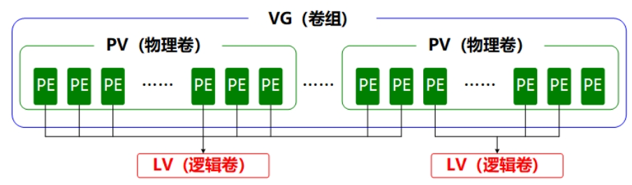

#### 基本命令

##### 硬件信息

```shell
# 总核数 = 物理CPU个数xX 每个物理CPU的核数 
# 总逻辑CPU数 = 物理CPU个数 x 每个物理CPU的核数 x 超线程数

# 查看物理CPU个数
cat /proc/cpuinfo| grep "physical id"| sort| uniq| wc -l

# 查看每个物理CPU中core的个数(即核数)
cat /proc/cpuinfo| grep "cpu cores"| uniq

# 查看逻辑CPU的个数
cat /proc/cpuinfo| grep "processor"| wc -l

# 查看CPU信息（型号）
cat /proc/cpuinfo | grep name | cut -f2 -d: | uniq -c

 
# 查看内存信息
cat /proc/meminfo

# 如何查看Linux 内核
uname -a
cat /proc/version

# 查看机器型号（机器硬件型号）
dmidecode | grep "Product Name"

# 如何查看linux 系统版本
cat /etc/redhat-release
lsb_release -a
cat  /etc/issue
 
# 如何查看linux系统和CPU型号，类型和大小
cat /proc/cpuinfo

# 如何查看linux 系统内存大小的信息，可以查看总内存，剩余内存，可使用内存等信息  
cat /proc/meminfo
```


##### 系统状态

+ **echo**：echo [字符串] [$变量]

  ``` shell
  echo "hello world"
  echo $SHELL  ->  /bin/bash
  ```

+ **wget**：

  | 参数 | 作用                                 |
  | ---- | ------------------------------------ |
  | -b   | 后台下载模式                         |
  | -P   | 下载到指定目录                       |
  | -t   | 最大尝试次数                         |
  | -c   | 断点续传                             |
  | -p   | 下载页面内所有资源，包括图片、视频等 |
  | -r   | 递归下载                             |

+ **ps**

  **pstree**

  | 参数 | 作用                               |
  | ---- | ---------------------------------- |
  | -a   | 显示所有进程（包括其他用户的进程） |
  | -u   | 用户以及其他详细信息               |
  | -x   | 显示没有控制终端的进程             |

  > **R（运行）：**进程正在运行或在运行队列中等待。
  >
  > **S（中断）：**进程处于休眠中，当某个条件形成后或者接收到信号时，则脱离该状态。
  >
  > **D（不可中断）：**进程不响应系统异步信号，即便用kill命令也不能将其中断。
  >
  > **Z（僵死）：**进程已经终止，但进程描述符依然存在, 直到父进程调用wait4()系统函数后将进程释放。
  >
  > **T（停止）：**进程收到停止信号后停止运行。
  >
  > 高优先级（<），低优先级（N），被锁进内存（L），包含子进程（s），多线程（l）

+ **top**

  

  > 第1行：系统时间、运行时间、登录终端数、系统负载（三个数值分别为1分钟、5分钟、15分钟内的平均值，数值越小意味着负载越低）。
  >
  > 第2行：进程总数、运行中的进程数、睡眠中的进程数、停止的进程数、僵死的进程数。
  >
  > 第3行：用户占用资源百分比、系统内核占用资源百分比、改变过优先级的进程资源百分比、空闲的资源百分比等。其中数据均为CPU数据并以百分比格式显示，例如“99.9 id”意味着有99.9%的CPU处理器资源处于空闲。
  >
  > 第4行：物理内存总量、内存空闲量、内存使用量、作为内核缓存的内存量。
  >
  > 第5行：虚拟内存总量、虚拟内存空闲量、虚拟内存使用量、已被提前加载的内存量。

+ **nice**：用于调整进程的优先级。nice 优先级数字 服务名称

  ``` shell
  nice -n -20 bash
  ```

+ **pidof**：用于查询某个指定服务进程的PID号码值

  ``` shell
  pidof sshd
  ```

+ **kill**：用于终止某个指定PID值的服务进程。kill [参数] 进程的PID

  **killall**：用于终止某个指定名称的服务所对应的全部进程。killall [参数] 服务名称

+ **ifconfig**：用于获取网卡配置与网络状态等信息

  ``` shell
  # 主要看：网卡名称、inet参数的IP地址、ether参数的MAC地址、RX、TX流量统计
  ens160: flags=4163<UP,BROADCAST,RUNNING,MULTICAST>  mtu 1500
          inet 192.168.10.10  netmask 255.255.255.0  broadcast 192.168.10.255
          inet6 fe80::c8f8:f5c5:8251:aeaa  prefixlen 64  scopeid 0x20
          ether 00:0c:29:7d:27:bf  txqueuelen 1000  (Ethernet)
          RX packets 304  bytes 33283 (32.5 KiB)
          RX errors 0  dropped 0  overruns 0  frame 0
          TX packets 91  bytes 11052 (10.7 KiB)
          TX errors 0  dropped 0 overruns 0  carrier 0  collisions 0
  ```

+ **free**：显示当前系统中内存的使用量信息  free -h

  |       | 内存总量 | 已用量 | 空闲量 | 进程共享的内存量 | 磁盘缓存的内存量 | 缓存的内存量 | 可用量    |
  | ----- | -------- | ------ | ------ | ---------------- | ---------------- | ------------ | --------- |
  |       | total    | used   | free   | shared           | buffers          | buff/cache   | available |
  | Mem:  | 1.9Gi    | 1.4Gi  | 99Mi   | 20Mi             | 450Mi            | 348Mi        |           |
  | Swap: | 2.0Gi    | 80Mi   | 1.9Gi  |                  |                  |              |           |

+ **who**：用于查看当前登入主机的用户终端信息

  **last**：用于调取主机的被访记录

+ **ping**

  **tracepath**：用于显示数据包达到目的主机途中所经过的路由信息

+ **netstat**：netstat -antupl

  | 参数 | 说明                     |
  | ---- | ------------------------ |
  | -a   | 显示所有连接中的Socket   |
  | -p   | 显示正在使用的进程信息   |
  | -t   | 显示TCP协议的连接状态    |
  | -u   | 显示UDP协议的连接状态    |
  | -n   | 使用IP地址，不使用域名   |
  | -l   | 仅列出正在监听的服务状态 |
  | -i   | 现在网卡列表信息         |
  | -r   | 显示路由表信息           |

+ **telnet**：telnet ip port

+ **crontab**：定时任务

  | 参数 | 说明                   |
  | ---- | ---------------------- |
  | -u   | 表示操作哪个用户       |
  | -l   | 显示工作表内的定时任务 |
  | -e   | 编辑工作表             |

##### 文件操作

+ **pwd**

+ **cd**

+ **ls**：ls -al

  **tree**：用于以树状图的形式列出目录内容及结构

+ **find**：用于按照指定条件来查找文件所对应的位置。find [查找范围] 寻找条件  eg：find / -name "hello"

  | 参数               | 作用                                                         |
  | ------------------ | ------------------------------------------------------------ |
  | -name              | 匹配名称                                                     |
  | -perm              | 匹配权限（mode为完全匹配，-mode为包含即可）                  |
  | -user              | 匹配所有者                                                   |
  | -group             | 匹配所有组                                                   |
  | -mtime -n +n       | 匹配修改内容的时间（-n指n天以内，+n指n天以前）               |
  | -atime -n +n       | 匹配访问文件的时间（-n指n天以内，+n指n天以前）               |
  | -ctime -n +n       | 匹配修改文件权限的时间（-n指n天以内，+n指n天以前）           |
  | -nouser            | 匹配无所有者的文件                                           |
  | -nogroup           | 匹配无所有组的文件                                           |
  | -newer f1 !f2      | 匹配比文件f1新但比f2旧的文件                                 |
  | --type b/d/c/p/l/f | 匹配文件类型（后面的字幕字母依次表示块设备、目录、字符设备、管道、链接文件、文本文件） |
  | -size              | 匹配文件的大小（+50KB为查找超过50KB的文件，而-50KB为查找小于50KB的文件） |
  | -prune             | 忽略某个目录                                                 |
  
+ **cat**

  **more**：space / enter 向下翻页

  **head**：head -n 10 log

  **tail**：tail -n 10 log

+ **wc**：用于统计指定字符串的行数、字数或字节数

  | 参数 | 作用         |
  | ---- | ------------ |
  | -l   | 只显示行数   |
  | -w   | 只显示单词数 |
  | -c   | 只显示字节数 |

+ **cut**：用于按列提取字符串内容   cut -d : -f 1 /etc/passwd

  | 参数 | 作用                   |
  | ---- | ---------------------- |
  | -f   | 设置需要提取的列的下标 |
  | -d   | 设置间隔符号           |

+ **grep**：输出符合查询条件的行   grep  "warn"  a.log 

  | 参数 | 作用                               |
  | ---- | ---------------------------------- |
  | -n   | 显示行号                           |
  | -v   | 反向选择——仅列出没有“关键词”的行。 |

+ **awk**：读取文件的每一行，输出里面的字段

  ``` shell
  # 格式
  $ awk 动作 文件名
  # 示例
  $ awk '{print $0}' demo.txt
  ```

  + 分隔符 -F（默认空格）

    ``` shell
    $ awk -F ':' '{ print $1 }' demo.txt
    # $O 代表输入行，$1、$2、$3 代表第一个字段、第二个字段、第三个字段
    ```

  + 变量 $N

    ``` shell
    # $NF 代表最后一个字段
    $ echo 'this is a test' | awk '{print $NF}'
    test
    # NR 代表当前处理的是第几行
    $ awk -F ':' '{print NR ") " $1}' demo.txt
    1) root
    2) daemon
    ```

  + 条件：只输出符合条件的行

    ``` shell
    # 格式
    $ awk '条件 动作' 文件名
    # 示例
    $ awk -F ':' '/usr/ {print $1}' demo.txt   # /regx/ 正则
    $ awk -F ':' 'NR % 2 == 1 {print $1}' demo.txt
    $ awk -F ':' '{if ($1 > "m") print $1}' demo.txt
    ```

+ **sed**： 查找模式匹配的行，执行后面的字符串操作

  ``` shell
  # p : 显示
  # -n 仅显示script处理后的结果
  $ cat /etc/passwd | sed '5,7p' -n 
  $ cat /etc/passwd | sed '/root/p' -n  # 搜索并打印
  # s : 替换 
  $ echo "hello world" | sed 's/world/timi/gi' # 搜索并替换 sed 's/要被取代的字串/新的字串/gi' g全局 i忽略大小写
  # d : 删除
  $ cat /etc/passwd | sed '2d' 
  $ cat /etc/passwd | sed '/root/d' # 搜索并删除
  ```

+ **touch**

  **mkdir**

  **cp**

  **mv**

  **rm**

+ **dd**：用于按照指定大小的数据块个数来复制文件或转换文件

  | 参数  | 作用                 |
  | ----- | -------------------- |
  | if    | 输入的文件名称       |
  | of    | 输出的文件名称       |
  | bs    | 设置每个“块”的大小   |
  | count | 设置要复制“块”的个数 |

  ``` shell
  # 虚拟设备：不会占用系统存储空间
  # /dev/null：黑洞，输入到这个设备的数据都将被直接丢弃
  # /dev/zero：可以输出无穷无尽的数据
  # /dev/random、/dev/urandom：提供随机字节流
  dd if=/dev/zero of=target count=1 bs=1G
  ```

+ **tar**

  ```shell
  tar -czvf a.tar.gz ./dir
  tar -xzvf a.tar.gz -C ./
  ```

  | 参数 | 作用                   |
  | ---- | ---------------------- |
  | -c   | 创建压缩文件           |
  | -x   | 解开压缩文件           |
  | -t   | 查看压缩包内有哪些文件 |
  | -z   | 用Gzip压缩或解压       |
  | -j   | 用bzip2压缩或解压      |
  | -v   | 显示压缩或解压的过程   |
  | -f   | 目标文件名             |
  | -p   | 保留原始的权限与属性   |
  | -P   | 使用绝对路径来压缩     |
  | -C   | 指定解压到的目录       |

+ **ln**：用于创建文件的软硬链接

  ``` shell
  ln old.txt new.txt
  -rw-r--r-- 2 root root 26 Jan 11 00:13 old.txt
  # 文件属性第二列的数字是文件inode链接数，创建硬链接则加一
  ```

  | 参数 | 作用                                               |
  | ---- | -------------------------------------------------- |
  | -s   | 创建“符号链接”（如果不带-s参数，则默认创建硬链接） |
  | -f   | 强制创建文件或目录的链接                           |
  | -i   | 覆盖前先询问                                       |
  | -v   | 显示创建链接的过程                                 |


##### 输入输出

> 标准输入重定向（STDIN，文件描述符为0）：默认从键盘输入，也可从其他文件或命令中输入。
>
> 标准输出重定向（STDOUT，文件描述符为1）：默认输出到屏幕。
>
> 错误输出重定向（STDERR，文件描述符为2）：默认输出到屏幕。

+ 输入重定向（to memery）

  | 符号                   | 作用                                         |
  | ---------------------- | -------------------------------------------- |
  | 命令 < 文件            | 将文件作为命令的标准输入                     |
  | 命令 << 分界符 eg: EOF | 从标准输入中读入，直到遇见分界符才停止       |
  | 命令 < 文件1 > 文件2   | 将文件1作为命令的标准输入并将标准输出到文件2 |

+ 输出重定向（to outside）

  | 符号          | 作用                                                         |
  | ------------- | ------------------------------------------------------------ |
  | 命令 > 文件   | 将标准输出重定向到一个文件中（清空原有文件的数据）           |
  | 命令 2> 文件  | 将错误输出重定向到一个文件中（清空原有文件的数据）           |
  | 命令 >> 文件  | 将标准输出重定向到一个文件中（追加到原有内容的后面）         |
  | 命令 2>> 文件 | 将错误输出重定向到一个文件中（追加到原有内容的后面）         |
  | 命令 &>> 文件 | 将标准输出与错误输出共同写入到文件中（追加到原有内容的后面） |

##### 管道符

**|：**把前一个命令原本要输出到屏幕的信息当作是后一个命令的标准输入

**| xargs：**若管道后方的命令不接受标准输入作为参数，只接收命令行参数，则使用 xargs 进行转换


##### 环境变量

+ echo $变量名

  env：查看当前用户所有的环境变量

  | 变量名称     | 作用                             |
  | ------------ | -------------------------------- |
  | HOME         | 用户的主目录（即家目录）         |
  | SHELL        | 用户在使用的Shell解释器名称      |
  | HISTSIZE     | 输出的历史命令记录条数           |
  | HISTFILESIZE | 保存的历史命令记录条数           |
  | MAIL         | 邮件保存路径                     |
  | LANG         | 系统语言、语系名称               |
  | RANDOM       | 生成一个随机数字                 |
  | PS1          | Bash解释器的提示符               |
  | PATH         | 定义解释器搜索用户执行命令的路径 |
  | EDITOR       | 用户默认的文本编辑器             |

  **设置环境变量**

  1. ``` shell
     $ VAR=VALUE # 不可空格
     $ echo $VAR
     $ export VAR # 提升为全局变量
     ```

  2. /etc/bashrc  or  /etc/profile  or  ~/.bash_profile

     ``` shell
     export PATH="$PATH:/home/qhl/mysql/bin"
     source /etc/profile
     ```

**转义字符**

+ 反斜杠（\）：使反斜杠后面的一个变量变为单纯的字符。
  
    ``` shell
    PRICE=5
    echo "Price is \$$PRICE"   # Price is $5
  ```
  
+ 单引号（''）：转义其中所有的变量为单纯的字符串。
  
    ``` shell
    echo 'Price is $PRICE'   # Price is $PRICE
  ```
  
+ 双引号（""）：保留其中的变量属性，不进行转义处理。
  
    ``` shell
    echo "Price is $PRICE"   # Price is 5
  ```
  
+ 反引号（``）：把其中的命令执行后返回结果。
  
    ``` shell
    echo `uname -a`  # Linux
  ```
  
    

##### Shell

+ ``` shell
  #!/bin/bash
  echo $0 # 文件名
  echo $1 # 第一个传参
  ```

+ **变量**

  ``` shell
  VAR=VALUE
  VAR=$(curl www.baidu.com)
  echo "$VAR"
  echo "${VAR}"
  ```

+ **数组**

  ``` shell
  ARRAY=(VALUE0 VALUE1 VALUE2 VALUE3)
  ARRAY[0]=VALUE0
  ARRAY[1]=VALUE1
  echo ${ARRAY[0]}
  echo ${ARRAY[*]} # 所有元素
  echo ${#ARRAY[*]} # 数组长度
  for item in ${ARRAY[*]}; do echo $item; done
  ```

+ **expr**

  ``` shell
  VAL=`expr $a + $b`
  VAR=`expr $a - $b`
  VAR=`expr $a \* $b`
  VAR=`expr $a / $b`
  ```

+ **if**

  ``` shell
  if [ $VAR == 1 ]; then echo "+"; echo "-"; 
  elif [ $VAR == 2 ]; then echo "/"; 
  else echo "*"; fi
  ```

+ **for**

  ``` shell
  for i in $(ls); do echo $i; done
  ```

+ **while**

  ```shell
  while [ 1 == 1 ]; do echo "+"; done
  ```


##### 用户管理

在Linux系统中创建每个用户时，将自动创建一个与其同名的基本用户组，而且这个基本用户组只有该用户一个人。如果该用户以后被归纳入其他用户组，则这个其他用户组称之为扩展用户组。一个用户只有一个基本用户组，但是可以有多个扩展用户组

+ **id**：用于显示用户详细信息。id root

+ **useradd**：用于创建新的用户账户。

  | 参数 | 作用                                     |
  | ---- | ---------------------------------------- |
  | -d   | 指定用户的家目录（默认为/home/username） |
  | -e   | 账户的到期时间，格式为YYYY-MM-DD.        |
  | -u   | 指定该用户的默认UID                      |
  | -g   | 指定一个初始的用户基本组（必须已存在）   |
  | -G   | 指定一个或多个扩展用户组                 |
  | -N   | 不创建与用户同名的基本用户组             |
  | -s   | 指定该用户的默认Shell解释器              |

+ **groupadd**：用于创建新的用户组

+ **usermod**：用于修改用户的属性

  | 参数  | 作用                                                         |
  | ----- | ------------------------------------------------------------ |
  | -c    | 填写用户账户的备注信息                                       |
  | -d -m | 参数-m与参数-d连用，可重新指定用户的家目录并自动把旧的数据转移过去 |
  | -e    | 账户的到期时间，格式为YYYY-MM-DD                             |
  | -g    | 变更所属用户组                                               |
  | -G    | 变更扩展用户组                                               |
  | -L    | 锁定用户禁止其登录系统                                       |
  | -U    | 解锁用户，允许其登录系统                                     |
  | -s    | 变更默认终端                                                 |
  | -u    | 修改用户的UID                                                |

+ **passwd**：用于修改用户的密码、过期时间等信息。

  普通用户只能使用passwd命令修改自己的系统密码，而root管理员则有权限修改其他所有人的密码（而且不用验证旧密码）

  | 参数    | 作用                                                         |
  | ------- | ------------------------------------------------------------ |
  | -l      | 锁定用户，禁止其登录                                         |
  | -u      | 解除锁定，允许用户登录                                       |
  | --stdin | 允许通过标准输入修改用户密码，如echo "NewPassWord" \| passwd --stdin Username |
  | -d      | 使该用户可用空密码登录系统                                   |
  | -e      | 强制用户在下次登录时修改密码                                 |
  | -S      | 显示用户的密码是否被锁定，以及密码所采用的加密算法名称       |

+ **userdel**：用于删除已有的用户账户

  | 参数 | 作用                     |
  | ---- | ------------------------ |
  | -f   | 强制删除用户             |
  | -r   | 同时删除用户及用户家目录 |


##### 权限管理


+ **普通权限**：读 写 执行 【所属者 所属组 其它用户】

+ **特殊权限**：

  + **SUID**【user】：让二进制程序的执行者临时拥有文件所属者的权限（即所有人都可以执行）

    文件所有者的权限由rwx变成了rws，其中x改变成s就意味着该文件被赋予了SUID权限

    如果原先权限位上没有x执行权限，那么被赋予特殊权限后将变成大写的S（无法执行）

  + **SGID**【group】：让二进制程序的执行者临时拥有文件所属组的权限

  + **SBIT**：文件保护位（用户只能删除自己的文件，不能删除其它用户）

+ **chmod**：用于设置文件的一般权限及特殊权限。[u g o] [+ -] [r w x s t]

  | 参数 | 作用         |
  | ---- | ------------ |
  | u+s  | 设置SUID权限 |
  | u-s  | 取消SUID权限 |
  | g+s  | 设置SGID权限 |
  | g-s  | 取消SGID权限 |
  | o+t  | 设置SBIT权限 |
  | o-t  | 取消SBIT权限 |

  **chown**：用于设置文件的所有者和所有组

  ``` shell
  chown user:group anaconda-ks.cfg 
  ```

  

+ **隐藏权限**

  **chattr**：用于设置文件的隐藏权限

  **lsattr**：用于查看文件的隐藏权限

  | 参数 | 作用                                                         |
  | ---- | ------------------------------------------------------------ |
  | i    | 无法对文件进行修改；若对目录设置了该参数，则仅能修改其中的子文件内容而不能新建或删除文件 |
  | a    | 仅允许补充（追加）内容，无法覆盖/删除内容（Append Only）     |
  | S    | 文件内容在变更后立即同步到硬盘（sync）                       |
  | s    | 彻底从硬盘中删除，不可恢复（用0填充原文件所在硬盘区域）      |

+ **ACL**：对指定的用户进行单独的权限控制

  **setfacl**：用于管理文件的ACL权限规则

  **getfacl**：用于查看文件的ACL权限规则

  ``` shell
  setfacl -Rm u:qhl:rwx /root
  ```

  | 参数 | 作用             |
  | ---- | ---------------- |
  | -m   | 修改权限         |
  | -M   | 从文件中读取权限 |
  | -x   | 删除某个权限     |
  | -b   | 删除全部权限     |
  | -R   | 递归子目录       |

+ **su** / **sudo -i**

##### 目录结构

| 目录名称    | 应放置文件的内容                                          |
| ----------- | --------------------------------------------------------- |
| /boot       | 开机所需文件—内核、开机菜单以及所需配置文件等             |
| /dev        | 以文件形式存放任何设备与接口                              |
| /etc        | 配置文件                                                  |
| /home       | 用户主目录                                                |
| /bin        | 存放单用户模式下还可以操作的命令                          |
| /lib        | 开机时用到的函数库，以及/bin与/sbin下面的命令要调用的函数 |
| /sbin       | 开机过程中需要的命令                                      |
| /media      | 用于挂载设备文件的目录                                    |
| /opt        | 放置第三方的软件                                          |
| /root       | 系统管理员的家目录                                        |
| /srv        | 一些网络服务的数据文件目录                                |
| /tmp        | 任何人均可使用的“共享”临时目录                            |
| /proc       | 虚拟文件系统，例如系统内核、进程、外部设备及网络状态等    |
| /usr/local  | 用户自行安装的软件                                        |
| /usr/sbin   | Linux系统开机时不会使用到的软件/命令/脚本                 |
| /usr/share  | 帮助与说明文件，也可放置共享文件                          |
| /var        | 主要存放经常变化的文件，如日志                            |
| /lost+found | 当文件系统发生错误时，将一些丢失的文件片段存放在这里      |


##### 磁盘操作

| 硬件设备      | 文件名称           |
| ------------- | ------------------ |
| IDE设备       | /dev/hd[a-d]       |
| SCSI/SATA/U盘 | /dev/sd[a-z]       |
| virtio设备    | /dev/vd[a-z]       |
| 软驱          | /dev/fd[0-1]       |
| 打印机        | /dev/lp[0-15]      |
| 光驱          | /dev/cdrom         |
| 鼠标          | /dev/mouse         |
| 磁带机        | /dev/st0或/dev/ht0 |


硬盘设备是由大量的扇区组成的，每个扇区的容量为512字节。其中第一个扇区最重要，它里面保存着主引导记录与分区表信息。

主分区、扩展分区、逻辑分区：3个主分区加1个扩展分区，在扩展分区中创建出数个逻辑分区，满足多分区（大于4个）的需求。

+ **blkid**

+ **mount** / **umount**

  | 参数 | 作用                                       |
  | ---- | ------------------------------------------ |
  | -a   | 挂载所有在 **/etc/fstab** 中定义的文件系统 |
  | -t   | 指定文件系统的类型                         |

+ **lsblk**

+ **fdisk**：用于新建、修改及删除磁盘的分区表信息

  | 参数 | 作用                   |
  | ---- | ---------------------- |
  | m    | 查看全部可用的参数     |
  | n    | 添加新的分区           |
  | d    | 删除某个分区信息       |
  | l    | 列出所有可用的分区类型 |
  | t    | 改变某个分区的类型     |
  | p    | 查看分区表信息         |
  | w    | 保存并退出             |
  | q    | 不保存直接退出         |

+ **RAID**

  | RAID级别 | 最少硬盘 | 可用容量 | 读写性能 | 安全性 | 特点                                                         |
  | -------- | -------- | -------- | -------- | ------ | ------------------------------------------------------------ |
  | 0        | 2        | n        | n        | 低     | 追求最大容量和速度，任何一块盘损坏，数据全部异常。           |
  | 1        | 2        | n/2      | n        | 高     | 追求最大安全性，只要阵列组中有一块硬盘可用，数据不受影响。   |
  | 5        | 3        | n-1      | n-1      | 中     | 在控制成本的前提下，追求硬盘的最大容量、速度及安全性，允许有一块硬盘异常，数据不受影响。 |
  | 10       | 4        | n/2      | n/2      | 高     | 综合RAID1和RAID0的优点，追求硬盘的速度和安全性，允许有一半硬盘异常（不可同组），数据不受影响 |

  

  

  + RAID 10 vs RAID 5：鉴于RAID 5技术是因为硬盘设备的成本问题对读写速度和数据的安全性能而有了一定的妥协，但是大部分企业更在乎的是数据本身的价值而非硬盘价格，在不考虑成本的情况下RAID 10的性能都超过了RAID 5，因此生产环境中主要使用RAID 10技术。

  + RAID 10 vs RAID 01：RAID 10级别中任何一块硬盘损坏都不会影响到数据安全性，其余硬盘均会正常运作。但RAID 01只要有任何一块盘损坏，最低级别的RAID 0硬盘组马上会停止运作。

  + **mdadm**：用于创建、调整、监控和管理RAID设备

    ``` shell
    mdadm -Cv /dev/md0 -n 4 -l 10 /dev/sdb /dev/sdc /dev/sdd /dev/sde
    ```

    | 参数 | 作用                   |
    | ---- | ---------------------- |
    | -n   | 指定设备数量           |
    | -l   | 指定RAID级别           |
    | -x   | 指定备份盘数量（主备） |
    | -C   | 创建                   |
    | -v   | 显示过程               |
    | -a   | 新增设备               |
    | -r   | 移除设备               |
    | -Q   | 查看摘要信息           |
    | -D   | 查看详细信息           |
    | -S   | 停止RAID磁盘阵列       |


+ **逻辑卷管理**

  

  | 功能/命令 | 物理卷管理 | 卷组管理  | 逻辑卷管理 |
  | --------- | ---------- | --------- | ---------- |
  | 扫描      | pvscan     | vgscan    | lvscan     |
  | 建立      | pvcreate   | vgcreate  | lvcreate   |
  | 显示      | pvdisplay  | vgdisplay | lvdisplay  |
  | 删除      | pvremove   | vgremove  | lvremove   |
  | 扩展      |            | vgextend  | lvextend   |
  | 缩小      |            | vgreduce  | lvreduce   |

