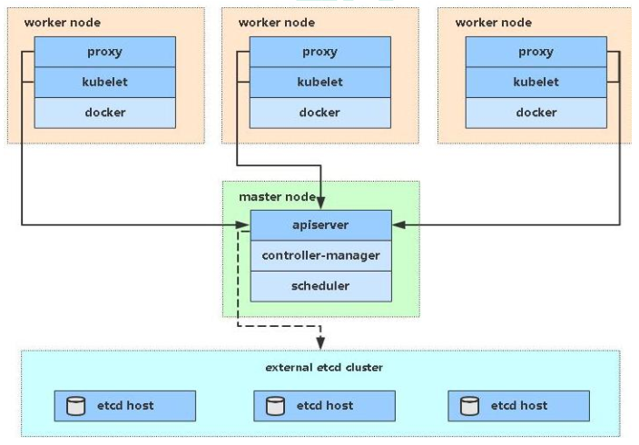

###  Kubernetes 资源管理

#### kubectl 命令

```shell
kubectl [command] [resourceType] [name] [flags -n -A -o]   # kubectl集群命令行工具
```

1. 基本命令

   | 命令         | 翻译     | 命令作用                     |
   | ------------ | -------- | ---------------------------- |
   | create       | 创建     | 创建一个资源                 |
   | edit         | 编辑     | 编辑一个资源                 |
   | get          | 获取     | 获取一个资源                 |
   | patch        | 更新     | 更新一个资源                 |
   | delete       | 删除     | 删除一个资源                 |
   | explain      | 解释     | 展示资源文档                 |
   | cluster-info | 集群信息 | 显示集群信息                 |
   | version      | 版本     | 显示当前Client和Server的版本 |

2. 运行和调试

   | 命令      | 翻译     | 命令作用               |
   | --------- | -------- | ---------------------- |
   | run       | 运行     | 在集群中运行指定的镜像 |
   | expose    | 暴露     | 暴露资源为Service      |
   | describe  | 描述     | 显示资源内部信息       |
   | logs      | 日志     | 输出容器在Pod中的日志  |
   | attach    | 缠绕     | 进入运行中的容器       |
   | exec      | 执行     | 进入容器中执行命令     |
   | cp        | 复制     | 在Pod内外复制文件      |
   | rollout   | 首次展示 | 管理资源的发布         |
   | scale     | 规模     | 扩（缩）容Pod的数量    |
   | autoscale | 自动调整 | 自动调整Pod的数量      |
   | apply     | 应用     | 通过文件对资源进行配置 |
   | label     | 标签     | 更新资源上的标签       |


#### 资源类型

```shell
kubectl api-resources   # kubernetes中所有的内容都抽象为资源
```

1. 集群容器资源

   | 资源名称   | 缩写 | 资源作用     |
   | ---------- | ---- | ------------ |
   | nodes      | no   | 集群组成部分 |
   | namespaces | ns   | 隔离Pod      |
   | pods       | po   | 装载容器     |

2. Pod资源控制器

   | 资源名称                   | 缩写   | 资源作用    |
   | -------------------------- | ------ | ----------- |
   | replication controllers    | rc     | 控制Pod资源 |
   | replicasets                | rs     | 控制Pod资源 |
   | deployments                | deploy | 控制Pod资源 |
   | daemonsets                 | ds     | 控制Pod资源 |
   | jobs                       |        | 控制Pod资源 |
   | cronjobs                   | cj     | 控制Pod资源 |
   | horizontal pod autoscalers | hpa    | 控制Pod资源 |
   | statefulsets               | sts    | 控制Pod资源 |

3. 服务发现资源

   | 资源名称 | 缩写 | 资源作用        |
   | -------- | ---- | --------------- |
   | services | svc  | 统一Pod对外接口 |
   | ingress  | ing  | 统一Pod对外接口 |

4. 存储资源

   | 资源名称                 | 缩写 | 资源作用 |
   | ------------------------ | ---- | -------- |
   | volume attachments       |      | 存储     |
   | persistent volumes       | pv   | 存储     |
   | persistent volume claims | pvc  | 存储     |

5. 配置资源

   | 资源名称   | 缩写 | 资源作用 |
   | ---------- | ---- | -------- |
   | configmaps | cm   | 配置     |
   | secrets    |      | 配置     |


#### 资源管理方式

1. 命令式：

   kubectl create deployment nginx --image=nginx:1.17.1 --dry-run=client -n dev -o yaml

   kubectl run nginx --image=nginx:1.17.1 --port=80 --namespace=dev

2. 命令式 + 配置：kubectl create/patch -f nginx-pod.yaml

3. 声明式 + 配置： kubectl apply -f nginx-pod.yaml


### Kubernetes 概念

Kubernetes 是自动化容器编排的开源平台


通过部署Nginx服务来说明Kubernetes系统各个组件调用关系：

1. 首先需要明确，一旦Kubernetes环境启动之后，master和node都会将自身的信息存储到etcd数据库中。
2. Nginx服务的安装请求首先会被发送到master节点上的API Server组件。
3. API Server组件会调用Scheduler组件来决定到底应该把这个服务安装到那个node节点上。此时，它会从etcd中读取各个node节点的信息，然后按照一定的算法进行选择，并将结果告知API Server。
4. API Server调用Controller-Manager去调用Node节点安装Nginx服务。
5. Kubelet接收到指令后，会通知Docker，然后由Docker来启动Nginx的Pod。Pod是Kubernetes的最小操作单元，容器必须跑在Pod中。
6. Nginx服务就运行了，如果需要访问Nginx，就需要通过kube-proxy来对Pod产生访问的代理，这样，外界用户就可以访问集群中的Nginx服务了。


##### **Master**

```
- Master 集群控制平台，负责协调集群中的所有活动。
- Master 组件包括：
	- apiserver：提供 Kubernetes API, 是控制平台的前端接口
	- etcd：存储配置信息和集群状态数据
	- kube-scheduler：提供调度服务，选择合适的节点执行Pod
	- controller：控制器，监控 apiserver 当前状态，不断修正接近用户yaml文件声明的期望值
        - kube-controller-manager：统一运行控制器，包括
            - Node controller：负责监听节点停机事件
            - Replicas controller：负责维护期望的Pod副本数
            - Endpoints controller：负责为端点对象（连接Service和Pod）赋值
            - Namespace controller：负责为新的名称空间创建 Service Account 和 API Access Token
        - cloud-controller-manager：由云产商定制的控制器
            - route controller
            - service controller
```

##### **Worker/Node**  

``` 
- 节点是虚拟机或物理计算机，充当k8s集群中的工作计算机。（外网IP）
- Node 组件包括：
	- kubelet：管理Worker节点并负责与Master节点通信，管理 Pod 内运行的 Container 。
	- kube-proxy：维护节点的网络规则，实现Pod网络通信，是实现Service的重要部分
	- container-engine：容器引擎，如 Docker cri-o rktlet
```



##### **Pod**

```
- Pod（容器组）是 k8s 集群上的最基本的单元。（内网IP）
- 存放一组 container（可包含一个或多个 container 容器，即图上正方体。
- 存放 container 容器的共享资源，包括：
	- 共享存储，称为 Volumes 卷，即图上紫色圆柱
	- 网络，每个 Pod（容器组）在集群中有个唯一的 IP，pod（容器组）中的 container（容器）共享该IP地址
	- container（容器）的基本信息，例如容器的镜像版本，对外暴露的端口
```

> Node             :  物理机
> Pod                :  虚拟机
> Container     :  容器


##### **Deployment**

```
- Pod 控制器：Deployment
- 在kubernetes中，Pod是最小的控制单元，但是kubernetes很少直接控制Pod，都是通过Pod控制器来完成
```


+ **操作：部署 Deployment**

``` yaml
- 创建文件 nginx-deployment.yaml
apiVersion: apps/v1	
kind: Deployment 	
metadata:	        
  name: nginx-deployment	
  labels:	    
    app: nginx	
spec:	        # Deployment specific
  replicas: 1	
  selector:	   
    matchLabels: 
      app: nginx
  template:	    # Pod template
    metadata:	
      labels:	
        app: nginx
    spec:	    # Pod specific
      containers:	
      - name: nginx
        image: nginx:1.7.9
```

##### **Service** 

``` 
- Pod IP会随着 Pod 的重建产生变化，同时 Pod IP仅仅是集群内部可见的虚拟的IP，外部无法访问。
- Service 屏蔽后端系统的 Pod 在销毁、创建过程中所带来的 IP 地址的变化, 实现对前端透明统一。
- Service 使 Pod 之间的相互依赖解耦（原本从一个 Pod 中访问另外一个 Pod，需要知道对方的 IP 地址）.
- Service 使用 Labels、LabelSelector 匹配一组 Pod.
```


##### **LabelSelector** 

```
- Service 通过 LabelSelector 将多组 Pod 统一入口，把这些 Pod 的指定端口公布到到集群外部，并支持负载均衡和服务发现。
- 上图中有两个服务Service A(黄色虚线)和Service B(蓝色虚线)
- Service A 将请求转发到 IP 为 10.10.10.1 的Pod上， Service B 将请求转发到 IP 为 10.10.10.2、10.10.10.3、10.10.10.4 的Pod上。
```


##### **Lable**

```
- Labels（标签）是附加到 Kubernetes 对象（Node、Deployment、Pod、Service等） 的键/值对
	- 将 Kubernetes 对象指派用于开发、测试、生产环境
	- 嵌入版本标签，使用标签区别不同应用软件版本
	- 使用标签对 Kubernetes 对象进行分类

- 上图体现了 Labels（标签）和 LabelSelector（标签选择器）之间的关联关系
    - Deployment B 含有 LabelSelector 为 app=B, 通过此方式，将含有 app=B 标签的 Pod 与之关联
    - 通过 Deployment B 创建的 Pod 包含标签为 app=B
    - Service B 通过标签选择器 app=B 选择可以路由的 app=B 的 Pod
```


+ **操作：为 Deployment 创建 Service**

``` yaml
- 创建文件 nginx-deployment.yaml
apiVersion: apps/v1	
kind: Deployment	# Deployment template
metadata:	       
  name: nginx-deployment	
  labels:	    
    app: nginx	
spec:	         # Deployment specific
  replicas: 1	
  selector:	    
    matchLabels: 
      app: nginx
  template:	     # Pod template
    metadata:	
      labels:	
        app: nginx
    spec:	     # Pod specific
      containers:	
      - name: nginx	
        image: nginx:1.7.9	

- 创建文件 nginx-service.yaml
apiVersion: v1
kind: Service      # Service template
metadata:
  name: nginx-service	
  labels:     	
    app: nginx	
spec:	    # Service specific
  selector:	   
    app: nginx	
  ports:
  - name: nginx-port	
    protocol: TCP	    
    port: 80	        # 集群内的其他容器组可通过 80 端口访问 Service
    nodePort: 32600   # 外部通过主机32600端口访问 Service
    targetPort: 80	# 将请求转发到匹配 Pod 的 80 端口
  type: NodePort	

# ClusterIP：默认值，它是kubernetes系统自动分配的虚拟IP，只能在集群内部访问。
# NodePort：将Service通过指定的Node上的端口暴露给外部，通过此方法，就可以在集群外部访问服务。
# LoadBalancer：使用外接负载均衡器完成到服务的负载分发，注意此模式需要外部云环境的支持。
# ExternalName：把集群外部的服务引入集群内部，直接使用。

- 启动 service 服务进程
kubectl apply -f nginx-service.yaml
- 访问服务
curl [anyNode ip]:32600
```

##### Namespaces

```
命名空间，可对资源进行分组隔离
```

##### **Scaling**

``` 
- 我们创建了一个 Deployment，然后通过 Service 服务 提供访问 Pod 的方式。我们发布的 Deployment 只创建了一个 Pod 来运行我们的应用程序。当流量增加时，我们需要对应用程序进行伸缩操作以满足系统性能需求。
- 下图所示：Service A 只将访问流量转发到 IP 为 10.0.0.5 的Pod上，修改了 Deployment 的 replicas 为 4 后，Kubernetes 又为该 Deployment 创建了 3 新的 Pod，这 4 个 Pod 有相同的标签。因此Service A通过标签选择器与新的 Pod建立了对应关系，将访问流量通过负载均衡在 4 个 Pod 之间进行转发。
```


+ **操作：将 Deployment 扩容到 4 个副本**

``` yaml
- 通过更改 Deployment 中的 replicas（副本数）来完成扩展
spec:
  replicas: 4    #使用该Deployment创建两个应用程序实例
```

##### **Rolling Update**

``` 
- 通过使用新版本的 Pod 逐步替代旧版本的 Pod 来实现 Deployment 的更新, 这个过程中，Service 能够监视 Pod 的状态，将流量始终转发到可用的 Pod 上。
- Rolling Update 支持：
	- 将应用程序从准上线环境升级到生产环境（通过更新容器镜像）
	- 回滚到以前的版本
	- 持续集成和持续交付应用程序，无需停机
- Rolling Update 流程：
	- 更新完 Deployment 部署文件中的镜像版本后，master 节点选择了一个 worker 节点，并根据新的镜像版本创建 Pod（紫色容器）。新 Pod 拥有唯一的新的 IP。同时，master 节点选择一个旧版本的 Pod 将其移除。重复以上操作直至所有 Pod 均替换。
```


+ **操作：Deployment 滚动更新** 

``` yaml
- Deployment 运行多个应用程序实例 (replicas)，就可以在不停机的情况下执行滚动更新
- 更新 Image 配置
apiVersion: apps/v1
kind: Deployment
metadata:
  name: nginx-deployment
  labels:
    app: nginx
spec:
  replicas: 4
  selector:
    matchLabels:
      app: nginx
  template:
    metadata:
      labels:
        app: nginx
    spec:
      containers:
      - name: nginx
        image: nginx:1.8   #使用镜像nginx:1.8替换原来的nginx:1.7.9
        ports:
        - containerPort: 80

- 查看 Pod 替换过程
watch kubectl get pods -l app=nginx
```


### Kubernetes 组件


#### Node 节点

```
工作节点包含了运行Pod所需的服务，如 container-engine、kubelet、kube-proxy 等，并都由 master 组件进行管理。
```

+ **节点信息**

  ```
  kubectl describe node [node-name]
  ```

  + **Addresses**

    ```yaml
    Addresses:
      InternalIP:  172.17.216.105   # 节点内部 IP
      ExternalIP:  xxxxx			# 节点外部 IP
      Hostname:    demo-worker-temp-01
    ```

  + **Conditions**

    ```yaml
    # 节点运行状态 Type, 符合为 True
    Ready、OutOfDisk（磁盘空间不足）、DiskPressure（磁盘空间紧张）、MemoryPressure（内存紧张）、PIDPressure（进程紧张）、NetworkUnvailable（网络配置有问题）
    ```

  + **Capacity and Allocatable**

    ```yaml
    # 容量：节点资源总数
    Capacity:
      cpu:                2
      ephemeral-storage:  41147472Ki
      hugepages-1Gi:      0
      hugepages-2Mi:      0
      memory:             7733524Ki
      pods:               110
    # 可分配量：剩余可分配的资源数
    Allocatable:
      cpu:                2
      ephemeral-storage:  37921510133
      hugepages-1Gi:      0
      hugepages-2Mi:      0
      memory:             7631124Ki
      pods:               110
    ```

  + **Info**

    ```yaml
    # 节点基本信息：Linux Kernel、Kubernetes、Docker、OS 等版本信息
    ```

+ **节点管理**

  ```
  与 Pod 和 Service 不一样，节点并不是由 Kubernetes 创建，而是云服务商提供的物理机/虚拟机资源池
  向 Kubernetes 中创建节点时，仅仅是创建了一个描述该节点信息的 API 对象
  ```

  + **节点控制器（in Master）**

    ```
    作用：
    	- 注册节点时分配 CIDR 地址块
    	- 检查节点对应的虚拟机是否可用
    	- 监控节点的健康状态（心跳包是否可达）
    ```

  + **节点自注册（Self-Registration）**

    ```
    kubelet 启动参数 -register-node true（默认） 
    将自动向 API Server 注册节点信息
    ```

+ **Master-Node 通信**

  ```
  集群 和 Master 间双向通信基于 kube-APIServer 组件
  ```


#### K8s Object 管理

```yaml
K8s Objects指集群中的实体 .yaml 数据描述，包括：
	- 集群中运行了哪些容器化应用程序
	- 集群中对应用程序可用的资源
	- 应用程序相关的策略定义，例如，重启策略、升级策略、容错策略
每个 K8s Object 包含 spec（目标状态） 和 status（实际状态）
Master 控制器 Controller 动态修正，利用负反馈原理不断使 实际状态 接近 目标状态

apiVersion: v1
kind: Pod
spec:
  containers:
  - name: nginx
    image: nginx:1.7.9
    ports:
    - containerPort: 80
```

+ **标签和选择器**

  ```yaml
  # 标签（Label）是Kubernetes对象上的一组键值对，标签可以标识Kubernetes对象
  apiVersion: v1
  kind: Pod
  metadata:
    name: label-demo
    labels:
      environment: production
      app: nginx
  
  # 标签选择器（Label Selector）可以分类和选择相同标签的一组Kubernetes对象
  apiVersion: v1
  kind: Pod
  metadata:
    name: cuda-test
  spec:
    containers:
      - name: cuda-test
        image: "k8s.gcr.io/cuda-vector-add:v0.1"
        resources:
          limits:
            nvidia.com/gpu: 1
    nodeSelector:     #  Pod 可以被调度到包含标签 accelerator = nvidia-tesla-p100 的节点上
      accelerator: nvidia-tesla-p100
  ```

+ **注解**

  ```yaml
  # 注解（annotation）可以为对象添加一些元数据，用于客户端读取
  apiVersion: v1
  kind: Pod
  metadata:
    name: annotations-demo
    annotations:
      imageregistry: "https://hub.docker.com/"
  ```


#### Container 容器

```yaml
apiVersion: v1
kind: Pod
metadata:
  name: cuda-test
spec:
  containers:
    - name: cuda-test
      image: "k8s.gcr.io/cuda-vector-add:v0.1"
```

+ **钩子函数**

  ```yaml
  Kubernetes 在容器的生命周期中提供两个 hook 钩子函数，包括：
  - PostStart：在容器创建后执行
  - PreStop：在容器终止前执行
  spec:
    containers:
    - name: lifecycle-demo-container
      image: nginx
      lifecycle:
        postStart:
          exec:
            command: ["/bin/sh", "-c", "echo Hello from the postStart handler > /usr/share/message"]
        preStop:
          exec:
            command: ["/bin/sh","-c","nginx -s quit; while killall -0 nginx; do sleep 1; done"]
  ```


#### Pod 容器组

```
Pod 是 Kubernetes 中最小调度单元
Pod 为 组内容器 提供两种共享资源，包括 网络和存储：
	- 网络：每个 Pod 分配独立的 IP地址；Pod中所有容器共享网络名称空间，容器IP相同，端口不同，可用localhost:port通信
	- 存储：Pod 定义共享数据卷，组内容器可以访问共享数据。
```

``` yaml
apiVersion: v1     # 必选，版本号，例如v1
kind: Pod       　 # 必选，资源类型，例如 Pod
metadata:       　 # 必选，元数据
  name: string     # 必选，Pod名称
  namespace: string  # Pod所属的命名空间,默认为"default"
  labels:       　　  # 自定义标签列表
    key: value      　
spec:  # 必选，Pod中容器的详细定义
  containers:  # 必选，Pod中容器列表
    - name: string   # 必选，容器名称
      image: string  # 必选，容器的镜像名称
      imagePullPolicy: [ Always|Never|IfNotPresent ]  # 获取镜像的策略 
      command: [string]   # 容器的启动命令列表，如不指定，使用打包时使用的启动命令
      args: [string]      # 容器的启动命令参数列表
      workingDir: string  # 容器的工作目录
      volumeMounts:       # 挂载到容器内部的存储卷配置
        - name: string      # 引用pod定义的共享存储卷的名称，需用volumes[]部分定义的的卷名
          mountPath: string # 存储卷在容器内mount的绝对路径，应少于512字符
          readOnly: boolean # 是否为只读模式
      ports: # 需要暴露的端口库号列表
        - name: string        # 端口的名称
          containerPort: int  # 容器需要监听的端口号
          hostPort: int       # 容器所在主机需要监听的端口号，默认与Container相同
          protocol: string    # 端口协议，支持TCP和UDP，默认TCP
      env:   # 容器运行前需设置的环境变量列表
        - name: string  # 环境变量名称
          value: string # 环境变量的值
      resources: # 资源限制和请求的设置
        limits:  # 资源限制的设置
          cpu: string     # Cpu的限制，单位为core数，将用于docker run --cpu-shares参数
          memory: string  # 内存限制，单位可以为Mib/Gib，将用于docker run --memory参数
        requests: # 资源请求的设置
          cpu: string    # Cpu请求，容器启动的初始可用数量
          memory: string # 内存请求,容器启动的初始可用数量
      lifecycle: # 生命周期钩子
  postStart: # 容器启动后立即执行此钩子,如果执行失败,会根据重启策略进行重启
  preStop: # 容器终止前执行此钩子,无论结果如何,容器都会终止
    livenessProbe:  # 对Pod内各容器健康检查的设置，当探测无响应几次后将自动重启该容器
      exec:       　 # 对Pod容器内检查方式设置为exec方式
        command: [string]  # exec方式需要制定的命令或脚本
      httpGet:       # 对Pod内个容器健康检查方法设置为HttpGet，需要制定Path、port
        path: string
        port: number
        host: string
        scheme: string
        HttpHeaders:
          - name: string
            value: string
      tcpSocket:     # 对Pod内个容器健康检查方式设置为tcpSocket方式
        port: number
        initialDelaySeconds: 0       # 容器启动完成后首次探测的时间，单位为秒
        timeoutSeconds: 0    　　    # 对容器健康检查探测等待响应的超时时间，单位秒，默认1秒
        periodSeconds: 0     　　    # 对容器监控检查的定期探测时间设置，单位秒，默认10秒一次
        successThreshold: 0
        failureThreshold: 0
        securityContext:
          privileged: false
  restartPolicy: [Always | Never | OnFailure]  # Pod的重启策略
  nodeName: <string> # 设置NodeName表示将该Pod调度到指定到名称的node节点上
  nodeSelector: obeject # 设置NodeSelector表示将该Pod调度到包含这个label的node上
  imagePullSecrets: # Pull镜像时使用的secret名称，以key：secretkey格式指定
    - name: string
  hostNetwork: false   # 是否使用主机网络模式，默认为false，如果设置为true，表示使用宿主机网络
  volumes:   # 在该pod上定义共享存储卷列表
    - name: string    # 共享存储卷名称 （volumes类型有很多种）
      emptyDir: {}       # 类型为emtyDir的存储卷，与Pod同生命周期的一个临时目录。为空值
      hostPath: string   # 类型为hostPath的存储卷，表示挂载Pod所在宿主机的目录
        path: string      　　        # Pod所在宿主机的目录，将被用于同期中mount的目录
      secret:       　　　# 类型为secret的存储卷，挂载集群与定义的secret对象到容器内部
        scretname: string
        items:
          - key: string
            path: string
      configMap:         # 类型为configMap的存储卷，挂载预定义的configMap对象到容器内部
        name: string
        items:
          - key: string
            path: string
```


+ **生命周期**

  ```
  Pod phase 代表容器组所处生命周期的阶段，取值有：
  	- Pending：K8S 已经创建并确认该 Pod，但还未完成节点调度或正在下载镜像
  	- Running：Pod 已经绑定到 节点，并且所有容器已经 创建，至少一个容器正在 启动/运行（创建 != 运行）
  	- Succeeded：Pod 所有容器已经成功终止，且不会再重启
  	- Failed：Pod 所有容器已经终止，至少一个容器处于失败状态
  	- Unknown：不能确定 Pod 状态，如通信故障时
  	
  Pod conditions 描述 Pod 是否达到某些条件状态，取值有：
  	- PodScheduled： Pod 已被调度到一个节点
  	- Ready： Pod 已经可以接受服务请求，应该被添加到所匹配 Service 的负载均衡的资源池
  	- Initialized：Pod 中所有初始化容器已成功执行
  	- Unschedulable：不能调度该 Pod（缺少资源或者其他限制）
  	- ContainersReady：Pod 中所有容器都已就绪
  ```

+ **初始化容器（名词 noun）**

  ```yaml
  Pod 除了包含多个工作容器，也可以包含一个或多个初始化容器，初始化容器在工作容器启动之前执行
  Pod 启动执行顺序：首先初始化网络和数据卷，然后逐一启动初始化容器（成功才继续下一个），过程中如果有初始化容器启动失败，kubelet 将根据 Pod 的 restartPolicy 决定是否重新启动 Pod.
  
  apiVersion: v1
  kind: Pod
  metadata:
    name: init-demo
  spec:
    containers:
    - name: nginx
      image: nginx
      ports:
      - containerPort: 80
      volumeMounts:
      - name: workdir
        mountPath: /usr/share/nginx/html
    initContainers:    # 初始化容器
    - name: install
      image: busybox
      command:
      - wget
      - "-O"
      - "/work-dir/index.html"
      - https://kuboard.cn
      volumeMounts:
      - name: workdir
        mountPath: "/work-dir"
    dnsPolicy: Default
    volumes:
    - name: workdir
      emptyDir: {}
  ```

  

#### Controller 控制器

```
Pod 是 Kubernetes 中最小的调度单元
用户应该始终使用控制器来创建 Pod，而不是直接创建 Pod
控制器作用：水平扩展（运行多个Pod副本）、滚动更新（不停机）、故障恢复（节点调度）
```

+ **ReplicaSet**

  ```yaml
  # ReplicaSet 维护 Pod 以指定数量的副本进行运行
  apiVersion: apps/v1
  kind: ReplicaSet
  metadata:
    name: frontend
    labels:
      app: guestbook
      tier: frontend
  spec:
    replicas: 3   # 副本数
    selector:     # 标签选择器，表示接管哪些 Pod
      matchLabels:
        tier: frontend
    template:    # Pod 模板定义
      metadata:
        labels:
          tier: frontend
      spec:
        containers:
        - name: nginx
          image: nginx
          
  # 查看 ReplicaSet 信息：  kubectl get rs
  ```

+ **Deployment**

  ```yaml
  # Deployment 最常用，用于部署无状态服务，进一步管理 Pod 和 ReplicaSet，并提供声明式、滚动更新等操作。
  
  # 创建 Deployment  
  kubectl apply -f nginx-deployment.yaml
  
  apiVersion: apps/v1
  kind: Deployment
  metadata:
    name: nginx-deployment
    labels:
      app: nginx
  spec:
    replicas: 3
    selector:
      matchLabels:
        app: nginx
    template:
      metadata:
        labels:
          app: nginx
      spec:
        containers:
        - name: nginx
          image: nginx:1.7.9
          ports:
          - containerPort: 80
  
  # 更新 Deployment
  kubectl set image nginx-deployment nginx=nginx:1.9.1 -record=true
  
  # 回滚 Deployment  
  1. 检查更新历史  kubectl rollout[滚动] history[历史] nginx-deployment
  2. 回滚指定版本  kubectl rollout history nginx-deployment -revision=2
  
  # 伸缩 Deployment
  kubectl scale nginx-deployment -replicas=10
  kubectl autoscale deployment.v1.apps/nginx-deployment -min=10 -max=15 -cpu-percent=80 （基于CPU利用率自动伸缩）
  
  # 暂停和继续 Deployment
  1. 暂停 Deployment  kubectl rollout pause[暂停] nginx-deployment
  2. 修改 Deployment（暂停状态下未更新）   kubectl set image nginx-deployment nginx=nginx:1.9.1
  3. 继续 Deployment（对修改做更新）   kubectl rollout resume[继续] nginx-deployment
  
  # 查看 Deployment 状态  
  kubectl rollout status 
      - Progressing：正在执行滚动更新
      - Complete：滚动完成
      - False：滚动失败
  ```

+ **StatefulSet**

  ```yaml
  # StatefulSet 管理 有状态 的应用程序
  StatefulSet 分配 固定的名字 和 按顺序增长的ID 给 Pod。
  使用场景：当应用程序需要稳定的网络标识，或者是 按顺序部署、删除和增加副本 时
  ```

+ **DaemonSet**

  ```yaml
  # DaemonSet 
  - 开启新节点时，Pod副本也添加到该节点
  - 集群移除节点时，Pod也被垃圾回收
  - 删除DaemonSet时，可以删除所有Pod
  应用场景：每个节点上运行集群的存储守护进程、运行日志收集的线程、运行监控守护进程
  ```

+ **Job / CronJob**

  ```yml
  # Job
  	确保指定数量的 Pod 可以成功执行任务
  # CronJob
  	定时任务，周期性创建Job，执行任务
  ```


#### Service 服务发现

```
Service 是 K8S 的服务发现机制，解决 Deployment 管理的 Pod IP 动态变化问题
	- Pod 有各自的 IP 地址，Service 有唯一的 DNS name
	- Service 通过 label selector 选定一组 Pod，并将流程负载均衡到这组 Pod 中

流程：Controller 创建 Pod，再通过 Service 暴露为网络服务，通过 Ingress 对集群外提供互联网访问

实践建议 Tip
	- Service 与 Controller 同名
    - Service 与 Controller 使用相同的 label selector
```

+ **创建 Service**

  ```yaml
  apiVersion: v1
  kind: Service
  metadata:
    name: my-service
  spec:
    selector:
      app: MyApp
    ports:
      - protocol: TCP
        port: 80   # Service 端口
        targetPort: 9376  #  Selected Pod 的端口
  ```

+ **kube-proxy  代理**

  ```yaml
  场景：在K8S服务代理中，发送到Service的ip:prot请求将被转发到合适的Pod，过程对用户透明。
  实现：集群中每个 Work/Node 都运行 kube-proxy，提供虚拟IP访问，实现 Pod网络通信 和 Service服务发现。
  三种代理模式：userspace、iptables、ipvs
  ```

  + **userspace**

    ```
    Master为Service分配虚拟IP地址和端口号，Worker的kube-proxy监听Service创建，并设定iptables防火墙规则
    请求流量发送到Service[ip:targetPort]后，由iptables捕获（内核态操作）并重定向到kube-proxy开启的代理端口，最终流量由kube-proxy负载（用户态操作）到后端Pods
    ```

  + **iptables 【默认】**

    ```
    请求流量发送到service[ip:targetPort]后，由iptables捕获并直接负载到后端Pods（均在内核态操作），而kube-proxy只负责生成iptables规则
    ```

    > iptables 比 userspace 性能更好，因为减少了内核态与用户态的切换 

  + **ipvs**

  

#### Ingress 访问入口

> Ingress 将集群内部的 Service 通过 HTTP/HTTPS 方式暴露到集群外部，并通过规则定义 HTTP/HTTPS 的路由

```yaml
# 服务访问转发流程：
1. Ingress Controller 开启 workers节点 80/443端口 [域名访问]
2. Ingress Controller 将外部请求路由到 Service [ip:port访问]
3. Service 通过 kube-proxy 进一步将请求负载均衡转发到 Pod [label转发]

# Ingress是K8S配置信息，Ingress Controller是K8S访问控制器

# 定义 Nginx Ingress Controller
apiVersion: extensions/v1beta1
kind: DaemonSet
metadata:
  name: nginx-ingress
  namespace: nginx-ingress
	# ...
spec:
  selector:
    matchLabels:
      app: nginx-ingress
  template:
    metadata:
      labels:
        app: nginx-ingress
    spec:
      serviceAccountName: nginx-ingress
      containers:
      - image: nginx/nginx-ingress:1.5.3
        name: nginx-ingress
        ports:
        - name: http
          containerPort: 80
          hostPort: 80
        - name: https
          containerPort: 443
          hostPort: 443
```


#### Volume 数据卷

```yaml
# K8S Volume 数据卷对象（Pod文件目录）
Docker数据卷是容器共享宿主机目录
Volume数据卷是是容器共享Pod目录，有生命周期（随Pod）
PersistentVolum存储卷是宿主机上的物理存储空间（资源）

# 解决两方面问题
1. 数据持久性：Pod中数据卷可以避免容器奔溃重启数据丢失
2. 数据共享：Pod容器组内的容器会有文件共享的需求
```

+ **数据卷类型**

  + **emptyDir**

    ```
    emptyDir 在Pod容器组创建时分配空目录，并在Pod移除时释放。因此，容器奔溃后重启（不会移除Pod），数据仍存在。
    适用场景：计算过程中的临时数据、增量检查点、容器间临时共享数据
    ```
    
  + **nfs**
    
      ```
      NFS（网络文件系统）:用户和程序可以像访问本地文件一样访问远端系统上的文件
      Pod 容器组被移除时，NFS中的数据仍然保留。
    适用场景：容器的软件日志和data目录、用户上传容器的文件
    ```
  
  + **hostPath**
  
    ```
    指定path，将Pod容器组所在宿主机节点的文件系统上某个文件夹挂载到容器内
    适用场景：容器要访问宿主机数据，如docker，则使用 hostpath 挂载宿主节点 /var/lib/docker
    ```
  
  + **configMap**
  
    ```
    将配置信息写入 configMap 对象，并通过数据卷以文件形式挂载到容器
    适用场景：配置容器应用程序
    ```
  
  + **secret**
  
    ```
    将敏感信息（如密码）存入 k8s secret 对象，并通过数据卷以文件形式挂载到容器
    适用场景：挂载Https证书
    ```
  
+ **数据卷挂载**

  ```yaml
  # 挂载是指将定义在 Pod 中的数据卷关联到容器 Container
  
  apiVersion: v1
  kind: Pod
  metadata:
    name: my-lamp-site
  spec:
      containers:
      - name: mysql
        image: mysql
        env:
        - name: MYSQL_ROOT_PASSWORD
          value: "rootpasswd"
        volumeMounts:
        - mountPath: /var/lib/mysql  # 挂载到容器的内部路径
          name: site-data
          subPath: mysql				# Pod数据卷路径下的相对路径
          readOnly: false
      - name: php
        image: php:7.0-apache
        volumeMounts:
        - mountPath: /var/www/html
          name: site-data
          subPath: html
          readOnly: false
      volumes:
      - name: site-data
        persistentVolumeClaim:
          claimName: my-lamp-site-data
  ```


#### PersistentVolume 存储卷


```yaml
# K8S提供的管理存储系统的API
# PersistentVolume、PersistentVolumeClaim、StorageClass
# https://blog.csdn.net/u013541707/article/details/110916951
PV可理解为一个物理存储卷资源
PVC是对Pod对所需PV性能指标的一个声明
StorageClass是面向用户可以自动创建的PV的一个机制
```

