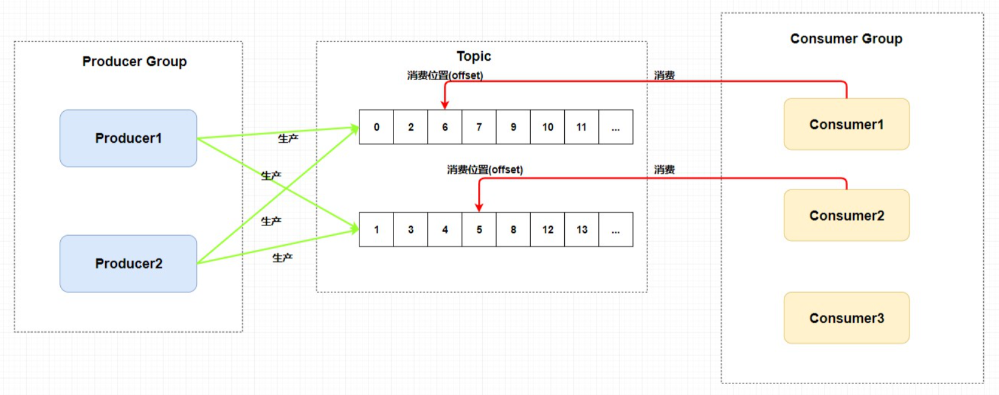
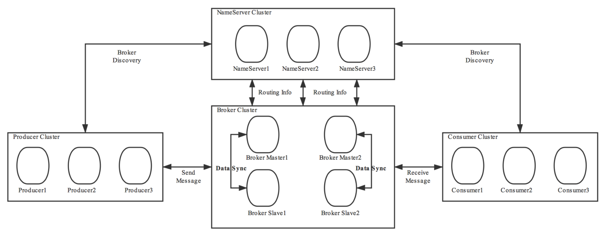
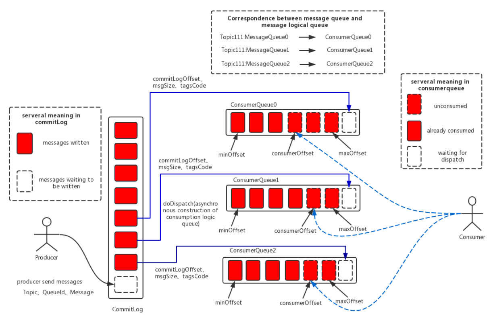
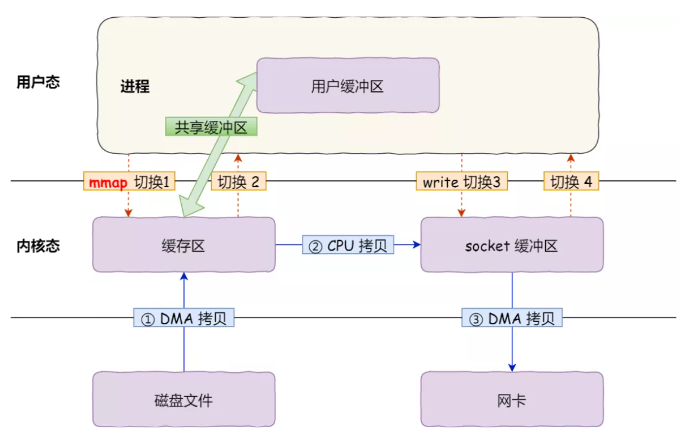
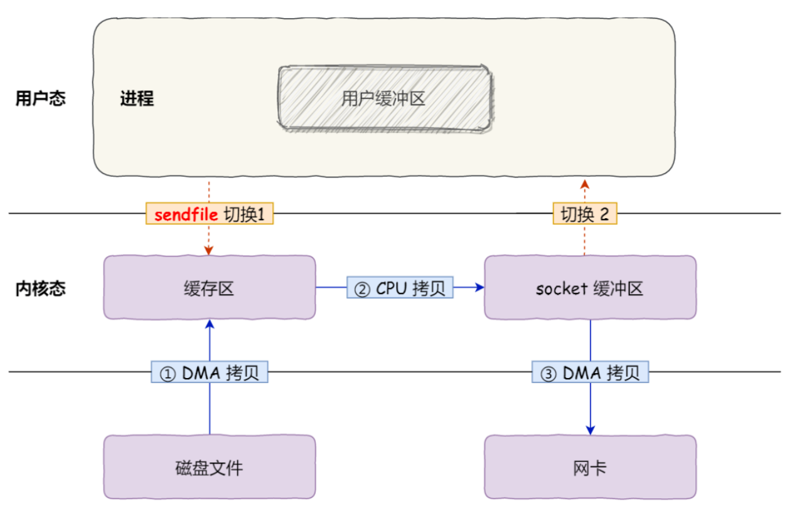
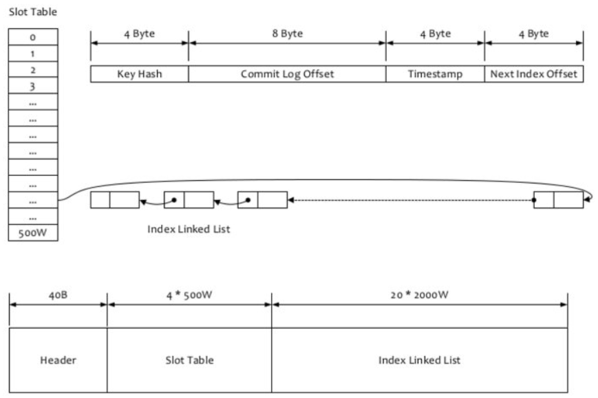
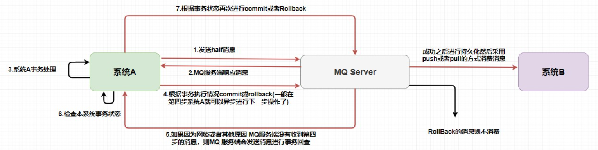

### 消息模型

+ Producer Group: 生产者组（生产相同主题的消息）
+ Consumer Group: 消费者组（消费相同主题的消息）
+ Topic: 主题（**每个主题存在多个队列**）
+ Queue: 队列（**每个主题划分成多个队列**）
  + 生产：生产者每次生产消息是指定主题中某个队列发送的
  + 消费：1. **集群消费模式**下，**一个队列只会被一个消费者消费**，多出的消费者闲置（可接替宕机的消费者），**每个消费组（是组）在每个队列上维护一个消费位置**；2. **广播消费模式下**，每个消费者接收所有队列，即**主题所有消息**。

总结：RocketMQ 通过在 **一个 Topic** 中配置 **多个队列**，并且 **每个队列维护每个消费者组的消费位置（由Broker端维护）**，实现了 **发布订阅模式** 。

### 架构图

+ Producer: 消息生产者
+ Consumer: 消息消费者
+ Broker: 消息队列服务器，负责消息投递、存储和查询等功能。Broker和Topic是**多对多**关系，**一个Topic 分布在多个Broker上，一个Broker可以配置多个Topic，它们是多对多的关系**
+ NameServer: 注册中心，提供Broker路由信息管理功能

**高可用部署**

1. Broker做**集群部署**和**主从部署**， salve 从 master 同步数据（同步复制或者异步复制），如果 master 宕机，**则 slave 提供消费服务，但是不能写入消息** 

2. NameServer做**集群部署**，没有主节点，**去中心化**，节点间不会进行复制。在 RocketMQ 中 **每个Broker和所有NameServer保持长连接**，Broker每隔30s向所有NameServer上报信息
3. 生产者与单个NameSever建立长连接，**先从 NameServer 获取关于 Broker 的路由信息**，然后通过 **轮询** 的方法去向每个队列中生产数据以达到 **负载均衡** 的效果
4. 消费者与单个NameSever建立长连接，通过NameServer获取所有Broker路由信息后，有两种模式进行消费：**广播模式 / 集群模式**

### 消息存储

#### 1.1 整体结构

+ **CommitLog**：消息主体以及元数据的存储主体，存储Producer端写入的消息主体内容，消息内容不是定长的。单个文件大小默认1G（过大无法**零拷贝**） ，文件名长度为20位，左边补零，剩余为起始偏移量，比如00000000000000000000代表了第一个文件，起始偏移量为0，文件大小为1G=1073741824；当第一个文件写满了，第二个文件为00000000001073741824，起始偏移量为1073741824，以此类推。消息主要是顺序写入日志文件，当文件满了，写入下一个文件；
+ **ConsumeQueue**：消息消费队列，引入的目的主要是提高消息消费的性能。由于消息消费是针对主题进行的，如果要遍历commitlog文件中根据topic检索消息是非常低效。其中，ConsumeQueue（逻辑消费队列）作为消费消息的索引，保存了指定Topic下的队列消息在CommitLog中的起始物理偏移量offset、消息大小size和消息Tag的HashCode值。consumequeue文件夹呈现topic/queue/file三层组织结构。同时consumequeue文件采取定长设计，每一个条目共20个字节，分别为8字节的commitlog物理偏移量、4字节的消息长度、8字节tag hashcode，单个文件由30W个条目组成。
+ **IndexFile**：IndexFile（索引文件）提供了一种可以通过key或时间区间来查询消息的方法。

总结： Broker中**所有主题/队列共用一个**日志数据文件 CommitLog 来存储消息，提高数据写入效率（无差别**批量写入**）；同时，Broker 中又使用了 ConsumeQueue 作为每个队列的索引文件来 **提升读取消息的效率**，可以直接根据队列的消息序号，计算出索引的全局位置（索引序号*索引固定⻓度20），然后直接读取这条索引，再根据索引中记录的消息的全局位置，找到消息

#### 1.2 页缓存和内存映射

**页缓存（PageCache)：**OS内核对文件的缓存，用于加速对文件的读写，以达到近似内存的读写速度。

+ 对于数据的写入，OS会先写入至PageCache内，随后通过异步由pdflush内核线程将Cache数据刷盘至物理磁盘上
+ 对于数据的读取，OS从物理磁盘上访问读取文件的同时，会顺序**对其他相邻块的数据文件**进行预读取

**内存映射（零拷贝）：** 

+ **mmap + write**：4次上下文切换，1次CPU拷贝

  

+ **sendfile**：2次上下文切换，1次CPU拷贝

  

#### 1.3 刷盘机制

+ **同步刷盘：**只有在消息真正持久化至磁盘后RocketMQ的Broker端才会真正返回给Producer端一个成功的ACK响应。同步刷盘对MQ消息可靠性来说是一种不错的保障，但是性能上会有较大影响，一般适用于金融业务应用该模式较多。
+ **异步刷盘：**能够充分利用OS的PageCache的优势，只要消息写入PageCache即可将成功的ACK返回给Producer端。消息刷盘采用后台异步线程提交的方式进行，降低了读写延迟，提高了MQ的性能和吞吐量。

#### 1.4 消息查询

消息查询概念**不同于消息消费**

+ **按照MessageId查询消息：**

  RocketMQ中的MessageId的长度总共有16字节，其中包含了消息存储主机地址（IP地址和端口），消息Commit Log offset

  

+ **按照MessageKey查询消息：**

  

  基于RocketMQ的IndexFile索引文件来实现，逻辑结构类似JDK中HashMap **（哈希+链表）**。

  存储路径是：$HOME\store\index${fileName}，文件名fileName以创建时的时间戳命名。

  整个Index File的结构如图，40 Byte 的**Header**用于保存一些总的统计信息，4\*500W的 **Slot Table**并不保存真正的索引数据，而是保存每个槽位对应的单向链表的头。20*2000W 是真正的**索引数据**，即一个 Index File 可以保存 2000W个索引。

  Key值是 **topic + “#” + KEY**；Value数据则包含了 **Key Hash/CommitLog Offset/Timestamp/NextIndex offset** 四个字段，其中NextIndex用于哈希冲突时的链表结构。

  故：读取消息的过程就是用topic和key找到IndexFile索引文件中的一条记录，根据其中的commitLog offset从CommitLog文件中读取消息的实体内容

  

#### 1.5 稀疏索引

与稠密索引不同，**稀疏索引不会为每个搜索值开辟内存空间建立索引记录。多个搜索值会指向同个索引值对应的索引记录**。

比如：有一列搜索值如下：1  2  3  4  5  6  7

密集索引的做法是为这7个值建立索引记录，那么就有7条索引记录，如下：

​	1：到1的指针

​	2：到2的指针

​	....

​	7：到7的指针

稀疏索引的做法是将这个6个值分组，1、2、3和4、5、6和7分为不同的3组，取这三组中最小的搜索值作为索引记录中的索引值，如下所示。稀疏索引则需要先定位 **floor（搜索值）**，然后在通过起始位置去定位具体的偏移量。

​	1：到顺序存储1、2、3的起始位置的指针

​	4：到顺序存在4、5、6的起始位置的指针

​	7：到顺序存储7的起始位置的指针

稠密索引建立了索引值与数据位置 1:1 的关系，稀疏索引建立了索引值与数据位置 1:n 的关系。在大多数场景密集索引**查询效率更高**，在大多数场景稀疏索引**占用空间更小**。

对于MySQL，**辅助索引必须是稠密索引，而聚集索引可以是稀疏索引**

#### 1.6 消息机制

+ **顺序消费**

  RocketMQ **在主题上是无序的，它只有在队列层面才是保证有序**

  + **普通顺序**：消费者通过 **同一个消费队列收到的消息是有顺序的**，不同消息队列收到的消息则**可能是无顺序**的 （**推荐**，可以使用 **Hash取模法** 来使消息投入同一个消息队列）
  + **严格顺序**：消费者收到的 **所有消息** 均是有顺序的，**即使在异常情况下也会保证消息的顺序性** （此时，Broker集群中只要有机器不可用，为了实现严格顺序，**整个集群都不可用**）

+ **重复消费**：业务层面上做幂等处理，比如 MySQL唯一键插入报错、Redis集合Set天然幂等、生成uuid做记录，消费时比对
+ **回溯消费**：回溯消费是指Consumer已经消费成功的消息，由于业务上需求需要重新消费。在RocketMQ中，Broker在向Consumer 投递成功消息后，**消息仍然需要保留** 。RocketMQ支持按照时间回溯消费，时间维度精确到毫秒

+ **消息过滤**：消费者可以根据Tag进行消息过滤，也支持自定义属性过滤。消息过滤目前是在**Broker端**实现的，优点是减少了对于Consumer无用消息的网络传输，缺点是增加了Broker的负担、而且实现相对复杂
+ **消息重投**：生产者在发送消息时，**同步消息**失败会重投（选择其它Broker），异步消息有重试（同个Broker），oneway没有任何保证
+ **死信队列**：用于处理无法被正常消费的消息。当一条消息初次消费失败，消息队列会自动进行消息重试；达到最大重试次数后，若消费依然失败，此时，消息队列不会立刻将消息丢弃，而是将其发送到该消费者对应的死信队列中。可以对死信队列中的消息进行重发来使得消费者实例再次进行消费。

### 通信机制

Netty Reactor 模型

### 事务机制

在 RocketMQ 中使用的是 **事务消息加上事务反查机制** 来解决分布式事务问题的

+ 事务消息发送及提交：

  1. 发送消息（half消息）
  2. 服务端响应消息写入结果。
  3. 根据发送结果执行本地事务（如果写入失败，此时half消息对业务不可见，本地逻辑不执行）
  4.  根据本地事务状态执行Commit或者Rollback（Commit操作生成消息索引，消息对消费者可见）

  在第一步发送的 half 消息 ，它的意思是 **在事务提交之前，对于消费者来说，这个消息是不可见的**。（通过将消息的主题暂时改成RMQ_SYS_TRANS_HALF_TOPIC，再根据commit/rollback来决定提交或回滚消息）

+ 补偿流程：

  1. 对没有Commit/Rollback的事务消息（pending状态的消息），从服务端发起回查
  2. Producer收到回查消息，检查回查消息对应的本地事务的状态
  3. 根据本地事务状态，重新Commit或者Rollback

  其中，补偿阶段用于解决消息Commit或者Rollback发生超时或者失败的情况。

注意：在 MQ Server 指向系统B的操作已经和系统A不相关了。也就是说，在消息队列中的分布式事务是：**本地事务和存储消息到消息队列才是同一个事务**。这样也就产生了事务的**最终一致性**，因为整个过程是异步的，**每个系统只要保证它自己那一部分的事务就行了**。