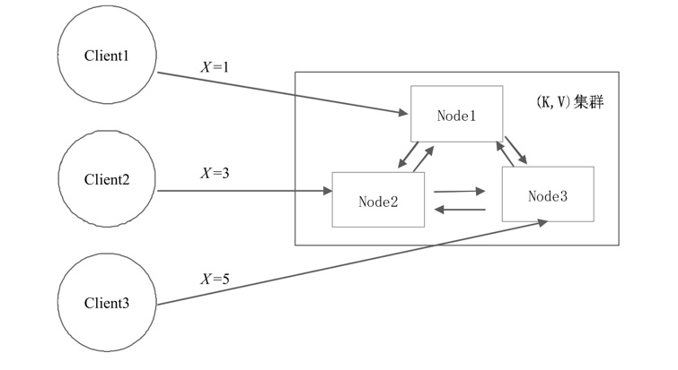
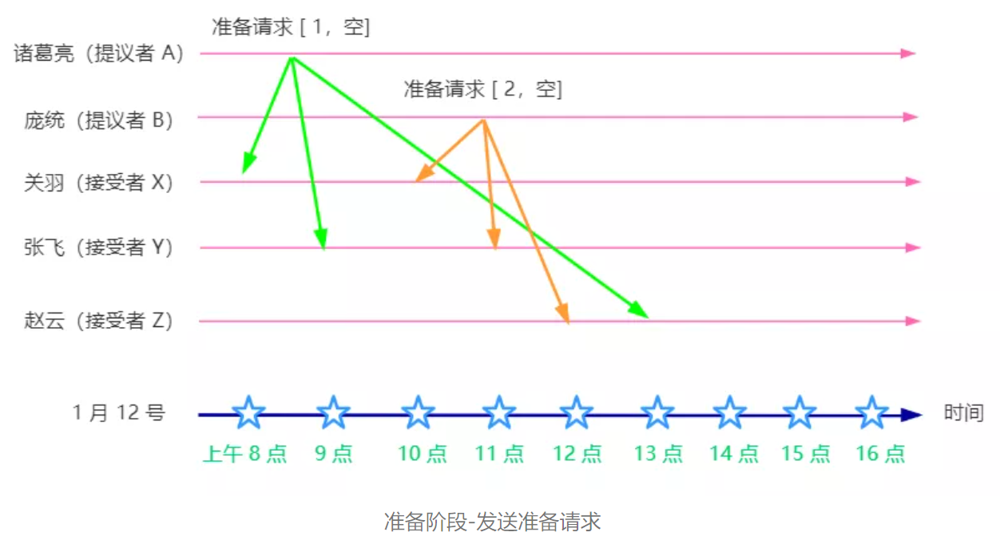
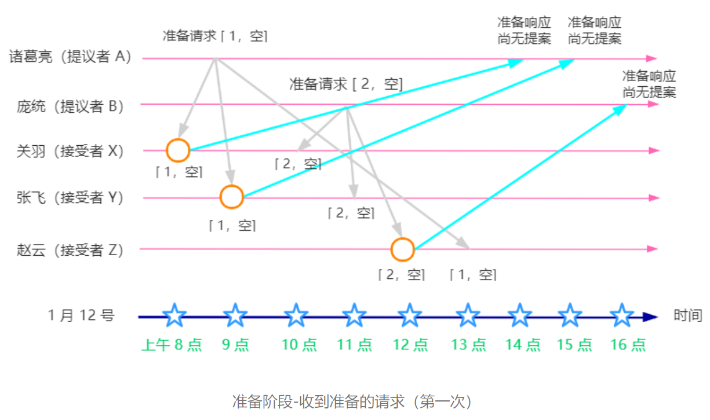
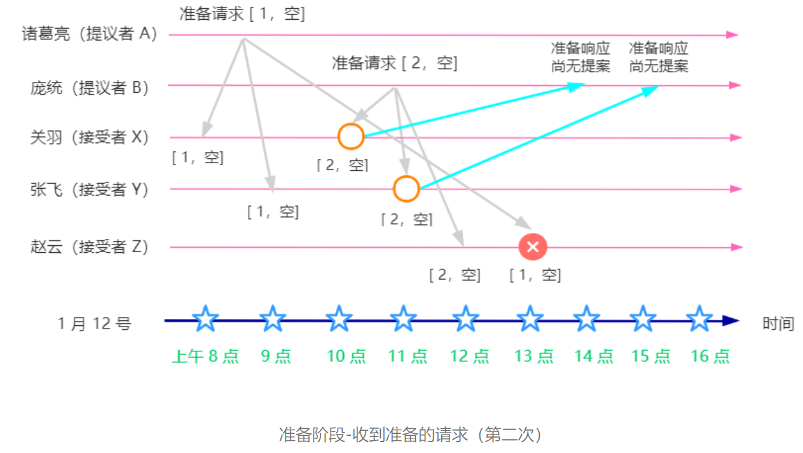
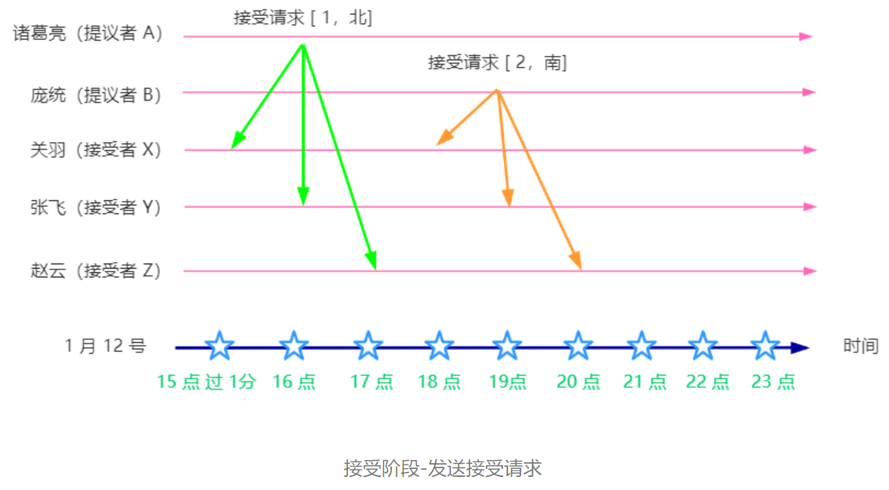
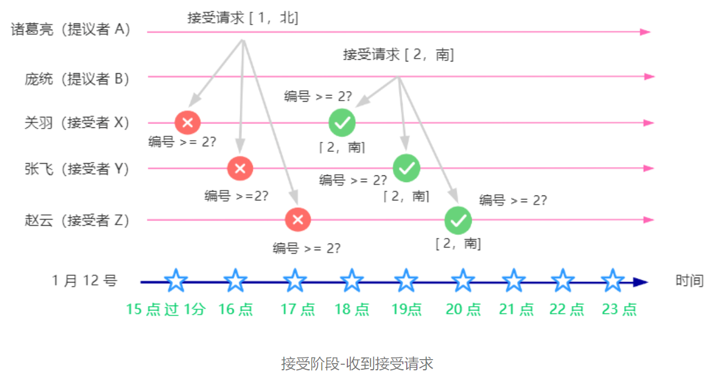

### why: 客户端往集群节点写数据，如何保证集群各节点上数据一致性（CP）

**选举机制相关概念**

- 候选人能力：投票的基本原则是选最强的人
- 遇强改投：如果后面发现更强的人可以改投票
- 投票箱：所有人的票都会放在投票箱
- 领导者：得票最多的人即为领导者

**同步过程：** **prepare + commit （两阶段）**

### Zab 【Leader】

> 基于 **主备模式（Leader / Follower）**
>
> 主进程（Leader）是客户端 **写入** 的入口，然后 **复制** 到备份进程（Follower）， 这样可以保证集群各节点数据一致性
>
> 在两种状态间切换：**消息广播**、**崩溃恢复**

+ **选举机制**

  触发的时机

  1. 服务启动时：初始状态下会对比 **服务器sid** ，编号越大权值越

     > 假设5台服务器依次启动，选举过程如下：
     >
     > 1. 服务器1启动
     >
     >    发起一次选举，服务器1投自己一票，此时服务器1票数一票，**不够半数以上**（3票），选举无法完成
     >
     >    投票结果：服务器1为1票
     >
     >    服务器1状态保持为 **LOOKING**
     >
     > 2. 服务器2启动
     >
     >    发起一次选举，服务器1和2分别投自己一票，**此时服务器1发现服务器2的id比自己大**，更改选票投给服务器2
     >
     >    投票结果：服务器1为0票，服务器2为2票
     >
     >    服务器1，2状态保持 **LOOKING**
     >
     > 3. 服务器3启动
     >
     >    发起一次选举，服务器1、2、3先投自己一票，然后因为服务器3的id最大，两者更改选票投给为服务器3
     >
     >    投票结果：服务器1为0票，服务器2为0票，服务器3为3票（**超过半数，成为 Leader**）
     >
     >    服务器1，2更改状态为 **FOLLOWING**，服务器3更改状态为 **LEADING**
     >
     > 4. 服务器4启动
     >
     >    发起一次选举，此时服务器1，2，3 **已经不是LOOKING 状态**，**不会更改选票信息**。服务器3为3票，服务器4为1票。此时服务器4 **少数服从多数**，更改选票信息为服务器3。
     >
     > 5. 服务器5启动  同4

  2. 服务器运行期间 Leader 故障：**对比事务编号，zxid 越大**，数据越新，权值也就越大

     > Leader 服务器宕机，**整个 Zookeeper 集群将暂停对外服务**，触发新一轮的选举
     >
     > 初始状态下服务器3当选为 Leader，服务器3故障宕机后，此时每个服务器上zxid可能都不一样。
     >
     > 假设server1为99，server2为102，server4为100，server5为101，选举流程如下
     >
     > 1. 第一次投票，每台机器都会将票投给自己
     > 2. 接着每台机器都会将自己的投票发给其他机器，如果发现其他机器的zxid比自己大，那么就需要改投票重新投一次。比如server1 收到了三张票，发现server2的xzid为102，pk一下发现自己输了，后面果断改投票选server2为老大。

     

+ **消息广播**【类似 **2PC**】

  1. **prepare**：Leader 将数据 **预** 写入 自身 和 Followers
  2. **commit**：当超过半数 Follower 返回 ack，Leader 执行 commit（先 commit 自身，再发送 commit 给 Followers）

  + **tips**
    + Zab协议 **保证全局顺序一致性，而不保证数据强一致性**。

      Leader 依次完成两个事务 A B 时，不能保证所有 Follower 立即更新到最新状态；只保证所有 Follower 一定时间内会同步到最新状态，且任意 Follower 都认为事务A先于事务B完成，不会乱序（保证全局顺序一致性）

      此外，ZAB协议保证来自同一个 Follower 的两个事务 A、B 按照 Follower 发出请求的顺序（而非 Leader 收到请求的顺序）依次执行，不会出现乱序。即保证任意客户端写请求的一致性。

      1. 为每个请求分配 **全局递增 ZXID**
      2. **只能 Leader 接受写请求**；Follwer 接收到写请求，将 **转发** 给 Leader 处理 

    + 对比 2PC 协议，Zab 在 Leader 和 Follower 间使用 **消息队列** 异步处理，解除同步阻塞
    
    

+ **奔溃恢复【选举 + 同步】**

  + **原则 / 要求**
    1. Leader 自身 commit 的数据最终会被 Followers **同步**
    2. Leader 没有 commit 的数据将确保被 **丢弃**
  + **基于 ZXID / SID 选举 Leader**
    + 服务器编号 **越大**，在选举算法中权重越大（初始化启动时根据服务器ID进行比较）
    + 事务编号 越大，说明数据越新，在选举算法中权重越大
  + **数据同步**
    + **场景**：在选举成功**后**，正式工作**前**，新 Leader 需确认 **自身事务** 是否被 **过半** Follower 提交
    + **策略**：Follower 接上 Leader 后，对比 自己 与 Leader 的 ZXID **编号大小**，进行**回滚或更新**。

### Raft 【Leader】

> 基于 **主备模式（Leader / Follower）**
>
> 主进程（Leader）是客户端 **写入** 的入口，然后 **复制** 到备份进程（Follower）， 这样可以保证集群各节点数据一致性
>
> 核心概念：选举任期、超过半数、节点状态【跟随者、候选者、领导者】

+ **Leader选举**：每个跟随者节点分配 **随机的选举超时** 时间（该时间内节点必须等待，无法发起候选投票），直到仅有一个节点 **最先** 发起候选投票，**超过半数** 节点同意则晋升为领导者。领导者是分布式系统的 **操作入口** 。

+ **日志复制流程**：客户端想更新数据，Leader **先记录**日志，此时状态为 **uncommitted**；并将日志同步给 Fllower节点，当超过半数节点同步日志时，Leader 状态变为 **commited** **再更新**数据；最后通知其它所有节点更新数据至集群状态一致。    

+ **网络分区容错**：不同分区下的节点会 **各自选举**，产生多个 Leader；当网络恢复正常时，**选举任期高**的 Leader 留下，其它 Leader 转化为 Follower，并根据 uncommitted 日志进行操作回滚；最后同步所有节点。

### Paxos 【no Leader】

+ 角色：提议者、接受者、学习者
+ 阶段：准备阶段（编号）、接受阶段（提议）
+ 原则：
  1. 编号小的，优先级低，两个阶段的请求都会直接拒绝（准备阶段，越后面编号越大）
  2. 编号大的，优先级高，但准备阶段时，如果发送的接受者已经接收到编号小的提议（接受阶段），则编号大的会在准备阶段后将提议改为编号小的提议
  3. 少数服从多数
     + 提议者在准备阶段，只要接收超过半数回复，就可以进行接收阶段
     + 接收阶段，只要有过半数的接收者接受同一个提议，则达成共识

+ 示例：

  + 准备阶段：

    1. 发送请求：提议者B 在后面，编号大

       

    2. 接收请求：

       1. 编号小的，优先级低，请求会直接拒绝（图中的❌）
       2. 编号大的覆盖编号小的（此时没触及原则2）
       3. 触及原则2的情况：
          + 假设 接收者Y 经过 提议者A 的提议阶段，状态是 [1,北]，此时 提议者B 的准备阶段发送 [2, 空]
          + 接收者Y 状态变更为 [2,北]，准备阶段的响应是 [2,北]
          + 提议者B 接收到响应后，发现已有提案（若有多个，取编号高的），就将自己的提议改为 北，接受阶段发送 [2, 北]

       

       

  + 接受阶段

    1. 发送请求：15点1分（提议者在准备阶段，只要接收超过半数回复，就可以进行接收阶段）

       

    2. 接收请求：

       1. 编号小的，优先级低，请求会直接拒绝（图中的❌）
       2. 少数服从多数（19点时即达成共识）

       