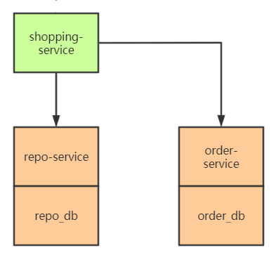
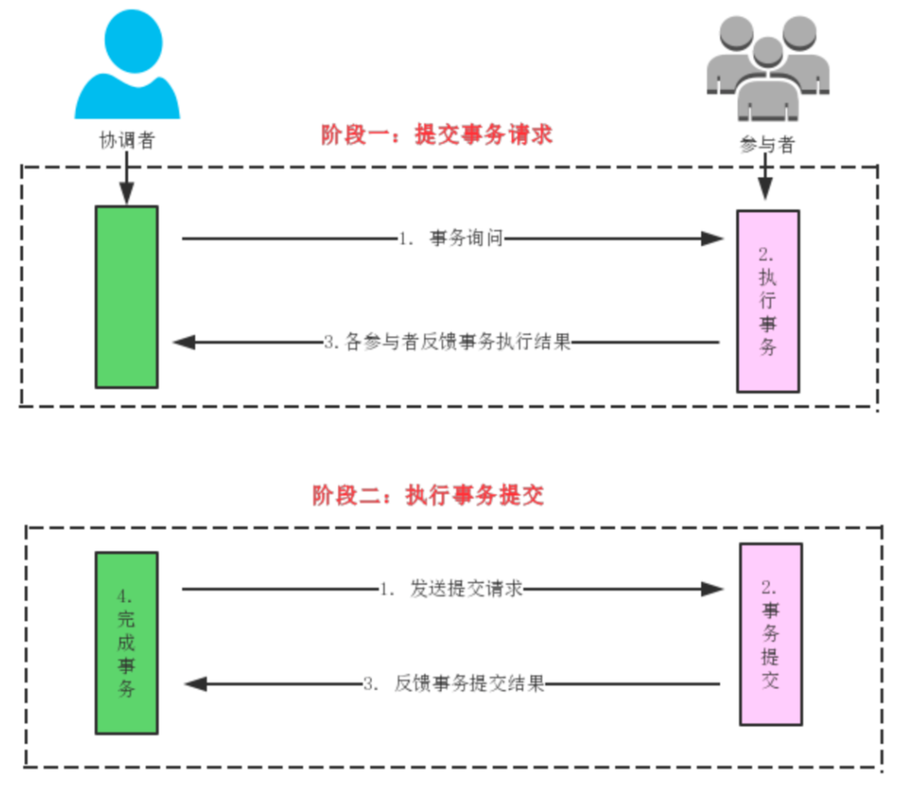
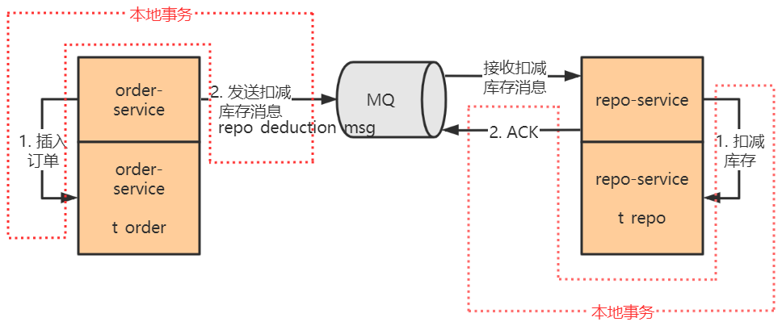
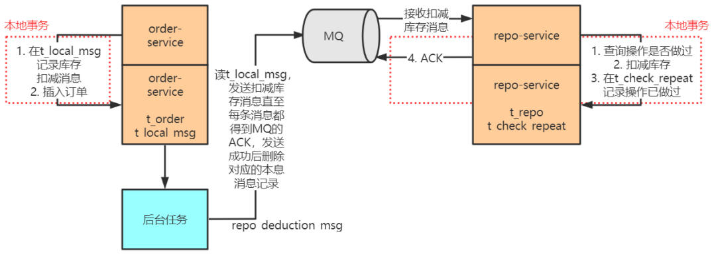

### 分布式事务模型

> 在分布式事务模型中，一个 TM 管理多个 RM，即一个服务程序访问多个数据源
> TM 是一个全局事务管理器，协调多方 RM 本地事务的进度，使其共同提交或回滚，最终达成一种全局的 ACID 特性

+ **事务协调者（事务管理器 Transaction Manager TM）：** shopping-service 
+ **事务参与者（资源管理器 Resource Manager RM）：** repo-service + order-service

### 2PC【Prepare + Commit + Rollback】

1. **两阶段**：
   + **准备阶段 Prepare**：**预** 写入，等待响应
   + **提交阶段 Commit**：**共同** 提交  或  回滚  （提交后返回不全为OK，也可再次回滚）

2. **实现：**所有 **RM参与者** 提供三个接口（可以理解成 XA 协议）

   1. **Prepare**：TM 调用接口查询 RM 本地事务是否就绪
   2. **Commit**：TM 调用接口要求 RM 本地事务提交
   3. **Rollback**：TM 调用接口要求 RM 本地事务回滚

   > 可以将这三个接口简单地（但不严谨地）理解成 XA 协议（分布式事务处理标准），MySQL、Oracle、DB2 这些主流数据库都实现了 XA 协议。

3. **缺点：**

   1. 阶段一同步阻塞
   2. 协调者单点宕机
   3. 提交阶段若 RM 没反馈提交结果，TM 无法确定 RM 是否提交 [ 网络故障 / RM 宕机 ]

   > 2PC 除了性能和可靠性上存在问题，它的适用场景也很局限，它要求参与者实现了 XA 协议，使用 XA 协议的数据库作为参与者可以完成 2PC 过程。
   >
   > 上面的电商场景无法使用 2PC，因为 shopping-service 通过 Rest 接口调用 repo-service 和 order-service，间接访问 repo_db 和 order_db。除非 shopping-service 直接配置 repo_db 和 order_db 作为自己的数据库。（保证3个Rest接口使用同个数据库连接对象即可实现，但不会这么做）

### TCC【Try + Commit + Cancel】

> 2PC是数据库层面的XA协议，TCC是服务层面上的2PC，面向微服务。

1. **实现：**
   + **阶段一：准备阶段。**协调者调用所有的每个微服务提供的 Try 接口，将整个全局事务涉及到的资源锁定住，若锁定成功 Try 接口向协调者返回 OK。
   + **阶段二：提交阶段。**若所有的服务的 try 接口在阶段一都返回 OK，则进入提交阶段，协调者调用所有服务的 Confirm 接口，各个服务进行事务提交。如果有任何一个服务的 Try 接口在阶段一返回 OK 或者超时，则协调者调用所有服务的 Cancel 接口。

2. **细节：**
   + 如何解决2PC中缺点三：**多次请求重试**
   + 重试过程如何保证幂等：**人工维护去重表**

> TCC 由支付宝团队提出，被广泛应用于金融系统中。我们用银行账户余额购买基金时，会注意到银行账户中用于购买基金的那部分余额首先会被冻结，由此我们可以猜想，这个过程大概就是 TCC 的第一阶段。

### 事务状态表 

> **TM协调者** 借助 事务状态表 实现 类似TCC事务解决方案。

| 分布式事务 ID   | 事务内容                                                     | 事务状态                                                     |
| :-------------- | :----------------------------------------------------------- | :----------------------------------------------------------- |
| global_trx_id_1 | 操作 1：调用 repo-service 扣减库存 操作 2：调用 order-service 生成订单 | 状态 1：初始  状态 2：操作 1 成功  状态 3：操作 1、2 成功 |

> 初始状态为 1，**多次请求重试直至**每成功调用一个服务，则更新一次状态，最后所有的服务调用成功，状态更新到 3。

> 在此基础上，可以启动后台任务扫描状态表，若在事务周期阈值内状态还未更新到 3，后台任务 **重新调用 TM协调者**， 再次执行任务【注意 RMs 幂等去重】。后台任务多次失败则 **人工介入干预**。

 

### 基于消息中间件的最终一致性事务

> 无论是 2PC、TCC 还是 事务状态表，基本都遵守 XA 协议思想，本质上都是 TM 协调 RMs 进度，缺点：**操作耦合度高**、全局事务期间**锁住资源**。
>
> 因此，互联网服务推出 **非XA协议（无TM） **的方案，即 基于消息中间件的最终一致性事务。

+ **本地事务**

  > **🍉顺序：先操作DB，再操作MQ**
  >
  > DB开启事务 -- DB操作 -- MQ操作 -- DB提交事务 （期间DB/MQ报错则直接回滚）

+ **错误方案**

  

  > order-service 发送消息失败 就 **贸然回滚** （此时MQ可能已经接受到消息，只是因为网络分区没返回OK）  
  >
  > 不断重试？但网络分区可能一时无法恢复。**生产者这里不允许回滚，**因此不行。

+ **正确方案**

  

  > 生产者添加 t_local_msg 业务操作消息表，并开启 **定时任务**，**不断重试**发送消息至MQ，直至返回OK。
  >
  > 消费者需要增加**业务去重**操作，保证消息消费的**幂等性**。
  
  > 问题：先插入订单再扣库存会有**超卖现象**
  >
  > 解决：如果repo-service因为库存不足扣减失败需要通知order-service取消订单。或者先扣减库存，成功即返回下单成功，由库存系统发送事务消息给订单系统创建订单，用户刷新页面查看订单信息再去支付