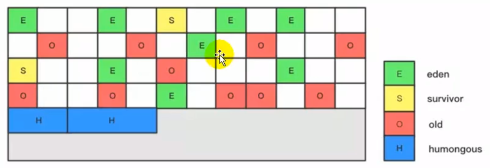

https://gitee.com/moxi159753/LearningNotes/tree/master/JVM/1_%E5%86%85%E5%AD%98%E4%B8%8E%E5%9E%83%E5%9C%BE%E5%9B%9E%E6%94%B6%E7%AF%87/5_%E8%99%9A%E6%8B%9F%E6%9C%BA%E6%A0%88

https://www.bilibili.com/video/BV1PJ411n7xZ?from=search&seid=15188220267839160314

## JVM


### 类加载器

#### **类加载器作用**


1. 类加载器负责 **从文件系统或者网络中** 加载.class文件（class文件在文件开头有特定标识）

2. ClassLoader只负责class文件加载，至于它是否可以运行，得有 **执行引擎Execution Engine** 决定

   

3. 加载得类信息存放在称为 **方法区的内存空间**

   

#### **类加载器角色**

> .class文件加载到JVM中，作为元数据模板放在方法区。该过程需要一个 **运输工具扮演快递员** 的角色，即 ClassLoader。

#### **JVM类加载过程**


1. **加载（类加载器）**

   1. 通过一个**类的全限定名**获取定义此类的二进制字节流
   2. 将这个字节流所代表的**静态存储结构**转化为**方法区**的**运行时数据结构**
   3. 在内存堆中生成这个类的java.lang.**Class对象**，作为方法区这个类的各种数据的访问入口

   > 加载class文件方式有：本地系统、网络（Web Applet）、zip/jar/war、运行时计算生成.class文件（动态代理）

2. **链接**

   1. **验证：**确保字节流信息正确安全（文件格式、元数据、字节码、符号引用等验证） 

      > 二进制魔数：CAFE BABE		插件 jclass -> show byteCode 查看字节码

      

   2. **准备：**为 **static类变量** 分配内存并且设置 **默认初始值**，即0

      > 注意：
      >
      > 1. 若是用final修饰的static，则因为final在编译的时候就分配值了，故 准备阶段 是 **显性初始化**
      > 2. 这里不会为 **实例变量** 分配初始化，**实例变量**是随着 **对象** 分配在堆中，类变量是在 **方法区** 中

      ```java
      public class Demo {
          private static int a = 1;  // 准备阶段为0，在初始化的时候才是1
          public static void main(String[] args) {
              System.out.println(a);
          }
      }
      ```

   3. **解析：**将常量池内的**符号引用（字符串标识）**转换为**直接引用（地址指针）**的过程

      > 事实上，解析操作往往会伴随着JVM在执行完初始化之后再执行

3. **初始化**：**就是执行 类构造器方法\<clinit>() 的过程**

   + \<clinit>() 不需要自己定义，当我们代码中包含static变量的时候，就会有clinit方法。

   + \<clinit>() 是执行类变量的赋值动作和静态代码块的方法，按语句出现的顺序执行，先父类后子类

   + **类构造器方法\<clinit>() != 类的构造器\<init>**
   + 虚拟机的实现上必须保证 **类构造器方法\<clinit>()** 在多线程下被**同步加锁，只执行一次**。

#### **类加载器分类**


> 这里的四者间的双亲委派是 **包含关系**，不是上层和下层，**也不是继承关系**。

1. **引导类加载器，Bootstrap ClassLoader**

   > 1. 使用C/C++语言实现的，嵌套在JVM内部，不继承自Java.lang.ClassLoader，没有父加载器
   > 2. 加载 JAVAHOME/jre/1ib/rt.jar、resources.jar
   > 3. 出于安全考虑，Bootstrap只加载包名为java、javax、sun等开头的类

   

2. **扩展类加载器，Extension ClassLoader**

   > 1. Java语言编写，sun.misc.Launcher$ExtClassLoader，派生于ClassLoader类
   > 2. 加载 JAVAHOME/jre/1ib/ext

3. **应用类加载器，Apps ClassLoader**

   > 1. Java语言编写，sun.misc.Launcher$AppClassLoader，派生于ClassLoader类
   > 2. 它负责加载环境变量classpath路径下的类库
   > 3. 是程序中默认的类加载器，一般来说，Java应用的类都是由它来完成加载

4. **用户自定义类加载器**

#### 双亲委派机制


> 好处：
>
> 1. 避免类的重复加载（类加载器+类名），如自定义String类，调用main方法报错
> 2. 保护程序安全，如定义java.lang.MyString类，ClassLoader禁止加载java.lang前缀的类而报错

1. **双亲委派的例子 SPI**

   > 当我们加载jdbc.jar 用于实现数据库连接的时候，首先我们需要知道的是 jdbc.jar是基于SPI接口进行实现的，所以在加载的时候，会进行双亲委派，最终从根加载器中加载 SPI核心类（rt.jar），接着在进行反向委派，通过线程上下文类加载器进行实现类 jdbc.jar的加载。

   

2. **沙箱安全机制**

   > 自定义String类，并调用String类的main方法
   > 但是在加载自定义String类的时候会率先使用引导类加载器加载，而引导类加载器在加载的过程中会先加载jdk自带的文件（rt.jar包中java\lang\String.class）
   > 报错信息说没有main方法，就是因为加载的是rt.jar包中的String类
   > 这样可以保证对 **Java核心源代码** 的保护，这就是沙箱安全机制

#### 触发类加载时机

1. 创建类的实例
2. 创建类的子类实例
3. 访问某个类或接口的静态变量
4. 调用类的静态方法
5. 反射


### 运行时内存


> 内存是非常重要的系统资源，是硬盘和CPU的**中间仓库**，承载着操作系统和应用程序的实时运行。JVM内存布局规定了Java在运行过程中内存申请、分配、管理的策略，保证了JVM的高效稳定运行。

> 当我们通过前面的：类的加载-> 验证 -> 准备 -> 解析 -> 初始化 这几个阶段完成后，就会用到 **执行引擎** 对类进行使用，同时执行引擎将会使用到 **运行时内存**

#### 程序计数器

> JVM中的程序计数寄存器（Program Counter Register）中，Register的命名源于CPU的寄存器，寄存器存储指令相关的现场信息。CPU只有把数据装载到寄存器才能够运行。这里，**并非是广义上所指的物理寄存器**，或许将其翻译为程序计数器会更加贴切

> **作用**：该内存区域用来存储指向下一条指令的地址，也即将要执行的指令代码。由**执行引擎**读取下一条指令

> 每个线程都有它自己的程序计数器，**是线程私有的（记录各个线程正在执行的当前字节码指令地址，才能实现多线程）**
> 它是唯一一个在Java虚拟机规范中没有规定任何outotMemoryError情况的区域


#### 虚拟机栈

+ **概述**

  > 由于**跨平台性的设计**，Java的指令都是**根据栈来设计的**。不同平台CPU架构不同，所以**不能设计为基于寄存器的**。

  > 优点是跨平台，指令集小，编译器容易实现，缺点是性能下降，实现同样的功能需要更多的指令。

  > 栈是运行时的单位，而堆是存储的单位
  >
  > 1. 栈解决程序的运行问题，即程序如何执行，或者说如何处理数据。
  > 2. 堆解决的是数据存储的问题，即数据怎么放，放哪里

  **每个线程在创建时都会创建一个虚拟机栈，其内部保存一个个栈帧，对应着一次次Java方法调用**

  **栈是线程私有，生命周期和线程一致**

+ **栈帧结构**

  > **局部变量表**（Local Variables）
  > **操作数栈**（operand Stack）（表达式栈）
  > **动态链接**（DynamicLinking）（指向运行时常量池的方法引用）
  > **方法返回地址**（Return Address）（方法正常退出或者异常退出的定义）

  

  > 虚拟机栈的操作只有两个：**进栈 / 出栈**
  >
  > 1. 每个方法执行，伴随着栈帧进栈
  > 2. 函数返回（return / throw）后栈帧出栈

  > **执行引擎** 运行的所有字节码指令只针对 **当前栈帧** 进行操作
  >
  > 如果在该方法中调用了其他方法，**对应的新的栈帧会被创建出来**，放在栈的顶端，成为**新的当前帧（压栈）**。

+ **内存溢出**

  + **StackoverflowError：**单线程内递归出不来，栈帧溢出

    > 可以使用参数 -Xss 选项来设置线程的最大栈空间，栈的大小直接决定了函数调用的最大可达深度

  + **OutofMemoryError：**多线程需要过多的虚拟机栈

1. **局部变量表**

2. **操作数栈**

3. **动态链接**

   

   > 每一个栈帧内部都包含一个指向 **运行时常量池** 中 **该栈帧** **所属方法的引用**
   >
   > 包含这个引用的目的就是为了支持 **当前方法** 的代码能够实现 **动态链接**（即当前方法可以调用其它方法）
   >
   > 描述一个方法调用了其他方法时，就是通过 **运行常量池** 中指向方法的符号引用来表示的，**动态链接作用是将符号引用转换直接引用**

   > 为什么需要运行常量池：因为在不同的方法，都可能调用常量或者方法，所以只需要存储一份即可，节省了空间

   > **方法调用**
   >
   > 在JVM中，将符号引用转换为调用方法的直接引用与**方法绑定机制**相关
   >
   > 绑定是一个字段、方法或者类在**符号引用**被替换为**直接引用**的过程，这仅仅**发生一次**。

   + **静态链接（早期绑定 / 非虚方法）**

     > 当一个字节码文件被**装载进JVM**内部时，如果**被调用的目标方法在编译期可知**，且运行期保持不变时，**在编译期**将调用方法的符号引用转换为直接引用的过程称之为静态链接

   + **动态链接（晚期绑定 / 虚方法）**

     > **如果被调用的方法在编译期无法被确定下来**，也就是说，只能够**在程序运行期将调用的方法的符号转换为直接引用**，由于这种引用转换过程具备动态性，因此也被称之为动态链接。

   > 对于虚方法（需要动态链接），如果在每次动态分派的过程中都要重新在类的方法元数据中搜索合适的目标的话就可能影响到执行效率。
   >
   > **为了提高性能**，JVM采用在类的 **方法区** 建立一个**虚方法表**（非虚方法不会出现在表中），使用索引表来代替查找
   >
   > **每个类** 中都有一个虚方法表，表中存放着各个方法的实际入口（直接指针），虚方法表会在 **类加载的链接阶段** 被创建并初始化


4. **方法返回地址**：

   > 方法的退出就是当前栈帧出栈的过程：
   >
   > 1. 将返回值压入调用者栈帧的操作数栈
   > 2. 将方法返回地址写入PC寄存器

   + 方法正常退出时

     > 将**调用者调用时PC计数器**的值作为返回地址，即调用该方法的指令的下一条指令的地址

   + 方法异常退出时

     > 返回地址是要通过 **异常处理表** 来确定，该表不存在栈帧中  // todo where

+ 方法定义的局部变量是否线程安全？

  > 如果对象是在内部产生，并在内部消亡，没有返回到外部，那么它就是线程安全的，反之则是线程不安全的。

#### 本地方法栈


> 本地方法：即非Java代码的方法。定义本地方法**（关键字：native）**时并不提供实现体，实现体由非Java语言在外部实现。
>
> 虚拟机栈管理Java方法的调用；本地方法栈管理本地方法的调用。

#### 堆


> **一个JVM进程** 只存在 **一个堆内存**，但是一个JVM进程包含多个线程
>
> **堆是线程共享**，是Java内存管理的核心区域

> 所有的**对象实例以及数组**都应当在运行时分配在堆上

> **栈帧只保存引用指针**，引用指向堆中的位置
>
> 方法结束后堆中对象不会马上移除（Stop the word 降低性能），得等到触发GC才回收

+ **逻辑分类**

  + 新生代（Eden + Survivor[to/from]  8:1:1）
  + 养老代
  + 永久代 1.7 / 元空间 1.8

  

+ **设置堆内存大小**

  > Java堆区用于存储Java对象实例，堆的大小在JVM启动时就已经设定好

  + -Xms 用于表示堆区的 **起始内存**，等价于 -xx:InitialHeapSize（默认：电脑内存 / 64）
  + -Xmx 用于表示堆区的 **最大内存**，等价于 -xx:MaxHeapSize（默认：电脑内存 / 4）

  > **动态扩缩容：**
  >
  > 随着程序的执行，所需的堆空间越来越大，则会逐渐增大堆内存空间；当堆内存使用率降低，则会逐渐减小该内存区域的大小
  >
  > 🌕 通常会将 -Xms 和 -Xmx **配置相同值**，因为扩缩容前会执行GC，如果 -Xms 设置较小的话起初**会频繁 GC（1. STW 降低性能 2.GC后JVM重新规划内存，耗时）** 
  >
  > 堆内存使用超过 **-Xmx** 则抛出 **OutOfMemoryError** 异常

+ **新生代和老年代**

  > -XX: NewRatio  = 2   // 新生代 : 老年代 = 1 : 2
  >
  > -XX: SurvivorRatio = 8  // Eden : Survivor[to/from] = 8 : 1 : 1
  >
  > 为什么要分代：优化GC性能（不分代则整堆扫描效率低，分代的话由于大部分对象 **朝生夕死**，把新对象放同一块地方进行回收，可以腾出很大空间）

+ **对象分配过程**

  > 1. New的对象先放伊Eden。此区有大小限制
  > 2. 当Eden空间填满时，**触发MinorGC，进行新生代内存清理**（销毁不可达对象，并将剩余对象移动到 Suvivor F，并给对象设置年龄计数器。加一）
  > 3. 当Eden空间再次填满时，**触发MinorGC，进行新生代内存清理**（销毁不可达对象，并将新生代剩余对象移动到 Suvivor T，年龄加一）
  > 4. 当Suvivor **对象年龄** 到达 15 时，晋升老年代  //  -XX:MaxTenuringThreshold
  > 5. 当老年代内存不足时，**触发MajorGC，进行老年代内存清理** or **触发FullGC，进行整堆内存升级**
  > 6. 当执行了MajorGC / FullGC 之后，发现依然无法进行对象的保存，就会产生OOM异常

  

  > 分配原则：
  > 1. 优先分配到新生代 Eden
  > 2. 大对象直接分配老年代（尽量避免程序中出现过多大对象）
  > 3. 长期存活的对象分配到老年代
  > 4. 动态年龄判断（当新生代 Suvivor 相同年龄对象总和大于 Suvivor 空间一半时）

+ **TLAB: Thread Local Allocation Buffer**

  **堆内存都是线程共享的吗？ 不是的**

  > 共享内存上申请空间会产生 **指针冲突问题**，需要 **加锁同步**，此时效率下降。
  >
  > 故在堆中划分出一块区域 TLAB ，为每个线程分配一个私有缓冲区，包含在 Eden 空间内。
  >
  > -XX: UseTLAB  是否开启
  >
  > -XX:TLABWasteTargetPercent  TLAB 占 Eden 空间百分比

  **TLAB 分配过程**

  > 对象先通过TLAB开辟空间，如果不能放入，则通过Eden来进行分配

  

+ **逃逸分析**

  **堆是分配对象的唯一选择吗？ 不是的**

  > JIT编译器 在 编译期间 根据 逃逸分析 的结果，如果对象并没有逃逸出方法，那么优化成栈上分配。这样无需在堆上分配内存，也无须进行垃圾回收。这也是最常见的堆外存储技术。（同时还会有 **锁消除** 的优化，降低 **线程同步** 开销）
  >
  > 如何分析：当一个对象在方法中被定义后，对象只在方法内部使用，则认为没有发生逃逸，如果对象定义后在方法外部被调用则发生逃逸。

  

  **分离对象和标量替换**

  > 在JIT阶段，如果经过逃逸分析，发现对象不会被外界访问的话，那么经过JIT优化，就会把这个对象拆解成若干个其中包含的若干个成员变量来代替。这个过程就是使用标量（最小粒度）替换聚合量，节省空间。

  **逃逸分析的不足**

  > 其根本原因就是无法保证收益比。虽然经过逃逸分析可以做 **标量替换、栈上分配、和锁消除** ，但是逃逸分析自身需要复杂计算，这是相对耗时过程。


#### 方法区

> 方法区在 **逻辑上** 是属于堆的（**物理上不是**），但有的实现不会选择去进行垃圾收集或者进行压缩。目的就是要和堆分开。


> 元空间与永久代最大的区别在于：元空间不在 **虚拟机设置内存** 中，而是使用 **本地内存**

**为什么用元数据区代替永久代 ？**

> 1. 为永久代设置空间最大限制是很难确定的，容易OOM；元空间使用的是本地内存。
> 2. 提高内存最大限制，可以降低 Full GC 频率

+ **设置方法区大小**

  **JDK7 永久代**

  >-XX:Permsize   初始大小
  >-XX:MaxPermsize   最大限制

  **JDK8 元数据区**

  >-XX:MetaspaceSize    初始大小
  >
  >-XX:MaxMetaspaceSize   最大限制   dft: -1 没有限制（尽可能用尽系统内存）

+ **方法区、堆、栈**


+ **方法区内部结构**

  

  **方法区存储的内容**

  > 1. 类型信息（class / interface / enum / annotation）
  >
  >    全名 + 修饰符（public / abstract / final）+ 直接父类全名 + 直接接口列表
  >
  > 2. 域信息（变量信息）
  >
  >    类型的所有域的相关信息：域名称、域类型、域修饰符
  >
  > 3. 方法信息
  >
  >    方法名称 + 返回类型 + 参数数量和类型 + 异常表 + 修饰符 + 字节码 
  >
  > 4. 静态变量
  >
  >    类变量随着 **类的加载** 而加载，被类所有实例共享，即使没有实例时也可以访问
  >
  > 5. 全局变量 static final
  >
  >    final 修饰的 类变量在 **编译** 的时候就会被分配了 （编译 .class - 加载 .class）
  >
  > 6. 运行时常量池
  >
  >    JVM 加载类型（类或接口等）后维护的常量池，结构跟数组项相似，包含多种不同的常量。如编译期就明确的数值，和运行期解析后才能获得的方法或字段的引用。此时不再是字节码常量池种的符号地址了，而是真实地址。

  **运行时常量池 vs 字节码常量池**

  > 字节码常量池作用：
  >
  > .java文件编译后产生.class字节码文件。而字节码包含的 类型数据 过大，不能直接存到字节码里。故可以将数据存到常量池中，字节码包含指向常量池的**符号引用**。加载时动态链接，符号引用变成直接引用，指向运行时常量池

  

  ``` java
  public class MethodAreaTest2 {
      public static void main(String args[]) {
          Object obj = new Object();
      }
  }
  // 翻译成如下字节码
  // new #2  --> #2 是 符号引用
  // dup
  // invokespecial
  ```

+ **方法区垃圾回收**

  > 有些人认为方法区（元空间 / 永久代）没有垃圾收集，其实不准确。
  > JVM规范对方法区的约束是非常宽松的，提到可以不要求虚拟机在方法区中实现垃圾收集。
  > 事实上也确实有未实现或未能完整实现方法区类型卸载的收集器存在（如JDK11时期的ZGC收集器就不支持类卸载）。

  方法区垃圾收集主要两部分：不再使用的 **常量** 和 **类型**


**小结**


**运行时数据区，是否存在Error和GC？**

| 运行时数据区 | 是否存在Error | 是否存在GC |
| ------------ | ------------- | ---------- |
| 程序计数器   | 否            | 否         |
| 虚拟机栈     | 是            | 否         |
| 本地方法栈   | 是            | 否         |
| 方法区       | 是（OOM）     | 是         |
| 堆           | 是            | 是         |


#### 对象

+ **对象实例化**

  + **方式**

    + new

    + Class.newInstance

    + Class.getConstructor  -> Constructor.newInstance

    + Object.clone （need implement Cloneable）

    + 序列化

  + **步骤**

    1. 判断对象对应的类是否已经加载、链接、初始化

       > 是否能在方法区的运行时常量池定位到该类的元信息，不行则双亲委派加载

    2. 为对象分配内存

       > 并发问题：1. CAS 失败重试   2. 每个线程分配TLAB

    3. 默认初始化（零值初始化）

       > 所有属性设置默认值，保证对象实例字段在不赋值可以直接使用

    4. 设置对象头

       > 将对象所属类（即类元数据）、对象HashCode和对象GC信息、锁信息等存储在对象头

    5. 执行 init 方法进行初始化

       > 程序角度的初始化：初始化成员变量，执行实例化代码块，调用类的构造方法，并把堆内对象的首地址赋值给引用变量

+ **对象内存布局**

  

  + **对象头**

    + 运行时元数据

      > 哈希值、GC分代年龄、锁状态标志、线程持有的锁、偏向线程ID、偏向时间戳

    + 类型指针

      > 指向方法区中存放的类元信息

  + **实例数据**

    >  对象真正存储的有效信息，包括各种类型的字段（包括父类继承和本身拥有，父类定义的变量出现在子类之前）

  + **对齐填充**

+ **对象访问定位**
  + **直接指针（HotSpot采用）**

    > 直接指针是局部变量表中的引用，直接指向堆中的实例，在对象实例中有类型指针，指向的是方法区中的对象类型数据

    

  + **句柄访问**

    > 栈局部变量表指向堆空间的句柄池，句柄池含有对象实例和元类型的指针。
    >
    > 优点：reference存储稳定的句柄地址，对象被移动时（GC会移动对象）只需改变句柄存储的指针，reference不用更改

    

#### 直接内存

> 直接内存是在Java堆外的、直接向系统申请的内存区间
>
> -XX: MaxDirectMemorySize     不受 JVM 内存回收管理

+ **Java NIO** 允许程序使用直接内存，用于数据缓冲区

  

+ **Java BIO** 非直接缓存区，拷贝两次

  


#### 字符串常量池

+ **StringTable**：
  + **字符串常量池不会存储相同内容的字符串（结构是大小固定 HashTable）** -XX:StringTablesize
  + **存放的对象**
    + 用 **双引号** 申明的 String 对象
    + 使用 String 的 **intern()** 方法
  + **所处位置**： JDK7 版本将 StringTable 从 **方法区** 移至 **堆**（原因：方法区空间较小，且垃圾回收频率低）

+ **String 不可变类**

  + **final**

    **final class String  /  final char value[]** （JDK9压缩空间，换成 final byte[] value）

    > 修饰类：类不能被继承
    > 修饰变量：基础类型 -> 不可改值
    >         		   引用类型 -> 引用的地址的值不能修改，但是这个引用所指向的对象里面的内容还是可以改变的
    > 修饰方法：不可重写

    >不可变类：是实例不能被修改的类，给String重新赋值只是改变它引用，不会改变它本来内存地址上的值
    >不可变类应遵循的规则：
    >		1、保证类不会被扩展（final String）
    >    	2、保证类的域都是final、private（private final char[]）
    >    	3、不要对外提供任何会修改对象状态的方法（concat是copyof一份）

+ **字符串拼接**

  + 常量与常量拼接，结果在常量池，原理是编译期优化

    > String s = "a" + "b";  // 得到 ab 的常量池

  + 其中有一个是变量，结构就在堆中，原理是StringBuilder.append.toString

    > String s = new String("a") + new String("b");
    >
    > 总共创造 6 个对象：
    >
    > 1. new StringBuilder()
    > 2. new String("a")
    > 3. 常量池 “a”
    > 4. new String("b")
    > 5. 常量池“b”
    > 6. StringBuilder.toString -> new String("ab")

+ **线程安全**

  >  String 安全；StringBuffer 安全（TLB Buffer）； StringBuilder 不安全


### 执行引擎

> 执行引擎属于JVM下层，包括 解释器、及时编译器、垃圾回收器


> 虚拟机是相对于物理机的概念，这两种机器都有代码执行能力。区别是物理机的执行引擎是直接建立在处理器、缓存、指令集和操作系统层；而虚拟机的执行引擎则是由软件自行实现的，因此可以不受物理条件制约地定制指令集与执行引擎的结构体系，能够执行不被硬件直接支持的指令集格式


#### 引擎工作流程

+ 执行引擎通过 程序计数器 获取字节码指令
+ 每当执行完一条指令后，PC寄存器 就会更新下一条需被执行的指令地址
+ 在执行指令过程中，通过存储在局部变量表中的 reference 定位到 堆的对象实例信息 和 方法区的类型信息 


#### 代码编译与执行

**[ Java编译器：编译 ] + [ JVM 执行引擎: 解析 + JIT编译 ]** 


+ **Java 编译器 （与 JVM 无关）**

  > Java代码编译是由Java源码编译器来完成

  

+ **执行引擎**

  **Java半解释半编译型语言**

  > Java字节码的执行是由JVM执行引擎来完成：解析器 + JIT编译器

  

  + **解释器**

    > JVM **执行引擎** 的 解释器 对字节码逐行解释，将字节码文件中内容解析为对应平台（Win/Linux）的本地机器指令执行。

  + **JIT 编译器**

    > JIT（Just In Time Compiler）：就是虚拟机将源代码 .class 直接编译成和本地机器（Win/Linux）平台相关的机器语言。寻找 **热点代码**，翻译成本地代码后，做缓存操作，存储在方法区。

  

  **既然有了JIT编译器，为何还要解析器“拖累”程序执行性能？**

  >关注点：应用是否看重程序启动时间
  >
  >当程序启动后，解释器可以马上发挥作用，省去编译的时间；而编译器在程序启动后，花时间将字节码编译为本地机器码，换取后续高效的执行性能。

  

+ **热点探测技术**
  + **调用计数器（函数 / 循环体代码）**
  + **热点衰减**：当超过一定时间限度，如果 方法 / 循环体 调用次数仍不足以进行编译器编译，那计数器就会减半，这个过程称为计数器热度的衰减，这段时间就称为统计的半衰周期。


#### 机器码 / 字节码


+ C / C++ 编译过程分成两个阶段：编译和汇编
+ Java 字节码 .class 是中间状态的机器码，比机器码更抽象，需要转译成机器码才能执行


#### 垃圾回收

> 垃圾回收：指在运行程序中**没有指针指向**的对象，需要被回收。
>
> GC 关注于 **堆（分代）**和 **方法区**，频繁收集 **新生代**，较少收集 **老年代**，极少收集 **方法区**


+ **相关算法**

  + **标记阶段**

    > 在GC执行垃圾回收之前，首先需要区分出内存中哪些是存活对象，哪些是已经死亡的对象。只有被标记为己经死亡的对象，GC才会在执行垃圾回收时，释放掉其所占用的内存空间，因此这个过程我们可以称为垃圾标记阶段。

    + **引用计数法**

      > 每个对象保存一个整型的引用计数器属性，用于记录对象被引用的情况。
      >
      > 缺陷：无法处理 **循环引用** 造成的 **内存泄漏**。

      ```java
      RefCountGC obj1 = new RefCountGC();
      RefCountGC obj2 = new RefCountGC();
      obj1.reference = obj2;
      obj2.reference = obj1;
      obj1 = null;
      obj2 = null;
      ```

      

      **Q：但Python使用是引用计数器，如何解决循环引用无法回收的问题**

      **A：**计数器是强引用计数器，使用 **弱引用** 区分可解决循环引用。若 A 强引用 B，则 B 引用 A 就**降为弱引用**，当判断是否为无用对象时，**仅考虑强引用计数是否为 0**，不关心弱引用计数。当环上的强引用计数减至 0 时销毁引用的对象。

      

    + **可达性分析**（根搜索算法）

      

      **GC Roots Sets包括：**

      + 虚拟机栈 / 本地方法栈：方法入参、局部变量
      + 方法区：常量池中引用的对象
      + 所有被 同步锁Synchronized 持有的对象
      + JVM内部引用：基本数据类型对应的Class对象、系统类加载器

      

    + **finalization 机制**

      当垃圾回收器发现没有引用指向一个对象，即：**垃圾回收此对象之前，总会先调用这个对象的 finalize() 方法**

    

    + **对象的生命状态**

      + **可触及的**：从根节点开始，可以到达这个对象。

      + **可复活的**：对象的所有引用都被释放，但是对象有可能在finalize（）中复活。

      + **不可触及的**：对象的 finalize() 被调用，并且没有复活，就会进入不可触及状态。不可能被复活，因为 **finalize()只会被调用一次**。

        ```java
        protected void finalize() throws Throwable {
            super.finalize();
            System.out.println("调用当前类重写的finalize()方法");
            canReliveObj = this;
        }
        
        // -----------------第一次gc操作------------
        // 调用当前类重写的finalize()方法
        // obj is still alive
        // -----------------第二次gc操作------------
        // obj is dead
        // 在进行第一次清除的时候，会执行finalize方法，然后对象进行了一次自救操作，但是因为finalize()方法只会被调用一次，因此第二次该对象将会被垃圾清除。
        ```

    

    + **MAT 与 JProfiler 的GC Roots 溯源**

    

  + **清除阶段**

    > 当成功区分出内存中存活对象和死亡对象后，GC接下来的任务就是执行垃圾回收，释放掉无用对象所占用的内存空间，以便有足够的可用内存空间为新对象分配内存。

    

    | 标记清除     | 标记整理           | 复制             |                                       |
    | ------------ | ------------------ | ---------------- | ------------------------------------- |
    | **速率**     | 中等               | 最慢             | 最快                                  |
    | **空间开销** | 少（但会堆积碎片） | 少（不堆积碎片） | 通常需要活对象的2倍空间（不堆积碎片） |
    | **移动对象** | 否                 | 是               | 是                                    |

    

    + **标记-清除**

      > 当内存空间不足触发GC时，就会停止整个程序（Stop The World），进行两项工作：标记 + 清除。
      >
      > 缺点:   1. 进行GC时需要停止整个应用，用户体验差
      >
      > ​			2. 清理出来的空闲内存不连续，产生碎片，需要维护空闲列表

      + **标记**：Collector从**引用根节**点遍历，标记所有被引用对象（**可达对象！不是垃圾对象**）
      + **清除**：Collector对内存从头到尾进行线性遍历，对 **没有被标记** 的对象进行回收

    

    + **复制**

      > 将内存空间逻辑上划分为两块，垃圾回收时将 **正在使用的内存** 的存活对象复制到 **未被使用的内存** 中，之后清除正在使用的内存的所有对象，最后交换两个内存的角色。（解决 标记-清除 **内存碎片化** 缺点）
      >
      > 缺点：需要两倍的内存空间

    

    + **标记-压缩**

      > 新生代死亡对象多，老年代存活对象多，在**老年代**使用复制算法，存在 **复制时间成本高** 缺点

      **流程**：**（Mark + Sweep + Compact）**

      标记-清除算法执行完后，再进行内存整理。将所有的存活对象压缩到内存的一端，按顺序排放。

  

  + **分代收集**

    > 上述算法都具有自己的优势，因此需要根据不同情况使用不同的算法。
    >
    > **（分代）**不同的对象的生命周期是不一样的。因此，分代收集算法应运而生，提高垃圾回收效率。

    + **新生代**

      + 特点：区域较小，生命周期短，存活对象少，回收频繁
      + 算法：**复制算法**，复制算法效率只与当前存活对象量的多少有关，故在年轻代速度是最快的

      

    + **老年代**

      + 特点：区域较大，生命周期长，存活对象多，回收不频繁
      + 算法：**标记-清除** 和 **标记-整理** 的混合实现


+ **相关概念理解**

  + **System.gc**

    > System.gc() 和 Runtime.getRuntime().gc() 会显示触发 FullGC，对新生代和老年代进行回收
    >
    > 免责声明：不能确保立刻生效（SafePoint）

  

  + **内存溢出**

  + **内存泄漏**

    > 严格来说，只有对象不会再被程序用到了，但是GC又不能回收他们的情况，才叫内存泄漏

    + 单例模式：如果单例持有外部对象引用，则外部对象不能被回收，可能导致泄漏（单例生命周期等同于应用）。

    + 会话连接：数据库、网络、文件等 **连接** 必须手动关闭，否则无法被回收。

    

  + **Stop The World**

    > JVM GC时，应用程序线程会被暂停，产生停顿

    

  + **操作系统语境的并发和并行**

    + **并发**

      > 并发不是真正意义上的 **同时进行（并行）**，只是CPU把一个时间段划分成几个时间片段，然后在时间区间来回切换。
      >
      > 由于CPU处理的速度非常快，只要时间间隔处理得当，即可让用户感觉是多个应用程序同时在进行。

    + **并行**

      > 当系统有 **多个CPU** 时，当一个CPU执行一个进程时，另一个CPU可以执行另一个进程，两个进程**互不抢占CPU资源**。
      >
      > **注**：其实决定并行的因素不是CPU的 **个数**，而是CPU的 **核数**，比如一个CPU多个核也可以并行

      

  + **垃圾收集器语境的并发和并行**

    + **串行**：指一条垃圾收集线程工作，此时用户线程处于等待状态    eg:  Serial 收集器
    + **并行**：指多条垃圾收集线程**并行**工作，但此时用户线程**仍处于等待状态**    eg:  Paralle 收集器  
    + **并发**：指用户线程和垃圾收集线程**同时执行（但不一定时并行，可能时间片切换执行）**, 没有**STW**   eg:  G1 CMS

    

  + **安全点与安全区**

    + **安全点**

      > 程序执行时并非在任意地方都能停顿下来开始GC，只有在 **特定的位置（安全点 SafePoint）** 才能停顿下来开始GC。
      >
      > 安全点选择很重要，**如果太少则导致每次GC时间过长，如果太多则导致每次GC切换性能开销导致的总GC时间过长**
      >
      > 大部分指令执行时间很短暂，安全点通常会选择在 **执行时间长的指令**。

      主动式中断：各个线程运行到安全点时将自己中断挂起

    

    + **安全区域**

      > 线程处于阻塞状态时，无法走到安全点去中断挂起。
      >
      > 安全区域 解决此问题：指在 **一段代码片段中**，对象引用关系不会发生变化，故在这个区域中任何位置GC都是安全的
      >
      > **安全区域 是扩展的 安全点**

      

  + **四种引用**

    + **强引用**

      > 只要强引用关系还存在，垃圾收集器就永远不会回收掉被引用的对象
      >
      > ```java
      > Object o = new Object();
      > o = null;  // 引用置为 null
      > ```

    + **软引用**

      > 在 JVM 垃圾回收时，第一次回收后仍内存溢出时，则把这些对象列入回收范围中，进行第二次回收。
      >
      > 场景：适合做缓存，缓存需要很多内存，容易OOM，用软引用来避免这问题
      >
      > ```java
      > // 创建强引用与对象关联，现在该对象为强可达状态
      > Object o = new Object();   
      > // 再创建一个软引用关联该对象
      > SoftReference<Object> srf = new SoftReference<Object>(o);
      > // 消除强引用，现在只剩下软引用与其关联，该String对象为软可达状态
      > o = null;        
      > // 重新关联上强引用
      > o = sff.get();
      > ```

    + **弱引用**

      > 在 JVM 垃圾回收时必回收（第一次就回收）
      >
      > ```java
      > Object o = new Object(); 
      > WeakReference<Object> wrf = new WeakReference<Object>(o);
      > System.gc();       
      > System.out.println(wrf.get());   // null
      > ```

    + **虚引用**

      > 对象是否有虚引用，完全不会对其生存时间构成影响，**也无法通过虚引用来获得对象的实例**
      >
      > 设置虚引用关联的唯一目的：能在对象被回收时拿到系统通知
      >
      > ```java
      > PhantomReference<T>
      > ```

      

+ **垃圾回收器**

  + **GC分类**

    + 按 **线程数** 分，可分为 **串行式 Serial** 和 **并行式 Paralle**

      

    + 按 **工作模式** 分，可分为 **独占式 STW** 和 **并发式 Not-STW (G1 CMS)**

    

  + **GC性能指标**

    + **吞吐量：** 运行用户代码时间 占 总时间（包括GC时间） 的比例
    + **暂停时间：**执行垃圾收集时，程序工作线程被暂停的时间（STW）

    > 其中，主要抓住 吞吐量 和 暂停时间。因为随着硬件发展，内存占用越能容忍。
    >
    > **高吞吐量 和 低暂停时间 是一对矛盾：如果STW次数太少则导致每次GC时间过长（暂停时间变长），如果太多则导致每次GC切换性能开销导致的总GC时间过长（吞吐量变低）**
    >
    > 设计原则：在最大吞吐量优先的情况下，尽可能降低暂停时间。

    

    

  + **七种垃圾回收器**

    > 针对不同的场景，移动端、服务端、单机等，使用不同的垃圾收集器，提高垃圾收集的性能

    + **串行回收器：**Serial、Serial Old

    + **并行回收器：**ParNew、Parallel Scavenge、Parallel Old

    + **并发回收器：**CMS、G1

      

    + **Serial GG：**新生代，复制 + 串行 + STW
    + **Serial Old：**老年代，标记-压缩 + 串行 + STW

    > 优点：简单，单核下高效      -XX: +UseSerialGC

    + **ParNew：**新生代，复制 + 并行 + STW

    > 优点：多线程，是很多JVM在Server模式下新生代的默认GC    -XX: +UseParNewGC

    + **Parallel Scavenge：**新生代，复制 + 并行 + STW   **【吞吐量优先】**
    + **Parallel Old：**老年代，标记-压缩 + 并行 + STW   **【吞吐量优先】**

    > 优点：与ParNew不同，Parallel目标是达到可控制的**吞吐量**。
    >
    > 高吞吐量可以高效利用CPU时间，尽快完成程序运算任务，主要适合在后台运算而不需要太多交互的任务。因此，常见在服务器环境中的如 批量处理、订单处理、科学计算 的应用程序。、

    + **CMS (Concurrent-Mark-Sweep)：** **老年代**，标记-清除 + **并发**（有的标记时仍会STW，清理时并发）**【低暂停时间】**

      

      CMS 整个过程比之前的垃圾回收器复杂，分为4个主要阶段：

      + **初始标记：**STW，仅仅标出 GC Roots 能直接关联到的对象，速度非常快
      + **并发标记：**并发，从 GC Roots 的直接关联对象开始遍历对整个对象图的过程，耗时较长但不需要停顿用户线程
      + **重新标记：**STW，由于在并发标记过程中，程序的工作线程会和垃圾收集线程交叉进行，因此修正并发标记期间程序对一部分对象的标记记录
      + **并发清除：**并发，清除对象释放空间。**由于标记-清除不需要移动存活对象**，所以这阶段也可以与用户线程并发

      > 优点：并发收集、低暂停时间
      >
      > 缺点：会产生内存碎片（采用空闲列表）
      >
      > JDK14新特性：删除CMS垃圾回收器

      

    + **G1回收器：** **区域化分代式**

      > 目标：**在延迟可控的情况下获得尽可能高的吞吐量   【全功能收集器，JDK7启用，JDK9后默认】**
      >
      > 每次根据 **允许的收集时间**，优先收回价值最大的 垃圾区域 Region

      **特点：**

      + 并发与并行

        + 并行：G1在回收时可以有多个GC线程同时工作。但此时用户线程**STW**。
        + 并发：G1不会在整个标记回收阶段都STW，拥有与应用并发执行的能力

      + 分代收集（Young GC / Full GC）

        + 属于分代垃圾收集器，它会从堆空间 **逻辑上** 区分新生代和老年代；但 **物理上** 它不要求新生代或者老年代都连续

        + 将堆空间划分为 **区域（Region）,这些区域包含了逻辑上的年轻代和老年代**

        + 和之前的各类回收器不同，G1 **同时兼顾年轻代和老年代**

      + 空间整合

        内存回收以 Region 作为基本单位。Region 之间是 **复制** 算法，整体上可看作是 **标记-压缩**（可以避免 **内存碎片**，需要 STW）

      + **可预测的停顿时间**

        G1在 **追求低暂停时间外**，还建立了可预测的停顿时间模型：**能让使用者明确指定在一个长度为 M 毫秒的时间片段内，消耗在垃圾收集上的时间不超过 N 毫秒** 

        + **通过分区可以只选取部分区域进行回收**，因此对全局停顿情况也能得到较好控制
        + G1跟踪各个区域的价值大小（回收所获得的空间和回收所需时间的经验值），在后台维护一个优先列表，**每次根据允许的收集时间，优先回收价值最大的区域**，保证G1在规定的时间内可以**回收尽可能高的空间**

      + **调优**：开启G1垃圾回收器 + 设置堆的最大内存 + 设置最大的停顿时间

        -XX:+UseG1GC  开启

        -XX:G1HeapRegionSize   设置每个Region的大小，值是2的次方，范围是 1MB ~ 32MB

        -XX:MaxGCPauseMillis   设置期望达到的最大GC暂停时间指标（**JVM尽力实现，但不保证达到**），默认 200ms

        -XX:ParallelGCThread    设置STW回收线程并行数的值，最多设置为8

        -XX:ConcGCThreads   设置并发标记的线程数，ParallelGCThread 的 1/4 左右

        -XX:InititatingHeapOccupancyPercent   **触发Full GC的堆使用率阈值（Young GC是当Eden区用尽时就触发）**

      + **分区：化整为零（散）**

        

        每个区域只能属于一个角色

        Humongous主要用于存储大对象，如果超过1.5个区域，就放到H块（设置原因：堆中大对象默认会直接分配给老年代，如果是短期存在的大对象，就会由于Full GC频率低而无法立即收集）

      + **垃圾回收过程**

        **G1同时兼顾年轻代和老年代**；不同域其它回收器，或者工作在年轻代，或者工作在老年代。

        

        **Young GC：**当年轻代Eden区用尽时开始年轻代回收过程；G1的年轻代回收是 **并行且STW** 的过程

        **并发标记：**当堆内存达到阈值（默认 45%）时，开始老年代并发标记的过程（伴随Young GC）

        + 初始标记 STW + 并发标记 + 重新标记 STW + 排序 + 回收 STW

        **混合回收：**G1老年代回收不需要整个老年代被回收，每次只需要扫描部分老年代的 Region 就可以了（设置了可停顿时间）。同时，老年代回收时也伴随着 Young GC

      + **Remembered Set 记忆集** 

        Why：Eden Region中的对象会被Old Region对象引用，故在 Young GC 判断对象存活时，还需要**从老年代**扫描到新生代，**扫描整个堆** 会 **降低GC的效率**，故使用 **Remembered Set 记忆集来避免全局扫描**  

        How：每个Region各自拥有一个Remembered Set，记录其对象被引用的Region信息。当进行垃圾收集时，直接在GC Root初始化时加入 Remembered Set，同时作为扫描存活对象的入口，从而扫描 Edon 时不用经过 Old Region 

    

    + **ZGC**

      令人震惊、革命性

      **超低停顿时间：**在不影响吞吐量的情况下，实现在任意堆内存大小下都可以把垃圾收集的停顿时间限制在 10ms 以内

      ZGC收集器是一款基于 Region内存布局，不设置分代的，使用读屏障、染色指针和内存多重映射等技术来实现 **可并发的标记-压缩** 算法的，以 **超低停顿为首要目标** 的一款垃圾收集器。

    

    + 总结

      