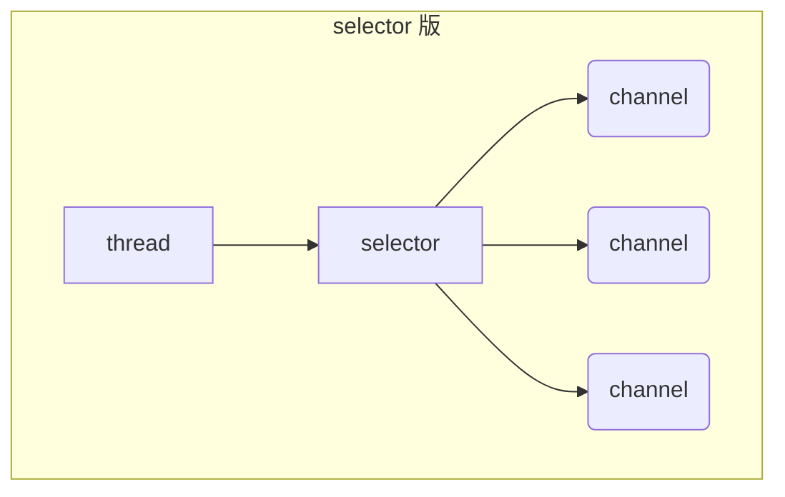

### NIO 基础

#### 1. 三大组件

##### 1.1 Channel

channel 是读写数据的 **双向通道**，类似于 stream， 但 stream 是 **单向通道**，要么是输入，要么是输出。

常见的 Channel 有：FileChannel、DatagramChannel、SocketChannel、ServerSocketChannel

##### 1.2 Selector

selector 的作用就是配合一个线程来管理多个 channel，获取这些 channel 上发生的事件。

这些 channel 工作在 **非阻塞模式** 下，不会让线程吊死在 单个 channel 上。

调用 selector 的 select() 会阻塞直到某个 channel 发生了读写就绪事件，select 方法返回这些事件交给 thread 来处理

##### 1.3 Buffer

buffer 是 io 缓冲区，用来缓冲读写数据（**优化组件**）。常见的 Buffer 有：Byte Short Int Long Float Double Char ... 

buffer 是 **非线程安全的**

buffer 属性：**capacity、position、limit**

编码姿势：

1. 向 buffer 写入数据，例如调用 channel.read(buffer)

2. 调用 **flip()** 切换至 **读模式**

3. 从 buffer 读取数据，buffer.get() 改变 position，buffer.get(i) 不变

4. 调用 **clear()** 或 **compact()** 切换至 **写模式**

写模式下，position 是写入位置，limit 等于容量，下图表示写入了 4 个字节后的状态

flip 动作发生后，position 切换为读取位置，limit 切换为读取限制

compact 动作，是把未读完的部分向前压缩，然后切换至写模式

clear 动作，切换成初始化写状态

#### 2. 文件编程

FileChannel 只能工作在 **阻塞模式** 下，无法直接打开 FileChannel，须通过 FileInputStream、FileOutputStream 或者 RandomAccessFile 的 getChannel 方法来获取 FileChannel

* 通过 FileInputStream 获取的 channel 只能读
* 通过 FileOutputStream 获取的 channel 只能写
* 通过 RandomAccessFile 是否能读写根据构造 RandomAccessFile 时的读写模式决定

#### 3. 网络编程

##### 阻塞

##### 非阻塞

##### 多路复用

