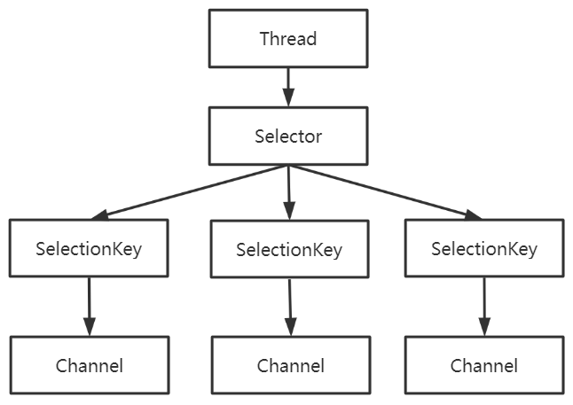
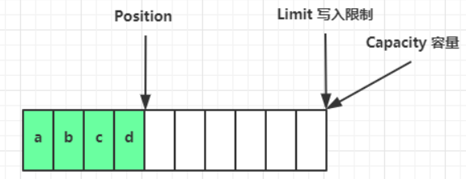
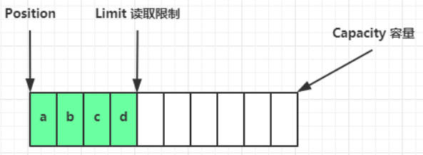
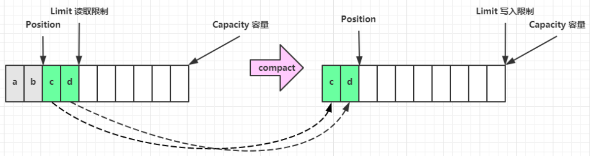
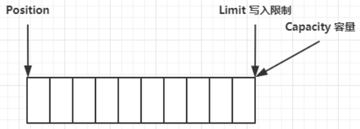
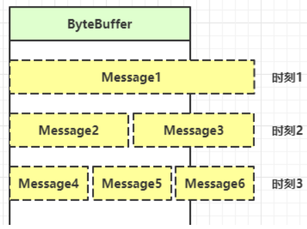
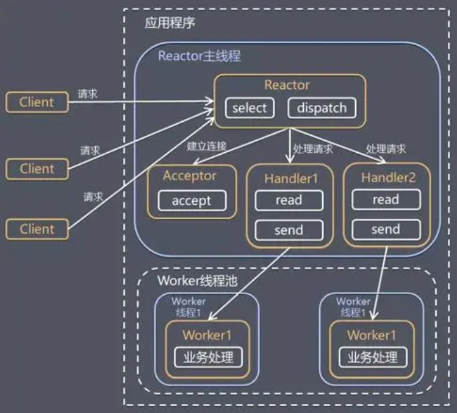
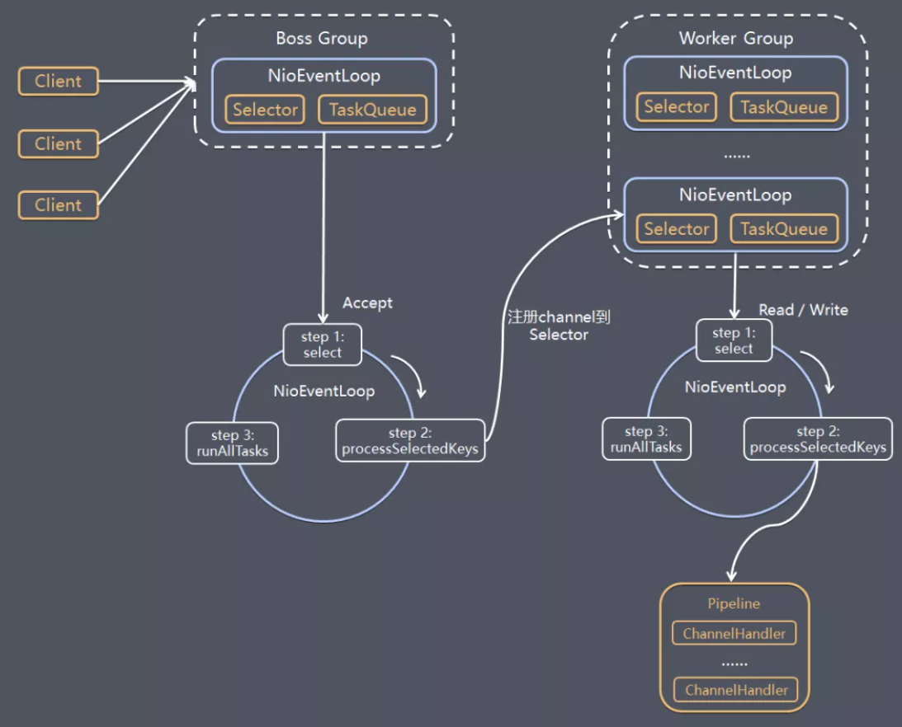
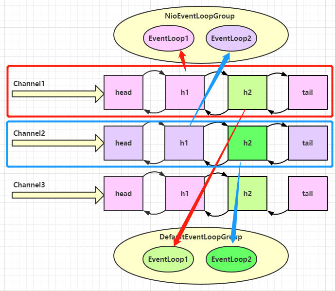
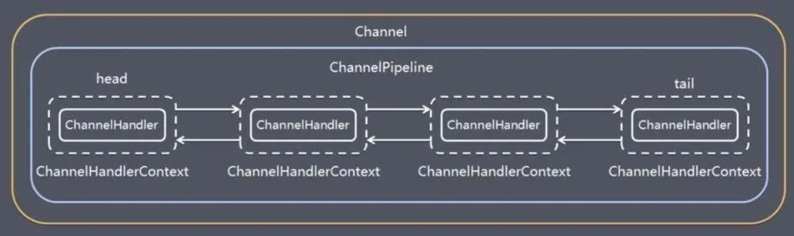

### NIO 基础

#### 1. 三大组件

##### Channel

channel 是读写数据的 **双向通道**，类似于 stream， 但 stream 是 **单向通道**，要么是输入，要么是输出。

常见的 Channel 有：FileChannel、DatagramChannel、SocketChannel、ServerSocketChannel


##### Selector

selector 的作用就是配合一个线程来管理多个 channel，获取这些 channel 上发生的事件。

这些 channel 工作在 **非阻塞模式** 下，不会让线程吊死在 单个 channel 上。

调用 selector 的 select() 会阻塞直到某个 channel 发生了读写就绪事件，select 方法返回这些事件交给 thread 来处理

Selector 对 SelectionKey : 1 对 n

SelectionKey 对 Channel : 1 对 1



**selector.select()** 何时不阻塞：

1. 事件发生时
2. 调用 selector.wakeup()
3. 调用 selector.close()
4. selector.select() 所在线程 interrupt 时


##### Buffer

buffer 是 io 缓冲区，用来缓冲读写数据（**优化组件**）。常见的 Buffer 有：Byte Short Int Long Float Double Char ... 

buffer 是 **非线程安全的**

**DirectByteBuf  零拷贝**

buffer 属性：**capacity、position、limit**

编码姿势：

1. 向 buffer 写入数据，例如调用 channel.read(buffer)

2. 🔥读 buffer 前调用 **flip()** 切换至 **读模式**

3. 从 buffer 读取数据，buffer.get() 改变 position，buffer.get(i) 不变

4. 调用 **clear()** 或 **compact()** 切换至 **写模式**

写模式下，position 是写入位置，limit 等于容量，下图表示写入了 4 个字节后的状态



flip 动作发生后，position 切换为读取位置，limit 切换为读取限制



compact 动作，是把未读完的部分向前压缩，然后切换至写模式



clear 动作，切换成初始化写状态




#### 2. 文件编程

FileChannel 只能工作在 **阻塞模式** 下，无法直接打开 FileChannel，须通过 FileInputStream、FileOutputStream 或者 RandomAccessFile 的 getChannel 方法来获取 FileChannel

* 通过 FileInputStream 获取的 channel 只能读
* 通过 FileOutputStream 获取的 channel 只能写
* 通过 RandomAccessFile 是否能读写根据构造 RandomAccessFile 时的读写模式决定


#### 3. 网络编程

##### 处理 accept 事件

```java
public class Server {
    public static void main(String[] args) {
        try (ServerSocketChannel channel = ServerSocketChannel.open()) {
            channel.bind(new InetSocketAddress(8080));
            System.out.println(channel);
            Selector selector = Selector.open();
            channel.configureBlocking(false);
            channel.register(selector, SelectionKey.OP_ACCEPT);
            while (true) {
                int count = selector.select();
                // 获取所有事件
                Set<SelectionKey> keys = selector.selectedKeys();
                // 遍历所有事件，逐一处理
                Iterator<SelectionKey> iter = keys.iterator();
                while (iter.hasNext()) {
                    SelectionKey key = iter.next();
                    // 判断事件类型
                    if (key.isAcceptable()) {
                        ServerSocketChannel c = (ServerSocketChannel) key.channel();
                        // 必须处理
                        SocketChannel sc = c.accept();
                    }
                    // 处理完毕，必须将事件移除
                    iter.remove();
                }
            }
        } catch (IOException e) {
            e.printStackTrace();
        }
    }
}
```

``` java
public class Client {
    public static void main(String[] args) {
        try (Socket socket = new Socket("localhost", 8080)) {
            System.out.println(socket);
            socket.getOutputStream().write("world".getBytes());
            System.in.read();
        } catch (IOException e) {
            e.printStackTrace();
        }
    }
}
```

**注意：**事件发生后，**要么处理，要么取消（cancel）**，不能什么都不做，否则下次该事件仍会触发，因为 select() 是水平触发模式

**select()、poll()** 模型都是水平触发模式；**epoll()** 模型即支持水平触发，也支持边缘触发，默认是水平触发

+ **Level_triggered(水平触发)：** 当被监控的文件描述符上有可读写事件发生时，epoll_wait()会通知处理程序去读写。如果这次没有把数据一次性全部读写完(如读写缓冲区太小)，那么下次调用 epoll_wait()时，它还会通知你，在上没读写完的文件描述符上继续读写，

+ **Edge_triggered(边缘触发)：** 当被监控的文件描述符上有可读写事件发生时，epoll_wait()会通知处理程序去读写。如果这次没有把数据一次性全部读写完(如读写缓冲区太小)，那么下次调用epoll_wait()时，它不会通知你，也就是它只会通知你一次，直到该文件描述符上出现第二次可读写事件才会通知你。


##### 处理 read 事件

``` java
public class Server {
    public static void main(String[] args) {
        try (ServerSocketChannel channel = ServerSocketChannel.open()) {
            channel.bind(new InetSocketAddress(8080));
            System.out.println(channel);
            Selector selector = Selector.open();
            channel.configureBlocking(false);
            channel.register(selector, SelectionKey.OP_ACCEPT);
            while (true) {
                int count = selector.select();
                // 获取所有事件
                Set<SelectionKey> keys = selector.selectedKeys();
                // 遍历所有事件，逐一处理
                Iterator<SelectionKey> iter = keys.iterator();
                while (iter.hasNext()) {
                    SelectionKey key = iter.next();
                    // 判断事件类型
                    if (key.isAcceptable()) {
                        ServerSocketChannel c = (ServerSocketChannel) key.channel();
                        // 必须处理
                        SocketChannel sc = c.accept();
                        sc.configureBlocking(false);
                        sc.register(selector, SelectionKey.OP_READ);
                    } else if (key.isReadable()) {
                        SocketChannel sc = (SocketChannel) key.channel();
                        ByteBuffer buffer = ByteBuffer.allocate(128);
                        int read = sc.read(buffer);
                        if(read == -1) {
                            key.cancel();
                            sc.close();
                        } else {
                            buffer.flip();
                            debug(buffer);
                        }
                    }
                    // 处理完毕，必须将事件移除
                    iter.remove();
                }
            }
        } catch (IOException e) {
            e.printStackTrace();
        }
    }
}
```

**注意：** keys != **selected**Keys  两个不同的集合

1.  iter.remove 作用：select 在事件发生后，就会将相关的 key 放入 **selected**Keys 集合，但不会在处理完后从 selectedKeys 集合中移除，需要我们自己编码删除

2. cancel 作用：cancel 会取消注册在 selector 上的 channel，并从 **keys** 集合中删除 key 后续不会再监听事件

3. 如何处理消息边界（**TCP 粘包问题，底层是数据流，没有固定数据包大小**）：

   

   + 思路一：**固定足够大的消息长度**，服务器按预定长度读取，缺点是浪费带宽
   + 思路二：**按分隔符拆分**，缺点是效率低
   + 思路三：**TLV 格式**，即 Type 类型、Length 长度、Value 数据。在类型和长度已知的情况下，即可分配大小合适的 Buffer


##### 处理 write 事件

``` java
public class Server {
    public static void main(String[] args) throws IOException {
        ServerSocketChannel ssc = ServerSocketChannel.open();
        ssc.configureBlocking(false);
        ssc.bind(new InetSocketAddress(8080));
        Selector selector = Selector.open();
        ssc.register(selector, SelectionKey.OP_ACCEPT);
        while(true) {
            selector.select();
            Iterator<SelectionKey> iter = selector.selectedKeys().iterator();
            while (iter.hasNext()) {
                SelectionKey key = iter.next();
                iter.remove();
                if (key.isAcceptable()) {
                    SocketChannel sc = ssc.accept();
                    sc.configureBlocking(false);
                    SelectionKey sckey = sc.register(selector, SelectionKey.OP_READ);
                    // 1. 向客户端发送内容
                    StringBuilder sb = new StringBuilder();
                    for (int i = 0; i < 3000000; i++) {
                        sb.append("a");
                    }
                    ByteBuffer buffer = Charset.defaultCharset().encode(sb.toString());
                    int write = sc.write(buffer);
                    // 3. write 表示实际写了多少字节
                    System.out.println("实际写入字节:" + write);
                    // 4. 如果有剩余未读字节，才需要关注写事件
                    if (buffer.hasRemaining()) {
                        // read 1  write 4
                        // 在原有关注事件的基础上，多关注 写事件
                        sckey.interestOps(sckey.interestOps() + SelectionKey.OP_WRITE);
                        // 把 buffer 作为附件加入 sckey
                        sckey.attach(buffer);
                    }
                } else if (key.isWritable()) {
                    ByteBuffer buffer = (ByteBuffer) key.attachment();
                    SocketChannel sc = (SocketChannel) key.channel();
                    int write = sc.write(buffer);
                    System.out.println("实际写入字节:" + write);
                    if (!buffer.hasRemaining()) { // 写完了
                        key.interestOps(key.interestOps() - SelectionKey.OP_WRITE);
                        key.attach(null);
                    }
                }
            }
        }
    }
}
```

**注意：由于可能无法一次性全部写入buffer**

+ 非阻塞模式下，无法保证把 buffer 中所有数据都写入 channel，**因此需要追踪 write 方法的返回值（代表实际写入字节数）**
+ 用 selector 监听所有 channel 的可写事件，每个 channel 都需要一个 key 来跟踪 buffer**【sckey.attach(buffer)】**，但这样又会导致占用内存过多，因此使用 **二阶段策略**：当消息处理器**第一次写入消息时**，才将 channel 注册到 selector 上；selector 检查 channel 上的可写事件，**如果所有的数据写完了**，就取消 channel 的注册（如果不取消，每次缓冲区可写时，均会触发 write 事件，故应当只在缓冲区 **写不下时** 再关注可写事件）


##### 单 Reactor 多线程模型




``` java
class BossEventLoop implements Runnable {

    private Selector selector;
    private WorkerEventLoop[] workers;
    private volatile boolean start = false;
    private AtomicInteger index = new AtomicInteger();

    public void register() throws IOException {
        if (!start) {
            ServerSocketChannel ssc = ServerSocketChannel.open();
            ssc.bind(new InetSocketAddress(8888));
            ssc.configureBlocking(false);
            selector = Selector.open();
            log.info("boss selector is {}", selector.toString());
            SelectionKey sscKey = ssc.register(selector, SelectionKey.OP_ACCEPT, null);
            this.workers = initWorkers();
            new Thread(this, "boss").start();
            log.info("boss start ....");
            start = true;
        }
    }

    private WorkerEventLoop[] initWorkers() {
        WorkerEventLoop[] eventLoops = new WorkerEventLoop[Runtime.getRuntime().availableProcessors()];
        log.debug("available processors cnt: {}", Runtime.getRuntime().availableProcessors());
        for (int i = 0; i < eventLoops.length; i++) {
            eventLoops[i] = new WorkerEventLoop(i);
        }
        return eventLoops;
    }

    @Override
    public void run() {
        while (true) {
            try {
                int cnt = selector.select();
                log.info("boss selectedkey cnt : {}", cnt);
                Iterator<SelectionKey> iter = selector.selectedKeys().iterator();
                while (iter.hasNext()) {
                    SelectionKey key = iter.next();
                    iter.remove();
                    if (key.isAcceptable()) {
                        ServerSocketChannel ssc = (ServerSocketChannel) key.channel();
                        SocketChannel sc = ssc.accept();
                        sc.configureBlocking(false);
                        log.debug("{} connected", sc.getRemoteAddress());
                        workers[index.getAndIncrement() % workers.length].register(sc);
                    }
                }
            } catch (Exception e) {
                e.printStackTrace();
            }
        }

    }
}

class WorkerEventLoop implements Runnable {

    private Selector selector;
    private volatile boolean start = false;
    private int index;

    public WorkerEventLoop(int index) {
        this.index = index;
    }

    public void register(SocketChannel sc) throws IOException {
        if (!start) {
            selector = Selector.open();
            log.info("worker-{} selector is {}", index, selector.toString());
            new Thread(this, "worker-" + index).start();
            log.info("worker-{} start ....", index);
            start = true;
        }
        try {
            // 防止 selector.select 阻塞时，sc.register(selector, SelectionKey.OP_READ, null) 失败
            selector.wakeup();
            sc.register(selector, SelectionKey.OP_READ, null);
            int cnt = selector.selectNow();
            log.info("worker-{} selectNow selectedkey cnt : {}", index, cnt);
        } catch (Exception e) {
            e.printStackTrace();
        }
    }

    @Override
    public void run() {
        while (true) {
            try {
                int cnt = selector.select();
                log.info("worker-{} select selectedkey cnt : {}", index, cnt);
                Iterator<SelectionKey> iter = selector.selectedKeys().iterator();
                while (iter.hasNext()) {
                    SelectionKey key = iter.next();
                    iter.remove();
                    if (key.isReadable()) {
                        SocketChannel sc = (SocketChannel) key.channel();
                        ByteBuffer buffer = ByteBuffer.allocate(1024);
                        int read = sc.read(buffer);
                        try {
                            if (read == -1) {
                                key.cancel();
                                sc.close();
                            } else {
                                log.info("{} message: ", sc.getRemoteAddress());
                                System.out.println(byteBufferToString(buffer));
                            }
                        } catch (Exception e) {
                            e.printStackTrace();
                            key.cancel();
                            sc.close();
                        }
                    }
                }
            } catch (Exception e) {
                e.printStackTrace();
            }
        }
    }

}


class Client {
    public static void main(String[] args) {
        try {
            SocketChannel sc = SocketChannel.open();
            ByteBuffer source = ByteBuffer.allocate(32);
            sc.connect(new InetSocketAddress("localhost", 8888));
            source.put("flip before read\n".getBytes());
            source.flip();
            sc.write(source);
            source.clear();
            source.put("hello world\n".getBytes());
            source.flip();
            sc.write(source);
            sc.write(Charset.defaultCharset().encode("hello world\n"));
            sc.write(Charset.defaultCharset().encode("so slow\n"));
        } catch (Exception e) {
            e.printStackTrace();
        }
    }
}
```

**注意：**

+ ServerSocketChannel.open()、Selector.open() 并 **不是单例模式**
+ selector 阻塞时对其 register 会报错，需要 **select.wakeup()** 使其此次 select 不阻塞


### Netty

#### 1. 基本架构

##### 多 Reactor 多线程模型




#### 2.基本组件

##### EventLoop

EventLoop 本质是 **一个线程 + 执行器（submit）**，维护了一个 Selector，里面有 run 方法处理 Channel 上源源不断的 io 事件，以及其它提交的普通任务。

EventLoopGroup 是一组 EventLoop，Channel 一般会调用 EventLoopGroup 的 register 方法来**绑定** 其中一个 EventLoop（负载均衡），**后续这个 Channel 上的 io 事件都由此 EventLoop 来处理**（保证了 io 事件处理时的线程安全）

```java
// 内部创建了两个 EventLoop, 每个 EventLoop 维护一个线程
DefaultEventLoopGroup group = new DefaultEventLoopGroup(2);
System.out.println(group.next());
System.out.println(group.next());
// 实现了 Iterable 接口提供遍历 EventLoop 的能力
for (EventExecutor eventLoop : group) {
    System.out.println(eventLoop);
}
```

**nio 工作线程** 和 **非nio工作线程** 共同处理 io 事件

```java
// 2个 非nio工作线程
DefaultEventLoopGroup normalWorkers = new DefaultEventLoopGroup(2);
new ServerBootstrap()
    // 2个 nio工作线程
    .group(new NioEventLoopGroup(1), new NioEventLoopGroup(2))
    .channel(NioServerSocketChannel.class)
    .childHandler(new ChannelInitializer<NioSocketChannel>() {
        @Override
        protected void initChannel(NioSocketChannel ch)  {
            ch.pipeline().addLast(new LoggingHandler(LogLevel.DEBUG));
            ch.pipeline().addLast(normalWorkers,"myhandler",
              new ChannelInboundHandlerAdapter() {
                @Override
                public void channelRead(ChannelHandlerContext ctx, Object msg) {
                    ByteBuf byteBuf = msg instanceof ByteBuf ? ((ByteBuf) msg) : null;
                    if (byteBuf != null) {
                        byte[] buf = new byte[16];
                        ByteBuf len = byteBuf.readBytes(buf, 0, byteBuf.readableBytes());
                        log.debug(new String(buf));
                    }
                }
            });
        }
    }).bind(8080).sync();
```

可以看到，nio group 和 非nio group 中的线程， **负载均衡地注册到 channel**（LoggingHandler 由 nio 工人执行，而我们自己的 handler 由非 nio 工人执行）





NioEventLoop 处理 **普通任务** 和 **定时任务**

``` java
NioEventLoopGroup nioWorkers = new NioEventLoopGroup(2);
nioWorkers.execute(()->{
    log.debug("normal task...");
});
nioWorkers.scheduleAtFixedRate(() -> {
    log.debug("timed task...");
}, 0, 1, TimeUnit.SECONDS);
```


##### Channel & **Future & Promise**


##### Handler & Pipeline




##### ByteBuf


##### 

