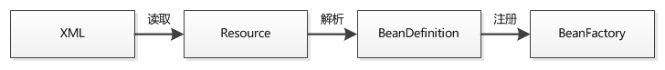
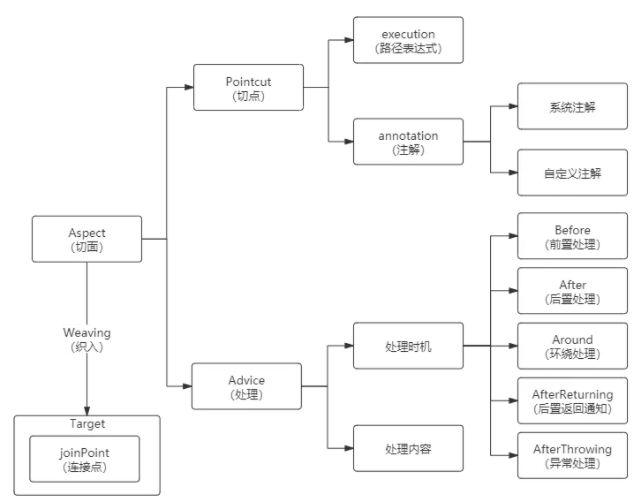
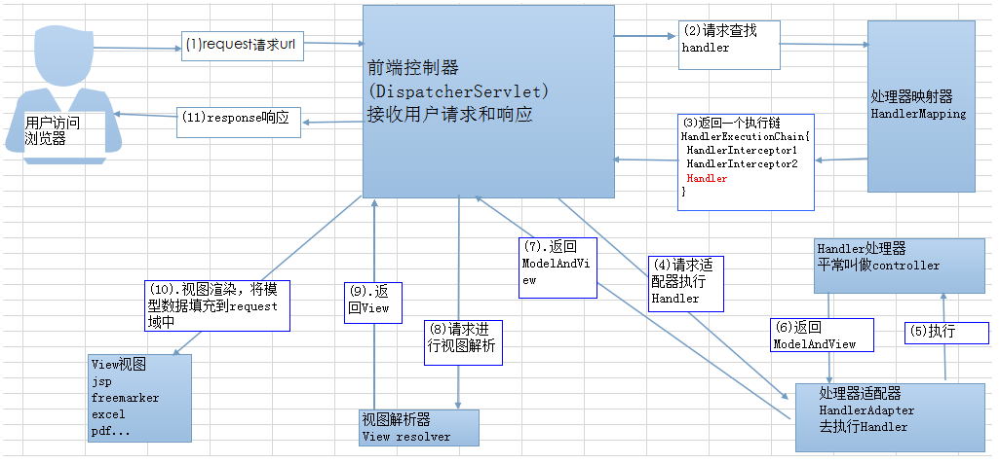

### SpringBoot 自动装配

+ Bean（调用的服务）
+ Property（服务的属性）
+ Configuration (全局Starter装配入口)


#### 定义starter项目

1. 定义要调用的服务Bean

   ``` java
   public class MsgService {
       
     private String url;
     private String accessKeyId;
     private String accessKeySecret;
   
     public MsgService(String url, String accessKeyId, String accessKeySecret) {
       this.url = url;
       this.accessKeyId = accessKeyId;
       this.accessKeySecret = accessKeySecret;
     }
   
     public void sendMsg(String msg) {
       System.out.println("Http请求，url=" + url + ";accessKeyId=" + accessKeyId + ";accessKeySecret=" + accessKeySecret + ";msg=" + msg);
     }
   ```

2. 定义属性类Property 

   ``` java
   @ConfigurationProperties(prefix = "msg")
   public class MsgProperties {
   
     private String url;
     private String accessKeyId;
     private String accessKeySecret;
       
     // 其他参数定义
     // 省略getter/setter方法
   
   }
   ```

3. 定义装配类 Configuration

   ``` java
   @Configuration
   @ConditionalOnClass(MsgService.class)
   @EnableConfigurationProperties(MsgProperties.class)
   public class MsgAutoConfiguration {
   
     @Resource
     private MsgProperties msgProperties;
   
     @Bean
     @ConditionalOnMissingBean(MsgService.class)
     @ConditionalOnProperty(prefix = "msg", value = "enabled", havingValue = "true")
     public MsgService msgService() {
       MsgService msgService = new MsgService(msgProperties.getUrl(), msgProperties.getAccessKeyId(),
           msgProperties.getAccessKeySecret());
       return msgService;
     }
   }
   ```

4. 配置 spring.factories，暴露入口

   ``` properties
   org.springframework.boot.autoconfigure.EnableAutoConfiguration=\
   com.secbro2.msg.MsgAutoConfiguration
   ```


#### 引入starter项目

1. 引入依赖

   ``` xml
   
   <dependency>
       <groupId>com.example</groupId>
       <artifactId>spring-boot-starter-msg</artifactId>
       <version>1.0-SNAPSHOT</version>
   </dependency>
   ```

2. 配置属性 application.properties

   ``` properties
   msg.enabled=true
   msg.url=127.0.0.1
   msg.accessKeyId=10000
   msg.accessKeySecret=123456789
   ```

3. 调用服务

   ``` java
   @RestController
   public class HelloWorldController {
   
   	@Resource
   	private MsgService msgService;
   
   	@RequestMapping("/sendMsg")
   	public String sendMsg(){
   		msgService.sendMsg("测试消息");
   		return "";
   	}
   }
   ```


#### 自动装配原理

1. `@SpringBootApplication `：启动类入口
   + **`@EnableAutoConfiguration`：启用 SpringBoot 的自动配置机制**
   + `@Configuration`：允许在上下文中注册额外的 bean 或导入其他配置类
   + `@ComponentScan`：扫描被 `@Component` (`@Service`,`@Controller`) 注解的 bean，注解默认会扫描启动类所在的包下所有的类 

2. `@EnableAutoConfiguration`：实现自动装配的核心注解
   
   + **`@Import(AutoConfigurationImportSelector.class)`：自动装配核心功能类**
3. `AutoConfigurationImportSelector.class` 装载流程
   1. 判断自动装配开关是否打开。默认`spring.boot.enableautoconfiguration=true`，可在 `application.properties` 或 `application.yml` 中设置
   2. 用于获取`EnableAutoConfiguration` 注解中的  `exclude` 和 `excludeName`
   3. 读取`META-INF/spring.factories`，获取需要自动装配的所有配置类
   4. 筛选满足 `@ConditionalOnXXX` 条件的配置类进行加载

4. SPI 服务发现机制

   > 当服务的提供者，提供了服务接口的一种实现之后，在jar包的META-INF/services/目录里同时创建一个以服务接口命名的文件。该文件里就是实现该服务接口的具体实现类。而当外部程序装配这个模块的时候，就能通过该jar包META-INF/services/里的配置文件找到具体的实现类名，并装载实例化，完成模块的注入。通过这个约定，就不需要把服务放在代码中了，通过模块被装配的时候就可以发现服务类了。


`@Component` 作用于类，通过类路径扫描来自动侦测以及自动装配到Spring容器中

`@Bean` 作用于方法，自定义性更强


### Spring IOC

Spring IoC：将对象之间的相互依赖关系交给 IoC 容器（Map）来管理，并由 IoC 容器完成对象的注入



+ 💛容器后处理：BeanFactoryPostProcessor、BeanPostProcessor、InstantiationAwareBeanPostProcessor
+ 💚Bean自身：Bean()、Bean.set()
+ 💙Bean后处理：init-method、destroy-method、xxxAware.setxxx()、InitializingBean, DisposableBean

---

​		**实例化（构造函数） + 填充属性（Set） + 初始化（切入点） + 销毁（切入点）**

​		**System.out.println("现在开始初始化容器")**

​		**ApplicationContext factory = new ClassPathXmlApplicationContext("springBeanTest/beans.xml");**

1. 💛BeanFactoryPostProcessor()

2. 💛BeanFactoryPostProcessor.postProcessBeanFactory()

3. 💛BeanPostProcessor()

4. 💛InstantiationAwareBeanPostProcessorAdapter()

5. 💛InstantiationAwareBeanPostProcessor.postProcessBeforeInstantiation()

6. 💚Bean()

7. 💛InstantiationAwareBeanPostProcessor.postProcessPropertyValues()

8. 💚Bean.set()

9. 💙xxxAware.setxxx()

10. 💛BeanPostProcessor.postProcessBeforeInitialization()

11. 💙InitializingBean.afterPropertiesSet()

12. 💙\<bean\>.init-method

13. 💛BeanPostProcessor.postProcessAfterInitialization()

14. 💛InstantiationAwareBeanPostProcessor.postProcessAfterInitialization()

    **System.out.println("容器初始化成功")**

    **using bean ...**

    **System.out.println("现在开始关闭容器")**

    **((ClassPathXmlApplicationContext)factory).registerShutdownHook()**

15. 💙DiposibleBean.destory()

16. 💙\<bean\>.destroy-method


https://gitee.com/SnailClimb/JavaGuide/blob/master/docs/system-design/framework/spring/Spring%E5%B8%B8%E8%A7%81%E9%97%AE%E9%A2%98%E6%80%BB%E7%BB%93.md


### Spring AOP

Spring AOP基于动态代理，**JDK Proxy** 属于运行时增强（基于反射），**AspectJ** 是编译时增强（基于字节码操作）。



``` java
// 定义 Aspect 切面
@Aspect
@Component
public class LogAdvice {
    // 定义 Pointcut 切点（id:pointcutId，path:joinPoint 连接点）
    @Pointcut("@annotation(org.springframework.web.bind.annotation.GetMapping)")
    private void pointcutId() {}

    // 定义 Advice 处理，Before 表示方法将在 joinPoint 连接点执行前执行
    @Before("pointcutId()")
    public void runBefore(){
        System.out.println("Advice runBefore joinPoint");
    }
}
```

``` java
@RestController
@RequestMapping(value = "/aop")
public class AopController {
    // joinPoint 连接点
    @GetMapping(value = "/getTest")
    public JSONObject aopTest() {
        return JSON.parseObject("{\"message\":\"SUCCESS\",\"code\":200}");
    }
}
```


### Spring 事务

+ 编程式事务，在代码中手动编码

  ``` java
  public void transaction() {
        TransactionDefinition def = new DefaultTransactionDefinition();
        TransactionStatus status = transactionManager.getTransaction(def);
         try {
           // 事务操作
           // 事务提交
           transactionManager.commit(status);
        } catch (DataAccessException e) {
           // 事务提交
           transactionManager.rollback(status);
           throw e;
        }
  }
  ```

+ 声明式事务，做配置（XML / 注解）

  ```java
  @Transactional
  public void test() {
       // 事务操作  
  }
  // 当@Transactional注解作用于类上时，该类的所有 public 方法将都具有该类型的事务属性
  ```

  **注解事务失效**

  1. @Transactional 应用在 **非 public 修饰** 的方法上

  2. @Transactional 注解属性 **propagation** 设置错误

  3. @Transactional 注解属性 **rollbackFor** 设置错误

  4. **同一个类中方法调用**，导致@Transactional失效

  5. 异常被 catch 捕获导致@Transactional失效

  6. 数据库引擎不支持的事务

  

  **隔离级别常量**

  1. **TransactionDefinition.ISOLATION_DEFAULT：**Mysql 可重复读，Oracle 读提交
  2. **TransactionDefinition.ISOLATION_READ_UNCOMMITTED：**读未提交
  3. **TransactionDefinition.ISOLATION_READ_COMMITTED：**读提交
  4. **TransactionDefinition.ISOLATION_REPEATABLE_READ：**可重复读
  5. **TransactionDefinition.ISOLATION_SERIALIZABLE：**串行化

  

  **事务传播行为**

  1. **当前已存在事务优先**
     + **TransactionDefinition.PROPAGATION_REQUIRED：**如果当前存在事务，则加入该事务；如果当前没有事务，则创建一个新的事务**（99%）**
     + **TransactionDefinition.PROPAGATION_SUPPORTS：** 如果当前存在事务，则加入该事务；如果当前没有事务，则以非事务的方式继续运行
     + **TransactionDefinition.PROPAGATION_MANDATORY：** 如果当前存在事务，则加入该事务；如果当前没有事务，则抛出异常。（mandatory：强制性）
  2. **当前已存在事务次之**
     + **TransactionDefinition.PROPAGATION_REQUIRES_NEW：** 创建一个新的事务，如果当前存在事务，则把当前事务挂起
     + **TransactionDefinition.PROPAGATION_NOT_SUPPORTED：** 以非事务方式运行，如果当前存在事务，则把当前事务挂起
     + **TransactionDefinition.PROPAGATION_NEVER：** 以非事务方式运行，如果当前存在事务，则抛出异常
3. **嵌套执行  PROPAGATION_NESTED：**内层事务依赖于外层事务。外层事务失败时，会回滚内层事务所做的动作。而内层事务操作失败并不会引起外层事务的回滚。 
  

  
**@Transactional(rollbackFor = Exception.class)**
  
  在 `@Transactional` 注解中如果不配置 `rollbackFor` 属性，那么事务只会在遇到 `RuntimeException` 的时候才会回滚,加上 `rollbackFor=Exception.class`，可以让事务在遇到非运行时异常时也回滚。


### Spring 设计模式

- **工厂设计模式** : Spring使用工厂模式通过 `BeanFactory`、`ApplicationContext` 创建 bean 对象。
- **代理设计模式** : Spring AOP 功能的实现。
- **单例设计模式** : Spring 中的 Bean 默认都是单例的。
- **模板方法模式** : Spring 中 `jdbcTemplate`、`hibernateTemplate` 等以 Template 结尾的对数据库操作的类，它们就使用到了模板模式。
- **包装器设计模式** : 我们的项目需要连接多个数据库，而且不同的客户在每次访问中根据需要会去访问不同的数据库。这种模式让我们可以根据客户的需求能够动态切换不同的数据源。
- **观察者模式:** Spring 事件驱动模型就是观察者模式很经典的一个应用
- **适配器模式** :Spring MVC 中也是用到了适配器模式适配 `Controller`


### SpringMVC 执行流程



1. 客户端（浏览器）发送请求，直接请求到 `DispatcherServlet`。
2. `DispatcherServlet` 根据请求 URL 调用 `HandlerMapping`，解析请求对应的 `Handler`。
3. 解析到对应的 `Handler`（也就是我们平常说的 `Controller` 控制器）后，开始由 `HandlerAdapter` 适配器处理。
4. `HandlerAdapter` 会根据 `Handler `来调用真正的处理器来处理请求，并处理相应的业务逻辑。
5. 处理器处理完业务后，会返回一个 `ModelAndView` 对象，`Model` 是返回的数据对象，`View` 是个逻辑上的 `View`。
6. `ViewResolver` 会根据逻辑 `View` 查找实际的 `View`。
7. `DispaterServlet` 把返回的 `Model` 传给 `View`（视图渲染）。
8. 把 `View` 返回给请求者（浏览器）


​	**SpringMVC 注解**

​	`@Controller` 返回一个页面

​	`@Controller + @ResponseBody` 返回 JSON 或 XML 形式数据

​	`@RestController` 返回 JSON 或 XML 形式数据

​	`@RequestMapping` URL 映射

​	`@RequestParam` Query 请求参数

​	`@PathVariable` Restful 路径参数

​	`@CookieValue`  Cookie 参数

​	`@ExceptionHandler`  Controller 异常处理函数


https://mp.weixin.qq.com/s/ovLO8gn_0GFrNFIii6niKw