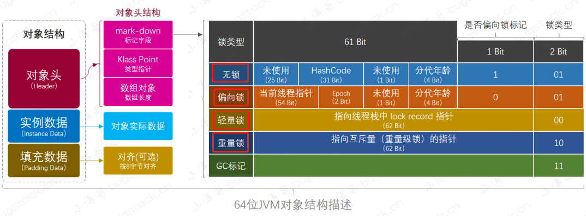
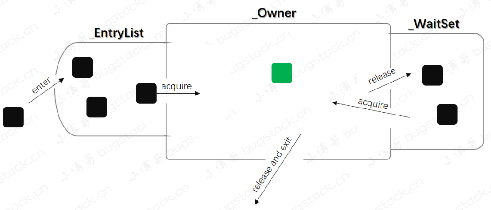
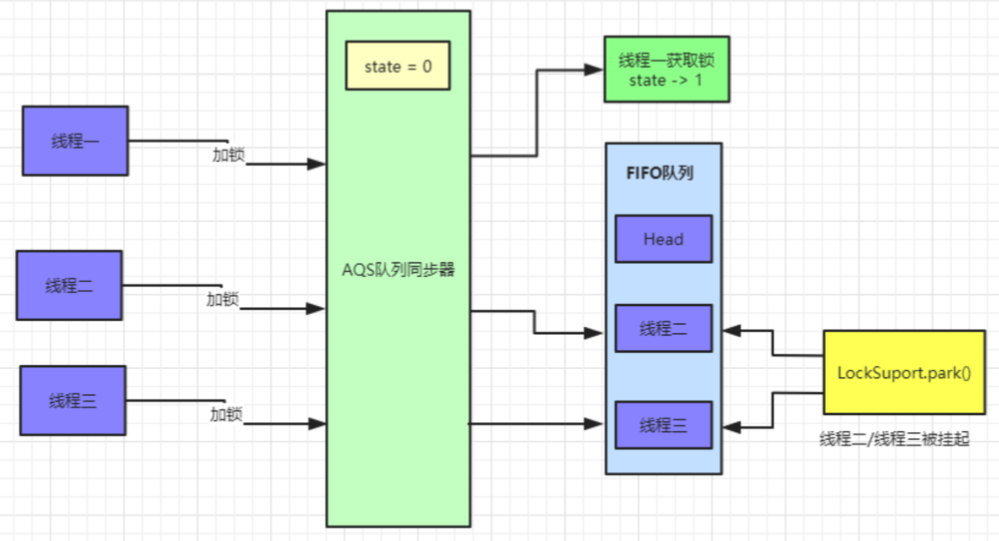
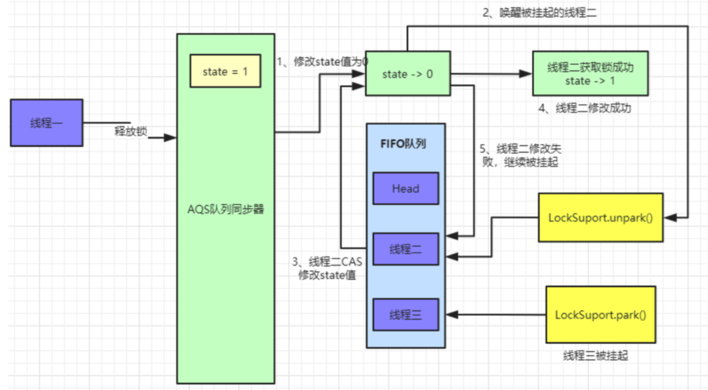
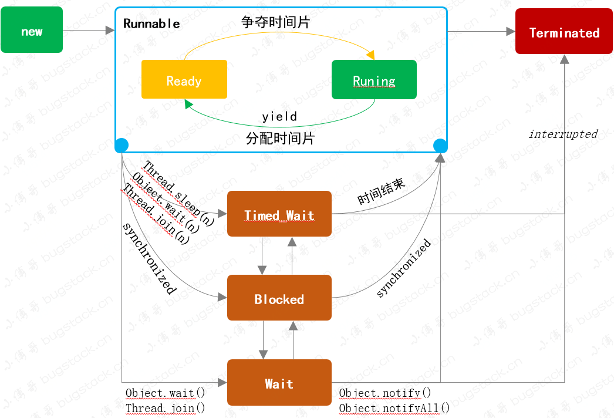

### 进程、线程、协程

+ 内核态 vs 用户态
+ 并行 vs 并发
+ 计算型任务（CPU密集型） vs 交互型任务（I/O密集型）


### volatile

+ **why：**

  + **原子性：** 多个操作，要么全部执行**且执行过程不被打断**，要么被打断就都不执行

  + **可见性：**当多个线程访问同一变量时，一个线程修改了变量值，其它线程能**立刻感知到修改**

    +  Java 多线程的内存模型中，每个线程运行时开辟了缓存空间（解决主存读取速度慢的缺点），但使用缓存则会有 **缓存读写一致性** 问题。
    + 可见性得感知到修改后，从主存拿新数据，而不是从缓存拿旧数据

  + **有序性：**程序执行顺序按照代码的先后顺序执行**（包括多线程）**，阻止指令重排

    + JVM为提高程序执行效率，对**数据无依赖（只考虑单个线程下）的指令**进行**重排序**优化（编译器和处理器提高并行度）

    + 由于JVM只可分析单个线程下的数据依赖，故指令重排序不会影响单个线程的执行，但是**会影响到线程并发执行的正确性** 

    + JVM自带的有序性原则（happens-before）:

      > 程序次序规则：单线程内，按照代码顺序，书写在前面的操作先行发生于书写在后面的操作  
      >
      > 锁定规则：unLock操作先行发生于后面对同一个锁额lock操作  
      >
      > volatile变量规则：volatile修饰的变量，写操作先行发生于后面对这个变量的读操作  
      >
      > 传递规则：如果操作A先行发生于操作B，而操作B又先行发生于操作C，则可以得出操作A先行发生于操作C  

+ **what：** 实现 **可见性 、有序性** 的关键字

+ **how**

  volatile汇编对应lock前缀指令，提供内存屏障功能

  + **实现可见性**：写操作强制立即写入主存，并使其它线程对应缓存行无效
  + **实现有序性**：阻止指令重排，屏障前后的指令**无法跨越屏障**进行重排

+ **单例模式（double check）**

  ``` java
  class Singleton {
      private volatile static Singleton instance = null;
      private Singleton() {}
      public static Singleton getInstance() {
          if(instance == null) {
              synchronized(Singleton.class) {
                  if(instance == null) {
                      instance = new Singleton(); // 开辟内存、初始化、指向引用
                  }
              }
          }
          return instance;
      }
  }
  ```


### synchronized

+ **why、what：** 实现多线程下 **原子性、可见性、有序性** 的关键字

+ **how：**

  + **synchronized：monitor的不同实现（锁升级过程）**

    + **偏向锁：** monitor 使用对象头中的 mark word 存储了 **当前线程对象的指针** ，每次线程进来时，monitor检查该字段是否当前线程匹配，是则放行不走 加锁/解锁 流程，如果不是则升级轻量级锁。
    + **轻量锁（自旋）：**当线程尝试获取锁时，会在 **该线程的帧栈** 中分配个 **锁记录** 的空间，并把锁对象的 mark word 字段拷贝到锁记录中。进入同步块时，使用 CAS 尝试将锁对象的 mark word更新为 **锁记录空间** 的指针地址，成功则获得锁，失败则 **自旋重试**，重试多次后则升级重量锁
    + **重量锁：**CAS修改对象头 mark word，更新为指向互斥量的指针， 若失败无法获得锁则被 **挂起**，等待 **唤醒**，开启新一轮的锁竞争。

  + **object：对象头。monitor对其锁字段做标记**

    

  + **threads：线程对象。monitor通过维护entryList、waitList队列，来管理线程对象**

    + **entryList：**竞争锁的队列。当新的线程进来时，首先与队头线程同时CAS竞争锁（非公平锁），成功则获得锁，失败则加入entryList尾部进行排队。
    + **waitList：**如果调用了**object.**wait() 方法，则当前获得锁的线程将 **归还锁**，进入waitlist 等待唤醒，唤醒后再开启新一轮的锁竞争。

    


### CAS

+ **why：**线程调度过程中，阻塞、唤醒（重量锁的互斥操作）开销大

+ **what：**无锁 / 乐观锁技术（乐观认为没有竞争，不加锁，等操作后发现有竞争再加重量锁）

+ **how：** compare and swap（CAS **整个逻辑不是原子的**（故会有 ABA 问题）)

  1. 线程从内存取值 V，并放入工作区缓存 A
  2. 对 A 进行进行业务计算，得出值 B
  3. compareAndSet 比较 A 值与现在内存的 V 值，若相等则将 B 值赋给内存 V；否则失败可自旋 （这里的compareAndSwap才是原子的）

  ```java
  class AtomicInteger {
      private volatile int value;   // 在无锁机制下需要用 volatile 保证线程间的数据是可见的（共享的）
      public final int get() {
          return value;
      }
      public final int incrementAndGet() {
          for(;;) {     // 无限循环直至成功
              int current = get();
              int next = current + 1;
              if(compareAndSwap(this, current, next)) return next;
          }
      }    
  }
  ```


### AQS 框架

+ **why + what：**AQS (AbstractQueuedSynchronizer) 抽象队列式同步器，手动实现多线程场景下的锁操作

+ **how：** 通过 **CAS** 手动维护 **volatile int state** (代表共享资源) 和 **node（FIFO 线程等待队列）** 

  ​			 多线程 cas 竞争 state 失败时会进入此队列，并调用 **LockSupport**.park 挂起当前线程

  **获取锁**

  

  **释放锁**

  

  ``` java
  public abstract class AbstractQueuedSynchronizer {
      private volatile int state;
      static final class Node {}
  
      // tryAcquire tryRelease 没有做实现，不同的锁定义不同的实现步骤
      protected boolean tryAcquire(int arg) {
          throw new UnsupportedOperationException();
      }
      protected boolean tryRelease(int arg) {
          throw new UnsupportedOperationException();
      }
      
      // ----------------- 加锁相关 ------------------------ //
      public final void acquire(int arg) {
          if (!tryAcquire(arg) &&
              acquireQueued(addWaiter(Node.EXCLUSIVE), arg))
              selfInterrupt();
      }
      // 利用 CAS 尝试抢占 state
      protected final boolean compareAndSetState(int expect, int update) {
          return unsafe.compareAndSwapInt(this, stateOffset, expect, update);
      }
      // 设置对象独占锁线程为当前线程
      protected final void setExclusiveOwnerThread(Thread thread) {
          exclusiveOwnerThread = thread;
      }    
      // 抢占失败则线程加入队列  addWaiter(Node.EXCLUSIVE)
      private Node addWaiter(Node mode) {    
          Node node = new Node(Thread.currentThread(), mode);
          Node pred = tail;
          if (pred != null) {
              node.prev = pred;
              if (compareAndSetTail(pred, node)) {
                  pred.next = node;
                  return node;
              }
          }
          enq(node);
          return node;
      }   
      // 线程在队列中挂起和唤醒 （执行addWaiter后进入acquireQueued）
      final boolean acquireQueued(final Node node, int arg) {
          boolean failed = true;
          try {
              boolean interrupted = false;
              // 加入队列后循环 竞争 挂起 唤醒 竞争 直至成功
              for (;;) {
                  final Node p = node.predecessor();
                  if (p == head && tryAcquire(arg)) {
                      setHead(node);
                      p.next = null; 
                      failed = false;
                      return interrupted;
                  } 
                  if (shouldParkAfterFailedAcquire(p, node) &&
                      parkAndCheckInterrupt())  // 挂起线程
                      interrupted = true;
              }
          } finally {
              if (failed)
                  cancelAcquire(node);
          }
      }    
      // 挂起线程
      private final boolean parkAndCheckInterrupt() {
          LockSupport.park(this);  // 挂起当前线程
          return Thread.interrupted();
      }
      
      // ----------------- 释放锁相关 ------------------------ //
      public final boolean release(int arg) {
          if (tryRelease(arg)) {
              Node h = head;
              if (h != null && h.waitStatus != 0)
                  unparkSuccessor(h);  // 唤醒线程
              return true;
          }
          return false;
      }
      // 唤醒 head 的后置节点线程
      private void unparkSuccessor(Node node) {
          int ws = node.waitStatus;
          if (ws < 0)
              compareAndSetWaitStatus(node, ws, 0);
          Node s = node.next;
          if (s == null || s.waitStatus > 0) {
              s = null;
              for (Node t = tail; t != null && t != node; t = t.prev)
                  if (t.waitStatus <= 0)
                      s = t;
          }
          if (s != null)
              LockSupport.unpark(s.thread);  // 唤醒操作
      }
  }
  ```

  ``` java
  public class LockSupport {
      public static void park(Object blocker) {
          Thread t = Thread.currentThread();
          setBlocker(t, blocker);
          UNSAFE.park(false, 0L);
          setBlocker(t, null);
      }
      public static void unpark(Thread thread) {
          if (thread != null)
              UNSAFE.unpark(thread);
      }
  }
  ```

  


### Lock 工具

+ **why：** 基于AQS实现的 Lock锁 对比 synchronized
  1. **语言**：Lock是Java API层面，synchronized是系统调用级别的
  2. **可中断**：Lock等待锁过程中可以用thread.interrupt来中断等待，而synchronized只能等待锁的释放，不能响应中断
  3. **公平锁**：Lock锁可以指定公平锁和非公平锁，synchronized只能为非公平锁
  4. **非阻塞加锁**：lock.tryLock() 尝试获取锁，不会阻塞，可以立即返回结果，而synchronized没有此功能
  5. **可重入**：Lock锁和synchronized都是可重入锁，是基于线程来分配锁
  6. **挂起唤醒**：Condition 可以定义多个，synchronized只能使用一个obj
  7. **释放锁**：Lock 需要手动释放锁以防死锁（try finally）,synchronized交给虚拟机释放锁

+ **what：** **java.util.concurrent.locks.\*** 

  + ReentrantLock：可重入锁

    ```java
    void lock();
    void lockInterruptibly() throws InterruptedException;
    boolean tryLock();
    boolean tryLock(long time, TimeUnit unit) throws InterruptedException;
    void unlock();
    Condition newCondition();
    ```

  + ReentrantReadWriteLock：读写锁

    ```java
    Lock readLock();
    Lock writeLock();
    ```


### Thread

+ **状态转换**

  ```java
  public enum State {
      NEW, RUNNABLE, BLOCKED, WAITING, TIMED_WAITING, TERMINATED;
  }
  ```

  

  + New：新创建的一个线程，处于等待状态
  + Runnable：可运行状态，包含了 Ready、Running 两个状态，具体看 CPU 分配时间片
  + Timed_waiting：**指定时间** 内让出 CPU 资源 ，此时线程不会被执行，也不会被系统调度
  + Wating：**可被唤醒 **的等待状态，此时线程不会被执行，也不会被系统调度
  + Blocked：当发生**锁竞争状态**下，没有获得锁的线程会处于挂起状态
  + Terminated：终止状态，程序流程正常结束或者发生异常

+ **相关方法**
  
  + **Thread**：yield（让出 cpu，时间片重新调度）、join（让线程进入 wait ，当线程执行完毕后再 notify）、sleep
  + **Object**：wait、notify、notifyAll（会释放锁）


### 任务

+ Runnable：无返回值

  ``` java
  public interface Runnable {
  	public abstract void run();
  }
  // thread 调用
  new Thread(()-> System.out.println("~")).start();
  // 线程池 execute 调用
  ```

+ Callable：有返回值

  ```java
  public interface Callable<V> {
      V call() throws Exception; // 方法有返回值
  }
  // 线程池 submit 方法使用
  <T> Future<T> submit(Callable<T> task)
  <T> Future<T> submit(Runnable task, T result)
  ```

+ Future：任务 **异步** 返回后，监视执行状态

  ```java
  public interface Future<V> {
      boolean cancel(boolean mayInterruptIfRunning);  // 取消任务
      boolean isCancelled();
      boolean isDone();
      V get(); // 阻塞式获取结果
      V get(long timeout, TimeUnit unit);  
  }
  ```

  


### 线程池

+ **ThreadPoolExecutor**
+ **构造参数**
  
  + **corePoolSize**：核心池大小
    + **maximumPoolSize**：线程池最多能创建的线程数
    + keepAliveTime：线程没有任务执行时最多保持的生命时间（当线程数大于corePoolSize时才会生效）
    + **workQueue**：阻塞队列，存储等待执行的任务
      + LinkedBlockingQueue：基于链表的先进先出队列，创建时没有指定队列大小，则默认为Integer.MAX_VALUE  
      + ArrayBlockingQueue：基于数组的先进先出队列，创建队列时必须指定大小
      + Synchronous：不保存提交的任务，而是直接新建线程执行新来的任务
    + **handler**：当拒绝处理任务时的策略
      + ThreadPoolExecutor.AbortPolicy：丢弃任务并抛出异常
      + ThreadPoolExecutor.DiscardPolicy：丢弃任务但不抛出异常
      + ThreadPoolExecutor.DiscardOldestPolicy：丢弃队列最前面的任务，然后重新尝试执行任务（重复直至成功）
      + ThreadPoolExecutor.CallerRunsPolicy：由调用线程处理该任务

  + **重要方法**
+ execute()：向线程池提交任务，不返回执行结果
    + submit()：向线程池提交任务，**能够返回执行结果 Future**
    + shutdown()、shutdownNow()：关闭线程池  
    
+ **执行流程**
  
  1. 如果当前线程池中的线程数目小于corePoolSize，则每来一个任务，就会创建新的线程去执行这个任务
  
  2. 如果当前线程池中的线程数目不小于corePoolSize，则每来一个任务，会尝试将其**添加到任务缓存队列**当中，若添加成功，则该任务会等待空闲线程将其取出去执行；**若添加失败（一般来说是任务缓存队列已满）**，则**会尝试创建新的线程**去执行这个任务
    3. 如果当前线程池中的线程数目达到**maximumPoolSize**，则会采取**任务拒绝策略**进行处理  
    4. 如果线程池中的线程数量**大于corePoolSize**时，如果某线程**空闲时间超过keepAliveTime**，线程将被终止，直至线程池中的线程数目不大于corePoolSize；如果允许为核心池中的线程设置存活时间（**allowCoreThreadTimeOut**），那么核心池中的线程空闲时间超过keepAliveTime，线程也会被终止

+ **不推荐使用 Executors 生成线程池对象，而是使用 ThreadPoolExecutor 构造方法**
  + **FixedThreadPool** 和 **SingleThreadExecutor** ：使用 LinkedBlockingQueue，没有初始化队列大小，允许 **请求任务** 长度为 Integer.MAX_VALUE，可能堆积大量的请求，从而导致 OOM。
  + **CachedThreadPool** 和 **ScheduledThreadPool** ：使用 Synchronous，允许创建 **线程数量** 为 Integer.MAX_VALUE ，可能会创建大量线程，从而导致 OOM。

+ 配置线程池参数
  + **CPU 密集型任务(N+1)**
  + **I/O 密集型任务(2N)**  【eg：网络、文件、数据库 ...】


### ThreadLocal

**why + what**：ThreadLocal 是 **线程变量副本** 工具类，实现 **并发场景**下 各个线程间的**变量互不干扰**

**how：** 每个线程 拥有属于自己的 Map Buffer

+ ThreadLocal 有 **静态** 内部类 ThreadLocal**Map**

  map 的 Key 是**所有线程共用的 threadlocal 对象指针**， Value 是 **不同线程变量副本**

  多个线程 与 new ThreadLocal 关系是： 多对一 

  ``` java
  public class ThreadLocal<T> {
      ThreadLocalMap getMap(Thread t) {
          return t.threadLocals;
      }    
      void createMap(Thread t, T firstValue) {
          t.threadLocals = new ThreadLocalMap(this, firstValue);
      }
      static class ThreadLocalMap { 
      	static class Entry extends WeakReference<ThreadLocal<?>> {
              Object value;
              Entry(ThreadLocal<?> k, Object v) {
                  super(k);
                  value = v;
              }
          }
      }
  }
  ```

+ Thread 有 ThreadLocal.TheadLocalMap 成员变量

  线程 与 ThreadLocal.TheadLocalMap 关系是： **一对一**

  ```java
  public class Thread implements Runnable {
      ThreadLocal.ThreadLocalMap threadLocals = null;
  }
  ```

+ 示例：

  ``` java
  ThreadLocal<User> users = new ThreadLocal();
  users.set(new User("A"))  // threadA
  users.set(new User("B"))  // threadB
  ```

  **同一个** threadlocal 对象在 set 方法中，会先获取 **不同的线程对象** thread，

  再为每个 thread 对象 创建并获取 **不同的Map对象（Buffer）** ThreadLocal.ThreadLocalMap

  因此，**不同线程有不同的 map**，map 的 key 是**同一个 threadlocal**，value 是 **不同副本变量**


### java.util.concurrent.*

+ **同步容器（所有操作都加锁，串行化）**

  + Hashtable
  + Vector

+ **并发容器（少数操作加锁，提高并发）**

  + ConcurrentHashMap：读不加锁，写加锁，减小锁粒度
  + CopyOnWriteArrayList：读不加锁，写加锁（写时复制，懒惰策略）

+ **阻塞队列（生产者消费者）**

  + ArrayBlockingQueue
  + LinkedBlockingQueue
  + PriorityBlockingQueue

+ **辅助工具**

  + CountDownLatch：**单个**线程 等待 **其它count个**线程 执行完任务后，再唤醒执行（不能复用，count没法做加法）

    ```java
    public CountDownLatch(int count)
    public void await()  // wait until count is 0 
    public boolean await(long timeout, TimeUnit unit)
    public void countDown()  // count--
    ```

  + CyclicBarrier：**一组count个**线程 互相等待到某个状态（全部await时），再一块唤醒执行（可以复用，唤醒后可以再await）

    ``` java
    public CountDownLatch(int count)
    public void await() // wait until all thread reach await()
    public boolean await(long timeout, TimeUnit unit)
    ```

  + Semaphore：互斥量

    ``` java
    public Semaphore(int permits, boolean fair) // 公平：等待时间越久被分配的优先级越高
    public void acquire()
    public boolean tryAcquire()
    public void release()
    ```

  + Timer：定时任务调度器

    ``` java
    public void schedule(TimerTask task, long delay) // 延迟 delay 后调用，仅一次
    public void schedule(TimerTask task, Date time)  // 每次到指定时间点则调度任务
    
    // 延迟 delay 后调用，调度完后，每隔 period 再次调度
    // delay 10, period 5
    public void schedule(TimerTask task, long delay, long period)  // 10 17(10+2+5) 24(10+2+5)  在实际时间点调度 
    public void scheduleAtFixedRate(TimerTask task, long delay, long period)  // 10 15 20 25 在理论时间点调度   
    
    TimerTask task = new TimerTask(()-> System.out.println("~"))
    ```

    