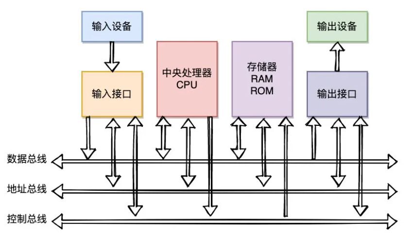
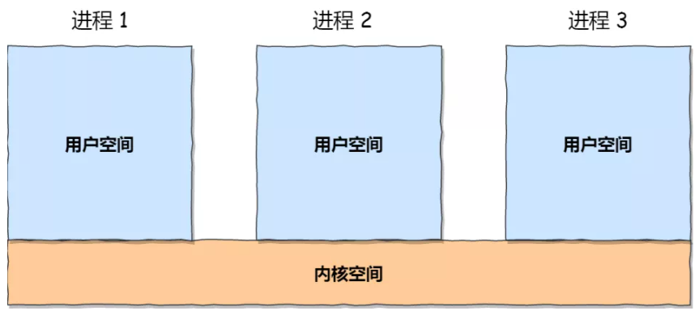
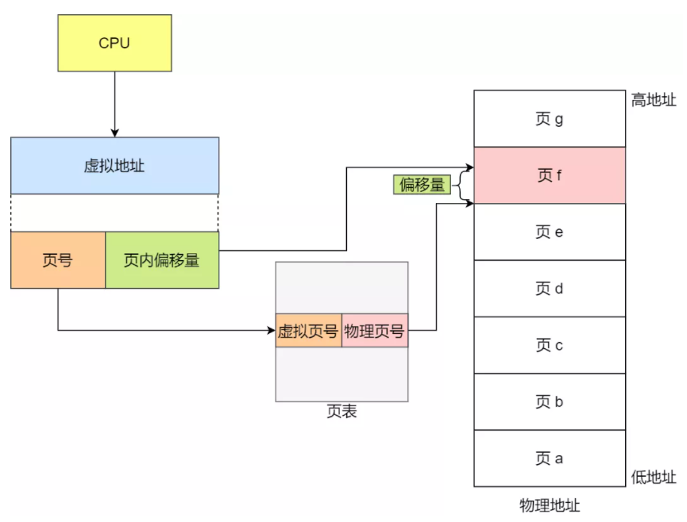
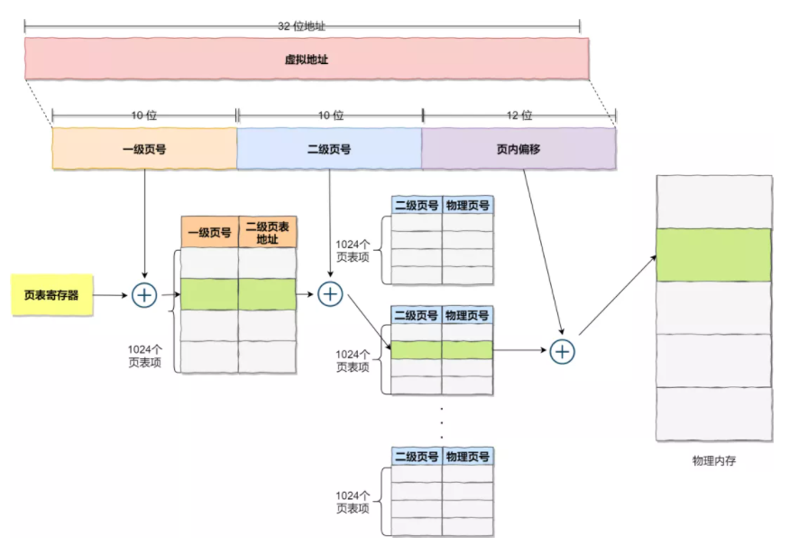
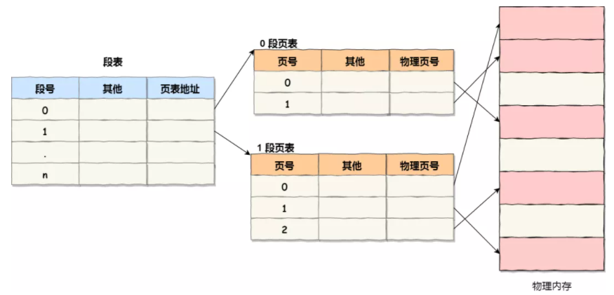
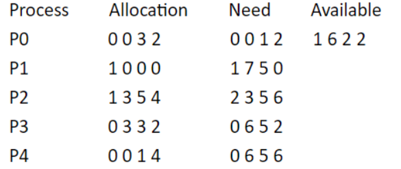
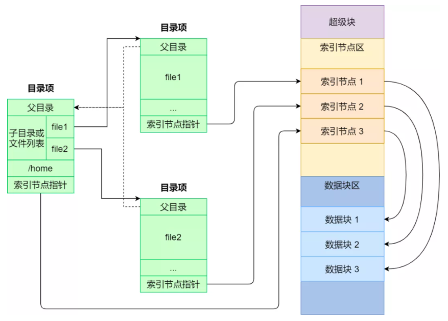

#### 内存管理



CPU 32位 指 地址总线宽度 32 位 （A0-A31），意味着 CPU 最大的寻址范围是 2^32 = 4G（区别于4GB）

​                       数据总线宽度 32 位（D0-D31），一次能读写的最大字节数是 32 Bit (4 Byte)


**虚拟内存**： 32 位CPU，每个进程有虚拟地址空间 4GB （4G x 1Byte 仅是归一方便计算），


虚拟地址空间分为 **内核空间** 和 **用户空间**：进程在用户态时，只能访问用户空间内存，只有进入内核态后，才可以访问内核空间的内存

虽然每个进程都各自有独立的虚拟内存，但是 **每个虚拟内存中的内核地址，其实关联的都是相同的物理内存**




4G 32位 虚拟地址范围 可分为两部分：页号（20Bit） + 页内偏移（12Bit） 




**多级页表**：

对于单页表的实现方式，在 32 位 和 页大小 4KB（2^12 * 1Byte） 的环境下，一个进程的页表需要装下 2^20 个页表项，每个 页表项 需要 4 Byte 来存储，则整个 4GB 空间的映射需要有 4MB 的内存来存储页表。100个进程...



分了二级表，映射 4GB 地址空间就需要 4KB 一级页表 （2^10 页表项）+ 4MB 二级页表（2^10 x 2^10 页表项）的内存，内存变大？

**局部性原理**：如果某个一级页表的页表项没有被用到，也就不需要创建这个页表项对应的二级页表了，即可以在需要时才创建二级页表

单级页表不行？内存中页表职责是将虚拟地址翻译成物理地址。假如虚拟地址在页表中找不到对应的页表项，计算机系统就不能工作了。所以页表一定要覆盖全部虚拟地址空间

**TLB**：（Translation Lookaside Buffer）页表缓存、快表 降低地址转换带来的时间复杂度

**段页式管理**：先将程序划分为多个有逻辑意义的段（**代码段、数据段、堆、栈**），再把每个段划分为多个页




**页面置换算法**

1. **FIFO（First In First Out） 页面置换算法（先进先出页面置换算法）** : 总是淘汰最先进入内存的页面，即选择在内存中驻留时间最久的页面进行淘汰。
2. **LFU （Least Frequently Used）页面置换算法（最少使用页面置换算法）** : 该置换算法选择在之前时期使用最少的页面作为淘汰页。
3. **LRU （Least Recently Used）页面置换算法（最近最久未使用页面置换算法）** ：LRU算法赋予每个页面一个访问字段，用来记录一个页面自上次被访问以来所经历的时间 T，当须淘汰一个页面时，选择现有页面中其 T 值最大的，即最近最久未使用的页面予以淘汰。


#### 进程管理

**进程是资源分配的基本单位**，进程拥有独立的地址空间；线程没有独立的地址空间，同一进程内多个线程共享其资源

**线程是CPU调度的基本单位**，在同一进程中，线程的切换不会引起进程切换，从一个进程中的线程切换到另一个进程中的线程时，会引起进程切换。

**协程是用户态线程**，线程的调度是操作系统实现的（暂停、让出、继续运行），而协程的调度权在用户。

```python
def func():
	print("a")
    yield
    print("c")
def A():
    co = func() # 获得协程函数
    next(co)    
    print("b")
    next(co)
    # a b c 
```


根据进程访问的**资源特点**，可划分为：

用户态：用户空间的资源

内核态：操作系统级别的资源（如 文件、进程、内存、设备）


**进程同步**：

+ 信号量（整型变量，PV操作）
  + **down** : 如果信号量大于 0 ，执行 -1 操作；如果信号量等于 0，进程睡眠，等待信号量大于 0；
  + **up** ：对信号量执行 +1 操作，唤醒睡眠的进程让其完成 down 操作。
+ 管程（引入条件变量，wait signal操作，在一个时刻只能有一个进程使用管程）
  + 对条件变量执行 wait() 操作会导致调用进程阻塞
  + 对条件变量执行 signal() 操作用于唤醒被阻塞的进程


**哲学家进餐**

五个哲学家围着一张圆桌，每个哲学家面前放着食物。哲学家的生活有两种交替活动：吃饭以及思考。当一个哲学家吃饭时，需要先拿起自己左右两边的两根筷子，并且一次只能拿起一根筷子。

为了防止死锁的发生，可以设置两个条件：

- 必须同时拿起左右两根筷子；
- 只有在两个邻居都没有进餐的情况下才允许进餐。

``` java
class Philosopher extends Thread{

    private Fork fork;
    
    public void run(){
        while(true){
            thinking();
            fork.takeFork();
            eating();
            fork.putFork();
        }        
    }
        
    public void eating(){ 
        try {
            sleep(1000);
        } catch (InterruptedException e) {
            e.printStackTrace();
        }
    }
    
    
    public void thinking(){
        try {
            sleep(1000);
        } catch (InterruptedException e) {
            e.printStackTrace();
        }
    }
}

class Fork{
	
    private boolean[] used={false,false,false,false,false,false};
    
    public synchronized void takeFork(){
        while(used[i]||used[(i+1)%5]){
            try {
                wait(); // 释放锁，并等待
            } catch (InterruptedException e) {
                e.printStackTrace();
            }
        }
        used[i ]= true;
        used[(i+1)%5]=true;
    }
    
    public synchronized void putFork(){
        used[i ]= false;
        used[(i+1)%5]=false;
        notifyAll();//唤醒其他线程
    }
}
```


**进程通信**

+ 匿名管道：半双工（单向交替），只能在父子进程或者兄弟进程中使用
+ 命名管道：半双工（单向交替），去除进程关系限制
+ 消息队列：全双工，读进程可以根据消息类型有选择地接收消息，而不像 FIFO 那样只能默认地接收
+ 共享存储：数据不需要在进程之间复制，速度最快
+ 套接字：可用于不同机器间的进程通信


**进程调度算法**

1. 先到先服务(FCFS)调度算法 : 从就绪队列中选择一个最先进入该队列的进程为之分配资源，使它立即执行到完成
2. 短作业优先(SJF)的调度算法 : 从就绪队列中选出一个估计运行时间最短的进程为之分配资源，使它立即执行到完成
3. 优先级调度 ： 为每个流程分配优先级，首先执行具有最高优先级的进程，依此类推。具有相同优先级的进程以 FCFS 方式执行
4. 时间片轮转调度算法 ：每个进程被分配一个时间段，称作它的时间片，即该进程允许运行的时间。
5. 多级反馈队列调度算法 ：多级反馈队列调度算法既能使**高优先级**的作业得到响应又能**使短作业（进程）**迅速完成。UNIX 采用。
   + 「多级」表示有多个队列，每个队列优先级从高到低，同时优先级越高时间片越短。
   + 「反馈」表示如果有新的进程加入优先级高的队列时，立刻停止当前正在运行的进程，转而去运行优先级高的队列；


**死锁产生的四个条件**

1. 资源互斥
2. 资源非抢占
3. 占有并等待
4. 循环等待


**避免死锁：银行家算法**

当一个进程申请使用资源的时候，银行家算法通过先 **试探** 分配给该进程资源，然后**安全检测**判断分配后的系统是否处于安全状态，若不安全则试探分配作废，让该进程继续等待。

示例：5个进程，4种资源

Allocation 已分配   Need 还需要   Available 还剩余   Request 请求



**安全检测**：减去进程Request资源，Avaliable资源能否满足其它某线程的Need资源；若没找到满足的线程，则不安全；若找到，则进入下个循环（此时回收找到的线程资源，重新计算Avaliable资源，即 **回收 + 分配**），直到**所有线程都可以被回收**，才算安全。

比如：此时 P2 Request{1,2,2,2}，减去Request，计算 Avaliable{0,4,0,0}，此时 P2既不能回收，Avaliable 又无法满足其它某一个线程的Need，故此次请求系统不安全。


#### 文件管理

Linux：一切皆文件，文件又可分为：普通文件、目录文件、链接文件和设备文件

Linux 文件系统会为每个文件分配两个数据结构：目录项（dentry）、索引节点（inode）

+ 目录项：记录文件的名字、**索引节点指针**以及与其他目录项的层级关联关系。多个目录项关联起来，就会形成目录结构，但它与索引节点不同的是，**目录项是由内核维护的一个数据结构，不存放于磁盘，而是缓存在内存**。【注：目录项 != 目录，目录是个文件，持久化存储在磁盘】
+ 索引节点：记录文件的元信息，如文件大小、访问权限、创建时间、修改时间、**数据在磁盘的位置**等等。索引节点是文件的**唯一**标识，它们之间一一对应，也同样都会被存储在硬盘中，所以**索引节点同样占用磁盘空间**。

目录项（文件名 + inode指针）-->  inode（存储文件基本信息 地址、长度、权限） -->  磁盘数据块



**文件描述符 fd = open(name, flag)**，每个进程的PCB中都会存着**各自**的**文件描述符表**，每一个表项都由两个部分组成，文件描述符 fd 和文件指针。**文件指针 **指向另一张表：**打开文件表**，此表的每一**项**存储着 **文件状态标志（可读、可写）**、**文件当前偏移量**、**v-node指针**。打开文件表是**系统级**的，进程共享。

**v-node**节点上保存了文件类型，对这个文件进行操作的函数指针以及对应的i-node节点的指针
**i-node**节点上保存了文件长度，文件数据存储在磁盘的位置，文件所属者等

**硬链接**：A 的目录项中的 inode 指针与 B 的目录项中的 inode 指针相同，即同个 inode 节点对应两个不同的文件名。删除 B 不影响 A。当 inode 节点上的链接数为0时，inode 节点和对应的数据块被回收。
**软链接**：A 的目录项中的 inode 指针与 B 的目录项中的 inode 指针不相同，A 和 B 指向的是两个不同的 inode，继而指向两块不同的数据块。但是 A 的数据块中存放的只是 B 的目录项路径。删除 B 影响 A 找到文件数据。


#### 设备管理

磁盘调度算法

1. 先来先服务算法：先到来的请求，先被服务（没考虑磁道距离，性能差）
2. 最短寻道时间优先算法：优先选择从当前磁头位置所需寻道时间最短的请求（局部请求太多得话，长距离的请求会得不到响应）
3. 扫描算法：磁头在一个方向上移动，访问所有未完成的请求，碰到最后一个请求，立即调换方向（电梯算法，中间磁道访问概率高）
4. 循环扫描算法：磁头在一个方向上移动，访问所有未完成的请求，直到移动到磁道另一端时，再调换方向。