#### OSI

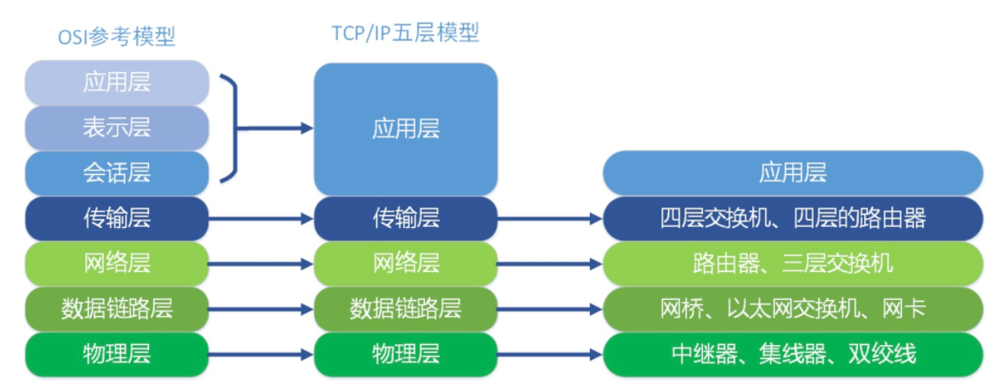

物理层：（比特）屏蔽物理设备差异，实现比特流的透明传输

数据链路层：（帧）通过控制协议，将有差错的物理信道变为无差错的、能可靠传输数据帧的数据链路

网络层：（包）路由寻址，数据链路层是解决同网络内节点间的通信，而网络层主要解决不同网络间通信

传输层：（段）建立端到端数据传输（可靠 TCP / 不可靠 UDP）


**如果让你来设计网络**

https://mp.weixin.qq.com/s/jiPMUk6zUdOY6eKxAjNDbQ

**电脑视角：**

- 首先我要知道我的 IP 以及对方的 IP
- 通过子网掩码判断我们是否在同一个子网
- 在同一个子网就通过 arp 获取对方 mac 地址直接扔出去
- 不在同一个子网就通过 arp 获取默认网关的 mac 地址直接扔出去

**交换机视角：**

- 我收到的数据包必须有目标 MAC 地址
- 通过 MAC 地址表查映射关系
- 查到了就按照映射关系从我的指定端口发出去
- 查不到就所有端口都发出去

**路由器视角：**

- 我收到的数据包必须有目标 IP 地址
- 通过路由表查映射关系
- 查到了就按照映射关系从我的指定端口发出去（不在任何一个子网范围，走其路由器的默认网关也是查到了）
- 查不到则返回一个路由不可达的数据包


**涉及到的三张表分别是**

- 交换机中有 **MAC 地址**表用于映射 MAC 地址和它的端口
- 路由器中有**路由表**用于映射 IP 地址(段)和它的端口
- 电脑和路由器中都有 **arp 缓存表**用于缓存 IP 和 MAC 地址的映射关系


**这三张表是怎么来的**

- MAC 地址表是通过以太网内各节点之间不断通过交换机通信，不断完善起来的。
- 路由表是各种路由算法 + 人工配置逐步完善起来的。
- arp 缓存表是不断通过 arp 协议的请求逐步完善起来的。


#### 应用层

##### HTTP 1.1

+ **长连接**，Connection: keep-alive 复用底层 TCP 连接 + Transfer-Encoding: chunked 分块传输编码
+ **Pipeline**，客户端可以同时发送多个请求，但服务端依然要等前一个请求的响应返回后才能处理下一个请求，头部阻塞【HTTP 1.0 一发一收】
+ **缓存处理**，cache-control：max-age=xxx 字段


##### HTTP 2.0

+ HTTP 1.1 缺点
  + **数据传输量大，延迟高**
  + **队头阻塞问题**，同一连接只能在完成一个 HTTP 事务（请求和响应）后，才能处理下一个事务
  + **HTTP 头部巨大**
  + **不支持服务器推送消息**
+ HTTP 2.0 特性
  + **头部压缩**，HTTP 协议的报文是由「Header + Body」构成的，HTTP/1.1 通过头字段 「Content-Encoding」指定 Body 的压缩方式，比如用 gzip 压缩。HTTP 2.0 采用 HPAK 压缩头部
  + **二进制帧**，HTTP/2 将 HTTP/1 的文本格式改成二进制格式传输数据，极大提高了 HTTP 传输效率
  + **多路复用、并发传输**，HTTP/2 基于流模型，**多个 Stream 复用一条 TCP 连接，达到并发的效果，不同 Stream 的帧是可以乱序发送的（因此可以并发不同的 Stream ）**，因为每个帧的头部会携带 Stream ID 信息，所以接收端可以通过 Stream ID 有序组装成 HTTP 消息，而 **同一 Stream 内部的帧必须是严格有序的**。（HTTP2 仍有头部阻塞问题，不是在应用层，而是因为传输层TCP是字节流。故 HTTP3 换成 UDP）
  + **服务器主动推送资源**


##### HTTP 状态码

**100**：Continue，服务器收到了请求的初始部分，并且请客户端继续发送。比如，客户端有大文件需要上传，但是服务器是否愿意接受，所以希望在消耗网络资源进行传输之前，先询问一下服务器的意愿（故是一种优化）。
（Req-Header）Expect: 100-continue   （Res-Status）100 Continue    417 Expectation Failed

**101**：Switching Protocols，切换协议 
（Req-Res-Header）Connection: Upgrade，  Upgrade: websocket


**301 vs 302**

+ 301：代表永久重定向，也就是说第一次请求拿到长链接后，下次浏览器再去请求短链的话，不会向短网址服务器请求了，而是直接从浏览器的缓存里拿，这样在 server 层面就无法获取到短网址的点击数了，如果这个链接刚好是某个活动的链接，也就无法分析此活动的效果。所以我们一般不采用 301
+ 302：代表临时重定向，也就是说每次去请求短链都会去请求短网址服务器（除非响应中用 Cache-Control 或 Expired 暗示浏览器缓存），这样就便于 server 统计点击数，所以虽然用 302 会给 server 增加一点压力，但在数据异常重要的今天，这点代码是值得的，所以推荐使用 302

**304**

第一次请求

+ step1:  (res) 200 --> date、expires、Last-Modified、ETag

第二次请求

+ step1: 看是否需要发送请求 （查缓存，先 from memory cache 再 from disk cache）
  + (req) cache-control：max-age=xxx 
    + 先比较当前时间和上次响应 date，如果没有超过max-age，命中本地强缓存
    + 如果没有cache-control，则取服务端 expires 的值，来对比当前时间是否过期
    + 如果都不满足，则进入协商缓存阶段（此时才需要发送请求）
  +  (req) cache-control：no-cache （直接进入协商缓存步骤）
+ step2:  协商缓存（服务端没修改资源，没必要回传）
  + (req) If-Modified-Since: Last-Modified 该请求首部告诉服务器，如果客户端传来的最后修改时间与服务器上的一致，则直接回送 304 和 响应报头即可
  + (req) If-None-Match: ETag-value （解决 Last-Modified 的缺陷：一个资源被修改了，但其实际内容根本没发生改变，故采用哈希标志）若服务端与客户端一致，则直接回送 304 和 响应报头即可


##### WebSocket

Http 不管是轮询还是长轮询，**半双工**效率比较低

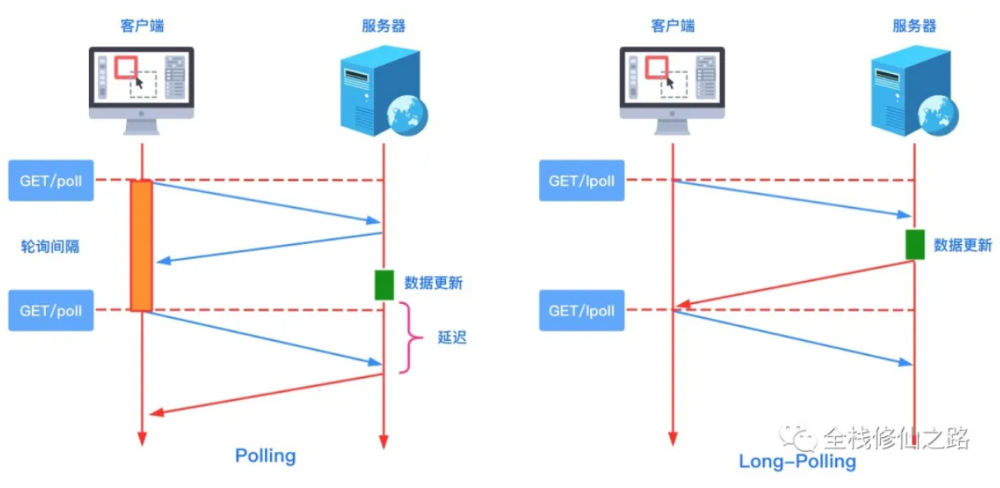

WebSocket 可在单个 TCP 连接上进行 **全双工** 通信，保持连接状态（HTTP无状态）
WebSocket 设计为在 HTTP 80 和 443 端口上工作，握手使用 HTTP Upgrade 头，从 HTTP 协议更改为 WebSocket 协议


生命周期：

1. 握手协议

   1. 客户端请求

      ```
      GET ws://echo.websocket.org/ HTTP/1.1
      Host: echo.websocket.org
      Origin: file://
      Connection: Upgrade
      Upgrade: websocket
      Sec-WebSocket-Version: 13
      Sec-WebSocket-Key: Zx8rNEkBE4xnwifpuh8DHQ==
      ```

      + Connection 必须设置 Upgrade，表示客户端希望连接升级
      + Upgrade 字段必须设置 websocket，表示希望升级到 WebSocket 协议。
      + Sec-WebSocket-Version 表示支持的 WebSocket 版本
      + Sec-WebSocket-Key 是随机的字符串，服务器端会用这些数据来构造出一个 SHA-1 的信息摘要。

   2. 服务端响应

      ```
      HTTP/1.1 101 Web Socket Protocol Handshake
      Connection: Upgrade
      Upgrade: websocket
      Sec-WebSocket-Accept: 52Rg3vW4JQ1yWpkvFlsTsiezlqw=
      ```

      + Sec-WebSocket-Accept：把 Sec-WebSocket-Key 加上一个特殊字符串 “258EAFA5-E914-47DA-95CA-C5AB0DC85B11”，然后计算 SHA-1 摘要，进行 Base64 编码，返回给客户端。

2. 消息协议

   在 WebSocket 协议中，数据是通过**数据帧**来进行传输的，同时，客户端必须在所有帧中**添加掩码**。服务端收到没有添加掩码的帧，必须立即关闭连接。（数据掩码的作用是增强协议的安全性，不是为了保护数据，因为算法是公开的）

   1. 数据帧格式

      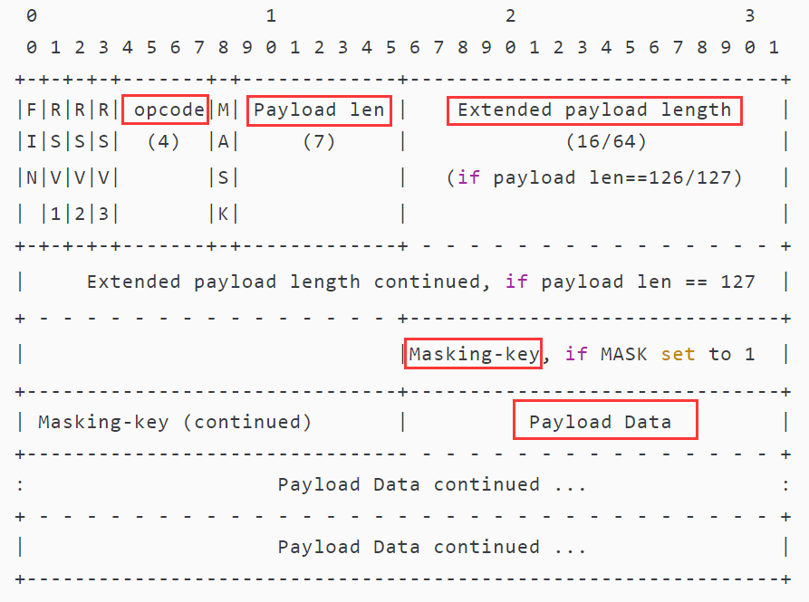

   2. 数据分片

      WebSocket 的每条消息可能被切分成多个数据帧。

      FIN 判断是否是最后一个帧。

      操作码 opcode 告诉了帧应该做什么。0x1，有效载荷就是文本。0x2，有效载荷就是二进制数据。0x0，则该帧是一个延续帧。这意味着服务器应该将帧的有效负载连接到从该客户机接收到的最后一个帧。

3. 心跳包

   在 WebSocket 协议中定义了 心跳 Ping 和 心跳 Pong 的控制帧

   心跳 Ping 帧包含的操作码是 0x9。心跳 Pong 帧包含的操作码是 0xA。


##### DNS

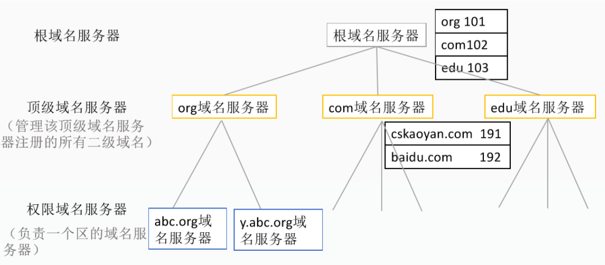

访问 y.abc.org 的流程：(8个UDP报文)

1. 浏览器缓存
2. HOST文件

3. 本地域名服务器  (拿着域名去根域名服务器)  【**迭代查询**】

4. 根域名服务器  {root}  （返回顶级域名服务器的IP地址）

5. 本地域名服务器  (拿着域名去顶级域名服务器)

6. 顶级域名服务器  abc.com  （返回权限域名服务器的IP地址）

7. 本地域名服务器  (拿着域名去权限域名服务器)

8. 权限域名服务器  y.abc.com（返回查询域名的IP地址）
9. 本地域名服务器 （拿到IP地址并返回给主机）


##### JWT

Session 有服务器单点问题，Token 需要去查数据库匹对，JWT 直接单向内存计算匹配签名

**Bearer**：头部（header）+ 内容（payload）+ 签名（signature）

secret 是保存在服务器端的私钥，jwt 的签发生成和校验也在服务器端

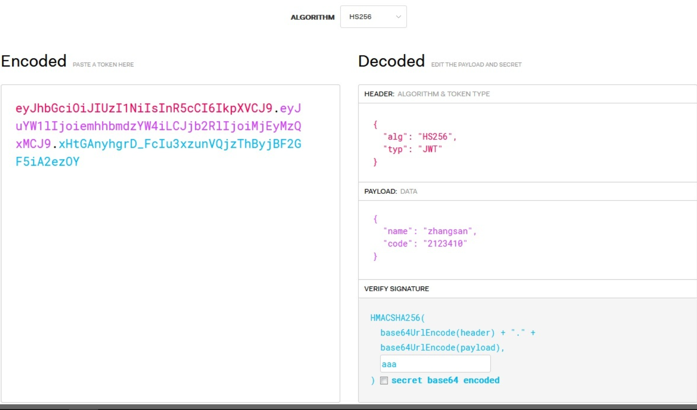

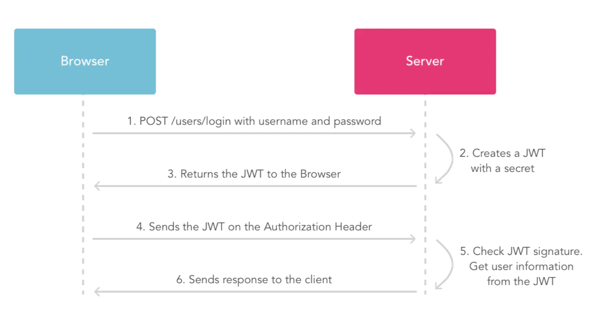


#### 传输层

##### TCP

Transmission **Control** Protocol：（控制）可靠、顺序、流量、拥塞 【全双工】

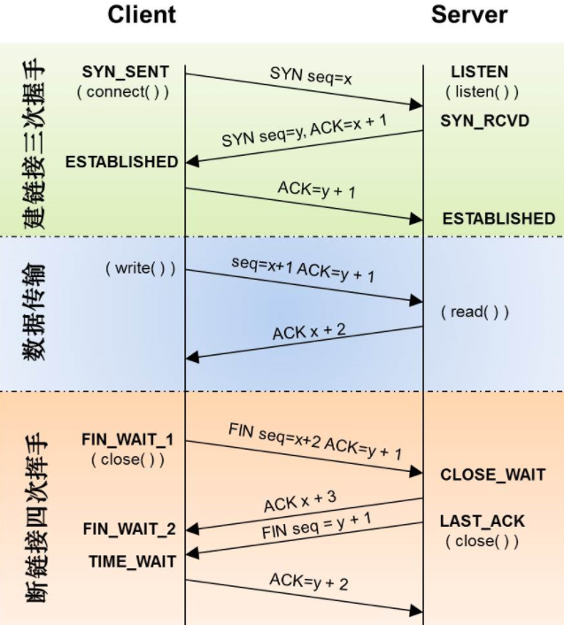

三次握手：SYN Flood 攻击 【开启 tcp_syncookies，TCP 根据双方的 ip、端口、SYN、时间戳等，生成序号标识（Cookie）】

四次挥手：服务端接收到 ACK=y+2 后关闭；客户端要等 2MSL 才关闭（服务端早于客户端）


TCP 的控制机制：（维护状态表）

+ 序列号
+ 应答信号、超时重发（重复确认时则快重传，不必等待超时重发计数器）【超时重发 != 重复确认】【超时重发过多次则**关闭连接**】
+ 滑动窗口：解决TCP以MSS段为单位应答发送的缺点，提高传输效率
+ 流量控制：双方动态协商滑动窗口大小
+ 拥塞控制：（拥塞窗口）慢启动（MSS从1开始）；先指数增加到阈值、再线性增加；阻塞时（超时 / 重复确认）快恢复（阈值设置成一半，窗口从阈值处线性增加）

【滑动窗口代表通信双方的数据接收能力，发送端根据 **接受端窗口大小** 来控制自己发送的数量，是接收端的 **数据缓冲区**】

【拥塞窗口代表整体网络环境的拥塞程度，不是接收端的数据缓冲区】

【窗口大小是发送端无需等待接收端确认应答信号而可以持续发送的数据最大值】

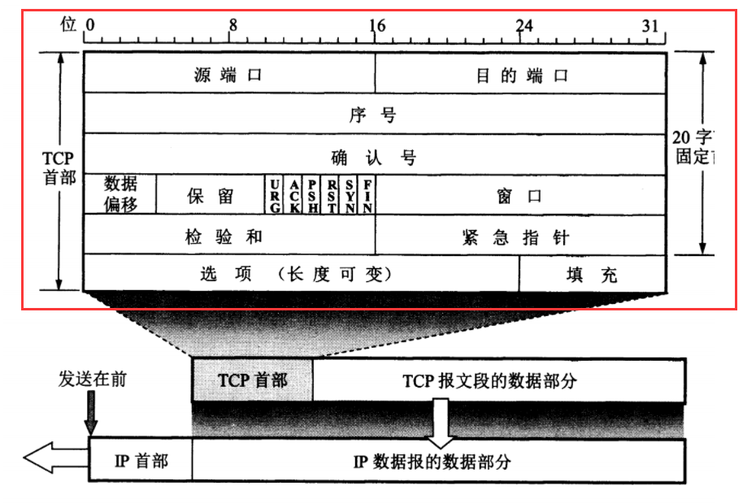

TCP 首部字段有 20 个字节

使用场景：当对网络通讯质量有要求的时候，比如：整个数据要准确无误的传递给对方，这往往用于一些要求可靠的应用，比如HTTP、HTTPS、FTP等传输文件的协议，POP、SMTP等邮件传输的协议。


##### UDP

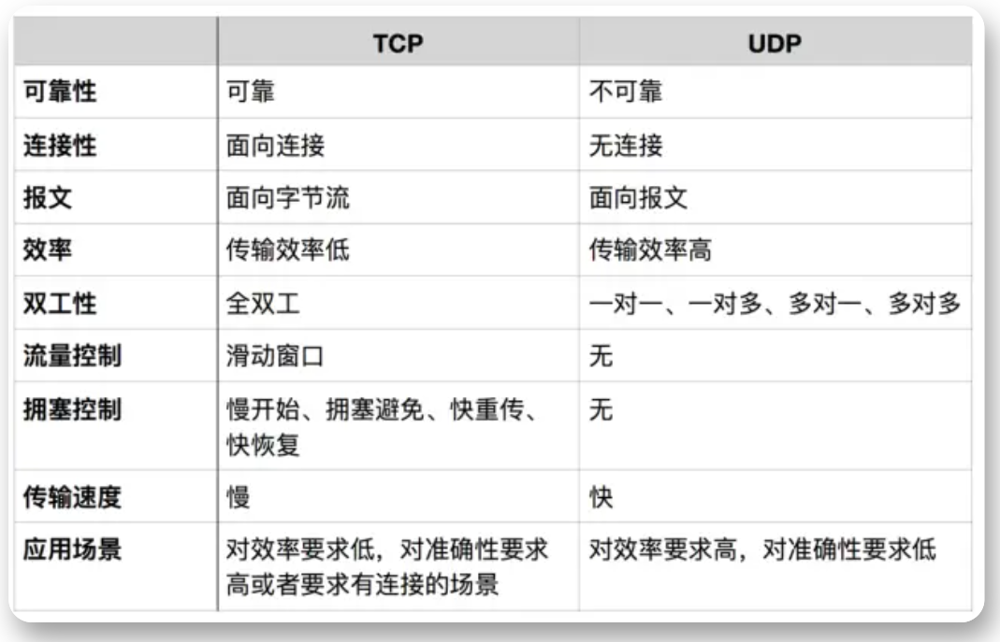

不可靠、不握手建立连接、面向报文，多种传播方式

面向报文：

+ 面向报文：应用层交给UDP多长的报文，UDP就照样发送，即一次发送一个报文。因此，应用程序必须选择合适大小的报文。若报文太长，则IP层需要分片，降低效率。若太短，会是IP太小。

+ 面向字节流：应用层和TCP的交互是一次一个数据块（大小不等），TCP把数据看成是一连串的无结构的字节流。TCP有一个缓冲，当应用程序传送的数据块太长，TCP就可以把它划分短一些再传送。

传播方式：

+ 单播Unicast：客户端与服务器之间的点到点连接
+ 广播BroadCast：（一对所有）广播者可以向网络中所有主机发送信息
+ 组播MultiCast：（一对一组）加入了同一个组的主机可以接受到此组内的所有数据【D类IP地址：224.0.0.0～224.0.0.255】

只有UDP才有广播、组播，TCP只能单播

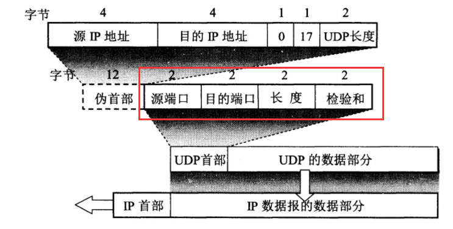

UDP 首部字段只有 8 个字节，包括源端口、目的端口、长度、检验和【伪首部只用来计算校验和，不用来传输】

使用场景：当对网络通讯质量要求不高的时候，要求网络通讯速度能尽量的快，这时就可以使用UDP。如语音、视频直播


##### Socket

socket 可以理解成基于TCP/UDP的系统进程，每绑定一个端口，都要关联到一个进程

作用：网络数据首先到达网卡，然后进入内核，由网络协议栈去处理，那么内核是如何把数据交给特定的用户进程呢？Socket !

socket 中存储了特定的四元组： 源ip+port，目的ip+port

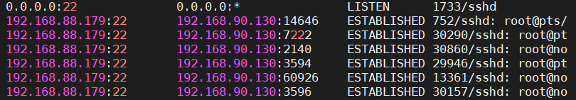

TCP Client：**每起一个连接会占用一个不同的系统端口**

+ 源 ip+port ，socket 为 [src ip, src port) <=> (*, *)] ；
+ 连接到目的 ip+port，socket 变为 [src ip, src port) <=> (dst ip, dst port)]；
+ 通过 Socket 与 TCP Server 进行通信

TCP Server：**所有连接共享同一个端口**

+ Accept 返回的 socket 为 [src ip, src port) <=> (dst ip, dst port)]；每一个连接都对应一个 socket id。

当系统接收 TCP 网络数据时，根据端口定位到特定的进程，然后进程根据 socket id 区分来自不同 client 的数据，系统中所有 socket 中的四元组信息，必定唯一，不可能重复。

Q：Linux服务器最多能支撑多少个TCP连接  （指的是 TCP Server）https://mp.weixin.qq.com/s/fo4LvCl9dFf7vdDGrAwL0A

服务器突然崩溃了，然后重启服务器的时候80端口被占用了，什么原因？与 TCP 四次挥手有关，资源需要等到 2MSL 才会释放

TCP Socket

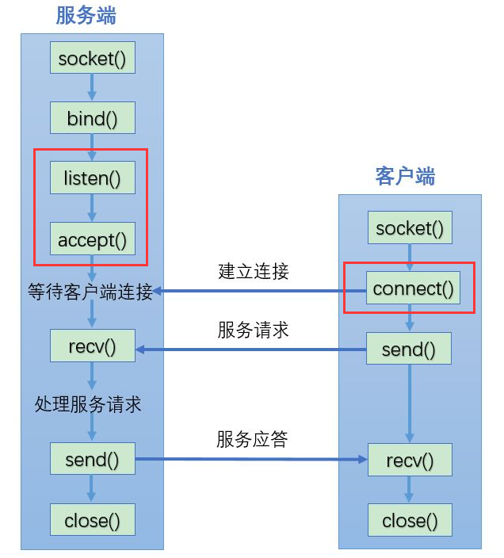

UDP Socket

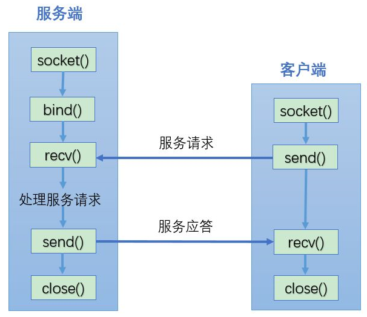


#### 网络层

##### IP

IP地址有32位

256 切半 切半 切半 切半                                                                                  默认子网掩码       

A类IP地址: 1.0.0.0 ~ 126.255.255.255 【0.x.x.x 和 127.x.x.x 保留】        255.0.0.0

B类IP地址: 128.0.0.0 ~ 191.255.255.255                                                      255.255.0.0

C类IP地址: 192.0.0.0 ~ 223.255.255.255                                                      255.255.255.0

D类IP地址: 224.0.0.0 ~ 239.255.255.255


##### 子网掩码

子网掩码主要是用来区分IP地址中的网络号和主机号

网络号：同个网段间才可以直接通信

如何判断两台主机在同个网络内：IP与子网掩码进行与运算，判断是否相同

子网掩码：网络划分变小（在默认掩码的基础上，借用主机位，主机位变小）

CIDR路由聚合：网络聚合变大（在默认掩码的基础上，借用网络位，主机位变大）


##### ARP

ARP 是根据IP地址获取MAC地址的协议。

当主机要发送一个IP包的时候，会首先查一下自己的ARP高速缓存（就是一个IP-MAC地址对应表缓存）。

如果查询的IP－MAC值对不存在，那么主机就向网络发送一个ARP协议广播包，这个广播包里面就有待查询的IP地址，而直接收到这份广播的包的所有主机都会查询自己的IP地址，

如果收到广播包的某一个主机发现自己符合条件，就准备好一个包含自己的MAC地址的ARP包传送给发送ARP广播的主机。


#### 数据链路层

##### MAC

MAC地址由48位组成，是网卡的唯一标志


