### 面向对象

+ 思想：
  + 封装：把对象的属性和行为结合成独立的整体，并隐藏对象的内部实现细节
  + 继承：子类继承父类，按需拓展新的属性和行为
  + 多态：运行时，根据对象实际的类型调用其相应的方法
  + 抽象：不断地向上抽取事物的共同特征

+ 设计原则：solid （面向对象属性行为、高内聚、低耦合）
  + s 单一职责：一个类应该只负责一件事情
  + o 开闭原则：对扩展开发，对修改关闭
  + l 里式替换：所有引用父类的地方必须能够透明地使用其子类对象
  + i 接口隔离：客户端不应该依赖他不需要的接口
  + d 依赖倒置：高层模块不应该依赖底层模块，两者都应该依赖其抽象

### UML图

+ **类：**

  + 第一行：类名
  + 第二行：属性（+ name: String）
  + 第三行：方法（+ static run(char c): void）

  作用域：  + 公共    # 保护    - 私有    static 静态 

+ **关系强弱顺序：** 泛化 = 实现 > 组合 > 聚合 > 关联 > 依赖
  
  + 泛化：子类与父类【空心三角实线，三角指向父类】
  + 实现：类与接口【空心三角虚线，三角指向接口】
  + 组合：成员变量，部分不能离开整体而存在【实心菱形 + 箭头实线，菱形指向整体，箭头指向部分】
  + 聚合：成员变量，部分可以离开整体而存在【空心菱形 + 箭头实线，菱形指向整体，箭头指向部分】
  + 关联：成员变量，拥有关系（单向/双向）【箭头实线，箭头指向被拥有者】
  + 依赖：局部变量/方法参数，使用关系【箭头虚线，箭头指向被使用者】

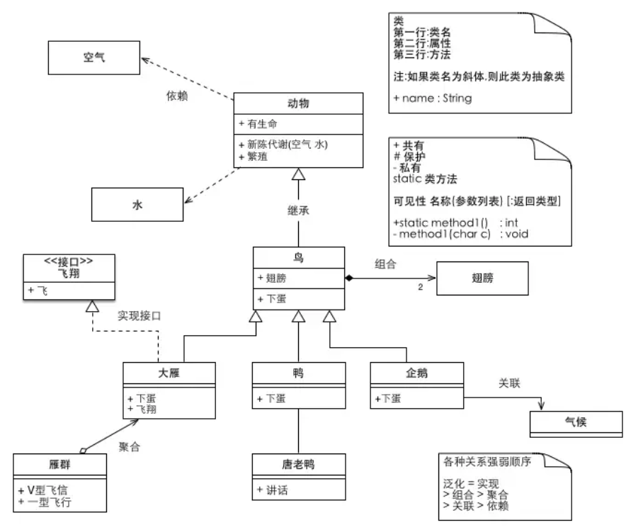

### 设计模式

代码：https://github.com/qhlpn/grocery/tree/master/designer

#### 创建者模式

##### -	工厂模式

> 通过 **中间层工厂**，对 调用者 **屏蔽** 对象创建细节，实现 对象创建流程 和 调用者 之间 **解耦**，调用者无需随对象细节而改动。

> 简单工厂：Calendar.getInstance		反射工厂：Spring ioc

> 简单工厂：产品有抽象层，但是工厂没有抽象层，在一个工厂中根据传参创建相应的产品类型
>
> 工厂方法：产品有抽象层，工厂有抽象层，一个工厂对应一个产品(即一个工厂只能创建一个产品类别)
>
> 抽象工厂：产品有抽象层，工厂有抽象层，一个工厂对应多个产品(即一个工厂可以创建多个产品类别)

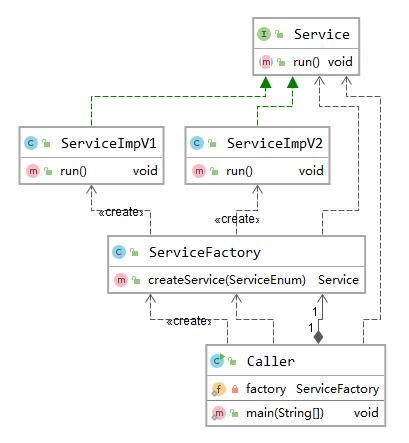

##### -	单例模式

> **【双检 / 枚举】** 某个类只存在一个对象实例， 并且只提供一个取得对象实例的方法（静态方法）。**减少对象重复创建的开销。**

> Spring Bean: type="singleton"

##### -	原型模式

> 用原型实例指定创建对象的种类，并且通过 **克隆** 原型（clone**浅拷贝**），创建新的对象。**简化对象创建时初始化属性的流程。**

> Spring Bean: type="prototype"

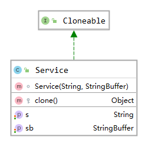

#### 结构型模式

##### -	代理模式

> Spring aop:  Transactional

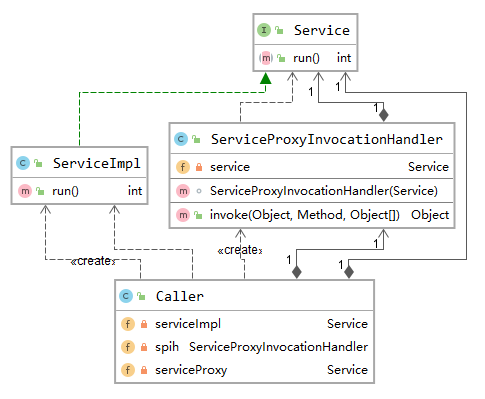

##### -	适配模式

> 适配模式可在不改变 service 代码的情况下， 将不同的 service 方法名往上抽象一层，**统一适配方法调用。**

> SpringMVC:   DispatcherServlet、HandlerAdapter、Controller

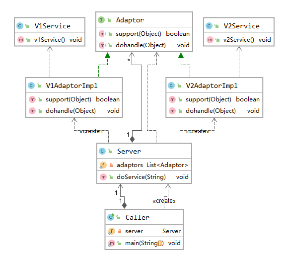

##### -	桥接模式

> 构建中间桥，整合接口和抽象类（or 子类），实现接口和抽象的分离，**两个不同的层次可以独立改变**。

> JDBC：DriverMange Connection

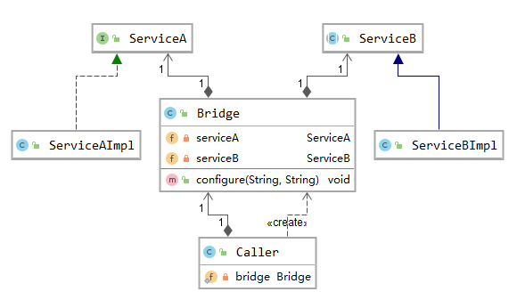

##### -	装饰模式

> 给对象强化 **新功能**。从树结构上看，继承是垂直伸展，装饰是水平伸展。**装饰可减少继承类（Java限制单继承）**

> Java IO:  FileInputStream、BufferInputStream、InputStreamReader

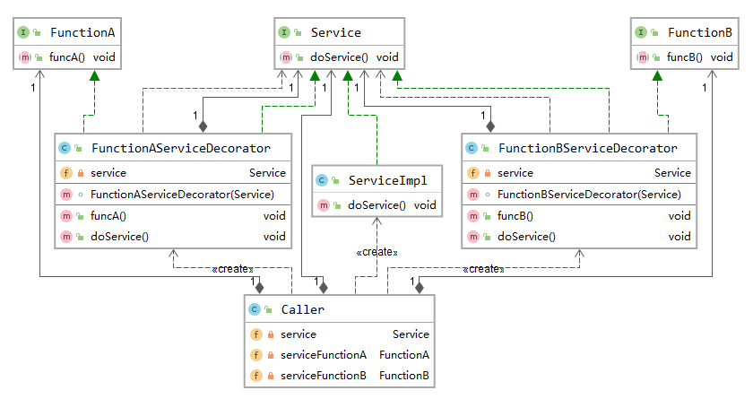

##### -	享元模式

> 共享对象（**工厂定义map共享：主键作key判断**），解决重复生成相同对象造成的 **效率低和内存浪费** 问题

> 常量池、连接池：Integer.valueOf

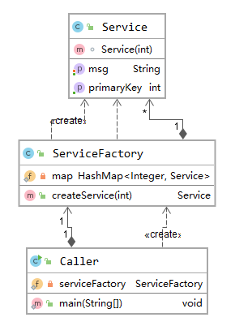

#### 行为型模式

##### -	责任链模式

> 每个接收者包含下个接收者的引用。如果不能处理该请求，则由 **自己（而非工厂）** 将请求传给下个接收者。**工厂维护责任链，对调用者和接收者进行解耦**。

> SpringMVC：DispatcherServlet、 HandlerExecutionChain、HandlerInterceptor

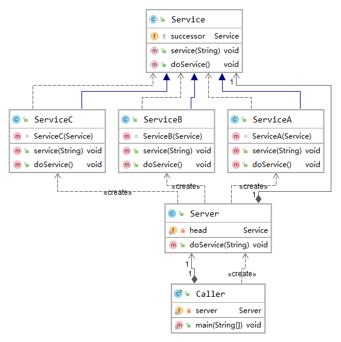

##### -	策略模式

> 定义算法族（策略组），分别封装起来，**把变化的代码从不变的代码中分离出来**，让算法间可以互相替换。

> 比较器：Arrays  public static \<T\> void sort(T[] a, Comparator\<? super T\> c)

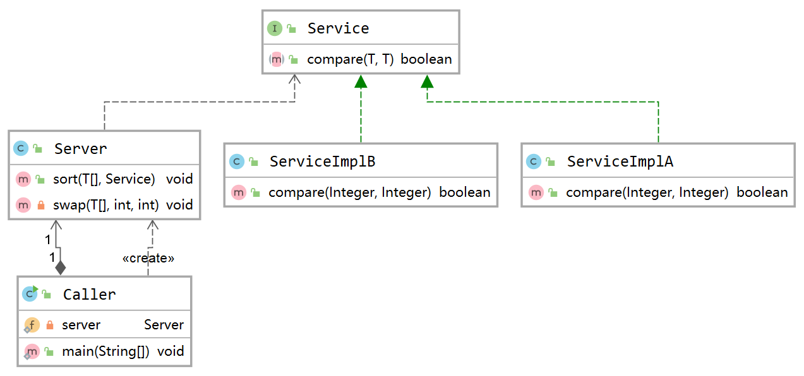

##### -	监听者模式

> 当一个对象被修改时，则通知依赖它的对象。

> Spring事件机制：ApplicationEvent 事件数据、ApplicationEventPublisher 发布者、ApplicationListener 监听者

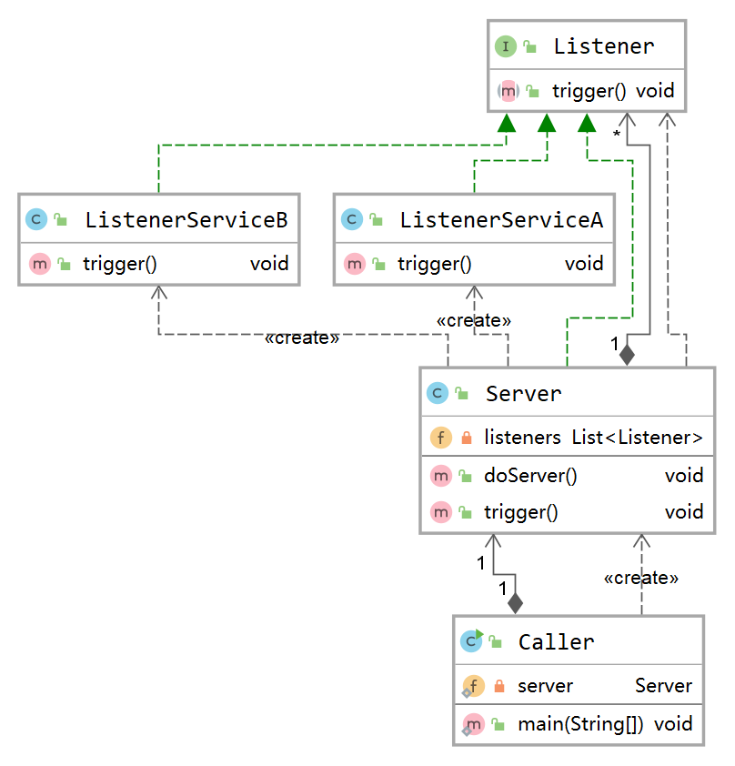

##### -	模板模式

>抽象类定义算法骨架模板，保持结构不变（**以 final 修饰**），**并对各个步骤做初始化**，同时再由子类提供 **部分** 步骤定制化实现

> JDBCTemplate、RedisTemplate

> 模板模式面向继承的抽象类；策略模式面向组合的实现接口（粒度小）

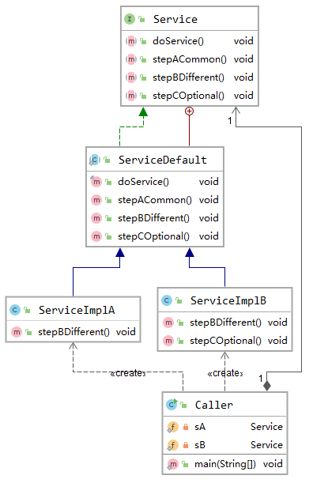

##### -	迭代器模式

>提供遍历集合元素的统一接口，用一致的方法遍历集合元素，**不暴露集合内部结构。**

> JDK：LinkedList、Iterator（for循环删除 vs 迭代器删除）

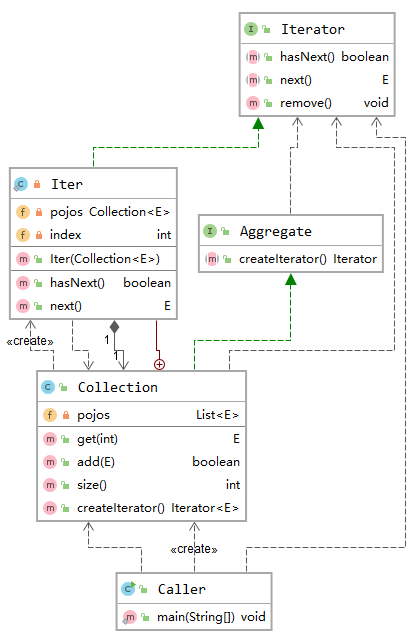