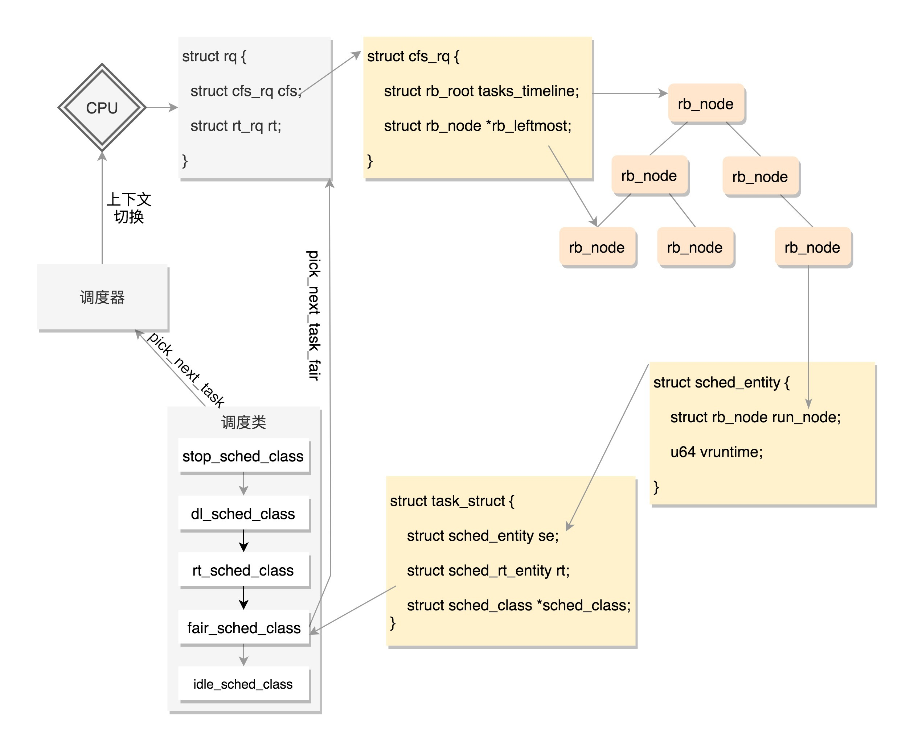

### 系统初始化

#### 内核子系统

+ 系统调用子系统：操作系统功能调用的统一入口
+ 进程管理子系统：对执行的程序进行生命周期和资源管理
+ 内存管理子系统：对操作系统的内存进行分配、回收、隔离
+ 文件子系统：对文件进行管理
+ 设备子系统：对输入输出设备进行管理
+ 网络子系统：网络协议栈和收发网络包


#### x86架构


+ 对于一个计算机来讲，最核心的就是**CPU**（Central Processing Unit，中央处理器）。这是这台计算机的大脑，所有的设备都围绕它展开。
+ CPU和其他设备连接，要靠一种叫作**总线**（Bus）的东西，其实就是主板上密密麻麻的集成电路，这些东西组成了CPU和其他设备的高速通道。
+ 在这些设备中，最重要的是**内存**（Memory）。因为单靠CPU是没办法完成计算任务的，很多复杂的计算任务都需要将中间结果保存下来，然后基于中间结果进行进一步的计算。CPU本身没办法保存这么多中间结果，这就要依赖内存了。
+ 当然总线上还有一些其他设备，例如显卡会连接显示器、磁盘控制器会连接硬盘、USB控制器会连接键盘和鼠标等等。


CPU和内存是完成计算任务的核心组件，**CPU和内存是如何配合工作的？**

CPU包括三个部分，运算单元、数据单元和控制单元。

+ **运算单元**只管算，例如做加法、做位移等等。但是，它不知道应该算哪些数据，运算结果应该放在哪里。
+ 运算单元计算的数据如果每次都要经过总线，到内存里面现拿，这样就太慢了，所以就有了**数据单元**。数据单元包括CPU内部的缓存和寄存器组，空间很小，但是速度飞快，可以暂时存放数据和运算结果。
+ 有了放数据的地方，也有了算的地方，还需要有个指挥到底做什么运算的地方，这就是**控制单元**。CPU的控制单元里面，有一个**指令指针寄存器**，它里面存放的是下一条指令在内存中的地址。控制单元会不停地将代码段的指令拿进来，先放入指令寄存器。当前的指令分两部分，一部分是做什么操作，例如是加法还是位移；一部分是操作哪些数据。要执行这条指令，就要把第一部分交给运算单元，第二部分交给数据单元。

CPU和内存来来回回传数据，靠的都是总线。总线上主要有两类数据，一个是地址数据，也就是我想拿内存中哪个位置的数据，这类总线叫**地址总线**（Address Bus）；另一类是真正的数据，这类总线叫**数据总线**（Data Bus）。


那CPU中总线的位数有没有个标准呢？如果没有标准，那操作系统作为软件就很难办了，因为软件层没办法实现通用的运算逻辑。好在历史将**x86**平台推到了**开放、统一、兼容**的位置。

+ 数据单元：为了暂存数据，8086处理器内部有8个16位的通用寄存器，也就是刚才说的CPU内部的数据单元，分别是AX、BX、CX、DX、SP、BP、SI、DI。这些寄存器主要用于在计算过程中暂存数据。

+ 控制单元：IP寄存器就是指令指针寄存器（Instruction Pointer Register)，指向代码段中下一条指令的位置。如果需要切换进程呢？每个进程都分代码段和数据段，为了指向不同进程的地址空间，有四个16位的段寄存器，分别是CS、DS、SS、ES。
  + CS就是代码段寄存器（Code Segment Register），通过它可以找到代码在内存中的位置；
  + DS是数据段的寄存器，通过它可以找到数据在内存中的位置。
  + SS是栈寄存器（Stack Register）。栈是程序运行中一个特殊的数据结构，数据的存取只能从一端进行，秉承后进先出的原则，push就是入栈，pop就是出栈。
  + ES是附加段寄存器

段寄存器的工作模式

+ 实模式：只能寻址1M，每个段最多64K（只使用了20位地址总线）
+ 保护模式：打开Gate A20，也就是第21根地址线的控制线，能够寻址4G。


#### 从bios到bootloader


+ **BIOS**：在主板上，有一个东西叫**ROM**（Read Only Memory，只读存储器），上面早就固化了一些初始化的程序，也就是**BIOS**（Basic Input and Output System，基本输入输出系统）。在x86系统中，将1M空间最上面的0xF0000到0xFFFFF这64K映射给ROM，也就是说，到这部分地址访问的时候，会访问ROM。当电脑刚加电的时候，会做一些重置的工作，将CS设置为0xFFFF，将IP设置为0x0000，所以第一条指令就会指向0xFFFF0，正是在ROM的范围内。在这里，有一个JMP命令会跳到ROM中做初始化工作的代码，于是，BIOS开始进行初始化的工作。
+ **bootloader**：操作系统在哪儿呢？一般都会在安装在硬盘上，在BIOS的界面上。你会看到一个启动盘的选项。启动盘有什么特点呢？它一般在第一个扇区，占512字节，而且以0xAA55结束。这个扇区通常称为**MBR**（Master Boot Record，主引导记录/扇区），执行**Grub2**配置的boot.img。由于512个字节实在有限，boot.img做不了太多的事情。它能做的最重要的一个事情就是加载**Grub2**的另一个镜像core.img，包含了diskboot.img、lzma_decompress.img（实模式切换到保护模式）、kernel.img


#### 内核初始化

内核的启动从入口函数start_kernel()开始。在init/main.c文件中，start_kernel相当于内核的main函数。打开这个函数，你会发现，里面是各种各样初始化函数XXXX_init。


+ 在操作系统里面，先要有个创始进程，有一行指令set_task_stack_end_magic(&init_task)。这里面有一个参数init_task，它的定义是struct task_struct init_task = **INIT_TASK(init_task)**。它是系统创建的第一个进程，我们称为**0号进程**。这是唯一一个没有通过fork或者kernel_thread产生的进程，是进程列表的第一个。
+ **trap_init()**，里面设置了很多**中断门**（Interrupt Gate），用于处理各种中断。其中有一个set_system_intr_gate(IA32_SYSCALL_VECTOR, entry_INT80_32)，这是系统调用的中断门。系统调用也是通过发送中断的方式进行的。
+ **mm_init()** 就是用来初始化内存管理模块
+ **sched_init()** 就是用于初始化调度模块。
+ 最后，start_kernel()调用的是 **rest_init()**，用来做其他方面的初始化，这里面做了好多的工作。
  + rest_init的第一大工作是，用kernel_thread(kernel_init, NULL, CLONE_FS)创建第二个进程，这个是**1号进程**。1号进程对于操作系统来讲，有“划时代”的意义。因为它将运行一个**用户态进程**。运行 **ramdisk（根文件系统）**的 **/init**，成为所有用户态进程的祖先。
  + rest_init第二大事情就是创建第三个进程，就是2号进程，负责所有**内核态**的线程的调度和管理，是内核态所有线程运行的祖先。


#### 系统调用过程

Linux提供了**glibc**中间层。它更熟悉系统调用的细节，并且可以封装成更加友好的接口。

用户态进程里面调用open函数，调用的是glibc里面的open函数，进而调用内核的open函数。


### 进程管理

#### 创建进程

1. 预处理：展开宏定义      gcc -E hello.c -o hello.i
2. 编译：生成汇编文件      gcc -S hello.c -o hello.s
3. 汇编：将汇编指令转为机器指令，生成目标文件       gcc -c hello.c -o hello.o
4. 链接：整合依赖的库，生成可执行文件         gcc hello.c


**创建进程：从代码到二进制到运行时**

首先通过图右边的文件编译过程，生成so文件和可执行文件，放在硬盘上。

下图左边的用户态的进程A执行fork，创建进程B，在进程B的处理逻辑中，执行exec系列系统调用。

系统调用会通过load_elf_binary方法，将刚才生成的可执行文件，加载到进程B的内存中执行。

**fork函数：**

执行完毕后，如果创建新进程成功，则出现两个进程。

一个是子进程，一个是父进程，各自执行各自的代码分支。

在子进程中，fork函数返回0，在父进程中，fork返回新创建子进程的进程ID。


#### 创建线程


#### 数据结构


+ **任务ID**

  ```c++
  pid_t pid;
  pid_t tgid;
  struct task_struct *group_leader; 
  ```

  进程和线程在内核统一视为任务，如何区分？通过判断 pid == tgid 。场景：展示进程、给进程下发指令

  pid:processId、tgid:threadgroupId

  任何一个进程，如果只有主线程，那pid是自己，tgid是自己，group_leader指向的还是自己。

  如果一个进程创建了其他线程，线程有自己的pid，tgid就是进程的主线程的pid，group_leader指向的就是进程的主线程。

  

+ **任务状态**

  

  + **TASK_RUNNING**：准备运行，看CPU时间片调度
  + **TASK_INTERRUPTIBLE**：可中断的睡眠状态【睡眠：如等待IO】
  + **TASK_UNINTERRUPTIBLE**：不可中断的睡眠状态（无法被信号唤醒，只能等IO完成，或者重启电脑）
  + **TASK_KILLABLE**：相比TASK_INTERRUPTIBLE，只可响应KILL信号
  + **EXIT_ZOMBIE**：僵尸进程（父进程还没使用wait()等系统调用来获知它的终止信息）
  + **EXIT_DEAD**：进程的最终状态

  

+ **信号处理**

  ``` c++
  /* Signal handlers: */
  struct signal_struct		*signal;
  struct sighand_struct		*sighand;
  sigset_t			blocked;
  sigset_t			real_blocked;
  sigset_t			saved_sigmask;
  struct sigpending		pending;
  unsigned long			sas_ss_sp;
  size_t				sas_ss_size;
  unsigned int			sas_ss_flags;
  ```

  这里定义了哪些信号被阻塞暂不处理（blocked），哪些信号尚等待处理（pending），哪些信号正在通过信号处理函数进行处理（sighand）。处理的结果可以是忽略，可以是结束进程等等。

  

+ **统计信息**

  ``` c++
  u64				utime;//用户态消耗的CPU时间
  u64				stime;//内核态消耗的CPU时间
  unsigned long	nvcsw;//自愿(voluntary)上下文切换计数
  unsigned long	nivcsw;//非自愿(involuntary)上下文切换计数
  u64				start_time;//进程启动时间，不包含睡眠时间
  u64				real_start_time;//进程启动时间，包含睡眠时间
  ```

+ **进程亲缘关系**

  ``` c++
  struct task_struct __rcu *real_parent; /* real parent process */
  struct task_struct __rcu *parent; /* recipient of SIGCHLD, wait4() reports */
  struct list_head children;      /* list of my children */
  struct list_head sibling;       /* linkage in my parent's children list */
  ```

  从创建进程可以看出，任何一个进程都有父进程。

  整个进程其实就是一棵进程树。而拥有同一父进程的所有进程都具有兄弟关系。

  parent 指向其父进程。当它终止时，必须向它的父进程发送信号。

  children 表示链表的头部。链表中的所有元素都是它的子进程。

  sibling 用于把当前进程插入到兄弟链表中。

  

+ **进程权限** 

  用户运行进程，进程权限由对应的用户和用户组权限决定，RWX .

  

+ **进程调度**

  进程的状态切换涉及到进程调度。

  

+ **内存管理**

  ``` c++
  struct mm_struct                *mm;
  struct mm_struct                *active_mm;
  ```

  每个进程都有自己独立的虚拟内存空间，这需要有一个数据结构来表示，就是mm_struct。

  

+ **文件与文件系统**

  ``` c++
  struct fs_struct                *fs;      /* Filesystem information: */
  struct files_struct             *files;   /* Open file information: */    
  ```

  每个进程有一个文件系统的数据结构，还有一个打开文件的数据结构。


#### 进程调度



每个CPU上有对应的队列，CFS的队列是一棵红黑树。

树的每个节点都是一个sched_entity，每个sched_entity都属于一个task_struct。

task_struct里面有指针指向这个进程属于哪个调度类。


+ **调度策略**

  + **实时进程**：（优先级 0～99【数字越小级别越高】）

    + **SCHED_FIFO**：相同优先级下先来先服务，高优先级可抢占低优先级
    + **SCHED_RR**：相同优先级下时间片轮询，高优先级可抢占低优先级
    + **SCHED_DEADLINE**：按照任务的ddl进行调度，选择离ddl最近的任务执行

  + **普通进程**：（优先级 100~139）

    **SCHED_CFS**：Completely Fair Scheduling 完全公平调度

    首先，你需要记录下进程的运行时间。

    CPU会提供一个时钟，过一段时间就触发一个时钟中断。就像咱们的表滴答一下，这个我们叫Tick。

    CFS会为每一个进程安排一个虚拟运行时间vruntime。

    如果一个进程在运行，随着时间的增长，也就是一个个tick的到来，进程的vruntime将不断增大。

    没有得到执行的进程vruntime不变。

    显然，那些vruntime少的，原来受到了不公平的对待，需要给它补上，所以会优先运行这样的进程。

    其次，如何给优先级高的进程多分时间呢？加权重系数，按比例！

    总vruntime不变，每到来一个tick，高优先级进程的vruntime的增长权重低，低优先级的高。

    

+ **调度队列**：红黑树（给vruntime排序）

  每个CPU都有自己的 struct rq 结构，其用于描述在此CPU上所运行的所有进程。

  包括一个实时进程队列rt_rq和一个CFS运行队列cfs_rq。


+ **调度类**

  当CPU需要找下个任务执行时，会按照优先级依次调用调度类，不同的调度类操作不同的队列。

  rt_sched_class先被调用，它会在rt_rq上找下一个任务。

  只有找不到的时候，才轮到fair_sched_class被调用，它会在cfs_rq上找下一个任务。

  这样保证了实时任务的优先级永远大于普通任务。


### 内存管理

#### 