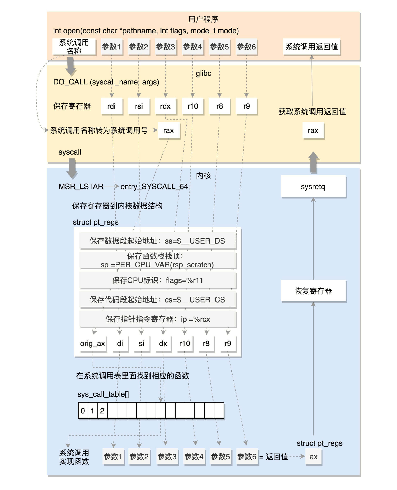

### 系统初始化

#### OS内核子系统

+ 系统调用子系统：操作系统功能调用的统一入口
+ 进程管理子系统：对执行的程序进行生命周期和资源管理
+ 内存管理子系统：对操作系统的内存进行分配、回收、隔离
+ 文件子系统：对文件进行管理
+ 设备子系统：对输入输出设备进行管理
+ 网络子系统：网络协议栈和收发网络包


#### x86架构


+ 对于一个计算机来讲，最核心的就是**CPU**（Central Processing Unit，中央处理器）。这是这台计算机的大脑，所有的设备都围绕它展开。
+ CPU和其他设备连接，要靠一种叫作**总线**（Bus）的东西，其实就是主板上密密麻麻的集成电路，这些东西组成了CPU和其他设备的高速通道。
+ 在这些设备中，最重要的是**内存**（Memory）。因为单靠CPU是没办法完成计算任务的，很多复杂的计算任务都需要将中间结果保存下来，然后基于中间结果进行进一步的计算。CPU本身没办法保存这么多中间结果，这就要依赖内存了。
+ 当然总线上还有一些其他设备，例如显卡会连接显示器、磁盘控制器会连接硬盘、USB控制器会连接键盘和鼠标等等。


CPU和内存是完成计算任务的核心组件，**CPU和内存是如何配合工作的？**

CPU包括三个部分，运算单元、数据单元和控制单元。

+ **运算单元**只管算，例如做加法、做位移等等。但是，它不知道应该算哪些数据，运算结果应该放在哪里。
+ 运算单元计算的数据如果每次都要经过总线，到内存里面现拿，这样就太慢了，所以就有了**数据单元**。数据单元包括CPU内部的缓存和寄存器组，空间很小，但是速度飞快，可以暂时存放数据和运算结果。
+ 有了放数据的地方，也有了算的地方，还需要有个指挥到底做什么运算的地方，这就是**控制单元**。CPU的控制单元里面，有一个**指令指针寄存器**，它里面存放的是下一条指令在内存中的地址。控制单元会不停地将代码段的指令拿进来，先放入指令寄存器。当前的指令分两部分，一部分是做什么操作，例如是加法还是位移；一部分是操作哪些数据。要执行这条指令，就要把第一部分交给运算单元，第二部分交给数据单元。

CPU和内存来来回回传数据，靠的都是总线。总线上主要有两类数据，一个是地址数据，也就是我想拿内存中哪个位置的数据，这类总线叫**地址总线**（Address Bus）；另一类是真正的数据，这类总线叫**数据总线**（Data Bus）。


那CPU中总线的位数有没有个标准呢？如果没有标准，那操作系统作为软件就很难办了，因为软件层没办法实现通用的运算逻辑。好在历史将**x86**平台推到了**开放、统一、兼容**的位置。

+ 数据单元：为了暂存数据，8086处理器内部有8个16位的通用寄存器，也就是刚才说的CPU内部的数据单元，分别是AX、BX、CX、DX、SP、BP、SI、DI。这些寄存器主要用于在计算过程中暂存数据。

+ 控制单元：IP寄存器就是指令指针寄存器（Instruction Pointer Register)，指向代码段中下一条指令的位置。如果需要切换进程呢？每个进程都分代码段和数据段，为了指向不同进程的地址空间，有四个16位的段寄存器，分别是CS、DS、SS、ES。
  + CS就是代码段寄存器（Code Segment Register），通过它可以找到代码在内存中的位置；
  + DS是数据段的寄存器，通过它可以找到数据在内存中的位置。
  + SS是栈寄存器（Stack Register）。栈是程序运行中一个特殊的数据结构，数据的存取只能从一端进行，秉承后进先出的原则，push就是入栈，pop就是出栈。
  + ES是附加段寄存器

段寄存器的工作模式

+ 实模式：只能寻址1M，每个段最多64K（只使用了20位地址总线）
+ 保护模式：打开Gate A20，也就是第21根地址线的控制线，能够寻址4G。


#### CPU执行周期


+ **指令周期**：CPU从取指到指令执行完毕的时间。包括：取指、译码、执行指令。由于各种指令操作功能不同，因此各种指令的指令周期是不相同的。

  

+ **机器周期**：在计算机中，为了便于管理，常把指令周期划分为若干个阶段，每一阶段完成一项工作例如，取指令、存储器读、存储器写等。完成一个基本操作所需要的时间称为机器周期

+ **时钟周期**：CPU操作的基本单位，振荡周期，时钟频率的倒数


当CPU采用中断方式实现主机与I/O交换信息时，**CPU在每条指令执行阶段结束前， 都要发中断查询信号**，以检测是否有某个I/O提出中断请求。如果有请求，CPU则要进入中断响应阶段，又称中断周期。在这阶段， CPU必须将程序断点保存到存储器中。

这样，一个完整的指令周期应包括取指、间址、执行和中断4个子周期。


#### 从bios到bootloader


+ **BIOS**：在主板上，有一个东西叫**ROM**（Read Only Memory，只读存储器），上面早就固化了一些初始化的程序，也就是**BIOS**（Basic Input and Output System，基本输入输出系统）。在x86系统中，将1M空间最上面的0xF0000到0xFFFFF这64K映射给ROM，也就是说，到这部分地址访问的时候，会访问ROM。当电脑刚加电的时候，会做一些重置的工作，将CS设置为0xFFFF，将IP设置为0x0000，所以第一条指令就会指向0xFFFF0，正是在ROM的范围内。在这里，有一个JMP命令会跳到ROM中做初始化工作的代码，于是，BIOS开始进行初始化的工作。

+ **bootloader**：操作系统在哪儿呢？一般都会在安装在硬盘上，在BIOS的界面上。你会看到一个启动盘的选项。启动盘有什么特点呢？它一般在第一个扇区，占512字节，而且以0xAA55结束。这个扇区通常称为**MBR**（Master Boot Record，主引导记录/扇区），执行**Grub2**配置的boot.img。由于512个字节实在有限，boot.img做不了太多的事情。它能做的最重要的一个事情就是加载**Grub2**的另一个镜像core.img，包含了diskboot.img、lzma_decompress.img（实模式切换到保护模式）、kernel.img

  

+ **BIOS vs UEFI**

  https://developer.aliyun.com/article/523995

  ```
  	UEFI是BIOS的一种升级替代方案。关于BIOS和UEFI二者的比较，如果仅从系统启动原理方面来做比较，UEFI之所以比BIOS强大，是因为UEFI本身已经相当于一个微型操作系统，其带来的便利之处在于：
  　　首先，UEFI已具备文件系统的支持，它能够直接读取FAT分区中的文件。什么是文件系统？简单说，文件系统是操作系统组织管理文件的一种方法，直白点说就是把硬盘上的数据以文件的形式呈现给用户。Fat32、NTFS都是常见的文件系统类型。
  　　其次，可开发出直接在UEFI下运行的应用程序，这类程序文件通常以efi结尾。既然UEFI可以直接识别FAT分区中的文件，又有可直接在其中运行的应用程序。那么完全可以将Windows安装程序做成efi类型应用程序，然后把它放到任意fat分区中直接运行即可，如此一来安装Windows操作系统这件过去看上去稍微有点复杂的事情突然就变非常简单了，就像在Windows下打开浏览器一样简单。而事实上，也就是这么一回事。
  　　最后，要知道这些都是BIOS做不到的。因为BIOS下启动操作系统之前，必须从硬盘上指定扇区读取系统启动代码（包含在主引导记录中），然后从活动分区中引导启动操作系统。对扇区的操作远比不上对分区中文件的操作更直观更简单，所以在BIOS下引导安装Windows操作系统，我们不得不使用一些工具对设备进行配置以达到启动要求。而在UEFI下，这些统统都不需要，不再需要主引导记录，不再需要活动分区，不需要任何工具，只要复制安装文件到一个FAT32（主）分区/U盘中，然后从这个分区/U盘启动，安装Windows就是这么简单。
  ```

  


#### 内核初始化

内核的启动从入口函数start_kernel()开始。在init/main.c文件中，start_kernel相当于内核的main函数。打开这个函数，你会发现，里面是各种各样初始化函数XXXX_init。


+ 在操作系统里面，先要有个创始进程，有一行指令set_task_stack_end_magic(&init_task)。这里面有一个参数init_task，它的定义是struct task_struct init_task = **INIT_TASK(init_task)**。它是系统创建的第一个进程，我们称为**0号进程**。这是唯一一个没有通过fork或者kernel_thread产生的进程，是进程列表的第一个。
+ **trap_init()**，里面设置了很多**中断门**（Interrupt Gate），用于处理各种中断。其中有一个set_system_intr_gate(IA32_SYSCALL_VECTOR, entry_INT80_32)，这是系统调用的中断门。系统调用也是通过发送中断的方式进行的。
+ **mm_init()** 就是用来初始化内存管理模块
+ **sched_init()** 就是用于初始化调度模块。
+ 最后，start_kernel()调用的是 **rest_init()**，用来做其他方面的初始化，这里面做了好多的工作。
  + rest_init的第一大工作是，用kernel_thread(kernel_init, NULL, CLONE_FS)创建第二个进程，这个是**1号进程**。1号进程对于操作系统来讲，有“划时代”的意义。因为它将运行一个**用户态进程**。运行 **ramdisk（根文件系统）**的 **/init**，成为所有用户态进程的祖先。
  + rest_init第二大事情就是创建第三个进程，就是2号进程，负责所有**内核态**的线程的调度和管理，是内核态所有线程运行的祖先。


#### 系统调用过程

x86提供了分层的权限机制，把区域分成了四个Ring，越往里权限越高，越往外权限越低。

操作系统很好地利用了这个机制，将能够访问关键资源的代码放在Ring0**内核态**。将普通的程序代码放在Ring3**用户态**。


操作系统已经从实模式切换到保护模式了，保护模式除了可访问空间大一些，还能防止处于用户态代码想要执行更高权限的指令。

当一个用户态的程序运行到一半，要访问一个核心资源，就需要暂停当前的运行，调用系统调用，接下来就轮到内核中的代码运行。

这个暂停怎么实现呢？其实就是把程序运行到一半的情况保存下来。例如，我们知道，内存是用来保存程序运行时候的中间结果的，现在要暂时停下来，这些中间结果不能丢，因为再次运行的时候，还要基于这些中间结果接着来。另外就是，当前运行到代码的哪一行了，当前的栈在哪里，这些都是在寄存器里面的。当系统调用完毕，返回的时候，再从这个地方将寄存器的值恢复回去，就能接着运行了。

**所以，系统调用的流程**：用户态 -- 系统调用 -- 保存寄存器 -- 内核态执行系统调用 -- 恢复寄存器 -- 返回用户态


同时，Linux提供了**glibc**中间层，进一步封装系统调用的入口，它更熟悉系统调用的细节，接口更友好。

用户态进程里面调用open函数，调用的是glibc里面的open函数，进而调用内核的open函数。



### 进程管理

#### 创建进程

1. 预处理：展开宏定义      gcc -E hello.c -o hello.i
2. 编译：生成汇编文件      gcc -S hello.c -o hello.s
3. 汇编：将汇编指令转为机器指令，生成目标文件       gcc -c hello.c -o hello.o
4. 链接：整合依赖的库，生成可执行文件         gcc hello.c


**创建进程：从代码到二进制到运行时**

首先通过图右边的文件编译过程，生成so文件和可执行文件，放在硬盘上。

下图左边的用户态的进程A执行fork，创建进程B，在进程B的处理逻辑中，执行exec系列系统调用。

系统调用会通过load_elf_binary方法，将刚才生成的可执行文件，加载到进程B的内存中执行。

**fork函数：**

执行完毕后，如果创建新进程成功，则出现两个进程。

一个是子进程，一个是父进程，各自执行各自的代码分支。

在子进程中，fork函数返回0，在父进程中，fork返回新创建子进程的进程ID。


#### 创建线程


#### 数据结构


+ **任务ID**

  ```c++
  pid_t pid;
  pid_t tgid;
  struct task_struct *group_leader; 
  ```

  进程和线程在内核统一视为任务，如何区分？通过判断 pid == tgid 。场景：展示进程、给进程下发指令

  pid:processId、tgid:threadgroupId

  任何一个进程，如果只有主线程，那pid是自己，tgid是自己，group_leader指向的还是自己。

  如果一个进程创建了其他线程，线程有自己的pid，tgid就是进程的主线程的pid，group_leader指向的就是进程的主线程。

  

+ **任务状态**

  

  + **TASK_RUNNING**：准备运行，看CPU时间片调度
  + **TASK_INTERRUPTIBLE**：可中断的睡眠状态【睡眠：如等待IO】
  + **TASK_UNINTERRUPTIBLE**：不可中断的睡眠状态（无法被信号唤醒，只能等IO完成，或者重启电脑）
  + **TASK_KILLABLE**：相比TASK_INTERRUPTIBLE，只可响应KILL信号
  + **EXIT_ZOMBIE**：僵尸进程（父进程还没使用wait()等系统调用来获知它的终止信息）
  + **EXIT_DEAD**：进程的最终状态

  

+ **信号处理**

  ``` c++
  /* Signal handlers: */
  struct signal_struct		*signal;
  struct sighand_struct		*sighand;
  sigset_t			blocked;
  sigset_t			real_blocked;
  sigset_t			saved_sigmask;
  struct sigpending		pending;
  unsigned long			sas_ss_sp;
  size_t				sas_ss_size;
  unsigned int			sas_ss_flags;
  ```

  这里定义了哪些信号被阻塞暂不处理（blocked），哪些信号尚等待处理（pending），哪些信号正在通过信号处理函数进行处理（sighand）。处理的结果可以是忽略，可以是结束进程等等。

  

+ **统计信息**

  ``` c++
  u64				utime;//用户态消耗的CPU时间
  u64				stime;//内核态消耗的CPU时间
  unsigned long	nvcsw;//自愿(voluntary)上下文切换计数
  unsigned long	nivcsw;//非自愿(involuntary)上下文切换计数
  u64				start_time;//进程启动时间，不包含睡眠时间
  u64				real_start_time;//进程启动时间，包含睡眠时间
  ```

+ **进程亲缘关系**

  ``` c++
  struct task_struct __rcu *real_parent; /* real parent process */
  struct task_struct __rcu *parent; /* recipient of SIGCHLD, wait4() reports */
  struct list_head children;      /* list of my children */
  struct list_head sibling;       /* linkage in my parent's children list */
  ```

  从创建进程可以看出，任何一个进程都有父进程。

  整个进程其实就是一棵进程树。而拥有同一父进程的所有进程都具有兄弟关系。

  parent 指向其父进程。当它终止时，必须向它的父进程发送信号。

  children 表示链表的头部。链表中的所有元素都是它的子进程。

  sibling 用于把当前进程插入到兄弟链表中。

  

+ **进程权限** 

  用户运行进程，进程权限由对应的用户和用户组权限决定，RWX .

  

+ **进程调度**

  进程的状态切换涉及到进程调度。

  

+ **内存管理**

  ``` c++
  struct mm_struct                *mm;
  struct mm_struct                *active_mm;
  ```

  每个进程都有自己独立的虚拟内存空间，这需要有一个数据结构来表示，就是mm_struct。

  

+ **文件与文件系统**

  ``` c++
  struct fs_struct                *fs;      /* Filesystem information: */
  struct files_struct             *files;   /* Open file information: */    
  ```

  每个进程有一个文件系统的数据结构，还有一个打开文件的数据结构。


#### 进程调度


每个CPU上有对应的队列，CFS的队列是一棵红黑树。

树的每个节点都是一个sched_entity，每个sched_entity都属于一个task_struct。

task_struct里面有指针指向这个进程属于哪个调度类。


+ **调度策略**

  + **实时进程**：（优先级 0～99【数字越小级别越高】）

    + **SCHED_FIFO**：相同优先级下先来先服务，高优先级可抢占低优先级
    + **SCHED_RR**：相同优先级下时间片轮询，高优先级可抢占低优先级
    + **SCHED_DEADLINE**：按照任务的ddl进行调度，选择离ddl最近的任务执行

  + **普通进程**：（优先级 100~139）

    **SCHED_CFS**：Completely Fair Scheduling 完全公平调度

    首先，你需要记录下进程的运行时间。

    CPU会提供一个时钟，过一段时间就触发一个**时钟中断**。就像咱们的表滴答一下，这个我们叫Tick。

    CFS会为每一个进程安排一个虚拟运行时间vruntime。

    如果一个进程在运行，随着时间的增长，也就是一个个tick的到来，进程的vruntime将不断增大。

    没有得到执行的进程vruntime不变。

    显然，那些vruntime少的，原来受到了不公平的对待，需要给它补上，所以会优先运行这样的进程。

    其次，如何给优先级高的进程多分时间呢？加权重系数，按比例！

    总vruntime不变，每到来一个tick，高优先级进程的vruntime的增长权重低，低优先级的高。

    

+ **调度队列**：红黑树（给vruntime排序）

  每个CPU都有自己的 **struct rq 任务队列结构**，其用于描述在此CPU上所运行的所有进程。

  包括一个实时进程队列rt_rq和一个CFS运行队列cfs_rq。


+ **调度类**

  **当CPU需要找下个任务执行时，会按照优先级依次调用调度类，不同的调度类操作不同的队列**。

  rt_sched_class先被调用，它会在rt_rq上找下一个任务。

  只有找不到的时候，才轮到fair_sched_class被调用，它会在cfs_rq上找下一个任务。

  这样保证了实时任务的优先级永远大于普通任务。
  
  
  
+ **主动调度**

  A项目做着做着，发现里面有一条指令sleep，也就是要休息一下，或者在等待某个I/O事件。

  这时就要主动让出CPU，然后可以开始做B项目。 **yield ?**

  比如：**从Tap网络设备等待一个读取**。当没有数据到来的时候，进程需要等待，所以会选择把CPU**主动让给 schedule**其他进程。

  ``` c
  static ssize_t tap_do_read(struct tap_queue *q, struct iov_iter *to, int noblock, struct sk_buff *skb)
  {
  ......
  	while (1) {
  		if (!noblock)
  			prepare_to_wait(sk_sleep(&q->sk), &wait,
  					TASK_INTERRUPTIBLE);
  ......
  		/* Nothing to read, let's sleep */
  		schedule();
  	}
  ......
  }
  ```

  

  

  **进程调度第一定理：调用 _schedule **

  + 记录当下的进程任务

  + 获取下一个任务**（调度类 > 队列）**

  + 当下个任务和当下任务不同，则进行**上下文切换**

    + 用户态进程空间切换
      + 用户栈切换（内存切换时即切换）
      + 用户栈顶指针切换/用户指令指针切换（内核态返回用户态时从内核栈弹出）
    + 内核栈切换
      + 内核栈切换（_switch_to中将current_task指向新的内核栈）
      + 内核态指令指针切换（_switch_to_asm(pre,next)）
      + 内核栈顶指针切换（_switch_to_asm将栈顶指针保存到tss）

  + 指令指针的保持和恢复（需要三个变量）

    **switch_to(prev = A, next=B, last=C)，A进程就明白，我当时被切换走的时候，是切换成B，这次切换回来，是从C回来的**


  **时钟中断**：

  + 硬件每过一段时间就触发一次时钟中断，通知操作系统，此中断是操作系统能够进行进程调度的基础

  + 每一次的时钟中断都需要操作系统设置一个下一次中断的时间，这样硬件才会在指定的时间发出时钟中断

    ``` c
    // 操作系统可请求（sbi_call 调用 ecall 指令）SBI 服务来完成时钟中断的设置。
    // OpenSBI 固件在接到 SBI 服务请求后，会帮助 OS 设置下一次要触发时钟中断的时间。
    // CPU 在执行过程中会检查当前的时间间隔是否已经超过设置的时钟中断时间间隔，如果超时则会触发时钟中断。
    // 设置下一次时钟中断的时间
    pub fn set_timer(time: usize) {
        sbi_call(SBI_SET_TIMER, time, 0, 0);
    }
    ```

    

  **抢占调度**

  + 打标记（TIF_NEED_RESCHED）

    + 场景一：时钟中断处理函数会调用scheduler_tick()，进而调用 check_preempt_tick() 标记当前进程是否应该被抢占
    + 场景二：当进程在等待I/O的时候，会主动放弃CPU。但是当I/O到来的时候，其中断处理函数会调用 try_to_wake_up() 唤醒进程，进而调用  check_preempt_tick() 标记当前进程是否应该被抢占

  + 当前进程调用 _schedule

    + 用户态进程

      + **从系统调用返回时**

        do_syscall_64->syscall_return_slowpath->prepare_exit_to_usermode->exit_to_usermode_loop

        ``` c
        static void exit_to_usermode_loop(struct pt_regs *regs, u32 cached_flags)
        {
        	while (true) {
        		/* We have work to do. */
        		local_irq_enable();
        		if (cached_flags & _TIF_NEED_RESCHED)
        			schedule();
        ......
        	}
        }
        ```

      + **从中断返回时**

        中断处理调用的是do_IRQ函数，中断完毕后分为两种情况，一个是返回用户态，一个是返回内核态

        返回用户态->prepare_exit_to_usermode->exit_to_usermode_loop

        ``` 
        common_interrupt:
                ASM_CLAC
                addq    $-0x80, (%rsp) 
                interrupt do_IRQ
        ret_from_intr:
                popq    %rsp
                testb   $3, CS(%rsp)
                jz      retint_kernel
        /* Interrupt came from user space */
        GLOBAL(retint_user)
                mov     %rsp,%rdi
                call    prepare_exit_to_usermode
                TRACE_IRQS_IRETQ
                SWAPGS
                jmp     restore_regs_and_iret
        /* Returning to kernel space */
        retint_kernel:
        #ifdef CONFIG_PREEMPT
                bt      $9, EFLAGS(%rsp)  
                jnc     1f
        0:      cmpl    $0, PER_CPU_VAR(__preempt_count)
                jnz     1f
                call    preempt_schedule_irq
                jmp     0b
        ```

    + 内核态进程

      + 调用 preempt_enable() 函数时

        在内核态的执行中，有的操作是不能被中断的，所以在进行这些操作之前，总是先调用preempt_disable()关闭抢占。

        当再次打开的时候（preempt_enable），就是一次内核态代码被抢占的机会。

      + 从中断返回时，调用 preempt_schedule_irq -> __schedule


#### 进程通信

##### 管道

管道数据存在**内核内存**中，int pipe(int fd[2]) 返回了两个文件描述符，这表示管道的两端。管道只能一端写入，另一端读出，**半双工**（可以在两个方向上传输，但不能同时传输）


+ 匿名管道  |

  ```
  ps -ef | grep xxx | awk '{print $2}' | xargs kill -9
  ```

+ 命名管道（管道以文件的形式存在 **p**）

  ```
  mkfifo hello
  # ls -l
  prw-r--r--  1 root root         0 May 21 23:29 hello
  # echo "hello world" > hello
  # cat < hello 
  hello world
  ```


##### 信号

```
# kill -l
 1) SIGHUP       2) SIGINT       3) SIGQUIT      4) SIGILL       5) SIGTRAP
 6) SIGABRT      7) SIGBUS       8) SIGFPE       9) SIGKILL     10) SIGUSR1
11) SIGSEGV     12) SIGUSR2     13) SIGPIPE     14) SIGALRM     15) SIGTERM
16) SIGSTKFLT   17) SIGCHLD     18) SIGCONT     19) SIGSTOP     20) SIGTSTP
21) SIGTTIN     22) SIGTTOU     23) SIGURG      24) SIGXCPU     25) SIGXFSZ
26) SIGVTALRM   27) SIGPROF     28) SIGWINCH    29) SIGIO       30) SIGPWR
31) SIGSYS      34) SIGRTMIN    35) SIGRTMIN+1  36) SIGRTMIN+2  37) SIGRTMIN+3
38) SIGRTMIN+4  39) SIGRTMIN+5  40) SIGRTMIN+6  41) SIGRTMIN+7  42) SIGRTMIN+8
43) SIGRTMIN+9  44) SIGRTMIN+10 45) SIGRTMIN+11 46) SIGRTMIN+12 47) SIGRTMIN+13
48) SIGRTMIN+14 49) SIGRTMIN+15 50) SIGRTMAX-14 51) SIGRTMAX-13 52) SIGRTMAX-12
53) SIGRTMAX-11 54) SIGRTMAX-10 55) SIGRTMAX-9  56) SIGRTMAX-8  57) SIGRTMAX-7
58) SIGRTMAX-6  59) SIGRTMAX-5  60) SIGRTMAX-4  61) SIGRTMAX-3  62) SIGRTMAX-2
63) SIGRTMAX-1  64) SIGRTMAX
```

+ 注册信号处理函数

  **中断和信号的严重程度不一样，信号影响的往往是某个进程，中断影响的是OS内核**，如果中断处理出现BUG，整个OS都挂

  中断要注册中断处理函数，但**中断处理函数是在内核驱动里**；信号也要注册信号处理函数，**信号处理函数是在用户态进程里**

+ 信号的发送与处理

  1. 假设我们有一个进程A，main函数里面调用系统调用进入内核。

  2. 按照系统调用的原理，会将用户态栈的信息保存在pt_regs里面，也即记住原来用户态是运行到了line A的地方。

  3. 在内核中执行系统调用读取数据。

  4. 当发现没有什么数据可读取的时候，**只好调用schedule让出CPU，进入睡眠状态**。

  5. 将进程状态设置为TASK_INTERRUPTIBLE，可中断的睡眠状态，也即如果有信号来的话，是可以唤醒它的。

  6. 其他的进程或者shell**发送信号**，有四个函数可以调用**kill**、tkill、tgkill、rt_sigqueueinfo。

  7. 四个发送信号的函数，在内核中最终都是调用do_send_sig_info。

  8. do_send_sig_info调用send_signal给进程A发送一个信号，其实就是找到进程A的task_struct。

     **小于32的信号加入信号集合，为不可靠信号（重复信号会被去重，导致丢失），**

     **大于32的信号加入信号链表，为可靠信号（相同的信号发送多遍，也处理多遍）。**

  9. do_send_sig_info调用signal_wake_up给**进程A打标记（TIF_NEED_RESCHED）**。

  10. **进程A被唤醒后，检查是否有信号到来**，如果没有，重新循环到一开始，尝试再次读取数据，如果还是没有数据，再次进入TASK_INTERRUPTIBLE，即可中断的睡眠状态。

  11. 当发现有信号到来的时候，就**对当前正在执行系统调用进行返回**，并返回一个错误表示系统调用被中断了。

  12. 系统调用返回的时候，会调用exit_to_usermode_loop。这是一个处理信号的时机，调用do_signal开始处理信号。

  13. 根据信号，得到信号处理函数sa_handler，然后修改pt_regs中的用户态栈的信息，让pt_regs指向sa_handler。同时修改用户态的栈，插入一个栈帧sa_restorer，里面保存了原来的指向line A的pt_regs，并且设置让sa_handler运行完毕后，跳到sa_restorer运行。

  14. 返回**用户态**，由于pt_regs已经设置为sa_handler，则返回**用户态执行sa_handler**。

  15. sa_handler执行完毕后，信号处理函数就执行完了，接着根据第15步对于用户态栈帧的修改，会跳到sa_restorer运行。

  16. sa_restorer会调用系统调用rt_sigreturn再次进入内核。

  17. 在内核中，rt_sigreturn恢复原来的pt_regs，重新指向line A。

  18. 从rt_sigreturn返回用户态，还是调用exit_to_usermode_loop。

  19. 这次因为pt_regs已经指向line A了，于是就到了进程A中，接着系统调用之后运行，当然这个系统调用返回的是它被中断了，没有执行完的错误。


##### 共享内存+信号量

- 共享内存和信号量的创建与初始化都遵循同样流程，通过ftok得到key，通过xxxget创建对象并生成id；
- 生产者和消费者都**通过shmat将共享内存映射到各自的内存空间**，在不同的进程里面映射的位置不同；
- **为了访问共享内存，需要信号量进行保护**，信号量需要通过semctl初始化为某个值；
- 接下来生产者和消费者要通过semop(-1)来竞争信号量，如果生产者抢到信号量则写入，然后通过semop(+1)释放信号量，如果消费者抢到信号量则读出，然后通过semop(+1)释放信号量；
- 共享内存使用完毕，可以通过shmdt来解除映射。


##### UNIX Socket

本地Unix套接字

https://www.jianshu.com/p/ce5d8b74ce30


### 内存管理


- 第一，虚拟内存的管理，将虚拟内存分成大小相等的页；
- 第二，物理内存的管理，将物理内存分成大小相等的页；
- 第三，内存映射，将虚拟内存也和物理内存也映射起来，并且在内存紧张的时候可以换出到硬盘中。


#### 物理内存


+ SMP（对称多处理器）：所有的内存条组成一大片内存，所有的CPU访问内存都要过总线，而且距离都是一样的（总线见x86图）
+ NUMA（非统一内存访问）：内存不是一整块，每个CPU都有自己的本地内存，CPU访问本地内存不用过总线，因而速度要快很多。每个CPU和内存在一起，称为一个**NUMA节点**。但是，在本地内存不足的情况下，每个CPU都可以去另外的NUMA节点申请内存，这个时候访问延时就会比较长。


**物理内存的组织形式**：

+ 如果有多个CPU，那就有多个NUMA **节点**。每个节点用struct pglist_data表示，放在一个数组里面。
+ 每个节点分为多个 **区域**，每个区域用struct zone表示，也放在一个数组里面
+ 每个区域分为多个 **页**。空闲页放在struct free_area里面，使用伙伴系统进行管理和分配，每一页用struct page表示


#### 虚拟内存

CPU 32位 指 地址总线宽度 32 位 （A0-A31），意味着 CPU 最大的寻址范围是 2^32 = 4G（区别于4GB）

​                       数据总线宽度 32 位（D0-D31），一次能读写的最大字节数是 32 Bit (4 Byte)

每个进程有虚拟地址空间 4GB （4G x 1Byte 仅是归一方便计算，否则是 4G x 4Byte）

虚拟地址空间分为 **内核空间** 和 **用户空间**：进程在用户态时，只能访问用户空间内存，只有进入内核态后，才可以访问内核空间的内存

虽然每个进程都各自有独立的虚拟内存，但是 **每个虚拟内存中的内核地址，其实关联的都是相同的物理内存**


#### 分段

段则是信息的逻辑单位，人为划分为：

+ **ELF** ：Text Segment：存放二进制可执行代码的位置。Data Segment：存放静态常量。BSS Segment：存放未初始化的静态变量
+ **堆**（Heap）**段**：动态分配内存的区域
+ **Memory Mapping Segment**（mmap内存映射区）：用来把文件内容映射到虚拟内存，比如映射二进制的执行文件依赖的某个动态链接库。
+ **栈**（Stack）**地址段**：函数栈所在位置

分段可以做权限审核，例如用户态DPL是3，内核态DPL是0。当用户态试图访问内核态的时候，会因为权限不足而报错。


#### 分页

页是信息的物理单位，内存换入换出的粒度更小（整个段的粒度大）

4G 32位 虚拟地址范围 可分为两部分：页号（20Bit） + 页内偏移（12Bit） 


对于单页表的实现方式，在 32 位 和 页大小 4KB（2^12 * 1Byte） 的环境下，一个进程的页表需要装下 2^20 个页表项，每个 页表项 需要 4 Byte（32Bit） 来存储，则整个 4GB 空间的映射需要有 4MB 的内存来存储页表。100个进程...


分了二级表，映射 4GB 地址空间就需要 4KB 一级页表 （2^10 页表项）+ 4MB 二级页表（2^10 x 2^10 页表项）的内存，内存变大？

**局部性原理**：**如果某个一级页表的页表项没有被用到，也就不需要创建这个页表项对应的二级页表了**，即可以在需要时才创建二级页表

**单级页表不行？**内存中页表职责是将虚拟地址翻译成物理地址。假如虚拟地址在页表中找不到对应的页表项，计算机系统就不能工作了。所以页表一定要覆盖全部虚拟地址空间

**页表寄存器（CPU的cr3控制寄存器3）**：保存该进程页表的基址（起始地址），用于找到该进程在页面项中的区域

**TLB**：（Translation Lookaside Buffer）页表缓存、快表 降低地址转换带来的时间复杂度


#### 内存分配

物理内存根据NUMA架构分节点。每个节点里面再分区域。每个区域里面再分页。

物理内存页面通过伙伴系统进行分配。分配的物理页面要变成虚拟地址让上层可以访问，kswapd可以根据物理页面的使用情况对页面进行换入换出。

对于内存申请的需求，可能来自内核态，也可能来自用户态。

+ 内核态

  + kmalloc分配大内存，vmalloc分配不连续物理页时，使用伙伴系统，分配后转换为虚拟地址，访问时需要通过内核页表进行映射
  + kmalloc分配小内存，以及kmem_cache_create/alloc时，则使用slub allocator分配器，将伙伴系统分配出来的大块内存切成小块进行分配

  kmalloc和kmem_cache_create/alloc分配的页部分不会被换出，只有vmalloc分配的部分会被换出，缺页异常调用do_page_fault

+ 用户态

  + mmap，进而调用sys_mmap进行分配
  + malloc，如果分配小的内存，就用sys_brk系统调用；如果分配大的内存，还是用sys_mmap系统调用

  正常情况下，用户态的内存都是可以换出的，缺页异常调用do_page_fault


#### 伙伴系统

+ 背景：分页系统会产生外部碎片，一个进程占用的内存空间可以是不连续的，并且一个进程的虚拟页面在不需要的时候可以存放在磁盘上。但是当进程需要较大运行内存，频繁地请求和释放不同大小的一组连续页框，必然导致在已分配的块内分散了许多小块的空闲页面，由此带来的问题是，即使**有足够的空闲页面可以满足请求，但要分配一个大块的连续页框可能无法满足请求**。
+ 作用：高效的分配和回收资源，**降低外部碎片**。
+ 原理：Linux中的内存管理的页大小为4KB。把所有的空闲页分组为11个页块链表，每个块链表分别包含很多个大小的页块，有1、2、4、8、16、32、64、128、256、512和1024个连续页的页块。最大可以申请1024个连续页，对应4MB大小的连续内存。每个页块的第一个页的物理地址是该页块大小的整数倍。
+ 示例：请求一个128个页的页块时，先检查128个页的页块链表是否有空闲块。如果没有，则查256个页的页块链表；如果有空闲块的话，则将256个页的页块分成两份，一份使用，一份插入128个页的页块链表中。如果还是没有，就查512个页的页块链表；如果有的话，就分裂为128、128、256三个页块，一个128的使用，剩余两个插入对应页块链表。


### 文件管理

Linux：一切皆文件，文件又可分为：普通文件、目录文件、字符设备文件、块设备文件、套接字文件、链接文件、管道文件


#### 文件系统: ext4

##### inode/block

+ inode：**文件** 元数据、索引
+ block：**磁盘** 数据块 4K

``` c
struct ext4_inode {
	__le16	i_mode;		/* 读写权限 */
	__le16	i_uid;		/* 用户 */
	__le32	i_size_lo;	/* 大小 */
	__le32	i_atime;	/* 访问文件时间 */
	__le32	i_ctime;	/* 修改inode时间 */
	__le32	i_mtime;	/* 修改文件数据时间 */
	__le32	i_dtime;	/* 删除文件时间 */
	__le16	i_gid;		/* 用户组 */
	__le16	i_links_count;	/* Links count */
	__le32	i_blocks_lo;	/* 块个数 */
	__le32	i_flags;	/* File flags */
......
	__le32	i_block[EXT4_N_BLOCKS];/* 块指针数组 */
	__le32	i_generation;	/* File version (for NFS) */
	__le32	i_file_acl_lo;	/* File ACL */
	__le32	i_size_high;
......
};
```

i_block[EXT4_N_BLOCKS] 索引磁盘数据块的方式：

+ 数组：前12项直接保存了块的位置，大于12的项才开始使用间接块。

  i_block[12]里面放间接块的位置，通过i_block[12]找到间接块后，间接块里面放数据块的位置，通过间接块可以找到数据块。

  对于大文件来讲，我们要多次读取硬盘才能找到相应的块，这样访问速度就会比较慢。

  

+ BTree：降低树的高度，减少读取磁盘次数

  ``` c
  struct ext4_extent {
  	__le32	ee_block;	/* first logical block extent covers */
  	__le16	ee_len;		/* number of blocks covered by extent */
  	__le16	ee_start_hi;	/* high 16 bits of physical block */
  	__le32	ee_start_lo;	/* low 32 bits of physical block */
  };
  ```
  
  i_block[i]指向的 4K数据块 里，存放着 数据块指针项 Extents（header+N entry）,header 和 entry 大小都是12 Byte (4+2+2+4)
  
  4K 扣除 header 12Byte，还能够存放 340个 Entry，每个Entry指向的 位图数据块 可表示空间 2^{15} (__le16) * 4K  = 128M，故一层树就能表示42.5GB文件
  
  

##### 位图

由上可知，硬盘上肯定有一系列的inode（文件）和block（磁盘）排列起来。

接下来的问题是，如果我要保存一个数据块，或者要保存一个inode，我应该放在硬盘上的哪个位置呢？

难道需要将所有的inode列表和块列表扫描一遍，找个空的地方随便放吗？

当然，这样效率太低了。所以在文件系统里面，我们专门弄了一个块来保存inode的位图。

在这4k里面，每一位对应一个inode。如果是1，表示这个inode已经被用了；如果是0，则表示没被用。

同样，我们也弄了一个块保存block的位图。


##### 文件系统格式

**一个块的位图 + 一系列的块** 的结构只能表示 128M（4KB=4\*2^10\*8=2^15），现在很多文件都比这个大，暂且把这结构称作一个**块组**

这样一个个块组，就基本构成了我们整个文件系统的结构。因为块组有多个，块组描述符也同样组成一个列表，我们把这些称为**块组描述符表**。

当然，我们还需要有一个数据结构，对整个文件系统的情况进行描述，这个就是**超级块**

**默认情况下，超级块和块组描述符表都有副本保存在每一个块组里面。**

对于整个文件系统，别忘了咱们讲系统启动的时候说的，如果是一个启动盘，需要预留一块区域作为引导区，所以第一个块组的前面要留1K，用于启动引导区。

最终，整个文件系统格式就是下面这个样子。


##### 目录存储格式

目录本身也是个文件，也有inode。inode里面也是指向一些数据块。

和普通文件不同的是，**普通文件的块里面保存的是文件数据**，而**目录文件的块里面保存**的是目录里面一项一项的文件信息。

每一项都会保存这个目录的下一级的文件的文件名和对应的inode

**目录（文件名 + inode指针）>  文件inode  >  磁盘数据块**

``` c
struct ext4_dir_entry {
	__le32	inode;			/* Inode number */
	__le16	rec_len;		/* Directory entry length */
	__u8	name_len;		/* Name length */
	__u8	file_type;
	char	name[EXT4_NAME_LEN];	/* File name */
};
```


##### 软链接/硬链接

+ 硬链接：A 的目录项中的 inode 指针与 B 的目录项中的 **inode 指针相同**，即同个 inode 节点对应两个不同的文件名。删除 B 不影响 A。当 inode 节点上的链接数为0时，inode 节点和对应的数据块被回收。
+ 软链接：A 的目录项中的 inode 指针与 B 的目录项中的 **inode 指针不相同**，A 和 B 指向的是两个不同的 inode，继而指向两块不同的数据块。但是 **A 的数据块中存放的只是 B 的目录项路径**。删除 B 影响 A 找到文件数据。


#### 虚拟文件系统


- 在应用层，进程在进行文件读写操作时，可通过系统调用如sys_open、sys_read、sys_write等。

- 在内核，每个进程都需要为打开的文件，维护一定的数据结构。

- 在内核，整个系统打开的文件，也需要维护一定的数据结构。

- Linux可以支持不同文件系统。它们的实现各不相同，因此Linux内核向用户空间提供了虚拟文件系统这个统一接口。

  它提供了常见的文件系统对象模型，例如 inode、directory entry、mount 等，

  以及操作这些对象的方法，如 inode operations、directory operations、file operations 等。

- 然后就是对接的是真正的文件系统，比如上述提及的ext4文件系统。

- 为了加快块设备的读写效率，有一个缓存层：

  **对于读，从块设备读取到缓存中，然后从缓存中拷贝到用户态。对于写，从用户态拷贝到缓存，设置缓存页为脏，然后启动一个线程写入块设备**

- 为了读写ext4文件系统，要通过块设备I/O层，也即BIO层。这是文件系统层和块设备驱动的接口。

- 最下层是块设备驱动程序。


#### 系统调用 💥

##### mount

```c
mount_fs(struct file_system_type *type, int flags, const char *name, void *data)
{
	struct dentry *root;
	struct super_block *sb;
	root = type->mount(type, flags, name, data);
	sb = root->d_sb;
......
}
```

这里调用的是ext4_fs_type的mount函数，也就是咱们上面提到的ext4_mount，从文件系统里面读取 **超级块**。

在文件系统的实现中，每个在硬盘上的结构，在内存中也对应相同格式的结构。

当所有的数据结构都读到内存里面，内核就可以通过操作这些数据结构，来操作文件系统了。


假设根文件系统下面有一个目录home，有另外一个文件系统A挂载在这个目录home下面。

在文件系统A的根目录下面有另外一个文件夹hello，然后有另外一个文件系统B挂在在/home/hello下面。

在文件系统B的根目录下面有另外一个文件夹world，在world下面有个文件夹data。所以我们就有了目录/home/hello/world/data。

为了维护这些关系，操作系统创建了这一系列数据结构。具体可以看上面的图。


##### open/write/read


对于每一个进程，打开的文件都有一个文件描述符

在files_struct里面会有文件描述符数组，每个一个文件描述符是这个数组的下标，里面的内容指向一个file结构，表示打开的文件。

file有这个文件对应的inode，最重要的是这个文件对应的操作file_operation。如果操作这个文件，就看这个file_operation里面的定义了。

file有对应的文件路径，进而获取对应的文件系统和文件目录项

对于每一个打开的文件，file都有一个directory dentry目录项，可以指向这个文件对应的 inode、以及 super_block 信息。


#### DMA / 零拷贝

DMA是用于I/O外部设备与内存之间搬运数据。

**四次拷贝**：数据从硬盘到网卡，因为有应用程序参与，他们需要先读到他们在用户空间的缓存区，再发送出去，总共有四次数据的传输。其中从硬盘到内核空间和从内核空间到网卡这两个环节，通过DMA搬运。**剩下两次的用户空间和内核空间的来回拷贝，通过CPU搬运。**


**零拷贝**：ssize_t sendfile(int out_fd,int in_fd,off_t *offset,size_t count); 只需要指定打开文件的描述符和要发送的网络接口描述符，直接把从硬盘读取到的数据缓冲区地址和长度给到网络socket描述符，就**省去了CPU搬运数据。**


#### RDMA

https://zhuanlan.zhihu.com/p/138874738


RDMA（Remote Direct Memory Access）意为远程直接地址访问，通过RDMA，本端节点可以“直接”访问远端节点的内存。所谓直接，指的是可以像访问本地内存一样，绕过传统以太网复杂的TCP/IP网络协议栈读写远端内存，而这个过程对端是不感知的，而且这个读写过程的大部分工作是由硬件而不是软件完成的。

优势：0拷贝（不需要在用户空间和内核空间中来回复制数据） + CPU卸载（报文封装和解析放到硬件中做）


#### FUSE

https://zhuanlan.zhihu.com/p/106719192

FUSE，implementing filesystems in user space，在用户空间实现文件系统


### 设备管理


+ 块设备：将信息存储在固定大小的块中，每个块都有自己的地址
+ 字符设备：发送或接受的是字节流，而不用考虑任何块结构，没有办法寻址


#### 设备中断

中断有两种，一种**软中断**，例如代码调用INT指令触发，一种是**硬件中断**，就是硬件通过中断控制器触发的


**统一流程**：设备驱动程序初始化的时候，要先注册一个该设备的中断处理函数。硬件触发硬中断，**中断是进程切换的时机**。CPU保存上下文，触发do_IRQ函数，这个函数是中断处理的统一入口。在这个函数里面，可以找到设备驱动程序注册的中断处理函数Handler，然后执行它进行中断处理。


#### 文件系统接口

Linux用文件系统接口屏蔽驱动程序的差异

操作设备，都是基于文件系统的接口，首先要统一的是设备名称。所有设备都在**/dev/**文件夹下面创建一个特殊的设备文件。

这个设备特殊文件也有inode，但是它不关联到硬盘或任何其他存储介质上的数据，而是建立了与某个设备驱动程序的连接。

假设是/dev/sdb，这是一个设备文件。这个文件本身和硬盘上的文件系统没有任何关系。这个设备本身也不对应硬盘上的任何一个文件

/dev/sdb其实是在一个特殊的文件系统**devtmpfs**中

当我们将/dev/sdb格式化成一个文件系统ext4的时候，就会将它mount到一个路径下面。例如在/mnt/sdb下面

此时/dev/sdb还是一个设备文件在特殊文件系统devtmpfs中，而/mnt/sdb下面的文件才是在磁盘的ext4文件系统中

```shll
# ls /dev -l
crw------- 1 root root      5,   1 Dec 14 19:53 console
crw-r----- 1 root kmem      1,   1 Dec 14 19:53 mem
crw-rw-rw- 1 root root      1,   3 Dec 14 19:53 null
crw-r----- 1 root kmem      1,   4 Dec 14 19:53 port
crw-rw-rw- 1 root root      1,   8 Dec 14 19:53 random
crw--w---- 1 root tty       4,   0 Dec 14 19:53 tty0
crw--w---- 1 root tty       4,   1 Dec 14 19:53 tty1
crw-rw-rw- 1 root root      1,   9 Dec 14 19:53 urandom
brw-rw---- 1 root disk    253,   0 Dec 31 19:18 vda
brw-rw---- 1 root disk    253,   1 Dec 31 19:19 vda1
brw-rw---- 1 root disk    253,  16 Dec 14 19:53 vdb
brw-rw---- 1 root disk    253,  32 Jan  2 11:24 vdc
crw-rw-rw- 1 root root      1,   5 Dec 14 19:53 zero
```

首先是第一位字符。如果是字符设备文件，则以c开头，如果是块设备文件，则以b开头。

其次是这里面的两个号，一个是主设备号，一个是次设备号。主设备号**定位设备驱动程序**，次设备号作为参数传给启动程序，**选择相应的单元**。

有了设备文件，我们就可以使用对于文件的操作命令和API来操作文件了。

例如，使用cat命令，可以读取/dev/random 和/dev/urandom的数据流，可以用od命令转换为十六进制后查看。

``` shell
cat /dev/urandom | od -x
# /dev/random在类UNIX系统中是一个特殊的设备文件，可以用作随机数发生器或伪随机数发生器。
```

有了文件系统接口之后，我们可以像**读写文件**一样操作设备。

但是有些任务只使用读写很难完成，例如检查特定于设备的功能和属性，超出了通用文件系统的限制。

所以，对于设备来讲，还有一种接口称为**ioctl**，表示输入输出控制接口，是用于**配置和修改特定设备属性**的通用接口


#### 设备驱动程序

设备控制器不属于操作系统的一部分，但是**设备驱动程序属于操作系统的一部分**。

操作系统的内核代码可以像调用本地代码一样调用驱动程序的代码，而驱动程序的代码需要发出特殊的面向设备控制器的指令，才能操作设备控制器。

在Linux里面，安装驱动程序，其实就是加载一个内核模块。

我们可以用命令lsmod，查看有没有加载过相应的内核模块。

```shell
# lsmod
Module                  Size  Used by
iptable_filter         12810  1
bridge                146976  1 br_netfilter
vfat                   17461  0
fat                    65950  1 vfat
ext4                  571716  1
cirrus                 24383  1
crct10dif_pclmul       14307  0
crct10dif_common       12595  1 crct10dif_pclmul
```

如果没有安装过相应的驱动，可以通过insmod安装内核模块。内核模块的后缀一般是ko。

```
insmod openvswitch.ko
```

一旦有了驱动，我们就可以通过命令mknod在/dev文件夹下面创建设备文件

```shell
mknod filename type major minor
```

其中filename就是/dev下面的设备名称，type就是c为字符设备，b为块设备，major就是主设备号，minor就是次设备号。一旦执行了这个命令，新创建的设备文件就和上面加载过的驱动关联起来，这个时候就可以通过操作设备文件来操作驱动程序，从而操作设备。

你可能会问，人家Windows都说插上设备后，一旦安装了驱动，就直接在设备列表中出来了，你这里怎么还要人来执行命令创建呀，能不能智能一点？

当然可以，这里就要用到另一个管理设备的文件系统，也就是**/sys**路径下面的**sysfs**文件系统。

```shell
# ls /sys -l
drwxr-xr-x   2 root root 0 Jan 24 18:24 block   # 是系统中当前所有的块设备
drwxr-xr-x  37 root root 0 Jan 24 18:59 bus
drwxr-xr-x  73 root root 0 Jan 14 09:04 class
drwxr-xr-x   4 root root 0 Jan 14 09:04 dev      # 目录下一个char文件夹，一个block文件夹，分别维护一个按字符设备和块设备的主次号码(major:minor)链接到真实的设备(/sys/devices下)的符号链接文件；
drwxr-xr-x  65 root root 0 Jan  9 11:45 devices  # 是内核对系统中所有设备的分层次的表示；
drwxr-xr-x   7 root root 0 Jan  9 11:45 firmware
drwxr-xr-x   9 root root 0 Jan  9 11:45 fs
drwxr-xr-x   2 root root 0 Jan 28 10:37 hypervisor
drwxr-xr-x  10 root root 0 Jan  9 11:45 kernel
drwxr-xr-x 234 root root 0 Jan 25 11:10 module   # 系统中所有模块的信息
drwxr-xr-x   2 root root 0 Jan 28 10:37 power
```


有了sysfs以后，还需要一个守护进程**udev**。当一个设备新插入系统的时候，内核会检测到这个设备，并创建内核对象kobject 。 这个对象通过sysfs文件系统展现到用户层，同时内核还向**用户空间**发送一个**热插拔**消息。udevd会监听这些消息，在/dev中创建对应的文件。


#### 字符设备

+ **insmod**：
  + 要使用一个字符设备，我们首先要把写好的内核模块，通过insmod加载进内核
  + 在字符设备驱动的内核模块加载的时候，最重要的一件事情就是，注册Linux主机连接的字符设备，分配一个struct cdev结构，将主设备号和次设备号生成一个dev_t的整数，然后将这个整数dev_t和cdev关联起来，将cdev的ops成员变量指向这个模块声明的file_operations。
  + 然后，cdev_add会将每个字符设备添加到内核中一个叫作struct kobj_map *cdev_map的结构，来统一管理所有字符设备。
+ **mknode /dev/xxx**
  + 内核模块加载完毕后，接下来通过mknod在/dev下面创建一个设备文件，这也才能通过文件系统的接口，对这个设备进行操作
  + 这个文件在特殊的devtmpfs文件系统上，有相应的dentry和inode。inode里有设备号。通过它可以在cdev_map中找到设备驱动程序
+ **open / write / read**：通过文件系统操作，进操作字符设备


#### 块设备

对于磁盘/dev/sda，我们既可以把它整个格式化成一个文件系统，也可以把它分成多个分区/dev/sda1、 /dev/sda2，然后把每个分区格式化成不同的文件系统

如果我们访问某个分区设备文件/dev/sda2，我们应该能知道它是哪个磁盘设备，如果我们访问整个磁盘设备文件/dev/sda，我们也应该能知道它分了几个区域

+ **gendisk**：用来描述整个设备的，因而上面的例子中，gendisk只有一个实例，指向/dev/sda
  + major是主设备号，first_minor表示第一个分区的从设备号，minors表示分区的数目
  + struct disk_part_tbl结构里是一个struct hd_struct的数组，用于表示各个分区。
  + struct block_device_operations fops指向对于这个块设备的各种操作。
+ **hd_struct**：来表示某个分区的，在上面的例子中，有两个hd_struct的实例，分别指向/dev/sda1、 /dev/sda2
  + 比较重要的成员变量保存了如下的信息：从磁盘的哪个扇区开始，到哪个扇区结束。
+ **block_device**：既可以表示整个块设备，也可以表示某个分区，所以对于上面的例子，block_device有三个实例，分别指向/dev/sda1、/dev/sda2、/dev/sda。
  + bd_disk 指向的gendisk就是整个块设备
  + bd_part指向的某个分区的hd_struct
  + bd_contains指向的是整个块设备的block_device


1. insmod初始化时，所有的块设备被一个map结构管理从dev_t到gendisk的映射；

2. 所有的block_device表示的设备或者分区都在 **bdev伪文件系统** 的inode列表中（why need ？磁盘可以分区）

   bdev 对于内核来说，就是普通的文件系统；所有表示块设备的inode都保存在 伪文件系统 bdev 中，但是这些对用户层不可见

3. mknod创建出来的块设备文件在 **devtemfs文件系统** 里面，特殊inode里面有块设备号；

4. mount一个块设备上的文件系统，调用这个文件系统的mount接口；

5. 通过按照/dev/xxx在文件系统devtmpfs文件系统上搜索到特殊inode，得到块设备号；

6. 根据特殊inode里面的dev_t在bdev文件系统里面找到inode；

7. 根据bdev文件系统上的inode找到对应的block_device，根据dev_t在map中找到gendisk，将两者关联起来；

8. 找到block_device后打开设备，调用和block_device关联的gendisk里面的block_device_operations打开设备；

9. 创建被mount的文件系统的super_block，有了 **ext4文件系统** 的super_block之后，接下来对于文件的读写过程，就和文件系统那一章的过程一摸一样了。


#### 磁盘类型

并行传输：并行传输指的是数据以成组的方式，在多条并行信道上同时进行传输，是在传输中有多个数据位同时在设备之间进行的传输。

串行传输：使用一条数据线，将数据一位一位地依次传输，每一位数据占据一个固定的时间长度。只需要少数几条线就可以在系统间交换信息，特别适用于计算机与计算机、外设之间的远距离通信。

效率不同：并行传输效率高，一次可传输多个数据；串行传输一次可传输一个数据。

速度不同：这个要具体说一说，大多数情况下串行速度会快一些。

上面提到了效率和速度两个概念，在这里要做一个比较。光从并行和串行的概念来看，并行似乎传输速度要比串行快，但是实际上确实反过来的。为什么呢？

原因是并行传输虽然一次可以发出多个数据，但是由于实际使用中，多条线路同时发送数据会造成线路震荡。由于采用并行总线接口，传输数据和信号的总线是复用的，如果要提高传输速率，那么传输的数据和信号往往产生干扰，发生错误。为了避免这种干扰，就必须将两次发送之间的间隔时间加大。而串行传输不会有这个影响。举个不太准确的例子，并行传输一个发送10个数字，假设一秒钟可以发出5次（间隔时间已经加进去了），那么一秒钟一共发送了50 个数字；如果使用串行传输的话，虽然效率低，一次仅能传输一个数字，是例子中并行传输效率的1/10，但是串行传输一秒钟可以传输100次，所以同样的时间内，串行传输比并行传输多传输了50个数字。这就是为什么明明并行效率高却不如串行用途更广泛的原因，因为串行快。

**IDE**：也叫ATA硬盘，并行传输技术，磁盘转速慢，数据传输速度慢（基本废弃）

**SATA**：采用串行传输技术，传输速度快，支持热插拔

**SCSI**：并行接口，因为IDE转速慢而出现，转速快，稳定性很好，适合做磁盘阵列

**SAS**：Serial Attach SCSI，新一代串行SCSI，传输数据快，可向下兼容SATA

**Mechanical hard drives**

| Drive (Type / RPM)                                           | IOPS(4KB block, random) | IOPS(64KB block, random) | MB/s (64KB block, random) | IOPS(512KB block, random) | MB/s (512KB block, random) |
| :----------------------------------------------------------- | :---------------------- | :----------------------- | :------------------------ | :------------------------ | :------------------------- |
| [SAS](https://en.wikipedia.org/wiki/Serial_Attached_SCSI) / 15K | 188 - 203               | 175 - 192                | 11.2 – 12.3               | 115 – 135                 | 58.9 – 68.9                |
| [SAS](https://en.wikipedia.org/wiki/Serial_Attached_SCSI) / 10K | 142 - 151               | 130 – 143                | 8.3 – 9.2                 | 80 – 104                  | 40.9 – 53.1                |
| [SATA](https://en.wikipedia.org/wiki/Serial_ATA) / 7200      | 73 - 79                 | 69 - 76                  | 4.4 – 4.9                 | 47 – 63                   | 24.3 – 32.1                |

**Solid-state devices**

| Device                                                       | Type                                                   | IOPS                                                         | Interface                                                    | Notes                                                        |
| :----------------------------------------------------------- | :----------------------------------------------------- | :----------------------------------------------------------- | :----------------------------------------------------------- | :----------------------------------------------------------- |
| [Intel X25-M G2](https://en.wikipedia.org/wiki/Intel#Solid-state_drives_(SSD)) ([MLC](https://en.wikipedia.org/wiki/Multi-level_cell)) | [SSD](https://en.wikipedia.org/wiki/Solid-state_drive) | ~8,600 IOPS[[11\]](https://en.wikipedia.org/wiki/IOPS#cite_note-11) | SATA 3 Gbit/s                                                | Intel's data sheet[[12\]](https://en.wikipedia.org/wiki/IOPS#cite_note-12) claims 6,600/8,600 IOPS (80 GB/160 GB version) and 35,000 IOPS for random 4 KB writes and reads, respectively. |
| [Corsair](https://en.wikipedia.org/wiki/Corsair_Gaming) Force Series GT | SSD                                                    | Up to 85,000 IOPS[[18\]](https://en.wikipedia.org/wiki/IOPS#cite_note-18) | SATA 6 Gbit/s                                                | 240 GB Drive, 555 MB/s sequential read & 525 MB/s sequential write, Random Write 4 kB Test (Aligned) |
| Intel SSD 750 Series                                         | SSD                                                    | 440,000 read IOPS 290,000 write IOPS[[33\]](https://en.wikipedia.org/wiki/IOPS#cite_note-Intel-SSD750SpecARK-33)[[34\]](https://en.wikipedia.org/wiki/IOPS#cite_note-Intel-SSD750SpecPDF-34) | [NVMe](https://en.wikipedia.org/wiki/NVM_Express) over [PCIe](https://en.wikipedia.org/wiki/PCIe) 3.0 x4, [U.2](https://en.wikipedia.org/wiki/U.2) and [HHHL](https://en.wikipedia.org/wiki/HHHL) [expansion card](https://en.wikipedia.org/wiki/Expansion_card) | 4 KB aligned random I/O with four workers at QD32 (effectively QD128), 1.2 TB model[[34\]](https://en.wikipedia.org/wiki/IOPS#cite_note-Intel-SSD750SpecPDF-34) Up to 2.4 GB/s sequential read, 1.2 GB/s sequential write[[33\]](https://en.wikipedia.org/wiki/IOPS#cite_note-Intel-SSD750SpecARK-33) |


#### udev

udev 入门：管理设备事件的 Linux 子系统

https://zhuanlan.zhihu.com/p/51984452

``` shell
# udev
cat <<"EOF"> /etc/udev/rules.d/sgio.sh
#!/bin/bash
DEVPATH=$1
MAJOR=$2
MINOR=$3
DATE=$(date "+%Y-%m-%d %H:%M:%S")
echo $DATE flag sgio $DEVPATH $MAJOR $MINOR >> /etc/udev/rules.d/sgio.log
cat /sys/dev/block/$MAJOR\:$MINOR/queue/unpriv_sgio 2>> /etc/udev/rules.d/sgio.log
if [ $? -eq 0 ]; then
    SGIO=$(cat /sys/dev/block/$MAJOR\:$MINOR/queue/unpriv_sgio)
    echo $DATE /sys/dev/block/$MAJOR\:$MINOR/queue/unpriv_sgio is $SGIO >> /etc/udev/rules.d/sgio.log
    if [ $SGIO == 0 ]; then
        echo $DATE set sgio to 1 >> /etc/udev/rules.d/sgio.log
        echo 1 > /sys/dev/block/$MAJOR\:$MINOR/queue/unpriv_sgio
    fi
fi
EOF
chmod 777 /etc/udev/rules.d/sgio.sh
cat <<EOF> /etc/udev/rules.d/10-scsi-sgio.rules
ACTION=="add",SUBSYSTEMS=="scsi",DRIVERS=="sd",SUBSYSTEM=="block",RUN+="/etc/udev/rules.d/sgio.sh %N %M %m"
EOF
udevadm trigger
udevadm control --reload
```


#### SDPK

spdk的基石（官网用了bedrock 这个词）是用户态（user space）、轮询（polled-mode）、异步（asynchronous）、无锁（lockless）的NVMe驱动，其提供了零拷贝、高并发直接从用户态访问ssd的特性。其最初的目的是为了优化块存储落盘。但随着spdk的持续演进，大家发现spdk可以优化存储软件栈的各个方面。


https://zhuanlan.zhihu.com/p/388959241

https://blog.csdn.net/zlarm/article/details/79140299

https://zhuanlan.zhihu.com/p/545346955


#### PCI


现代计算机系统因为高速设备和低速设备的运行任务的速度差异的问题，一般会有南北桥。

北桥是高速总线，就是CPU总线，内存总线等。

南桥芯片负责接入非高速的IO总线，IO总线有很多的具体总线，PCI总线，PCIE总线，IDE总线，SCSI总线等，这些总线的功能各不相同，

``` shell
# 0000:00:1f.1
# 第一个是域，第二个8位表示一个总线编号，第三个5位表示一个设备号，第四个3位表示功能号

[root@cicd ~]# lspci
00:00.0 Host bridge: Intel Corporation 440BX/ZX/DX - 82443BX/ZX/DX Host bridge (AGP disabled) (rev 03)
00:07.0 ISA bridge: Intel Corporation 82371AB/EB/MB PIIX4 ISA (rev 01)
00:07.1 IDE interface: Intel Corporation 82371AB/EB/MB PIIX4 IDE (rev 01)
00:07.3 Bridge: Intel Corporation 82371AB/EB/MB PIIX4 ACPI (rev 02)
00:08.0 VGA compatible controller: Microsoft Corporation Hyper-V virtual VGA
# lspci 没有标明域，但对于一台PC而言，一般只有一个域，即0号域
# 在单个系统上，插入多个总线是通过桥（bridge)来完成的，桥是一种用来连接总线的特殊PCI外设。
# PCI系统的整体布局组织为树型
[root@cicd ~]# lspci -t
-[0000:00]-+-00.0
           +-07.0
           +-07.1
           +-07.3
           \-08.0
[root@cicd ~]# lspci -vv

# lspci -DDnnv
```


#### NBD

https://zhuanlan.zhihu.com/p/50460919

简单地说，NBD针对的是存储块设备，而NFS针对的是文件系统。


### 网络管理

#### 协议栈


+ **为什么网络要分层呢**？

  因为网络环境过于复杂，不是一个能够集中控制的体系。

  全球数以亿记的**服务器和设备，各有各的体系**，但是都可以通过同一套网络协议栈，

  **通过切分成多个层次和组合**，来满足不同服务器和设备的通信需求。

  

+ 网络分完层之后，对于**数据包的发送**，就是**层层封装**的过程

  


**电脑视角：**

- 首先我要知道我的 IP 以及对方的 IP
- 通过子网掩码判断我们是否在同一个子网
- 在同一个子网就通过 arp 获取对方 mac 地址直接扔出去
- 不在同一个子网就通过 arp 获取默认网关的 mac 地址直接扔出去

**交换机视角：**

- 我收到的数据包必须有目标 MAC 地址
- 通过 MAC 地址表查映射关系
- 查到了就按照映射关系从我的指定端口发出去
- 查不到就所有端口都发出去

**路由器视角：**

- 我收到的数据包必须有目标 IP 地址
- 通过路由表查映射关系
- 查到了就按照映射关系从我的指定端口发出去（不在任何一个子网范围，走其路由器的默认网关也是查到了）
- 查不到则返回一个路由不可达的数据包

**涉及到的三张表分别是**

- 交换机中有 **MAC 地址**表用于映射 MAC 地址和它的端口
- 路由器中有**路由表**用于映射 IP 地址(段)和它的端口
- 电脑和路由器中都有 **arp 缓存表** 用于缓存 IP 和 MAC 地址的映射关系

**这三张表是怎么来的**

- MAC 地址表是通过以太网内各节点之间不断通过交换机通信，不断完善起来的。
- 路由表是各种路由算法 + 人工配置逐步完善起来的。
- arp 缓存表是不断通过 arp 协议的请求逐步完善起来的。


#### 套接字


Socket接口大多数情况下操作的是传输层，传输层有两个主流的协议TCP和UDP。

- TCP是面向连接的，UDP是面向无连接的。
- TCP提供可靠交付，无差错、不丢失、不重复、并且按序到达；UDP不提供可靠交付，不保证不丢失，不保证按顺序到达。
- TCP是面向字节流的，发送时发的是一个流，没头没尾；UDP是面向数据报的，一个一个的发送，有分界线。
- TCP是可以提供流量控制和拥塞控制的，既防止对端被压垮，也防止网络被压垮；UDP不可以。

从本质上来讲，所谓的面向连接、可靠、控制等特性，是在**客户端和服务端两侧**建立一定的数据结构来维护双方交互的状态。TCP无法左右中间的任何通路，也没有什么虚拟的连接，**中间的通路根本意识不到两端使用了TCP还是UDP**。


+ **socket 构成**

  

  创建 socket 的接口需要3个参数

  ```c
  SYSCALL_DEFINE3(socket, int, family, int, type, int, protocol)
  ```

  + **family**，表示地址族，不是所有的Socket都要通过IP进行通信，domain sockets就是通过本地文件进行通信（本地Unix套接字）

    ```c
    #define AF_UNIX 1/* Unix domain sockets */
    #define AF_INET 2/* Internet IP Protocol */
    ```

  + **type**，表示类型

  + **protocol**，表示协议

    SOCK_STREAM类型是面向数据流的，协议IPPROTO_TCP属于这种类型

    SOCK_DGRAM类型是面向数据报的，协议IPPROTO_UDP属于这种类型，如果在内核里面看的话，IPPROTO_ICMP也属于

    SOCK_RAW类型是原始的IP包，协议IPPROTO_IP属于这种类型

  通过这三级参数，分别在net_proto_family表中找到type链表，在type链表中找到protocal对应的操作。

  socket操作分为**两层**，对于TCP协议来讲，第一层是inet_stream\_**ops**层，第二层是tcp\_**prot**层。

  + struct socket *sock->ops 是用于负责对上给用户提供接口，并且和文件系统关联
  + struct sock *sk->sk_prot 是负责向下对接内核网络协议栈


+ **发送网络包（封包)**

  1. VFS层：write系统调用找到struct file，根据里面的file_operations的定义，调用sock_write_iter函数。sock_write_iter函数调用sock_sendmsg函数。
  2. Socket层：从struct file里面的private_data得到struct socket，根据里面ops的定义，调用inet_sendmsg函数。
  3. Sock层：从struct socket里面的sk得到struct sock，根据里面sk_prot的定义，调用tcp_sendmsg函数。
  4. TCP层：tcp_sendmsg函数会调用tcp_write_xmit函数，tcp_write_xmit函数会调用tcp_transmit_skb，在这里实现了TCP层面向连接的逻辑。
  5. IP层：扩展struct sock，得到struct inet_connection_sock，根据里面icsk_af_ops的定义，调用ip_queue_xmit函数。
  6. IP层：ip_route_output_ports函数里面会调用fib_lookup查找路由表。FIB全称是Forwarding Information Base，转发信息表，也就是路由表。
  7. 在IP层里面要做的另一个事情是填写IP层的头。
  8. 在IP层还要做的一件事情就是通过iptables规则。
  9. MAC层：IP层调用ip_finish_output进行MAC层。
  10. MAC层需要ARP获得MAC地址，因而要调用___neigh_lookup_noref查找属于同一个网段的邻居，他会调用neigh_probe发送ARP。
  11. 有了MAC地址，就可以调用dev_queue_xmit发送二层网络包了，它会调用__dev_xmit_skb会将请求放入队列。
  12. 设备层：网络包的发送回触发一个软中断NET_TX_SOFTIRQ来处理队列中的数据。这个软中断的处理函数是net_tx_action。
  13. 在软中断处理函数中，会将网络包从队列上拿下来，调用网络设备的传输函数ixgb_xmit_frame，将网络包发的设备的队列上去。

  

+ **接收网络包（拆包）**

  + **内核态接收网络包**

  1. 硬件网卡接收到网络包之后，通过DMA技术，将网络包放入Ring Buffer；
  2. 硬件网卡通过中断通知CPU新的网络包的到来；
  3. 网卡驱动程序会注册中断处理函数ixgb_intr；
  4. 中断处理函数处理完需要暂时屏蔽中断的核心流程之后，通过软中断NET_RX_SOFTIRQ触发接下来的处理过程；
  5. NET_RX_SOFTIRQ软中断处理函数net_rx_action，net_rx_action会调用napi_poll，进而调用ixgb_clean_rx_irq，从Ring Buffer中读取数据到内核struct sk_buff；
  6. 调用netif_receive_skb进入内核网络协议栈，进行一些关于VLAN的二层逻辑处理后，调用ip_rcv进入三层IP层；
  7. 在IP层，会处理iptables规则，然后调用ip_local_deliver交给更上层TCP层；
  8. 在TCP层调用tcp_v4_rcv，这里面有三个队列需要处理，如果当前的Socket不是正在被读；取，则放入backlog队列，如果正在被读取，不需要很实时的话，则放入prequeue队列，其他情况调用tcp_v4_do_rcv；
  9. 在tcp_v4_do_rcv中，如果是处于TCP_ESTABLISHED状态，调用tcp_rcv_established，其他的状态，调用tcp_rcv_state_process；
  10. 在tcp_rcv_established中，调用tcp_data_queue，如果序列号能够接的上，则放入sk_receive_queue队列；如果序列号接不上，则暂时放入out_of_order_queue队列，等序列号能够接上的时候，再放入sk_receive_queue队列。

  + **用户态读取网络包**

  1. VFS层：read系统调用找到struct file，根据里面的file_operations的定义，调用sock_read_iter函数。sock_read_iter函数调用sock_recvmsg函数。
  2. Socket层：从struct file里面的private_data得到struct socket，根据里面ops的定义，调用inet_recvmsg函数。
  3. Sock层：从struct socket里面的sk得到struct sock，根据里面sk_prot的定义，调用tcp_recvmsg函数。
  4. TCP层：tcp_recvmsg函数会依次读取receive_queue队列、prequeue队列和backlog队列。


### 虚拟化技术

+ 完全虚拟化：

  qemu向Guest OS模拟CPU，也模拟其他的硬件，

  GuestOS认为自己和硬件直接打交道，其实是同qemu模拟出来的硬件打交道，

  qemu会将这些指令转译给真正的硬件，所有的指令都要从qemu里面转化。

+ 硬件辅助虚拟化：

  对于Guest OS来讲，只要将物理机CPU的标志位设为虚拟机状态，就可以直接在CPU上执行大部分的指令，

  不需要qemu虚拟化软件在中间转述，这样大大提高了效率。Intel-VT，AMD-V。

+ 半虚拟化：
  
  KVM在内核里面需要有一个模块，来设置当前CPU是Guest OS在用，还是Host OS在用。
  
  KVM内核模块通过/dev/kvm暴露接口，用户态程序可以通过ioctl来访问这个接口。
  
  qemu将KVM整合进来，将有关CPU指令的部分交由内核模块来做，就是qemu-kvm。
  
  qemu和kvm整合之后，CPU和内存的性能问题解决了。
  
  另外qemu还会模拟其他的硬件，如网卡和硬盘。于是，qemu采取半虚拟化的方式，让Guest OS加载特殊驱动来做这件事情。
  
  + CPU和内存主要使用硬件辅助虚拟化进行加速，需要配备特殊硬件才能工作；
  + 网络和存储主要使用特殊的半虚拟化驱动加速，需要加载特殊的驱动程序。


#### CPU虚拟化

- 首先，我们要定义CPU这种类型的TypeInfo和TypeImpl、继承关系，并且声明它的类初始化函数。
- 在qemu的main函数中调用MachineClass的init函数，这个函数既会初始化CPU，也会初始化内存。
- CPU初始化的时候，会调用pc_new_cpu创建一个虚拟CPU，它会调用CPU这个类的初始化函数。
- 每一个虚拟CPU会调用qemu_thread_create创建一个线程，线程的执行函数为qemu_kvm_cpu_thread_fn。
- 在虚拟CPU对应的线程执行函数中，我们先是调用kvm_vm_ioctl(KVM_CREATE_VCPU)，在内核的KVM里面，创建一个结构struct vcpu_vmx，表示这个虚拟CPU。在这个结构里面，有一个VMCS，用于保存当前虚拟机CPU的运行时的状态，对于VMCS，有两个重要的操作，用于状态切换。
  - VM-Entry，我们称为从根模式切换到非根模式，也即切换到guest上，这个时候CPU上运行的是虚拟机。
  - VM-Exit我们称为CPU从非根模式切换到根模式，也即从guest切换到宿主机。例如，执行一些虚拟机没有权限的敏感指令。
- 在虚拟CPU对应的线程执行函数中，我们接着调用kvm_vcpu_ioctl(KVM_RUN)，在内核的KVM里面运行这个虚拟机CPU。运行的方式是保存宿主机的寄存器，加载客户机的寄存器，然后调用\__ex(ASM_VMX_VMLAUNCH)或者__ex(ASM_VMX_VMRESUME)，进入客户机模式运行。一旦退出客户机模式，就会保存客户机寄存器，加载宿主机寄存器，进入宿主机模式运行，并且会记录退出虚拟机模式的原因。大部分的原因是等待I/O，因而宿主机调用kvm_handle_io进行处理。


#### 内存虚拟化

+ 虚拟机里面的虚拟内存（Guest OS Virtual Memory，GVA），这是虚拟机里面的进程看到的内存空间；
+ 虚拟机里面的物理内存（Guest OS Physical Memory，GPA），这是虚拟机里面的操作系统看到的内存，它认为这是物理内存；
+ 物理机的虚拟内存（Host Virtual Memory，HVA），这是物理机上的qemu进程看到的内存空间；
+ 物理机的物理内存（Host Physical Memory，HPA），这是物理机上的操作系统看到的内存。

故内存虚拟化涉及的映射：GVA>GPA>HVA>HPA，映射多次性能差

为了解决这个问题，有两种主要的思路：

+ **影子页表**

  kvm为客户机中每个进程页表（GVA>GPA）维护一套相应的影子页表**（GVA>HPA）**

  在客户机访问内存时，使用的不是客户机的原来的页表，而是这个页表对应的影子页表，从而实现了从**客户机虚拟地址**到**宿主机物理地址**的**直接转换**

  但是影子页表的引入也意味着 KVM 需要为每个客户机的**每个进程**的页表都要维护一套相应的影子页表，**内存占用比较大**，

  而且客户机页表和和影子页表也需要进行实时同步

  

+ **拓展页表**

  硬件方式：Intel-EPT（Extent Page Table，扩展页表）技术**（GPA>HPA）**

  EPT在原有客户机页表对客户机虚拟地址到客户机物理地址映射的**同时**，又引入了 EPT页表来实现**客户机物理地址**到**宿主机物理地址**的映射

  客户机运行时，客户机页表被载入页表基址寄存器cr3，而EPT页表被载入专门的EPT页表指针寄存器eptp

  有了EPT，在客户机物理地址到宿主机物理地址转换的过程中，缺页会产生**EPT缺页异常**：

  KVM首先根据引起异常的客户机物理地址，映射到对应的宿主机虚拟地址，然后为此虚拟地址分配新的宿主机物理页

  KVM 只需为**每个客户机维护一套EPT页表**，也大大减少了内存的开销

  


#### 存储虚拟化

半虚拟化：虚拟机使用的硬盘和网卡都是虚拟的，应该加载特殊的驱动才能运行。

这些特殊的驱动往往要通过虚拟机里面和外面配合工作的模式，来加速对于存储和网络的使用。

**virtio**：虚拟化IO设备驱动，负责对于虚拟机提供统一的存储接口

**virtio的架构可以分为四层：**

- 首先，在**虚拟机**里面的virtio前端，针对不同类型的设备有不同的**驱动程序**，但是接口都是统一的。

  例如，硬盘就是virtio_blk，网络就是virtio_net。

- 其次，在**宿主机**的qemu里面，实现virtio后端的逻辑，主要就是**操作硬件的设备**。

  例如通过写一个物理机硬盘上的文件来完成虚拟机写入硬盘的操作。再如向内核协议栈发送一个网络包完成虚拟机对于网络的操作。

- 在virtio的前端和后端之间，有一个通信层，里面包含**virtio层**和**virtio-ring层**。

  virtio这一层实现的是虚拟队列接口，算是前后端通信的桥梁。而virtio-ring则是该桥梁的具体实现。

  

  **存储虚拟化的写入过程**（存储虚拟化是将宿主机的文件作为客户机的硬盘）

  - 在客户机的内核里面，有前端的块设备驱动Front-end driver，它符合普通设备驱动的格式，对外通过VFS暴露文件系统接口给客户机里面的应用。
  - 在宿主机的qemu进程中，有后端的设备驱动Back-end driver，当收到客户机的写入请求的时候，调用文件系统的write函数，写入到qcow2文件。
  - 中间的队列用于前端和后端之间传输数据，在前端的设备驱动和后端的设备驱动，都有类似的数据结构virt-queue来管理这些队列。

  


#### 网络虚拟化

网络虚拟化基于virtio，需要依赖于内核协议栈进行网络包的封装与解封装。


网络包需要从虚拟机里面发送到虚拟机外面，发送到宿主机上的时候，必须是一个正常的网络包才能被转发。

qemu自己没有网络协议栈，现去实现一个也不可能，太复杂，故需要借助宿主机内核的力量

1. 客户机会数据写入socket，经过VFS、客户机内核协议栈，到达内核网络设备驱动virtio_net，即virtio前端
2. 宿主机qemu的virtio后端驱动virtio_net，会将客户机发送给它的网络包，然后转换成为文件流，写入"/dev/net/tun"字符设备
3. 宿主机内核中TUN/TAP字符设备驱动会收到这个写入的文件流，调用TUN/TAP的虚拟网卡驱动
4. 网卡驱动会将文件流再次转成网络包，交给宿主机TCP/IP栈，最终从虚拟TAP网卡tap0发出来，成为标准的网络包


**虚拟机**（tun/tap + bri）


**tap/tun实现隧道**

1. 应用程序A是一个普通的程序，通过socket A发送了一个数据包，假设这个数据包的目的IP地址是192.168.3.1
2. socket将这个数据包丢给协议栈
3. 协议栈根据数据包的目的IP地址，匹配本地路由规则，知道这个数据包应该由tun0出去，于是将数据包交给tun0
4. tun0收到数据包之后，**发现另一端被进程B打开了，于是将数据包丢给了进程B（隧道软件）**
5. 进程B收到数据包之后，做一些跟业务相关的处理，然后构造一个新的数据包，将原来的数据包嵌入在新的数据包中，最后通过socket B将数据包转发出去
6. 这时候新数据包的源地址变成了eth0的地址，而目的IP地址变成了一个其它的地址，比如是10.33.0.1.
7. socket B将数据包丢给协议栈
8. 协议栈根据本地路由，发现这个数据包应该要通过eth0发送出去，于是将数据包交给eth0
9. eth0通过物理网络将数据包发送出去


#### 设备直通

+ **IOMMU**：(MMU Memory Management Unit内存管理单元) 实现系统设备在虚拟内存中进行寻址，也就是将虚拟内存地址映射为物理内存地址。

  

  在计算机领域，IOMMU（Input/Output Memory Management Unit）是一个内存管理单元（Memory Management Unit），它的作用是连接DMA-capable I/O总线（Direct Memory Access-capable I/O Bus）和主存（main memory）。传统的内存管理单元会把CPU访问的虚拟地址转化成实际的物理地址。而IOMMU则是把设备（device）访问的虚拟地址转化成物理地址。为了防止设备错误地访问内存，有些IOMMU还提供了访问内存保护机制。

  IOMMU的一个重要用途是在虚拟化技术（virtualization）：虚拟机上运行的操作系统（guest OS）通常不知道它所访问的host-physical内存地址。如果要进行DMA操作，就有可能破坏内存，因为实际的硬件（hardware）不知道guest-physical和host-physical内存地址之间的映射关系。IOMMU根据guest-physical和host-physical内存地址之间的转换表（translation table），re-mapping硬件访问的地址，就可以解决这个问题。

+ VFIO：https://zhuanlan.zhihu.com/p/534574765

  VFIO 是内核针对 IOMMU 提供的软件框架，支持 DMA Remapping 和 Interrupt Remapping。

  VFIO 是一套用户态驱动框架，提供两种基本服务：向用户态提供设备访问接口 和 向用户态提供配置IOMMU 接口。

  VFIO 可以用于实现高效的用户态驱动。在虚拟化场景可以用于 PCI 设备透传。通过用户态配置IOMMU接口，可以将DMA地址空间映射限制在进程虚拟空间中，这对高性能驱动和虚拟化场景device passthrough尤其重要
  
+ SR-IOV：https://zhuanlan.zhihu.com/p/91197211

  SR-IOV可以将一个物理网卡虚拟出来多个轻量化的PCI-e物理设备，从而分配给虚拟机使用


#### vhost

https://www.cnblogs.com/bakari/p/8341133.html


vhost 是 virtio 的一种后端实现方案，在 virtio 简介中，我们已经提到 virtio 是一种半虚拟化的实现方案，需要虚拟机端和主机端都提供驱动才能完成通信，通常，virtio 主机端的驱动是实现在用户空间的 qemu 中，而 vhost 是实现在内核中，是内核的一个模块 vhost-net.ko。

为什么要实现在内核中，有什么好处呢，请接着往下看。

在 virtio 的机制中，guest 与 用户空间的 Hypervisor 通信，会造成多次的数据拷贝和 CPU 特权级的上下文切换。例如 guest 发包给外部网络，首先，guest 需要切换到 host kernel，然后 host kernel 会切换到 qemu 来处理 guest 的请求， Hypervisor 通过系统调用将数据包发送到外部网络后，会切换回 host kernel ， 最后再切换回 guest。这样漫长的路径无疑会带来性能上的损失。

vhost 正是在这样的背景下提出的一种改善方案，它是位于 host kernel 的一个模块，用于和 guest 直接通信，数据交换直接在 guest 和 host kernel 之间通过 virtqueue 来进行，qemu 不参与通信，但也没有完全退出舞台，它还要负责一些控制层面的事情，比如和 KVM 之间的控制指令的下发等。


### 用户态技术


**怎么理解用户态和内核态？**

- librbd就是用户态，一般的kvm对接的就是librbd的
- kernel rbd就是内核态，这个是一个内核模块，是内核直接与osd交互的，一般来说内核态的性能会优于用户态


#### DPDK / RDB-NBD

现在通用系统要提高网卡性能，一个瓶颈就是用户态内核态频繁切换带来的开销。如果1秒切换1000次，这点开销无所谓，但是如果10k，100k次，开销就越来越大了，就会达到一个瓶颈。解决办法有3种：

1. 是把应用程序放内核态，osv操作系统就做这事。

2. 是把内核功能往用户态移。用户态协议栈就是这个目的。

3. 是减少切换次数，切换用户态很多是因为中断，如果不用中断，那切换次数就大大减少了。dpdk主要做这事。搞个专门核心处理网卡数据，用轮询，而不是中断方式。

至于如何实现用户态协议栈，主要是内存问题。这个在分页系统很好解决。内核处理的数据对应的物理页面，映射到用户态空间就好了。


1. 为什么用户态的程序可以访问设备的空间

   这个问题的答案是，用户程序可以访问什么空间是页表决定的，只要内核愿意给它，它愿意访问什么空间就访问什么空间。

   但这个问题问错了，因为DPDK并不是要访问设备的IO空间。相反，是设备要访问内存空间。DPDK的方法是在内核中申请好的ring buffer（设备和CPU交换用的内存），直接映射到用户态，这样用户态就可以直接操作这些内存了，要Kick设备动作，则可能通过系统调用或者直接映射设备的io空间。

2. 中断如何通知到用户态。在比如VFIO这样的系统上，中断通过解用户态的锁的方法实现对用户程序的通知。DPDK是不是这样，我得去看看代码（当然，我懒得看）。但以我的理解，DPDK的优势就在于就是抛弃了中断模式，而采用全polling的模式提供高带宽的处理能力，所以，有没有这个中断，其实很无所谓。


### 容器技术


#### namespace

**为了隔离不同类型的资源视图**，Linux内核里面实现了以下几种不同类型的namespace

- UTS，用于隔离主机名和域名
- User，用于隔离用户和用户组
- Mount，用于隔离文件系统挂载点
- PID，表示不同的namespace有完全独立的pid，也即一个namespace的进程和另一个namespace的进程，pid可以是一样的，但是代表不同的进程。
- Network，表示不同的namespace有独立的网络协议栈。
- IPC，用于隔离进程间通信的 IPC 资源，包括消息队列、信号量和共享内存等

1. 查看运行的docker容器

   ```
   # docker ps
   CONTAINER ID        IMAGE               COMMAND                         PORTS               
   f604f0e34bc2        testnginx:1         "/bin/sh -c 'nginx -…"          0.0.0.0:8081->80/tcp  
   ```

2. 查看容器entrypoint对应的进程号

   ```shell
   # docker inspect f604f0e34bc2
   Pid: 58212,
   ```

3. 查看宿主机nginx进程，可以看到master和worker，worker的父进程是master

   ``` shell
   # ps -ef |grep nginx
   root     58212 58195  0 01:43 ?        00:00:00 /bin/sh -c nginx -g "daemon off;"
   root     58244 58212  0 01:43 ?        00:00:00 nginx: master process nginx -g daemon off;
   ```

4. 在/proc/pid/ns里查看两个进程的ns，可以看到它们都属于相同的ns

   ``` shell
   # ls -l /proc/58212/ns 
   lrwxrwxrwx 1 root root 0 Jul 16 19:19 ipc -> ipc:[4026532278]
   lrwxrwxrwx 1 root root 0 Jul 16 19:19 mnt -> mnt:[4026532276]
   lrwxrwxrwx 1 root root 0 Jul 16 01:43 net -> net:[4026532281]
   lrwxrwxrwx 1 root root 0 Jul 16 19:19 pid -> pid:[4026532279]
   lrwxrwxrwx 1 root root 0 Jul 16 19:19 user -> user:[4026531837]
   lrwxrwxrwx 1 root root 0 Jul 16 19:19 uts -> uts:[4026532277]
   
   # ls -l /proc/58253/ns 
   lrwxrwxrwx 1 33 tape 0 Jul 16 19:20 ipc -> ipc:[4026532278]
   lrwxrwxrwx 1 33 tape 0 Jul 16 19:20 mnt -> mnt:[4026532276]
   lrwxrwxrwx 1 33 tape 0 Jul 16 19:20 net -> net:[4026532281]
   lrwxrwxrwx 1 33 tape 0 Jul 16 19:20 pid -> pid:[4026532279]
   lrwxrwxrwx 1 33 tape 0 Jul 16 19:20 user -> user:[4026531837]
   lrwxrwxrwx 1 33 tape 0 Jul 16 19:20 uts -> uts:[4026532277]
   ```

5. 指令**nsenter**，可以用来运行一个进程，进入指定的namespace

   例如，通过下面的命令，我们可以运行/bin/bash，并且进入nginx所在容器的namespace，可以查看该ns下的IP、进程等信息

   ``` shell
   # nsenter --target 58212 --mount --uts --ipc --net --pid -- /bin/bash
   root@f604f0e34bc2:/# ip addr
   1: lo: <LOOPBACK,UP,LOWER_UP> mtu 65536 qdisc noqueue state UNKNOWN group default qlen 1000
       link/loopback 00:00:00:00:00:00 brd 00:00:00:00:00:00
       inet 127.0.0.1/8 scope host lo
          valid_lft forever preferred_lft forever
   23: eth0@if24: <BROADCAST,MULTICAST,UP,LOWER_UP> mtu 1500 qdisc noqueue state UP group default 
       link/ether 02:42:ac:11:00:03 brd ff:ff:ff:ff:ff:ff
       inet 172.17.0.3/16 brd 172.17.255.255 scope global eth0
          valid_lft forever preferred_lft forever
   ```

6. 指令**unshare**，会离开当前的namespace，创建且加入新的namespace，然后执行参数中指定的命令

   例如，运行下面这行命令之后，pid和net都进入了新的namespace，看不到宿主机上其它ns下的IP地址和网卡、进程等信息

   ``` shell
   # unshare --mount --ipc --pid --net --mount-proc=/proc --fork /bin/bash
   # ip addr
   1: lo: <LOOPBACK> mtu 65536 qdisc noop state DOWN group default qlen 1000
       link/loopback 00:00:00:00:00:00 brd 00:00:00:00:00:00
   # ps aux
   USER       PID %CPU %MEM    VSZ   RSS TTY      STAT START   TIME COMMAND
   root         1  0.0  0.0 115568  2136 pts/0    S    22:55   0:00 /bin/bash
   root        13  0.0  0.0 155360  1872 pts/0    R+   22:55   0:00 ps aux
   ```


#### cgroup

**为了限制不同类型的资源使用量**，cgroups定义了下面的一系列子系统

- cpu 子系统，主要限制进程的cpu使用率。
- cpuacct 子系统，可以统计 cgroups 中的进程的 cpu 使用报告。
- cpuset 子系统，可以为 cgroups 中的进程分配单独的 cpu 节点或者内存节点。
- memory 子系统，可以限制进程的 memory 使用量。
- blkio 子系统，可以限制进程的块设备 io。
- devices 子系统，可以控制进程能够访问某些设备。
- net_cls 子系统，可以标记 cgroups 中进程的网络数据包，然后可以使用 tc 模块（traffic control）对数据包进行控制。


```shell
# 在宿主机上查看容器所在命名空间下的cgroup限制

1. 使用nsenter命令进入容器所在命名空间，例如：
nsenter -t <container_pid> -m -u -n -i
这将进入容器所在的PID、网络、UTS和IPC命名空间。

2. 使用cat命令查看相应子系统的cgroup限制，例如：
cat /sys/fs/cgroup/cpu,cpuacct/<path_to_cpu_cgroup>/cpu.cfs_quota_us
cat /sys/fs/cgroup/memory/<path_to_memory_cgroup>/memory.limit_in_bytes
cat /sys/fs/cgroup/pids/<path_to_pids_cgroup>/pids.max
例如，第一个命令将输出CPU子系统的时间配额值，第二个命令将输出内存子系统的限制值，第三个命令将输出PIDs子系统的进程数限制。
```


#### chroot

https://www.binwang.me/2012-03-12-chroot.html

https://blog.51cto.com/u_15457669/5394098


### 二进制表示

**浮点数**

float 32 double 64


| 位置  | 位数 | 作用   | 表示     |
| ----- | ---- | ------ | -------- |
| 0-51  | 52   | 尾数位 | 原码表示 |
| 52-62 | 11   | 指数位 | 移码表示 |
| 63    | 1    | 符号位 | 0,1      |

正数 / 2  小数 * 2


十进制 **10.25** 转成 二进制 **1010.01** 根据IEEE754标准转成 **1.01001 * 2^3**

- **符号位**：0
- **阶码部分**：以 **double** 为例子，指数位有**11**位，则为 1023 +（3）= 1026，所以二进制为：10000000010
- **尾数部分**：**01001** ，以 **double** 为例子，截取52位，表示为 01001000...0000

原码、补码、反码、移码是计算机表示数字的方式

- **原码**：最高位为符号位，其余位表示数值大小。例如，+8 的原码为 00001000，-8 的原码为 10001000。
- **反码**：正数的反码与原码相同，负数的反码为原码数值位按位取反。例如，+8 的反码为 00001000，-8 的反码为 11110111。
- **补码**：正数的补码与原码相同，负数的补码为原码数值位按位取反后加 1。例如，+8 的补码为 00001000，-8 的补码为 11111000。
- **移码**：补码符号位取反。例如，+8 的移码为 10001000，-8 的移码为 01111000。


