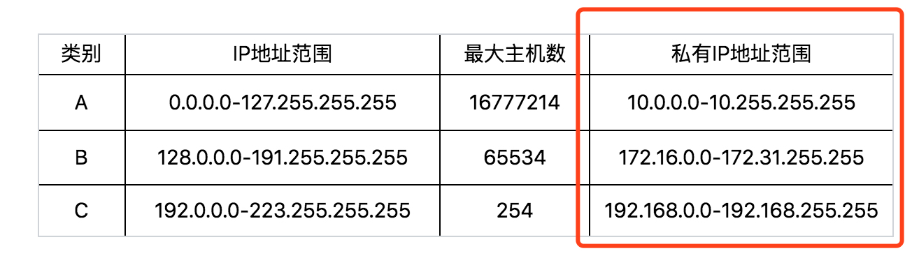
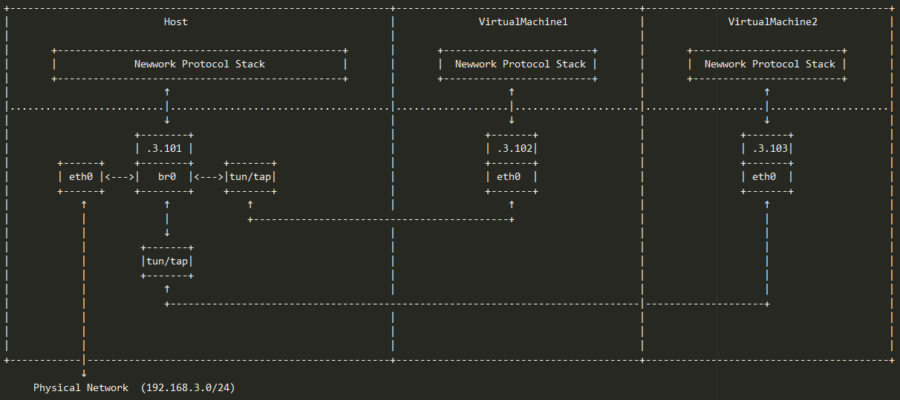
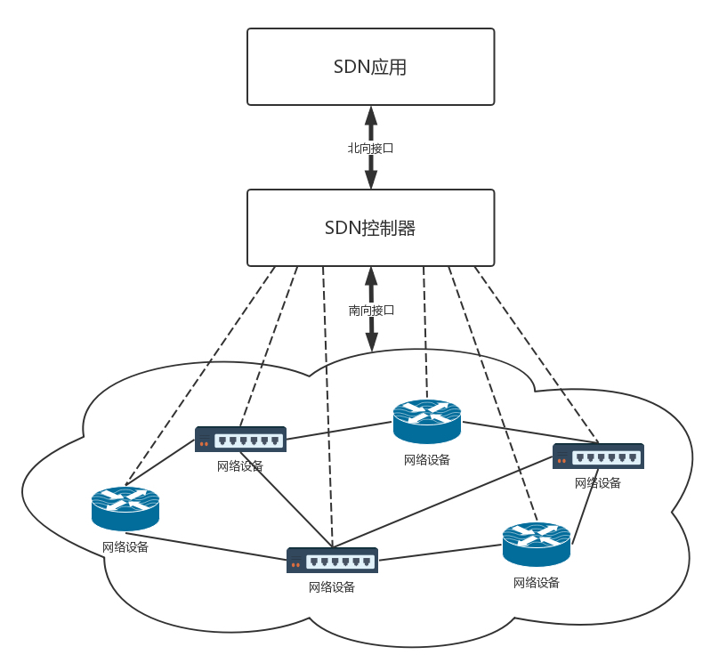

### 网络分层


+ **为什么网络要分层呢**？

  **因为不同的层次之间有不同的沟通方式**，这个叫作**协议**。

  网络环境过于复杂，不是一个能够集中控制的体系。

  全球数以亿记的**服务器和设备，各有各的体系**，但是都可以通过同一套网络协议栈，

  **通过切分成多个层次和组合**，来满足不同服务器和设备的通信需求。

  

+ **协议**

  + **应用层：DHCP、DNS、HTTP(s)、RPC、P2P、RTMP、GTP**
  + **传输层：UDP、TCP**
  + **网络层：ICMP、IP、OSPF、BGP、IPSec、GRE**
  + **链路层：ARP、VLAN、STP**
  + **物理层：网络跳线**


+ 网络分完层之后，对于**数据包的发送**，就是**层层封装**的过程，反之则是拆包

  始终牢记一个原则：**只要是在网络上跑的包，都是完整的。可以有下层没上层，绝对不可能有上层没下层。**

  


**电脑视角：**

- 首先我要知道我的 IP 以及对方的 IP
- 通过子网掩码判断我们是否在同一个子网
- 在同一个子网就通过 arp 获取对方 mac 地址直接扔出去
- 不在同一个子网就通过 arp 获取默认网关的 mac 地址直接扔出去

**交换机视角：**

- 我收到的数据包必须有目标 MAC 地址
- 通过 MAC 地址表查映射关系
- 查到了就按照映射关系从我的指定端口发出去
- 查不到就所有端口都发出去

**路由器视角：**

- 我收到的数据包必须有目标 IP 地址
- 通过路由表查映射关系
- 查到了就按照映射关系从我的指定端口发出去（不在任何一个子网范围，走其路由器的默认网关也是查到了）
- 查不到则返回一个路由不可达的数据包

**涉及到的三张表分别是**

- 交换机中有 **MAC 地址**表用于映射 MAC 地址和它的端口
- 路由器中有**路由表**用于映射 IP 地址(段)和它的端口
- 电脑和路由器中都有 **arp 缓存表**用于缓存 IP 和 MAC 地址的映射关系

**这三张表是怎么来的**

- MAC 地址表是通过以太网内各节点之间不断通过交换机通信，不断完善起来的。
- 路由表是各种路由算法 + 人工配置逐步完善起来的。
- arp 缓存表是不断通过 arp 协议的请求逐步完善起来的。


### ifconfig/ip addr

``` shell
# ip addr
1: lo: <LOOPBACK,UP,LOWER_UP> mtu 65536 qdisc noqueue state UNKNOWN group default 
    link/loopback 00:00:00:00:00:00 brd 00:00:00:00:00:00
    inet 127.0.0.1/8 scope host lo
       valid_lft forever preferred_lft forever
    inet6 ::1/128 scope host 
       valid_lft forever preferred_lft forever
2: eth0: <BROADCAST,MULTICAST,UP,LOWER_UP> mtu 1500 qdisc pfifo_fast state UP group default qlen 1000
    link/ether fa:16:3e:c7:79:75 brd ff:ff:ff:ff:ff:ff
    inet 10.100.122.2/24 brd 10.100.122.255 scope global eth0
       valid_lft forever preferred_lft forever
    inet6 fe80::f816:3eff:fec7:7975/64 scope link 
       valid_lft forever preferred_lft forever
       
# lo全称是loopback，又称环回接口，往往会被分配到127.0.0.1这个地址
# 这个地址用于本机通信，经过内核处理后直接返回，不会在任何网络中出现

# <BROADCAST,MULTICAST,UP,LOWER_UP> 叫作net_device flags，网络设备的状态标识
# BROADCAST表示这个网卡有广播地址，可以发送广播包
# MULTICAST表示网卡可以发送多播包
# UP表示网卡处于启动的状态
# LOWER_UP表示L1是启动的，也即网线插着
# MTU1500表示最大传输单元MTU为1500，这是以太网的默认值
```

#### **IP地址**




D类是**组播地址**。使用这一类地址，属于某个组的机器都能收到。

**公有IP地址**有组织统一分配，不可重复；**私有IP地址**允许个人自己管理分配，而且可以重复。


**静态配置IP地址**

```shell
# 使用 net-tools
$ sudo ifconfig eth1 10.0.0.1/24
$ sudo ifconfig eth1 up

# 使用 iproute2
$ sudo ip addr add 10.0.0.1/24 dev eth1
$ sudo ip link set up eth1
```


#### **CIDR**

打破了原来设计的几类地址的固定做法，将32位的IP地址一分为二，前面是**网络号**，后面是**主机号**，**可以合理控制组网区域大小**

伴随着CIDR存在的，一个是**广播地址**，10.100.122.255。**如果发送这个地址，所有10.100.122网络里面的机器都可以收到**

另一个是**子网掩码**，255.255.255.0，**将子网掩码和IP地址按位计算AND，就可得到网络号。**


#### **MAC地址**

**MAC地址**是网卡的物理地址，全局唯一标识（其定位功能仅限于局域网，跨子网则需要IP地址来定位了）


### DHCP/PXE

#### DHCP

**DHCP 动态主机配置协议**

有了这个协议，网络管理员只需要配置一段共享的IP地址。

每一台新接入的机器都通过DHCP协议，来这个共享的IP地址里申请，然后自动配置好就可以了。

等人走了，或者用完了，就会还回去，这样其他的机器也能用。


**解析DHCP工作方式（4次广播，基于UDP）**

1. DHCP Client：当一台机器新加入一个网络的时候，只知道自己的MAC地址，此时需要**广播**，DHCP Discover

   

2. DHCP Server：网络管理员在网络里面配置的DHCP Server，接到Boot request后，**广播**返回客户端IP地址、子网掩码、网关、有效期信息，DHCP Offer

   

3. DHCP Client：确认使用某个DHCP Server提供的IP地址（因为存在多个DHCP Server提供的场景）

   由于还没有得到DHCP Server的最后确认，客户端仍然使用0.0.0.0为源IP地址、255.255.255.255为目标地址进行**广播**

   

4. DHCP Server：接收到客户机的DHCP request之后，**广播**返回给客户机一个DHCP ACK消息包

   

#### PXE

**PXE 预启动执行环境（Pre-boot Execution Environment）**

管理员希望的不仅仅是能够自动分配IP地址，还要能够自动安装系统。装好系统之后自动分配IP地址，直接启动就能用了，


**操作系统启动过程：**

1. 首先启动BIOS，读取硬盘的MBR启动扇区，将GRUB启动起来；
2. 然后将权力交给GRUB，GRUB加载内核、加载作为根文件系统的initramfs文件；
3. 然后将权力交给内核；最后内核启动，初始化整个操作系统


自动安装操作系统的过程，只能插在BIOS启动之后。因为没安装系统之前，连启动扇区都没有。

因而这个过程叫做 **预启动执行环境（Pre-boot Execution Environment）**，简称**PXE。**

PXE协议分为客户端和服务器端，由于还没有操作系统，**只能先把客户端放在BIOS里面。**

当计算机启动时，BIOS把PXE客户端调入内存里面，就可以连接到服务端做一些操作了。


**PXE工作流程**


1. 首先，启动PXE客户端。第一步是通过DHCP协议告诉DHCP Server，我刚来，一穷二白，啥都没有。DHCP Server便租给它一个IP地址，同时也给它PXE服务器的地址、启动文件pxelinux.0。
2. 其次，PXE客户端知道要去PXE服务器下载这个文件后，就可以初始化机器。于是便开始下载，下载的时候使用的是TFTP协议。所以PXE服务器上，往往还需要有一个TFTP服务器。PXE客户端向TFTP服务器请求下载这个文件。
3. 然后，PXE客户端收到这个文件后，就开始执行这个文件。这个文件会指示PXE客户端，向TFTP服务器请求计算机的配置信息pxelinux.cfg。TFTP服务器会给PXE客户端一个配置文件，里面会说内核在哪里、initramfs在哪里。PXE客户端会请求这些文件。


### 链路层

物理层组局域网时，用的**集线器Hub**。

这种设备有多个口，可以将宿舍里的多台电脑连接起来。但是，和交换机不同，**集线器没有大脑，它完全在物理层工作**。

它会将自己收到的每一个字节，**都复制到其他端口上去（广播）**。这是第一层物理层联通的方案。


这个方案需要优化两个问题：

1. 这个包是发给谁的？谁应该接收？
2. 大家都在发，会不会产生混乱？有没有谁先发、谁后发的规则？


#### MAC

数据链路层（MAC层: Medium Access Control，**媒体访问控制**）

+ **多路访问**：解决往媒体上发数据的时候，谁先发、谁后发的问题
  1. 分多个车道。每个车一个车道，你走你的，我走我的。这在计算机网络里叫作**信道划分；**
  2. 今天单号出行，明天双号出行，轮着来。这在计算机网络里叫作**轮流协议；**
  3. 管三七二十一，有事儿先出门，发现特堵，就回去。错过高峰再出。我们叫作**随机接入协议。**著名的以太网，用的就是这个方式
+ **MAC地址**：解决发给谁，谁接收的问题
  + **交换机**：有MAC地址学习能力，端口和目标MAC地址映射关系存在**转发表**
  + **ARP协议**：已知IP地址，求MAC地址的协议（发送一个**广播包**，谁是这个IP谁来回答）


#### STP


**环路问题**：我们来想象一下机器1访问机器2的过程。

一开始，机器1并不知道机器2的MAC地址，所以它需要发起一个ARP的广播。广播到达机器2，机器2会把MAC地址返回来，看起来没有这两个交换机什么事情。

但是问题来了，这两个交换机还是都能够收到广播包的。交换机A一开始是不知道机器2在哪个局域网的，所以它会把广播消息放到局域网二。

在局域网二广播的时候，交换机B右边这个网口也是能够收到广播消息的。交换机B会将这个广播息信息发送到局域网一。

局域网一的这个广播消息，又会到达交换机A左边的这个接口。交换机A这个时候还是不知道机器2在哪个局域网，于是将广播包又转发到局域网二，形成环路。


**最小生成树**：给定一个带有权值的连通图（连通网），从众多的生成树中筛选出权值总和最小的生成树。

既然二层网络里有物理环路，那用**一种逻辑的方法将物理的环路斩断**，斩成一个发散的树状结构。

在计算机网络中，生成树的算法叫作**STP**，全称**Spanning Tree Protocol**。

1. 在二层网络里选择一个根（**root bridge**)，其它交换机当作树的树杈（每个网桥都被分配了一个ID，这个ID里有管理员分配的优先级）
2. 每个树杈自然有一个根末梢（**root port**)，这个就是交换机的上游接口
3. 除了根末梢，其它的接口都是下游接口，至于下游接口是畅通的、还是阻断的，取决于到根的路径成本
4. 下游谁更接近根，谁就连通，此时下游端口称为 **Designated Port**
5. 下游谁远离根，谁就被阻断，此时下游端口称为 **Non Designated Port**


#### VLAN

随着划分的局域网增多，服务器数目、交换机数目变多，此时如果只有一个广播域，则导致**广播风暴**，会有性能和安全问题。

本来，二层交换机只能构建单一的广播域，不过使用VLAN功能后，它能够将网络分割成多个广播域

**交换机是如何使用VLAN分割广播域呢？**


只需要在原来的二层的头上加一个TAG，里面有一个VLAN ID，

当交换机把二层的头取下来的时候，就能够识别这个VLAN ID。这样只有相同VLAN的包，才会互相转发。

将两个交换机连接起来的口应该设置成什么VLAN呢？

对于支持VLAN的交换机，有一种口叫作**Trunk口**。它可以转发属于任何VLAN的口。交换机之间可以通过这种口相互连接。


### ICMP

**ICMP**全称**Internet Control Message Protocol**，就是**互联网控制报文协议**。

古代行军的时候，为将为帅者需要通过侦察兵、哨探或传令兵等**人肉方式**来掌握前方的情况，控制整个战局。


ICMP报文是封装在IP包里面，有两种报文类型

+ **查询报文**：主动请求，并获得响应
+ **差错报文**：异常情况下发生的事情


#### ping

主动请求：ICMP ECHO REQUEST；主动请求的回复，**ICMP ECHO REPLY**。

比起原生的ICMP，ping 多了两个字段。

一个是**标识符**。这个很好理解，你派出去两队侦查兵，一队是侦查战况的，一队是去查找水源的，要有个标识才能区分。

一个是**序号**，你派出去的侦查兵，都要编个号。如果派出去10个，回来10个，就说明前方战况不错；如果派出去10个，回来2个，说明情况可能不妙。


#### traceroute

**差错报文的使用场景**

+ traceroute故意设置**特殊的TTL**，来追踪去往目的地沿途经过的路由器

  1. 将参数指向某个目的IP地址，它会发送一个UDP的数据包。将TTL设置成1，也就是说一旦遇到一个路由器或者一个关卡，就表示它牺牲了。

  2. 如果中间的路由器不止一个，当然碰到第一个就牺牲。于是，返回一个ICMP包，也就是网络差错包，类型是**时间超时**。

  3. 接下来，将TTL设置为2。第一关过了，第二关就牺牲了，那我就知道第二关有多远。如此反复，直到到达目的主机。
  4. 怎么知道UDP有没有到达目的主机？traceroute会发送一份UDP数据报给目的主机，但它会选择一个不可能的值作为UDP端口号（大于30000）。
  5. 当该数据报到达时，将使目的主机的UDP模块产生一份**端口不可达**错误ICMP报文。如果数据报没有到达，则可能是超时。

+ traceroute故意设置**设置不分片**，从而确定路径的MTU
  1. 要做的工作首先是发送分组，并设置不分片标志。
  2. 发送的第一个分组的长度正好与出口MTU相等。如果中间遇到窄的关口会被卡住，会发送ICMP网络差错包
  3. 每次收到ICMP不能分片差错时就减小分组的长度，直到到达目标主机

 


经常会遇到一个问题，如果不在我们的控制范围内，很多中间设备都是禁止ICMP的，**但是ping/traceroute不通不代表网络不通。**

这个时候就要使用**telnet**，通过其他协议来测试网络是否通。


### 路由协议

**路由器与网关**：**路由器**有五个**网卡**，分别连着五个局域网。每个网卡的IP地址都和局域网的IP地址相同的网段，每个**网卡**都是它那个局域网的**网关**

经过网关时，源MAC地址和目标MAC地址都会变，源MAC地址变成**当前网卡MAC地址**，目标MAC地址变成下一站的MAC地址

经过网关时，目标IP地址不会变，源IP地址分两种情况：**NAT（Network Address Translation）**时则源IP地址变成网关IP地址（**改变门面**），否则保持不变


#### 静态

路由表中会有多条路由规则。每一条规则至少包含这三项信息：

+ 目的网络：这个包想去哪儿
+ 出口设备：将包从哪个网卡扔出去
+ 下一跳网关：下一个路由器的地址

``` shell
ip route add 10.176.48.0/20 via 10.173.32.1 dev eth0
# 要去10.176.48.0/20这个目标网络，要从eth0端口出去，下一跳是10.173.32.1
```


#### 动态

使用动态路由路由器，可以根据路由协议算法生成动态路由表，随网络运行状况的变化而变化。

我们可以将复杂的路径，抽象为一种叫作图的数据结构，道路越短越好，因而这就转化成为**如何在途中找到最短路径**的问题

求最短路径常用的有两种方法，一种是Bellman-Ford算法，一种是Dijkstra算法


##### OSPF

**基于Dijkstra的链路状态路由算法的OSPF**

Dijkstra的链路状态路由算法的基本思路是：当一个路由器启动的时候，**首先是发现邻居**，向邻居say hello，邻居都回复。然后计算和邻居的距离，发送一个echo，要求马上返回，除以二就是距离。**然后将自己和邻居之间的链路状态包广播出去**，发送到整个网络的每个路由器。这样每个路由器都能够收到它和邻居之间的关系的信息。因而，每个路由器都能在自己本地构建一个完整的图，然后针对这个图使用Dijkstra算法，找到两点之间的最短路径。

不像距离距离矢量路由协议那样，更新时发送整个路由表。链路状态路由协议**只广播更新的或改变的网络拓扑**，这使得更新信息更小，节省了带宽和CPU利用率。而且一旦某个路由器挂了，它的邻居都会广播这个消息，可以使得坏消息迅速收敛。

**Open Shortest Path First**，**开放式最短路径优先**，就是这样一个基于链路状态路由协议，广泛应用在数据中心中的协议。由于主要用在**数据中心内部**，用于路由决策，因而称为**内部网关协议**（**Interior Gateway Protocol**，简称**IGP**）。内部网关协议的重点就是找到最短的路径。在一个组织内部，路径最短往往最优。


##### BGP

**基于Bellman-Ford的距离矢量路由算法的BGP**

这种算法的基本思路是，每个路由器都保存一个路由表，包含多行，每行对应网络中的一个路由器，每一行包含两部分信息，一个是要到目标路由器，从那条线出去，另一个是到目标路由器的距离。

每个路由器都是知道全局信息的。那这个信息如何更新呢？每过几秒，每个路由器都将自己所知的到达**所有的路由器**的距离告知邻居。每个路由器根据新收集的信息，计算和其他路由器的距离。比如自己的一个邻居距离目标路由器的距离是M，而自己距离邻居是x，则自己距离目标路由器是x+M。

这个算法比较简单，但是有两个问题：

1. **路由器挂掉后没能及时通知到（宕机消息收敛慢）**

   

   比如：原来的网络包括两个节点，B和C。A加入了网络，它的邻居B很快就发现A启动起来了。于是它将自己和A的距离设为1，同样C也发现A起来了，将自己和A的距离设置为2。但是如果A挂掉，情况就不妙了。B本来和A是邻居，发现连不上A了，但是C还是能够连上，只不过距离远了点，是2，于是将自己的距离设置为3。殊不知C的距离2其实是基于原来自己的距离为1计算出来的。C发现自己也连不上A，并且发现B设置为3，于是自己改成距离4。依次类推，数越来越大，**直到超过一个阈值**，我们才能判定A真的挂了。

2. **每次发送的时候，要发送整个全局路由表**


外网的路由协议，也即国家之间的，又有所不同。称为**外网路由协议**（**Border Gateway Protocol**，简称**BGP**）

在网络世界，每个国家成为自治系统**AS**，每个自治系统都有边界路由器，通过它和外面的世界建立联系。

自治系统间，边界路由器之间使用**BGP**广播路由

前面说了距离矢量路由协议的缺点。其中一个是收敛慢。在BGP里面，除了下一跳hop之外，就只剩自治系统AS的路径，从而可以避免坏消息传的慢的问题，也即上面所描述的，B知道C原来能够到达A是因为通过自己，一旦自己都到达不了A了，就不用假设C还能到达A了。

另外，在路径中将一个自治系统看成一个整体，不区分自治系统内部的路由器，这样自治系统的数目是非常有限的，就算是发送全局信息，也没有问题。


#### 验证源IP

https://zhuanlan.zhihu.com/p/50071964

**rp_filter**

配置好路由后，此时从客户端ping服务端的192.168.2.2，会发现并不能ping通。如果利用tcpdump在各个设备抓包，会发现服务端的192.168.2.2的入口能够抓到包，但是没有响应发出，这其实跟rp_filter这个安全机制有关。

rp_filter会检查IP报文的源地址，有3个可选值：

- 1（默认值）表示源IP必须是路由可达的，同时入口接口恰好是路由表查到出口接口；
- 2表示源IP必须是路由可达的，但放松为任意接口可达即可；
- 0表示不检查源IP

按照上述的规则，由于客户端到服务端的报文源IP是192.168.1.2，且从服务端左边接口进入，但服务端配置路由时，到192.168.1.0/24网段的路由走右边接口出，因此被内核过滤。解决方法是设置为2或者0，因为1.0网段可从右边接口可达。


### 虚拟IP (VIP)

原理：ARP刷新 https://www.itnoteshare.com/course/25/-1/previewcourse.htm

应用：keepalive https://blog.csdn.net/csdn317797805/article/details/100726480


### TCP

Transmission **Control** Protocol：（控制）可靠、顺序、流量、拥塞 【全双工】


客户端的状态变迁：CLOSED --> SYN_SENT --> ESTABLISHED --> FIN_WAIT_1 --> FIN_WAIT_2 --> TIME_WAIT --> CLOSED

服务器的状态变迁：CLOSED --> LISTEN --> SYN_RCVD --> ESTABLISHED --> CLOSE_WAIT --> LAST_ACK ---> CLOSED


三次握手：SYN Flood 攻击 【开启 tcp_syncookies，TCP 根据双方的 ip、端口、SYN、时间戳等，生成序号标识（Cookie）】

四次挥手：服务端接收到 ACK=y+2 后关闭；客户端要等 2MSL 才关闭（服务端早于客户端）


TCP 的控制机制：（维护状态表）

+ 序列号
+ 应答信号、超时重发（重复确认时则快重传，不必等待超时重发计数器）【超时重发 != 重复确认】【超时重发过多次则**关闭连接**】
+ 滑动窗口：解决TCP以MSS段为单位应答发送的缺点，提高传输效率
+ 流量控制：双方动态协商滑动窗口大小
+ 拥塞控制：（拥塞窗口）慢启动（MSS从1开始）；先指数增加到阈值、再线性增加；阻塞时（超时 / 重复确认）快恢复（阈值设置成一半，窗口从阈值处线性增加）

【滑动窗口代表通信双方的数据接收能力，发送端根据 **接受端窗口大小** 来控制自己发送的数量，是接收端的 **数据缓冲区**】

【拥塞窗口代表整体网络环境的拥塞程度，不是接收端的数据缓冲区】

【窗口大小是发送端无需等待接收端确认应答信号而可以持续发送的数据最大值】


TCP 首部字段有 20 个字节

使用场景：当对网络通讯质量有要求的时候，比如：整个数据要准确无误的传递给对方，这往往用于一些要求可靠的应用，比如HTTP、HTTPS、FTP等传输文件的协议，POP、SMTP等邮件传输的协议。


### UDP


不可靠、不握手建立连接、面向报文，多种传播方式

面向报文：

+ 面向报文：应用层交给UDP多长的报文，UDP就照样发送，即一次发送一个报文。因此，应用程序必须选择合适大小的报文。若报文太长，则IP层需要分片，降低效率。若太短，会是IP太小。

+ 面向字节流：应用层和TCP的交互是一次一个数据块（大小不等），TCP把数据看成是一连串的无结构的字节流。TCP有一个缓冲，当应用程序传送的数据块太长，TCP就可以把它划分短一些再传送。

传播方式：

+ 单播Unicast：客户端与服务器之间的点到点连接
+ 广播BroadCast：（一对所有）广播者可以向网络中所有主机发送信息
+ 组播MultiCast：（一对一组）加入了同一个组的主机可以接受到此组内的所有数据【D类IP地址：224.0.0.0～224.0.0.255】

只有UDP才有广播、组播，TCP只能单播


UDP 首部字段只有 8 个字节，包括源端口、目的端口、长度、检验和【伪首部只用来计算校验和，不用来传输】

使用场景：当对网络通讯质量要求不高的时候，要求网络通讯速度能尽量的快，这时就可以使用UDP。如QUIC、流媒体、IoT物联网、移动通信


### Socket

Socket接口大多数情况下操作的是传输层TCP和UDP（还有文件Socket）

这种情况下，Socket 中存储了特定的四元组： 源ip+port，目的ip+port


**TCP Client**：**每起一个连接会占用一个不同的系统端口**

+ 源 ip+port ，socket 为 [src ip, src port) <=> (*, *)] ；
+ 连接到目的 ip+port，socket 变为 [src ip, src port) <=> (dst ip, dst port)]；
+ 通过 Socket 与 TCP Server 进行通信

**TCP Server**：**所有连接共享同一个端口**

+ Accept 返回的 socket 为 [src ip, src port) <=> (dst ip, dst port)]；每一个连接都对应一个 socket id。

当系统接收 TCP 网络数据时，根据端口定位到特定的进程，然后进程根据 socket id 区分来自不同 client 的数据，系统中所有 socket 中的四元组信息，必定唯一，不可能重复。


Q：Linux服务器最多能支撑多少个TCP连接  （指的是 TCP Server）

> TCP连接四元组是源IP地址、源端口、目的IP地址和目的端口。任意一个元素发生了改变，那么就代表的是一条完全不同的连接了。拿我的Nginx举例，它的端口是固定使用80。另外我的IP也是固定的，这样目的IP地址、目的端口都是固定的。剩下源IP地址、源端口是可变的。所以理论上我的Nginx上最多可以建立2的32次方（ip数）×2的16次方（port数）个连接。这是两百多万亿的一个大数字

> 进程每打开一个文件，都会消耗一定的内存资源。如果有不怀好心的人启动一个进程来无限的创建和打开新的文件，会让服务器崩溃。所以linux系统出于安全角度的考虑，在多个位置都限制了可打开的文件描述符的数量，包括系统级fs.file-max、用户级/etc/security/limits.conf、进程级fs.nr_open。


Q：服务器突然崩溃了，然后重启服务器的时候80端口被占用了，什么原因？与 TCP 四次挥手有关，资源需要等到 2MSL 才会释放


**TCP Socket**


**UDP Socket**


### HTTP

**HTTP/1.1**

+ **长连接**，Connection: keep-alive 复用底层 TCP 连接 + Transfer-Encoding: chunked 分块传输编码
+ **Pipeline**，客户端可以同时发送多个请求，但服务端依然要等前一个请求的响应返回后才能处理下一个请求，头部阻塞【HTTP 1.0 一发一收】
+ **缓存处理**，cache-control：max-age=xxx 字段


**HTTP/2**

+ HTTP 1.1 缺点
  + **数据传输量大，延迟高**
  + **队头阻塞问题**，同一连接只能在完成一个 HTTP 事务（请求和响应）后，才能处理下一个事务
  + **HTTP 头部巨大**
  + **不支持服务器推送消息**
+ HTTP 2.0 特性
  + **头部压缩**，HTTP 协议的报文是由「Header + Body」构成的，HTTP/1.1 通过头字段 「Content-Encoding」指定 Body 的压缩方式，比如用 gzip 压缩。HTTP 2.0 采用 HPAK 压缩头部
  + **二进制帧**，HTTP/2 将 HTTP/1 的文本格式改成二进制格式传输数据，极大提高了 HTTP 传输效率
  + **多路复用、并发传输**，HTTP/2 基于流模型，**多个 Stream 复用一条 TCP 连接，达到并发的效果，不同 Stream 的帧是可以乱序发送的（因此可以并发不同的 Stream ）**，因为每个帧的头部会携带 Stream ID 信息，所以接收端可以通过 Stream ID 有序组装成 HTTP 消息，而 **同一 Stream 内部的帧必须是严格有序的**。（HTTP2 仍有头部阻塞问题，不是在应用层，在传输层，TCP是字节流。故 HTTP3 换成 UDP）
  + **服务器主动推送资源**


**HTTP/3 QUIC**

QUIC（全称Quick UDP Internet Connections，快速UDP互联网连接）是Google提出的一种基于UDP的通信协议，其目的是降低网络通信的延迟，提供更好的用户互动体验。**QUIC在应用层上，会自己实现快速连接建立、减少重传时延，自适应拥塞控制**。

1. **自定义连接机制**

   TCP连接是由四元组标识的，分别是源 IP、源端口、目的 IP、目的端口。一旦一个元素发生变化时，就需要断开重连，重新连接

   QUIC不再以四元组标识，而是以一个64位的随机数作为ID来标识，而且UDP是无连接的，所以当IP或者端口变化的时候，只要ID不变就不需要重新建立连接

2. **自定义重传机制**

   TCP为了保证可靠性，通过使用**序号**和**应答**机制，来解决顺序问题和丢包问题

   任何一个序号的包发过去，都要在一定的时间内得到应答，否则一旦超时，就会重发这个序号的包。超时时间是通过**采样往返时间RTT**不断调整的。

   其实，在TCP里面超时的采样存在不准确的问题。例如，发送一个包，序号为100，发现没有返回，于是再发送一个100，过一阵返回一个ACK101。

   这时候往返时间是多少呢？无法确定，因为不知道是第一个包还是第二个包送到。

   **QUIC也有个序列号，是递增的**。任何一个序列号的包只发送一次，下次就要加一了。例如，发送一个包，序号是100，发现没有返回；再次发送的时候，序号就是101了；如果返回的ACK 100，就是对第一个包的响应。如果返回ACK 101就是对第二个包的响应，RTT计算相对准确。

   但是这里有一个问题，就是怎么知道包100和包101发送的是同样的内容呢？**QUIC定义了一个offset概念**。QUIC既然是面向连接的，也就像TCP一样，是一个**数据流**，发送的数据在这个数据流里面有个偏移量offset，可以通过offset查看数据发送到了哪里，**这样只要这个offset的包没有来，就要重发**

3. **无阻塞的多路复用**

   有了自定义的连接和重传机制，我们就可以解决上面HTTP 2.0的多路复用问题。

   同HTTP 2.0一样，同一条QUIC连接上可以创建多个stream，来发送多个 HTTP 请求。但是，QUIC是基于UDP的，一个连接上的多个stream之间没有依赖。

   这样，假如stream2丢了一个UDP包，后面跟着stream3的一个UDP包，虽然stream2的那个包需要重传，但是stream3的包无需等待，就可以发给用户。

4. **自定义流量控制**

   TCP的流量控制是通过**滑动窗口协议**。QUIC的流量控制也是通过window_update，来告诉对端它可以接受的字节数。

   但是QUIC的窗口是适应自己的多路复用机制的，不但在一个连接上控制窗口，还在一个连接中的每个stream控制窗口。


**HTTP 状态码**

**100**：Continue，服务器收到了请求的初始部分，并且请客户端继续发送。比如，客户端有大文件需要上传，但是服务器是否愿意接受，所以希望在消耗网络资源进行传输之前，先询问一下服务器的意愿（故是一种优化）。
（Req-Header）Expect: 100-continue   （Res-Status）100 Continue    417 Expectation Failed

**101**：Switching Protocols，切换协议 
（Req-Res-Header）Connection: Upgrade，  Upgrade: websocket


**301 vs 302**

+ 301：代表永久重定向，也就是说第一次请求拿到长链接后，下次浏览器再去请求短链的话，不会向短网址服务器请求了，而是直接从浏览器的缓存里拿，这样在 server 层面就无法获取到短网址的点击数了，如果这个链接刚好是某个活动的链接，也就无法分析此活动的效果。所以我们一般不采用 301
+ 302：代表临时重定向，也就是说每次去请求短链都会去请求短网址服务器（除非响应中用 Cache-Control 或 Expired 暗示浏览器缓存），这样就便于 server 统计点击数，所以虽然用 302 会给 server 增加一点压力，但在数据异常重要的今天，这点代码是值得的，所以推荐使用 302

**304**

第一次请求

+ step1:  (res) 200 --> date、expires、Last-Modified、ETag

第二次请求

+ step1: 看是否需要发送请求 （查缓存，先 from memory cache 再 from disk cache）
  + (req) cache-control：max-age=xxx 
    + 先比较当前时间和上次响应 date，如果没有超过max-age，命中本地强缓存
    + 如果没有cache-control，则取服务端 expires 的值，来对比当前时间是否过期
    + 如果都不满足，则进入协商缓存阶段（此时才需要发送请求）
  + (req) cache-control：no-cache （直接进入协商缓存步骤）
+ step2:  协商缓存（服务端没修改资源，没必要回传）
  + (req) If-Modified-Since: Last-Modified 该请求首部告诉服务器，如果客户端传来的最后修改时间与服务器上的一致，则直接回送 304 和 响应报头即可
  + (req) If-None-Match: ETag-value （解决 Last-Modified 的缺陷：一个资源被修改了，但其实际内容根本没发生改变，故采用哈希标志）若服务端与客户端一致，则直接回送 304 和 响应报头即可


### WebSocket

Http 不管是轮询还是长轮询，**半双工**效率比较低


WebSocket 可在单个 TCP 连接上进行 **全双工** 通信，保持连接状态（HTTP无状态）
WebSocket 设计为在 HTTP 80 和 443 端口上工作，握手使用 HTTP Upgrade 头，从 HTTP 协议更改为 WebSocket 协议


生命周期：

1. 握手协议

   1. 客户端请求

      ```
      GET ws://echo.websocket.org/ HTTP/1.1
      Host: echo.websocket.org
      Origin: file://
      Connection: Upgrade
      Upgrade: websocket
      Sec-WebSocket-Version: 13
      Sec-WebSocket-Key: Zx8rNEkBE4xnwifpuh8DHQ==
      ```

      + Connection 必须设置 Upgrade，表示客户端希望连接升级
      + Upgrade 字段必须设置 websocket，表示希望升级到 WebSocket 协议。
      + Sec-WebSocket-Version 表示支持的 WebSocket 版本
      + Sec-WebSocket-Key 是随机的字符串，服务器端会用这些数据来构造出一个 SHA-1 的信息摘要。

   2. 服务端响应

      ```
      HTTP/1.1 101 Web Socket Protocol Handshake
      Connection: Upgrade
      Upgrade: websocket
      Sec-WebSocket-Accept: 52Rg3vW4JQ1yWpkvFlsTsiezlqw=
      ```

      + Sec-WebSocket-Accept：把 Sec-WebSocket-Key 加上一个特殊字符串 “258EAFA5-E914-47DA-95CA-C5AB0DC85B11”，然后计算 SHA-1 摘要，进行 Base64 编码，返回给客户端。

2. 消息协议

   在 WebSocket 协议中，数据是通过**数据帧**来进行传输的，同时，客户端必须在所有帧中**添加掩码**。服务端收到没有添加掩码的帧，必须立即关闭连接。（数据掩码的作用是增强协议的安全性，不是为了保护数据，因为算法是公开的）

   1. 数据帧格式

      

   2. 数据分片

      WebSocket 的每条消息可能被切分成多个数据帧。

      FIN 判断是否是最后一个帧。

      操作码 opcode 告诉了帧应该做什么。0x1，有效载荷就是文本。0x2，有效载荷就是二进制数据。0x0，则该帧是一个延续帧。这意味着服务器应该将帧的有效负载连接到从该客户机接收到的最后一个帧。

3. 心跳包

   在 WebSocket 协议中定义了 心跳 Ping 和 心跳 Pong 的控制帧

   心跳 Ping 帧包含的操作码是 0x9。心跳 Pong 帧包含的操作码是 0xA。


### TLS

```
// HTTP + TLS 
功能：加密 --> 防窃听
	 数字签名 --> 防篡改、验证数据来源

tip: 公钥加密是为了对内容加密保证不被窃听
	 私钥加密是为了验证数据来源
	 
	 生成：内容 --> hash1(直接对内容加密的话太久) --> 私钥加密 --> 数字签名
	 传输：内容 + 数字签名
	 验证：数字签名 --> 公钥解密确认来源，解密为h1 --> 内容hash2后做匹配防内容篡改
	 
// https 是为了验证服务器端的可信
	1、S去找CA要签名（CA的私钥对S的公钥进行加密生成数字签名，数字签名+S的公钥=数字证书）
	2、C向S索要数字证书，用CA的公钥解密，证明来源可信（CA认证），对S的公钥h2和h1核对，证明未篡改
	3、C用S的公钥对随机密码加密，传给S
	4、S用私钥解密，得到随机密码，从此对称加密
	

散列函数（不是加密算法）：MD5 + (单向不可逆)	

// 加密
对称加密：AES，DES，3DES
非对称加密：RSA DSA RCC

// http 前的TLS 4次握手
// https://blog.csdn.net/zxk364961978/article/details/54809008
```


### JWT

Session 有服务器单点问题，Token 需要去查数据库匹对，JWT 直接单向内存计算匹配签名


**Bearer**：头部（header）+ 内容（payload）+ 签名（signature）

secret 是保存在服务器端的私钥，jwt 的签发生成和校验也在服务器端


### DNS

Domain Name System (DNS)：域名与IP间映射


```
/etc/resolve.conf: DNS客户端配置文件
nameserver 定义DNS服务器的IP地址
domain 定义主机的域名。domain和search不能共存；如果同时存在，后面出现的将会被使用。
search 定义域名的搜索列表。eg search domainname.com 表示当提供了一个不包含完全域名的主机名时，在该主机名后添加domainname.com的后缀
sortlist 允许将得到域名结果进行特定的排序。它的参数为网络/掩码对，允许任意的排列顺序


/etc/hosts: 定义域名IP映射
www.qhl.com 192.168.0.2


nslookup 域名 -> 查询域名对应的IP地址
```


**DNS递归查询过程：abc.163.com**

根域名服务器：返回 .com顶级域名服务器 IP地址

顶级域名服务器：返回 163.com权威域名服务器 IP地址

权威域名服务器：返回 abc.163.com域名主机 IP地址

本地域名服务器：由网络服务商（ISP），如电信、移动等自动分配，通常就在ISP的某个机房


**DNS 负载均衡**

**内部负载均衡（客户端）**：域名解析时，服务端可以返回多个IP地址，可以配置客户端策略进行随机或者轮询选择

**全局负载均衡（服务端）**：GSLB、CNAME

**abc.yourcompany.com**

权威域名服务器会根据 **CNAME** 给域名起别名，变成 abc.CNAME.yourcompany.com，然后告诉本地DNS服务器，让它请求**GSLB**解析这个域名

图中画了两层的GSLB，是因为分运营商和地域。

我们希望不同运营商的客户，可以访问相同运营商机房中的资源，这样不跨运营商访问，有利于提高吞吐量，减少时延。

1. 第一层GSLB，通过查看请求它的本地DNS服务器所在的运营商，就知道用户所在的运营商。

   假设是移动，通过CNAME的方式，通过另一个别名 object.yd.yourcompany.com，告诉本地DNS服务器去请求第二层的GSLB。

2. 第二层GSLB，通过查看请求它的本地DNS服务器所在的地址，就知道用户所在的地理位置。

   然后返回距离用户位置比较近的Region的6个服务IP地址，客户端可以通过内部负载均衡的方式，随机或者轮询选择一个。


### 数据中心

**接入层/汇聚层/核心层**

数据中心的机器塞满机架的时候，需要有交换机将这些服务器连接起来，可以互相通信。这些交换机是放在机架顶端的，所以经常称为**TOR**（**Top Of** **Rack**）**交换机**，或者**接入层**（**Access Layer**）。

当一个机架放不下的时候，就需要多个机架，还需要有交换机将多个机架连接在一起。这些交换机称为**汇聚层交换机**（**Aggregation Layer**）。汇聚层将大量的计算节点通过二层互通相接在一起，形成一个集群，称为一个**POD**（**Point Of Delivery**），有时候也称为一个**可用区**（**Available Zone**）。

当节点数目再多的时候，一个可用区放不下，需要将多个可用区连在一起，连接多个可用区的交换机称为**核心交换机**。汇聚和核心之间是通过三层网络互通的。


**南北流量**：外部流量请求到内部应用

**东西流量**：不同节点间的横向交互


**大二层**

但是随着数据中心里面的机器越来越多，尤其是有了云计算、大数据，集群规模非常大，而且都要求在一个二层网络里面。这就需要二层互连从**汇聚层**上升为**核心层**，也即在核心以下，全部是二层互连，全部在一个广播域里面，这就是**大二层**。大二层通过overlay实现。


**TRILL/RBridge**

大二层引入了**TRILL**（**Transparent Interconnection of Lots of Link**），即**多链接透明互联协议**。它的基本思想是，二层环有问题，三层环没有问题，那就把三层的路由能力模拟在二层实现。运行TRILL协议的交换机称为**RBridge**，是**具有路由转发特性的网桥设备**，只不过这个路由是根据MAC地址来的，不是根据IP来的。


**高可用**

网卡：将多个网卡聚合成为一个逻辑网卡，即**绑定**（**bond**）。

> mode=0 (balance-rr) (平衡抡循环策略)
> mode=1 (active-backup) (主-备份策略)
> mode=2 (balance-xor) (平衡策略)
> mode=3 (broadcast) (广播策略)
> mode=4 (802.3ad) (IEEE 802.3ad 动态链接聚合)
> mode=5 (balance-tlb) (适配器传输负载均衡)

交换机：

+ 两个交换机，启用STP协议去除环路，形成主备，

+ 将多个交换机形成一个逻辑交换机，即**堆叠技术**


**Spine-Leaf**：https://cloud.tencent.com/developer/article/1979691


**使用 MBGP+MPLS+VRF 搭建多地互联数据中心网络**：https://littlewolf.moe/juniper-platform/276/


### VLAN

VLAN（Virtual LAN）：虚拟局域网

二层交换机只能构建单一的广播域，不过使用VLAN功能后，它能够将网络分割成多个广播域。

为什么需要分割广播域呢？那是因为，如果仅有一个广播域，有可能会影响到网络整体的传输性能（广播风暴）

**交换机视角：**

- 我收到的数据包必须有目标 MAC 地址
- 通过 MAC 地址表查映射关系
- 查到了就按照映射关系从我的指定端口发出去
- 查不到就所有端口都发出去（广播）

广播帧（目标MAC地址全部为1）会非常频繁地出现，如ARP、DHCP、RIP协议。


VLAN 帧在以太网帧的基础上增加了 VLAN Tag 字段，该字段包含 TPID、PCP、CFI 和 VID 4 个部分

其中 VID 即表示 VLAN ID，占 12bit，其中 0 和 4095 为保留值，所以一个以太网最多可以划分为 4094 个 VLAN


VLAN间通信时**需要路由器提供中继服务**，称作VLAN间路由，可以使用普通的路由器，也可以使用三层交换机


### VxLAN

**为什么需要VxLAN**

1. **虚拟机动态迁移，要求提供一个无障碍接入的网络**

   传统的二三层网络架构限制了虚拟机的动态迁移范围。为了打破这种限制，实现虚拟机的大范围甚至跨地域的动态迁移，就要求把VM迁移可能涉及的所有服务器都纳入同一个二层网络域。

   VXLAN可以提供一套方法论，在数据中心IP网络基础上，构建一张全互联的二层隧道虚拟网络，保证任意两点之间都能通过VXLAN隧道来通信，并忽略底层网络的结构和细节。从服务器的角度看，VXLAN为它们将整个数据中心基础网络虚拟成了一台巨大的二层交换机。

   基于这种二层交换机的模型，就很容易理解为什么VXLAN可以实现VM动态迁移了：将虚拟机从二层交换机的一个端口换到另一个端口，完全无需变更IP地址。

2. **数据中心租户数量激增，要求提供一个可隔离海量租户的网络**

   在传统的VLAN网络中，标准定义所支持的可用VLAN数量只有4000个左右。服务器虚拟化后，一台物理服务器中承载了多台虚拟机，每个虚拟机都有独立的IP地址和MAC地址，相当于接入数据中心的服务器成倍扩大了。VLAN的能力显然已经力不从心。

   VXLAN如何来解决上述问题呢？VXLAN在VXLAN帧头中引入了类似VLAN ID的网络标识，称为VXLAN网络标识VNI（VXLAN Network ID），由24比特组成，理论上可支持多达16M的VXLAN段，从而满足了大规模不同网络之间的标识、隔离需求。


**VXLAN隧道是如何建立的**

VTEP对VM发送的原始以太帧（Original L2 Frame）进行了包装：VXLAN Header + UDP Header + Outer IP Header + Outer MAC Header


**VTEP**

VTEP（VXLAN Tunnel Endpoints，VXLAN隧道端点）是VXLAN网络的边缘设备，是VXLAN隧道的起点和终点，

VXLAN对用户原始数据帧的封装和解封装均在VTEP上进行。VTEP既可以是一台独立的网络设备，也可以是在服务器中的虚拟交换机。

源服务器发出的原始数据帧，在VTEP上被封装成VXLAN格式的报文，并在**IP网络（三层）**中传递到另外一个VTEP上，并经过解封转还原出原始的数据帧，最后转发给目的服务器。


**VNI**

VNI（VXLAN Network Identifier，VXLAN 网络标识符），VNI是一种类似于VLAN ID的用户标识。

以太网数据帧中VLAN只占了12比特的空间，这使得VLAN的隔离能力在数据中心网络中力不从心。而VNI的出现，就是专门解决这个问题的。

一个VNI代表了一个租户，属于不同VNI的虚拟机之间不能直接进行二层通信。


**underlay**：底层承载网络（没用隧道技术的二层、三层网络）

**overlay**：基于底层网络互联互通的基础加上**隧道封装技术**去构建一个虚拟的网络

https://blog.csdn.net/qq_35029061/article/details/125682812


### 移动通信


有线通信：收发两端要有传输信号的导线相连，用电或者光传输

无线通信：靠电磁波的传播来传递信息的


有线信道的稳定性和高速性是无线信道难以比拟的，**无论无线通信如何无线，最终还是要连接到有线的网络里**。

移动通信主要是解决了用户和基站的这一段空中信道，进入高速数据传输以后，各个基站就需要使用光纤进行传输。


**2G网络**


**4G网络**


1. **基站子系统**分两部分：

   一部分对外提供**无线通信**，叫作**基站收发信台（BTS，Base Transceiver Station）**

   另一部分对内连接**有线网络**，叫作**基站控制器（BSC，Base Station Controller）**。

   基站收发信台通过无线收到数据后，转发给基站控制器。

   这部分属于无线的部分，统称为**无线接入网（RAN，Radio Access Network）**。


2. 基站控制器通过有线网络，连接到提供手机业务的运营商的数据中心。

   这部分称为**核心网（CN，Core Network）。**

   核心网还没有真的进入互联网，这部分还是主要提供手机业务，是手机业务的有线部分。

   首先接待基站来的数据的是**移动业务交换中心（MSC，Mobile Service Switching Center）**，

   它是进入核心网的入口，但是它不会让你直接连接到互联网上，主要用于认证是不是合法的手机接入。【**控制面**】

   验证通过后才接入**网关移动交换中心（GMSC ，Gateway Mobile Switching Center）**，它连接核心网和真正的互联网。【数据面】


3. 真正的互联网：电话网络**PSTN**（电路交换）【2G 3G】、**IP网络**（分组交换）


### 虚拟网卡

#### **tap/tun**

https://segmentfault.com/a/1190000009249039

#### **veth**

https://segmentfault.com/a/1190000009251098

#### **bridge**

https://segmentfault.com/a/1190000009491002   


### Docker网络

**docker**（veth + bri）


https://www.cnblogs.com/gispathfinder/p/5871043.html

+ bridge模式，使用--net=bridge指定，默认设置

  bridge本意是桥的意思，其实就是网桥模式，我们可以把网桥看成一个二层的交换机设备

  

  有了网桥之后，Docker 创建一个容器的时候，会执行如下操作：

  - 创建一对虚拟接口/网卡，也就是veth pair；
  - 本地主机一端桥接 到默认的 docker0 或指定网桥上，并具有一个唯一的名字，如 veth9953b75；
  - 容器一端放到新启动的容器内部，并修改名字作为 eth0，这个网卡/接口只在容器的命名空间可见；
  - 从网桥可用地址段中（也就是与该bridge对应的network）获取一个空闲地址分配给容器的 eth0
  - 配置默认路由到网桥

  

  

  数据入口方向：DNAT

  ```powershell
  $ iptables -t nat -nvL PREROUTING
  Chain PREROUTING (policy ACCEPT 159 packets, 20790 bytes)
   pkts bytes target     prot opt in     out     source               destination
      3   156 DOCKER     all  --  *      *       0.0.0.0/0            0.0.0.0/0            ADDRTYPE match dst-type LOCAL
  # 匹配目标地址类型为本地的包，执行target=DOCKER操作
  
  $ iptables -t nat -nvL DOCKER
  Chain DOCKER (2 references)                                                                                                
   pkts bytes target     prot opt in     out     source               destination                                            
      0     0 RETURN     all  --  docker0 *       0.0.0.0/0            0.0.0.0/0                                             
      0     0 DNAT       tcp  --  !docker0 *       0.0.0.0/0            0.0.0.0/0            tcp dpt:8088 to:172.17.0.2:80 
  # 对主机收到的目的端口为8088的tcp流量进行DNAT转换，将流量发往172.17.0.2:80
  ```

  数据出口方向：MASQUERADE

  ```powershell
  $ iptables -t nat -nvL POSTROUTING
  Chain POSTROUTING (policy ACCEPT 1099 packets, 67268 bytes)
   pkts bytes target     prot opt in     out     source               destination
     86  5438 MASQUERADE  all  --  *      !docker0  172.17.0.0/16        0.0.0.0/0
      0     0 MASQUERADE  tcp  --  *      *       172.17.0.4           172.17.0.4           tcp dpt:80
  # MASQUERADE: 自动获取网卡动态IP地址来做SNAT
  # 源地址为172.17.0.0/16的包从容器发出，会路由到网桥docker0，网桥根据宿主机的路由规则转给网卡eth0，并从eth0网卡发出去，此时规则生效(!docker0)
  ```


+ host模式，使用--net=host指定，容器内部网络空间共享宿主机的空间，效果类似直接在宿主机上启动一个进程，端口信息和宿主机共用。

+ container模式，使用--net=container:NAME_or_ID指定

  指定容器与特定容器共享网络命名空间

+ none模式，使用--net=none指定

  网络模式为空，即仅保留网络命名空间，但是不做任何网络相关的配置(网卡、IP、路由等)


### 虚拟机网络


**虚拟机**（tun/tap + bri）




**解决互通问题：**

https://www.cnblogs.com/huhuxixi/p/11527837.html

1. **桥接**

   

2. **NAT**

   


**解决隔离问题**

**VLAN**：基于物理网卡eth0创建带VLAN的虚拟网卡，所有从这个虚拟网卡出去的包，都带这个VLAN

为每个用户分配不同的VLAN，例如有一个用户VLAN 10，一个用户VLAN 20。

在一台物理机上，基于物理网卡，为每个用户用vconfig创建一个带VLAN的网卡。不同的用户使用不同的虚拟网桥，带VLAN的虚拟网卡也连接到虚拟网桥上。

这样，不同的用户由于网桥不通，不能相互通信，一旦出了网桥，由于VLAN不同，也不会将包转发到另一个网桥上。

另外，出了物理机也带着VLAN ID。只要物理交换机支持VLAN，到达另一台物理机的时候，VLAN ID依然在，它只会将包转发给相同VLAN的网卡和网桥。

**缺点：**

1. 用户越来越多的时候，虚拟网卡和虚拟网桥会越来越多，管理非常复杂
2. 虚拟机的VLAN和物理环境的VLAN是透传的，也即从一开始规划的时候，就需要匹配起来，将物理环境和虚拟环境强绑定，本来就不灵活。


### SDN

**软件定义网络（SDN）**



1. **控制与转发分离**

   转发平面就是一个个虚拟或者物理的网络设备，就像小区里面的一条条路。控制平面就是统一的控制中心，就像小区物业的监控室。

2. **控制平面与转发平面之间的开放接口**

   控制器向上提供接口，被应用层调用。控制器向下调用接口，来控制网络设备。前面这个接口称为**北向接口**，后面这个接口称为**南向接口**。

3. **逻辑上的集中控制**

   逻辑上集中的控制平面可以控制多个转发面设备，也就是控制整个物理网络，因而可以获得全局的网络状态视图。


**OpenFlow / OpenvSwitch**

SDN有很多种实现方式，我们来看一种开源的实现方式。

OpenFlow是SDN控制器和网络设备之间互通的**南向接口协议**，OpenvSwitch用于**创建软件的虚拟交换机**，是支持OpenFlow协议的。

它们都可以被统一的**SDN控制器**管理，从而实现物理机和虚拟机的网络连通。


**如何控制网络：SDN控制器通过OpenFlow协议向Openvswith写入流表规则**


**在OpenvSwitch里面，有一个流表规则，任何通过这个交换机的包，都会经过这些规则进行处理。**

对于每一条规则，要看是否满足匹配条件。

这些条件包括，从哪个端口进来的，网络包头里面有什么等。

满足了条件的网络包，就要执行一个动作，对这个网络包进行处理。可以修改包头里的内容，可以跳到任何一个表格，可以转发到某个网口出去，也可以丢弃。


**场景：用OpenvSwitch实现VLAN的功能**

在OpenvSwitch中**虚拟交换机端口**port分两种：

1. access port：
   + 端口配置tag，从这个端口进来的包会被打上这个tag
   + 如果网络包本身带有的VLAN ID等于tag，则会从这个port发出
   + 从access port发出的包不带VLAN ID。
2. trunk port：
   + 如果trunks为空，全部允许通过，对于所有VLAN的包，本身带什么VLAN ID，就携带什么VLAN ID。如果没有设置VLAN，就属于VLAN 0。
   + 如果trunks不为空，则仅仅带着这些VLAN ID的包通过。


**传统实现VLAN vs OpenvSwitch实现VLAN**


在没有OpenvSwitch的时候，如果一个新的用户要使用一个新的VLAN，还需要创建一个属于新的VLAN的虚拟网卡，并且为这个租户创建一个单独的虚拟网桥，这样用户越来越多的时候，**虚拟网卡和虚拟网桥会越来越多**，管理非常复杂。

另一个问题是**虚拟机的VLAN和物理环境的VLAN是透传的**，也即从一开始规划的时候，就需要匹配起来，将物理环境和虚拟环境强绑定，本来就不灵活。

而引入了OpenvSwitch，状态就得到了改观。

首先，由于OpenvSwitch本身就是支持VLAN的，**所有的虚拟机都可以放在一个网桥br0上**，通过不同的用户配置不同的tag，就能够实现隔离。例如上面的图，用户A的虚拟机都在br0上，用户B的虚拟机都在br1上，有了OpenvSwitch，就可以都放在br0上，只是设置了不同的tag。

另外，还可以创建一个虚拟交换机br1，将物理网络和虚拟网络进行隔离。

物理机的VLAN规划，通过物理交换机。

虚拟机在一台物理机上，虚拟交换机的VLAN都是从1开始的。由于一台机器上的虚拟机不会超过4096个，所以VLAN在一台物理机上如果从1开始，肯定够用了。

例如在图中，上面的物理机里面，用户A被分配的tag是1，用户B被分配的tag是2，而在下面的物理机里面，用户A被分配的tag是7，用户B被分配的tag是6。

如果物理机之间的通信和隔离还是通过VLAN的话，需要将虚拟机的VLAN和物理环境的VLAN对应起来，但为了灵活性，不一定一致，这样可以实现分别管理物理机的网络和虚拟机的网络。好在OpenvSwitch可以对包的内容进行修改。例如通过匹配dl_vlan，然后执行mod_vlan_vid来改进进出出物理机的网络包。


### iptables


#### **五链四表**

**五链（阶段）：**当一个网络包进入一台机器的时候：

1. 首先拿下MAC头看看，是不是我的。如果是，则拿下IP头来。
2. 先进mangle表的**PREROUTING**链。在这里可以根据需要改变数据包头内容，之后进入nat表的PREROUTING链，在这里可以根据需要做**Dnat**，也就是目标地址转换。
3. 进入路由判断，要判断是进入本地的还是转发的。
4. 如果是进入本地的，就进入**INPUT**链，之后按条件过滤限制进入。之后进入本机，再进入**OUTPUT**链，按条件过滤限制出去，离开本地。
5. 如果是转发就进入**FORWARD**链，根据条件过滤限制转发。
6. 之后进入**POSTROUTING**链，这里可以做**Snat**，离开网络接口。


**四表（功能）：**raw–>mangle–>nat–>filter。这四个优先级依次降低。

1. 数据包的过滤（**filter**）
2. 网络地址转换（**nat**）
3. 数据包的修改（**mangle**）
4. 关闭nat表上启用的连接追踪机制（**raw** 不常用）

**动作：**

1. 放行传给协议栈（**ACCEPT**）
2. 丢弃，不再传输（**DROP**）
3. 发给某个用户态进程（**QUEUE**）


### tcpdump


### Flannel


Flannel是跨节点容器网络方案之一，它提供的Overlay方案主要有两种方式，一种是UDP在用户态封装，一种是VXLAN在内核态封装。


#### UDP

**Flannel使用UDP实现Overlay网络**


在物理机A上的容器A里面，能看到的容器的IP地址是172.17.8.2/24，里面设置了默认的路由规则default via 172.17.8.1 dev eth0。

如果容器A要访问172.17.9.2，就会发往这个默认的网关172.17.8.1。172.17.8.1就是物理机上面docker0网桥的IP地址，这台物理机上的所有容器都是连接到这个网桥的。

在物理机上面，查看路由策略，会有这样一条172.17.0.0/24 via 172.17.0.0 dev flannel.1，也就是说发往172.17.9.2的网络包会被转发到flannel.1这个网卡。

这个网卡是怎么出来的呢？在每台物理机上，都会跑一个flanneld进程，这个进程打开一个/dev/net/tun字符设备的时候，就出现了这个网卡。

所有发到flannel.1这个网卡的包都会被flanneld进程读进去，接下来flanneld要对网络包进行处理。

物理机A上的flanneld会将网络包**封装在UDP包**里面，然后外层加上物理机A和物理机B的IP地址和端口号，发送给物理机B上的flanneld。

为什么是UDP呢？因为不想在flanneld之间建立两两连接，而UDP没有连接的概念，任何一台机器都能发给另一台。

物理机B上的flanneld收到包之后，解开UDP的包，将里面的网络包拿出来，从物理机B的flannel.1网卡发出去。

在物理机B上，有路由规则172.17.9.0/24 dev docker0 proto kernel scope link src 172.17.9.1。

将包发给docker0，docker0将包转给容器B。通信成功。

上面的过程连通性没有问题，但是由于全部在用户态，所以性能差了一些。


#### VxLAN

**Flannel使用VxLAN实现Overlay网络**


如果使用VXLAN，就不需要打开一个TUN设备了，而是要建立一个VXLAN的VTEP。如何建立呢？可以通过netlink通知内核建立一个VTEP的网卡flannel.1。在我们讲OpenvSwitch的时候提过，netlink是一种用户态和内核态通信的机制。

当网络包从物理机A上的容器A发送给物理机B上的容器B，在容器A里面通过默认路由到达物理机A上的docker0网卡，然后根据路由规则，在物理机A上，将包转发给flannel.1。这个时候flannel.1就是一个VXLAN的VTEP了，它**将网络包进行封装**。

网络包的MAC地址这样写：源为物理机A的flannel.1的MAC地址，目标为物理机B的flannel.1的MAC地址，在外面加上VXLAN的头。

外层的IP地址这样写：源为物理机A的IP地址，目标为物理机B的IP地址，外面加上物理机的MAC地址。

这样就能通过VXLAN将包转发到另一台机器，从物理机B的flannel.1上解包，变成内部的网络包，通过物理机B上的路由转发到docker0，然后转发到容器B里面。通信成功。


### Calico

**Calico网络设计思路**

**不走Overlay网络（不封包），降低网络性能损耗，将转发全部用三层网络的路由转发来实现**


图中的两台物理机，它们的物理网卡是同一个二层网络里面的。由于两台物理机的容器网段不同，我们完全可以**将两台物理机配置成为路由器，并按照容器的网段配置路由表**。

首先，如果全部走三层的路由规则，**没必要每台机器都用一个虚拟网桥docker0**，从而浪费了一个IP地址，而是**可以直接用路由**转发到veth pair在物理机这一端的网卡。

在物理机A中，可以配置：要想访问网段172.17.9.0/24，下一跳是192.168.100.101，也即到物理机B上去。

这样在容器A中访问容器B，当包到达物理机A的时候，就能够匹配到这条路由规则，并将包发给下一跳的路由器，也即发给物理机B。在物理机B上也有路由规则，找到对应的物理机veth网卡，进而转到容器veth网卡。

当容器B返回结果的时候，在物理机B上，可以做类似的配置：要想访问网段172.17.8.0/24，下一跳是192.168.100.100，也即到物理机A上去，再经过路由规则找到对应的容器。


**Calico网络的转发细节**

容器A1的IP地址为172.17.8.2/32，这里注意，不是/24，而是/32，将容器A1作为一个单点的局域网了。

容器A1里面的默认路由，Calico配置得比较有技巧

```
default via 169.254.1.1 dev eth0 
169.254.1.1 dev eth0 scope link 
```

这个IP地址169.254.1.1是默认的网关，但是整个拓扑图中没有一张网卡是这个地址。那如何到达这个地址呢？

前面我们讲网关的原理的时候说过，当一台机器要访问网关的时候，**首先会通过ARP获得网关的MAC地址，然后将目标MAC变为网关的MAC，而网关的IP地址不会在任何网络包头里面出现**，也就是说，**没有人在乎这个地址具体是什么，只要能找到对应的MAC，响应ARP就可以了**。

ARP本地有缓存，通过ip neigh命令可以查看。

```
169.254.1.1 dev eth0 lladdr ee:ee:ee:ee:ee:ee STALE
```

**这个MAC地址是Calico硬塞进去的**，但是没有关系，它能响应ARP，于是发出的包的目标MAC就是这个MAC地址。

在物理机A上查看所有网卡的MAC地址的时候，我们会发现**veth1就是这个MAC地址**。所以容器A1里发出的网络包，第一跳就是这个veth1这个网卡，也就到达了物理机A这个路由器。

在物理机A上有三条路由规则，分别是去两个本机的容器的路由，以及去172.17.9.0/24，下一跳为物理机B。

```
172.17.8.2 dev veth1 scope link 
172.17.8.3 dev veth2 scope link 
172.17.9.0/24 via 192.168.100.101 dev eth0 proto bird onlink
```

同理物理机B上也有三条路由规则，分别是去两个本机的容器的路由，以及去172.17.8.0/24，下一跳为物理机A。

在Calico网络中，物理机化身为路由器，通过路由器上的路由规则，将包转发到目的地。在这个过程中，没有隧道封装解封装，仅仅是单纯的路由转发，性能会好很多。但是，这种模式也有很多问题。


### K8s网络

Kubernetes引入的网络模型提出了下列基本要求。只要满足了这些要求，即可成为一个K8s网络方案供应商。

+ Pod都有自己单独的IP地址，Pod内部的所有容器共享Pod的IP地址，且可以相互自由通信
+ Node上的容器可以使用Pod的IP地址和其它Node上面的容器通信，且不需要通过NAT
+ 如果Pod使用宿主机网络环境，那么跨Node的容器间可以使用宿主机IP地址进行通信，且不需要通过NAT
+ Node上面的agent（比如system daemon, kubelet等）可以使用IP地址和位于该Node上面的所有容器通信，且不需要通过NAT
+ Pod之间容器通信所涉及到的隔离问题，通过 NetworkPolicy CR解决

要求说明了

+ 不能NAT意味着Pod自己看自己的IP和别人(宿主机上面的agent或者其它Pod)看到自己的IP是一样的，对，一眼看穿、看懂对方的那种。而与此对应的是，如有NAT在捣鬼的话，当企业内部的机器访问躲在Nginx后面的服务时，二者相互看不清对方的本来面目。
+ 容器之间IP互通，也就间接要求了宿主机之间是三层可达的。为什么呢？**如果宿主机环境是二层网络，那么天生就是可实现三层可达的，但如果二层不通的话，也需要实现三层可达，不然从一个Pod发出的数据不是被憋死在宿主机上面了吗？**

+ 二层可达表示同个局域网内，不可达则表示位于不同局域网；三层可达则可位于不同局域网，经过路由器到达


**K8s扁平网络模型：**


**CNI实现方案**

K8s内建了一个kubenet，它可以支持一些基本的网络连接。但更普遍的使用方式是用第三方的网络方案。只要它满足CNI(Container Network Interface) 规范就可以以插件的方式在K8s环境使用。

CNI插件的种类多种多样，关键的功能有两个：

+ IP管理插件，主要负责为Pod分配IP地址，并在Pod被销毁的时候回收IP
+ 网络插件，主要负责将Pod插入到K8s网络或从K8s网络删除


+ **离开k8s网络，进入宿主机网络阶段**

  + **Overlay networks 模式**

    作为一般规则，当K8s网络的traffic途径宿主机网络中路由规则**不可以被正常路由**的话（比如不同网段），就需要考虑封包（Encapsulation）。典型的封包方案有 Flannel VXLAN 和 Calico IP-in-IP两种。

  + **直接路由 Pod IP 模式**

    作为一般规则，如果K8s网络的traffic途径宿主机网络中路由规则**可以被正常路由**的话，就可以采用直接路由Pod IP方案，无需封包，性能损失小。Flannel host-gw 和 Calico BGP 使用了这种模式。

+ **离开宿主机网络阶段**

  + **要求宿主机二层连通的方案**

    作为一般规则，当K8s网络的traffic离开宿主机时，如果下一跳或者网关是**集群主机**的IP地址，也即dest MAC是集群主机的MAC地址时，就**需要**宿主机环境二层是能直接连通的。

  + **要求宿主机三层连通的方案**

    作为一般规则，当K8s网络的traffic离开宿主机时，如果下一跳或者网关**不是集群主机**的IP地址，就**不需要**二层连通，此时**只要三层IP可达**即可把以太帧路由到终点。